***

# Introduction to Open Data Science - Course Project


```r
# This is a so-called "R chunk" where you can write R code.

date()
```

```
## [1] "Tue Dec 13 18:33:19 2022"
```
# **Chapter 1: Start me up**
# 1. Thoughts about the course

## 1.1 My feeling about the course

I am feeling very good, since I finally start using GitHub from scratch. **All my colleagues** are using GitHub for collaboration, but I do not even have any idea what it is. This course is very timely. Hopefully after this course, I can join their collaboration loop effectively. 

## 1.2 What do I expect to learn

I do not have any particular expectation in the statistical knowledge I am going to learn, because anything about statistics is interesting to me. Actually, I hope in the course I could have chance of exercising **GitHub collaboration in practical manner**. For example, my colleagues always mention the creation of some 'branches' of some "root" data sets, which I still do not understand very clearly what is it.

# 2. reflect on my learning with the *R for Health Data Science book*

## 2.1 How did it work as a "crash course" on modern R tools and using RStudio?

Luckily, I just finished taking Prof. Kimmo's another course "Quantitative Research Skills", where I got chance to walk through several chapters of *R for Health Data Science book*. This way I suppose I could make some comments on the book retrospectively. I would say this is the best book for novice R users to start off. The author did the instruction from an industry perspective ( health science), which avoid getting too deep in math but focuses on the R as a statistical tool for solving industry problem itself. When I tried to start with R years ago, one of the biggest barrier is for every statistical feature I want to realize, R always present a multitude of pathways to realize it (for example, to compute a new variable for a data set, you can you ".[,c] <-", or ".$c<-", or " %>% " + "mutate"), other source of material/textbook always tried to feed you with all these possibilities, which makes things complicated. This book just doesn't. For each function to execute, it only show you one approach. This is just what most non-statistics-majors want! 

## 2.2 Which were your favorite topics?

Data wrangling, definitely (although there is no specific chapter for it, but it scatters throughout the whole book). Most descriptive, inferential and exploratory statistics are so easy to realize in R. By the merit of R, for these purposes, all I need is first, know what I am going to do (base on my stat knowledge), and then search in Google about which package(s) are for doing that, and finally install it, read the instruction&example and then do it. Very mechanical. There is never a big challenge. To me, data wrangling (more than dozens of variable) requires some real effort, and hence more interesting. And there is never an end. Today I realize a wrangling task in three lines of codes, maybe tomorrow I could come up with or stumble over a way that only requires two, or even one. This process is super exciting. 

## 2.3 Which topics were most difficult? 

Data wrangling, of course according to my story above, followed by logistic regression. For logistic regression, I have several big unsolved problem on mind. They are: __a.__ considering there is not an alternative of linear regression's r square for logistic regression, how do I evaluate the variance that my model could explain? __b.__ after modeling additive effect, model modification is recommended to follow. It is not difficult to create a main effect plot to observe candidate multiplicative variables if __y__ is continuous. But is it also applicable to a binary __y__ ? However, I suppose this is mainly due to my lack of relevant stat knowledge, having nothing to do with R language. 


# 3. My GitHub Repo

Please find it Here:
  https://github.com/rg450318262/IODS-project

# 4. Token

Since I have generated the token before the new task is published (That is the only way I get my machine connected to GitHub), I will not generate it again in case any overlapping problems. 


This is the end of chapter 1

***********************


  

***
  


# **Chapter 2: Regression and model validation**

*Describe the work you have done this week and summarize your learning.*

- Describe your work and results clearly. 
- Assume the reader has an introductory course level understanding of writing and reading R code as well as statistical methods.
- Assume the reader has no previous knowledge of your data or the more advanced methods you are using.


```r
date()
```

```
## [1] "Tue Dec 13 18:33:19 2022"
```


# 1 Preparing

## 1.1 read the data set


```r
library(tidyverse)
learn <- read_csv(file = "data/learning2014.csv")
```

## 1.2 Code categorical data


```r
learn <- learn %>% 
  mutate(gender = gender %>%
           factor() %>% 
           fct_recode("Female" = "F",
                      "Male" = "M"))
```

## 1.3 explore the data set


```r
#explore dimensions
dim(learn)
```

```
## [1] 166   7
```

The data set has 166 observations of 7 variables.


```r
#explore structure
str(learn)
```

```
## tibble [166 × 7] (S3: tbl_df/tbl/data.frame)
##  $ gender  : Factor w/ 2 levels "Female","Male": 1 2 1 2 2 1 2 1 2 1 ...
##  $ age     : num [1:166] 53 55 49 53 49 38 50 37 37 42 ...
##  $ attitude: num [1:166] 3.7 3.1 2.5 3.5 3.7 3.8 3.5 2.9 3.8 2.1 ...
##  $ deep    : num [1:166] 3.58 2.92 3.5 3.5 3.67 ...
##  $ stra    : num [1:166] 3.38 2.75 3.62 3.12 3.62 ...
##  $ surf    : num [1:166] 2.58 3.17 2.25 2.25 2.83 ...
##  $ points  : num [1:166] 25 12 24 10 22 21 21 31 24 26 ...
```
The data set has six numeric (integer type) variables and one categorical (binary) variable. 

## 1.4 describe the variables

   Under the funding of *International Survey of Approaches to Learning*, 183 Finnish students who took the course "Introduction to Social Statistics" during 2014 fall participated in a survey about their learning, resulting in a data set with 32 variables and 166 observations (due to missing data points, the sample size is smaller than 183). The current data set for analysis is a convenient subset of it. It includes variables about the participants' demographic characteristics such as age and sex, as well as the final points they got for certain exam (could possibly be statistics). It also includes 4 psychological dimensions including study attitude (reflecting their motivation to the subject), deep learning score (reflecting how well their learning style fits into the deep learning type), surface learning score (reflecting how well their learning style fits into the surface learning type) and strategy learning score (reflecting how well their learning style fits into the strategic learning type).

### 1.4.1 describe the coninuous variable


```r
library(tidyverse)
library(finalfit) # a package introduced in RHDS book. 
                  #The "gg_glimpse" function could give nice descriptive 
                  #statistics for both types of variables. 
library(DT) # show table in a html-based neat view. 
ff_glimpse(learn)$Continuous %>% datatable() # descriptive statistics for
```

```{=html}
<div id="htmlwidget-1571a21e07199720fa00" style="width:100%;height:auto;" class="datatables html-widget"></div>
<script type="application/json" data-for="htmlwidget-1571a21e07199720fa00">{"x":{"filter":"none","vertical":false,"data":[["age","attitude","deep","stra","surf","points"],["age","attitude","deep","stra","surf","points"],["&lt;dbl&gt;","&lt;dbl&gt;","&lt;dbl&gt;","&lt;dbl&gt;","&lt;dbl&gt;","&lt;dbl&gt;"],[166,166,166,166,166,166],[0,0,0,0,0,0],["0.0","0.0","0.0","0.0","0.0","0.0"],["25.5","3.1","3.7","3.1","2.8","22.7"],["7.8","0.7","0.6","0.8","0.5","5.9"],["17.0","1.4","1.6","1.2","1.6","7.0"],["21.0","2.6","3.3","2.6","2.4","19.0"],["22.0","3.2","3.7","3.2","2.8","23.0"],["27.0","3.7","4.1","3.6","3.2","27.8"],["55.0","5.0","4.9","5.0","4.3","33.0"]],"container":"<table class=\"display\">\n  <thead>\n    <tr>\n      <th> <\/th>\n      <th>label<\/th>\n      <th>var_type<\/th>\n      <th>n<\/th>\n      <th>missing_n<\/th>\n      <th>missing_percent<\/th>\n      <th>mean<\/th>\n      <th>sd<\/th>\n      <th>min<\/th>\n      <th>quartile_25<\/th>\n      <th>median<\/th>\n      <th>quartile_75<\/th>\n      <th>max<\/th>\n    <\/tr>\n  <\/thead>\n<\/table>","options":{"columnDefs":[{"className":"dt-right","targets":[3,4]},{"orderable":false,"targets":0}],"order":[],"autoWidth":false,"orderClasses":false}},"evals":[],"jsHooks":[]}</script>
```

```r
                   #categorical data shown in html-based data table view.
```
According to their distribution shapes visualized in section 1.5 (next section), non-normally distributed variables were reported as median and Q1-Q3; roughly normal variables will be reported as mean±sd. 

The age of the participants was between 17 and 55 years old (median: 22; Q1-Q3:21,27 years old). Their exam points were 22.7±5.9. Their deep learning scores were 3.7±0.6. Their surface learning scores were 2.8±0.5. And their strategic learning scores were 3.1±0.8.

### 1.4.2 describe the categorical variable


```r
ff_glimpse(learn)$Categorical %>% datatable() # descriptive statistics for categorical data shown in html-based data table view.
```

```{=html}
<div id="htmlwidget-5b48aedfe4e50b461713" style="width:100%;height:auto;" class="datatables html-widget"></div>
<script type="application/json" data-for="htmlwidget-5b48aedfe4e50b461713">{"x":{"filter":"none","vertical":false,"data":[["gender"],["gender"],["&lt;fct&gt;"],[166],[0],["0.0"],[2],["\"Female\", \"Male\""],["110, 56"],["66, 34"]],"container":"<table class=\"display\">\n  <thead>\n    <tr>\n      <th> <\/th>\n      <th>label<\/th>\n      <th>var_type<\/th>\n      <th>n<\/th>\n      <th>missing_n<\/th>\n      <th>missing_percent<\/th>\n      <th>levels_n<\/th>\n      <th>levels<\/th>\n      <th>levels_count<\/th>\n      <th>levels_percent<\/th>\n    <\/tr>\n  <\/thead>\n<\/table>","options":{"columnDefs":[{"className":"dt-right","targets":[3,4,6]},{"orderable":false,"targets":0}],"order":[],"autoWidth":false,"orderClasses":false}},"evals":[],"jsHooks":[]}</script>
```

Among the 166 participants, 110 (66%) were female and 56 (34%) were male. According to a 2021 statistics, Finnish universities had a male:female ratio of 1:1.2, indicating female in our sample is over-represented.

## 1.5 visualize the data set


```r
library(GGally)
library(ggplot2)
library(tidyverse)
#create a self-defined function so that correlation matrix produced by ggpairs could 
#show LOWESS smoothing with scatter plot.
my_fn <- function(data, mapping, method="loess", ...){ #require the input of two
       #arguments: data and mapping; arguments method is set to be "Loess"
       #for more information about using Loess to check function form, please
       #go to (https://thestatsgeek.com/2014/09/13/checking-functional-form-in-logistic-regression-using-loess/)
      p <- ggplot(data = data, mapping = mapping) +  #call ggplot function
      geom_point(size = 0.3, color = "coral") +   #call point graph, reduce the 
        #size, turn color to coral, for better visualization
      geom_smooth(size = 0.3, method=method, ...) # fit Loess regression 
      p  #print the result
}
# create an plot matrix with ggpairs()
ggpairs(learn, 
        lower= list(combo = wrap("facethist", bins = 20), 
                    continuous = my_fn) #call self-defined function "my_fn"
        )
```

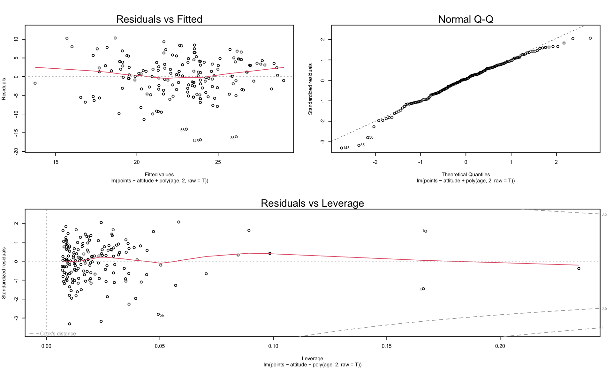

According to the visualization, it is found that the distribution of age is right-skewed; other numeric variables, though with slight skewness, can be roughly treated as normal distribution. All of the values of numeric variables did not show any remarkable difference between males and females. Variables "points", "attitude" and "deep" have 1 to 3 out-liers, respectively, and age has quite a number of out-liers. By examining the raw data, no evidence of mistaken record was detected. These out-liers were thus kept for analysis. Using variable "points" as reference, variable "attitude" showed a significant linear correlation(*r*=0.437). Although the correlation coefficient between age and points is only -0.093, the LOESS smoothing has shown there might be a quadratic relationship between them. 

# 2. Fitting the model

## 2.1 variable selection

According to the visualization in section 1.4, age (as polynomial form due to its non-linearity with the outcome) and attitude were used to fit the model that predicts exam points. Although no noticeable effect of gender was observed, it also entered the model for it being adopted as an important factor for predicting exam points in a multitude of publications. 

## 2.2 fitting 


```r
fit1 <- learn %>%  #using attitude, the polynomial age and gender to predict exam points
  lm(points ~ attitude  + poly(age, 2, raw =T) + gender, data = .) #ploy() is to
    #include 2nd order function form, where "2" means the order 
summary(fit1) # summarize the results
```

```
## 
## Call:
## lm(formula = points ~ attitude + poly(age, 2, raw = T) + gender, 
##     data = .)
## 
## Residuals:
##      Min       1Q   Median       3Q      Max 
## -17.1258  -3.1673   0.5261   3.6243  10.3486 
## 
## Coefficients:
##                         Estimate Std. Error t value Pr(>|t|)    
## (Intercept)            -4.246278   5.618253  -0.756 0.450873    
## attitude                3.774918   0.576603   6.547  7.5e-10 ***
## poly(age, 2, raw = T)1  1.094988   0.345856   3.166 0.001849 ** 
## poly(age, 2, raw = T)2 -0.017766   0.005188  -3.424 0.000782 ***
## genderMale             -0.615038   0.894211  -0.688 0.492569    
## ---
## Signif. codes:  0 '***' 0.001 '**' 0.01 '*' 0.05 '.' 0.1 ' ' 1
## 
## Residual standard error: 5.148 on 161 degrees of freedom
## Multiple R-squared:  0.256,	Adjusted R-squared:  0.2375 
## F-statistic: 13.85 on 4 and 161 DF,  p-value: 9.947e-10
```

The results showed that except for gender, other variables all had significant predicting effect (all *p*<0.01). Besides, F-statistics (*p* < 0.01) had rejected the null that the response variable cannot be represented as a function of any of the predictor variables, indicating the model is valid. Adjusted R-squared showed that the model explained 23.75% of the variance of exam points. However, in the next step I further reduced the model complexity by removing insignificant variable base on the rule of parsimony.  

## 2.3 removing insignifiant predictor

The model was fit again by removing gender. 


```r
fit2 <- learn %>% 
  lm(points ~ attitude  + poly(age, 2, raw =T), data = .)#ploy() is to
    #include 2nd order function form, where "2" means the order 
summary(fit2)
```

```
## 
## Call:
## lm(formula = points ~ attitude + poly(age, 2, raw = T), data = .)
## 
## Residuals:
##     Min      1Q  Median      3Q     Max 
## -16.904  -3.290   0.293   3.594  10.342 
## 
## Coefficients:
##                         Estimate Std. Error t value Pr(>|t|)    
## (Intercept)            -3.651986   5.542377  -0.659 0.510882    
## attitude                3.656205   0.549269   6.656 4.13e-10 ***
## poly(age, 2, raw = T)1  1.068947   0.343218   3.114 0.002180 ** 
## poly(age, 2, raw = T)2 -0.017435   0.005158  -3.380 0.000907 ***
## ---
## Signif. codes:  0 '***' 0.001 '**' 0.01 '*' 0.05 '.' 0.1 ' ' 1
## 
## Residual standard error: 5.139 on 162 degrees of freedom
## Multiple R-squared:  0.2538,	Adjusted R-squared:   0.24 
## F-statistic: 18.36 on 3 and 162 DF,  p-value: 2.634e-10
```

The results showed that all variables had significant predicting effect (all *p*<0.01). Besides, F-statistics (*p* < 0.01) had rejected the null that the response variable can not be represented as a function of any of the predictor variables, indicating the model is valid. Adjusted R-squared showed that the model explained 24% of the variance of exam points, which slightly outperformed the previous model. I took this model as the final model for model diagnostics.

In the final model, variable "attitude" has a coefficient of 3.65, indicating for 1 unit of attitude increase, the exam points is expected to increase 3.65, after controlling for other factors. The first order term of age has an coefficient estimate of 1.06, indicating that, overall, for every 1 unit increase of age, the exam points is expected to increase 1.06, after controlling for other factors. For the second order term of age, an estimated coefficient of -0.017 indicated for different value ranges of age, the effect on exam points might be significantly different. This auto-interaction might lead to -0.017 decrease in exam points across these ranges, after controlling for the other factors. 

The practical explanation for these coefficient might be *a.* attitude reflects the motivation of study and higher motivation will lead to better exam performance; *b.* statistics requires quite a bit of domain knowledge (economics, health, psychology..), logic reasoning and math foundations. Older students might have advantage in these aspects. *c.* However, this advantage will see a ceiling effect at around 30 years old (according to the graph above), and due to the aging and family burden, students over 30 years old might start to become less and less competitive in stat learning over time.  

# 3. Model diagnostic

In model diagnostic, some of the assumptions (linearity and normality) of linear regression were checked. Besides, observations with high influence will be examined in this section. 

## 3.1 diagnostic plots


```r
par(cex = 0.5,fig=c(0,0.5,0.5,1)) #set the coordinate of picture 1
plot(fit2, which = 1)  #plot diagnostic picture 1

par(cex = 0.5,fig=c(0.5,1,0.5,1), new=TRUE)#set the coordinate of picture 2
plot(fit2, which = 2) #plot diagnostic picture 2

par(cex = 0.5, fig=c(0,1,0,0.5), new=TRUE)#set the coordinate of picture 3
plot(fit2, which = 5)#plot diagnostic picture 3
```

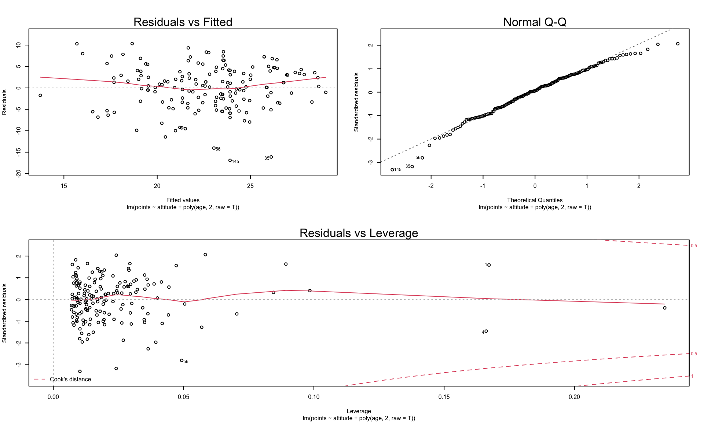

Residuals vs fitted plot (upper left) showed the data points are randomly scattered around the dotted line of y = 0, and the fitted line (red) is roughly horizontal without distinct patterns or trends, indicating a linear relationship. The linearity assumption of linear regression is met.

The QQ plot (upper right) showed most of the points plotted on the graph lies on the dashed straight line, except for the lower and upper ends, where some points deviated from the line, indicating the distribution might be slightly skewed. Considering the fact that in large sample size the assumption of linearity is almost never perfectly met, I see the assumption of normality as being approximately met.

## 3.2 other linear model assumptions

   The assumption of independence requires no relation between the different observations. I do not have information of how this study was designed, hence not being able to make any conclusion. However, I could imagine how hard it took to meet it here, since including students taking courses from different lecturers or different lecturer groups would lead to violation of it. On the other hand, if the results were from students of one same lecturer (or lecturer group), it might take several semesters to collect such a large sample or might take students from several different classes/majors in one semester, either way the assumption was violated. 
   
   Homoscedasticity is another assumption to check. However, considering it is better evaluated by fitted values against root of standardized residuals (the #3 in plot() function), which is not required to produce in the current assignment, I did not further dig into it. By looking into its rough substitute plot "residual vs fitted" (upper left, above), no obvious heteroscedasticity was detected.  

## 3.3 influential observations

Influential observations were shown in the bottom plot, where the red dashed line indicate cook's distance. Cook's distance is a commonly used estimate of the influence of a data point when performing a least-squares regression analysis. It measures the effect of deleting the observation for each given observation. In the plot, points, if there is any, outside the red dashed line are believed to have high influence. The graph for current model showed no points outside the line. The plot also showed the case numbers of 3 data points with the largest cook's distances, which are #1, #4 and #56. However, there are also other rules of thumbs for the cutoff, which are stricter. They include using an absolute value of 1, or using 4/n (n is sample size), or using 4×(the mean of the cooks distance for the whole sample). I did not further report them since it is not required in this assignment. I did it somewhere else for fun. If you are interested, please go to a r markdown file named "Supplement_Codes.html" or "Supplement_Codes.Rmd" under my "IODS-project" folder.    
 

of cook's distance,

where x is the index number of our sample and y is the cook's distance score for each observation. This is to evaluate, if there's any, the data points being tremendously influential to the coefficient estimate. Cook's distance is a commonly used estimate of the influence of a data point when performing a least-squares regression analysis. It measures the effect of deleting the observation for each given observation. There is no consensus on the cutoff for being influential using this indicator. The rules of thumbs include using an absolute value of 1, or using 4/n (n is sample size), or using 4×(the mean of the cooks distance for the whole sample). The plot showed the case numbers of 3 data points with the largest cook's distances, which are #1, #4 and #56. I did not further report them since it is not required in this assignment. I did it somewhere else for fun. If you are interested, please go to a r markdown file named "Supplement_Codes.html" or "Supplement_Codes.Rmd" under my "IODS-project" folder.    
  
This is the end of chapter 2  
***********************

Here we go again...

a test to see if it works

***


# **Chapter 3: Logistic regression**

# 1 Preparing 

## 1.1 read the data set


```r
library(tidyverse)
alc <- read_csv(file = "data/alc.csv")
```
## 1.2 check the data set


```r
glimpse(alc)
```

```
## Rows: 370
## Columns: 43
## $ school                <chr> "GP", "GP", "GP", "GP", "GP", "GP", "GP", "GP", …
## $ sex                   <chr> "F", "F", "F", "F", "F", "M", "M", "F", "M", "M"…
## $ age                   <dbl> 18, 17, 15, 15, 16, 16, 16, 17, 15, 15, 15, 15, …
## $ address               <chr> "U", "U", "U", "U", "U", "U", "U", "U", "U", "U"…
## $ famsize               <chr> "GT3", "GT3", "LE3", "GT3", "GT3", "LE3", "LE3",…
## $ Pstatus               <chr> "A", "T", "T", "T", "T", "T", "T", "A", "A", "T"…
## $ Medu                  <dbl> 4, 1, 1, 4, 3, 4, 2, 4, 3, 3, 4, 2, 4, 4, 2, 4, …
## $ Fedu                  <dbl> 4, 1, 1, 2, 3, 3, 2, 4, 2, 4, 4, 1, 4, 3, 2, 4, …
## $ Mjob                  <chr> "at_home", "at_home", "at_home", "health", "othe…
## $ Fjob                  <chr> "teacher", "other", "other", "services", "other"…
## $ reason                <chr> "course", "course", "other", "home", "home", "re…
## $ guardian              <chr> "mother", "father", "mother", "mother", "father"…
## $ traveltime            <dbl> 2, 1, 1, 1, 1, 1, 1, 2, 1, 1, 1, 3, 1, 2, 1, 1, …
## $ studytime             <dbl> 2, 2, 2, 3, 2, 2, 2, 2, 2, 2, 2, 3, 1, 2, 3, 1, …
## $ schoolsup             <chr> "yes", "no", "yes", "no", "no", "no", "no", "yes…
## $ famsup                <chr> "no", "yes", "no", "yes", "yes", "yes", "no", "y…
## $ activities            <chr> "no", "no", "no", "yes", "no", "yes", "no", "no"…
## $ nursery               <chr> "yes", "no", "yes", "yes", "yes", "yes", "yes", …
## $ higher                <chr> "yes", "yes", "yes", "yes", "yes", "yes", "yes",…
## $ internet              <chr> "no", "yes", "yes", "yes", "no", "yes", "yes", "…
## $ romantic              <chr> "no", "no", "no", "yes", "no", "no", "no", "no",…
## $ famrel                <dbl> 4, 5, 4, 3, 4, 5, 4, 4, 4, 5, 3, 5, 4, 5, 4, 4, …
## $ freetime              <dbl> 3, 3, 3, 2, 3, 4, 4, 1, 2, 5, 3, 2, 3, 4, 5, 4, …
## $ goout                 <dbl> 4, 3, 2, 2, 2, 2, 4, 4, 2, 1, 3, 2, 3, 3, 2, 4, …
## $ Dalc                  <dbl> 1, 1, 2, 1, 1, 1, 1, 1, 1, 1, 1, 1, 1, 1, 1, 1, …
## $ Walc                  <dbl> 1, 1, 3, 1, 2, 2, 1, 1, 1, 1, 2, 1, 3, 2, 1, 2, …
## $ health                <dbl> 3, 3, 3, 5, 5, 5, 3, 1, 1, 5, 2, 4, 5, 3, 3, 2, …
## $ failures              <dbl> 0, 0, 2, 0, 0, 0, 0, 0, 0, 0, 0, 0, 0, 0, 0, 0, …
## $ paid                  <chr> "no", "no", "yes", "yes", "yes", "yes", "no", "n…
## $ absences              <dbl> 5, 3, 8, 1, 2, 8, 0, 4, 0, 0, 1, 2, 1, 1, 0, 5, …
## $ G1                    <dbl> 2, 7, 10, 14, 8, 14, 12, 8, 16, 13, 12, 10, 13, …
## $ G2                    <dbl> 8, 8, 10, 14, 12, 14, 12, 9, 17, 14, 11, 12, 14,…
## $ G3                    <dbl> 8, 8, 11, 14, 12, 14, 12, 10, 18, 14, 12, 12, 13…
## $ alc_use               <dbl> 1.0, 1.0, 2.5, 1.0, 1.5, 1.5, 1.0, 1.0, 1.0, 1.0…
## $ high_use              <lgl> FALSE, FALSE, TRUE, FALSE, FALSE, FALSE, FALSE, …
## $ family.quality        <dbl> 4, 5, 4, 3, 4, 5, 4, 4, 4, 5, 3, 5, 4, 5, 4, 4, …
## $ in.class.performance  <dbl> 5, 3, 8, 1, 2, 8, 0, 4, 0, 0, 1, 2, 1, 1, 0, 5, …
## $ off.class.performance <chr> "Moderate to long study", "Moderate to long stud…
## $ social                <chr> "Frequent", "Infrequent", "Infrequent", "Infrequ…
## $ probability           <dbl> 0.29068345, 0.07880612, 0.15496055, 0.14278287, …
## $ prediction            <lgl> FALSE, FALSE, FALSE, FALSE, FALSE, FALSE, TRUE, …
## $ random.guess          <dbl> 0.10001649, 0.97795944, 0.73361349, 0.68607945, …
## $ prediction.guess      <lgl> FALSE, TRUE, TRUE, TRUE, TRUE, FALSE, FALSE, TRU…
```

This data approach student achievement in secondary education of two Portuguese schools. The data attributes include student grades, demographic, social and school related features) and it was collected by using school reports and questionnaires. Two datasets are provided regarding the performance in two distinct subjects: Mathematics (mat) and Portuguese language (por). 

# 2 Hypothesis

## 2.1 introduction

Despite the health risk and public harm associated with heavy drinking, alcohol is the most commonly used substance in developed countries [@Flor2020]. A large scale longitudinal study has identified Finland as the only Nordic country whose alcohol-attributable harms has increased [@Room2013]. Given that alcohol consumption typically starts in late adolescence or early adulthood [@Lees2020], measures to detect alcohol misuse among young people, especially college students, should be a top public health priority. Identifying a comprehensive set of early life factors associated with college students' alcohol use disorders could be an important starting point.

## 2.2 literature review

College students typically spend a tremendous amount of time with their family members, emphasizing the influence of family quality on any type of habit acquisitions.  Evidence has shown family relationship quality is strongly correlated with early alcohol use [@Kelly2011; @Brody1993], and the effect is interactive with gender [@Kelly2011]. Since studying also comprises an important part of college life, it is important to evaluate how college life and alcohol use interact with each other. An 21 year follow-up of 3,478 Australian since they were child has found level of academic performance predicts their drinking problems, independently of a selected group of individual and family con-founders [@Hayatbakhsh2011]. College students start to build up their social networks. An increased exposure to social communications is reasonably expected among them, which might incur alcohol involvement. A survey has found typical social drinking contexts were associated with men's average daily number of drinks and frequency of drunkenness, indicating social communications, interacted with gender, might have influence on college students' alcohol usage[@Senchak1998].

## 2.3 Proposing hypothesis

According to the literature review, 4 potential early-life factors is identified to predict excessive alcohol usage among college students. They are *a.* family relationship quality (interactive with gender); *b.* school performance; *c.* social communication (interactive with gender). I herein proposed a 3-factor alcohol high-use model for college students and test it using a secondary data set collected for other purposes.

In the data set, variables including gender, quality of family relationships ("famrel"), number of school absences ("absences"), weekly study time ("studytime") and frequency of going out with friends ("goout") could be candidate indicators for the current model. The variable "gender" and "famrel"'s relevance to the predictors are self-explanatory. School performance includes college students' in-class and off-class performance, which could be reflected by variables "absences" and "studytime", respectively. Variable "goout" captures the involvement of social activity, which is a good indicator to social communication. Note that base on the well-reported evidence introduced above, gender will not enter the model independently. Instead, it will comprise interaction terms with family relationship quality and social communication, respectively, and then enter the model. 

# 3 Data exploration

## 3.1 The distribution of the chosen variables


```r
wrap.lab <- c("in-class performance (absences, smaller is better)", 
                          "family relationship quality (famrel)",
                          "social (goout)",
                          "off-class performance (studytime)")
names(wrap.lab) <- c("absences", "studytime", "famrel", "goout")

alc %>% 
  select(absences, studytime, famrel, goout) %>% 
  pivot_longer(everything(), 
               names_to = "variable", 
               values_to = "value") %>% 
  ggplot(aes(x = value))+
  geom_bar(width =1, fill = "white", color = "black")+
  facet_wrap(~variable, scales = "free", 
             labeller = labeller(variable = wrap.lab))+
  scale_fill_brewer(palette = "Greys") +
  theme(panel.grid.major = element_blank(),
          panel.grid.minor = element_blank(),
        panel.background = element_rect(fill = "lightgrey"))+
  labs(title = "Distribution of the interested variables",
       x  = "Values of each variable",
       y = "Frequency")
```

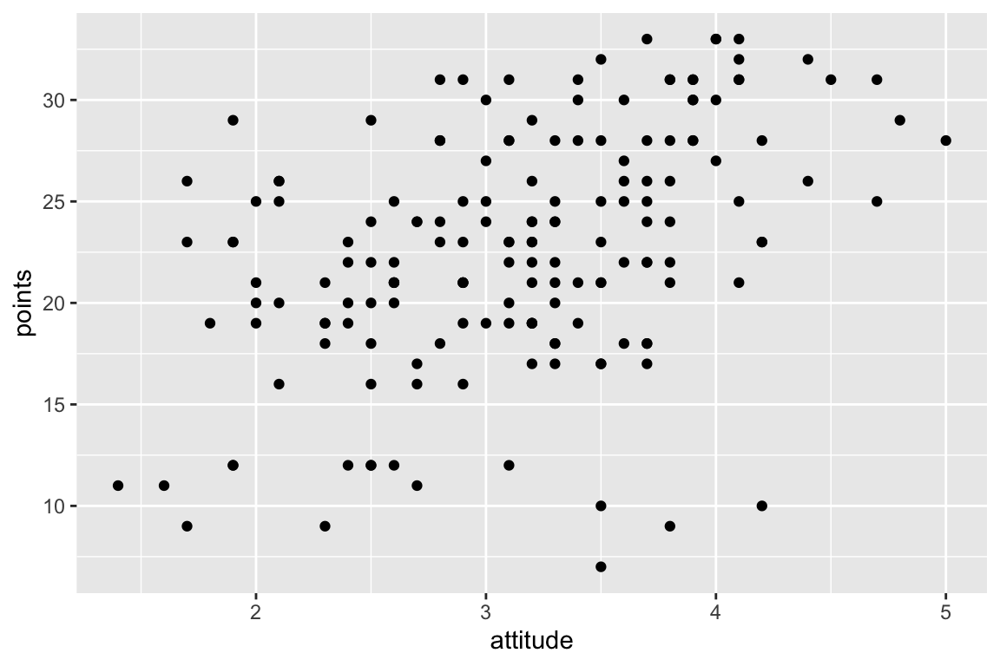

The distribution of in-class performance reflected by class absences is skewed to right with very long tail. This indicates that most students have full or almost full attendance of class, while a small number of students might be absent for quite a number of classes. Other three variables are semi-numeric ordinal obtained by item with Likert-marks, with labeling value ranging from 1 to 5. It is found most Finnish students tend to be very social, with more around 2/3 of them being at the high end the choices. For off-class performance reflected by study time, it is found that most Finnish students spend 2~10 hours a week studying. For family relationship quality, it is surprising to find only roughly 1/3 of the students having good or very good family relationship quality, and none of them believe they have excellent family relationship quality. 


## 3.2 exploring the association between faimly relationship quality and alcohol high-use

   The variable "famrel" in original data set elicited quality of family relationships (numeric: from 1 - very bad to 5 - excellent). In the current analysis, it is selected as a candidate predictor for the model to reflect the same idea--quality of family relationship.

### 3.2.1 numerically explore the association


```r
alc %>% count(high_use, famrel)
```

```
## # A tibble: 10 × 3
##    high_use famrel     n
##    <lgl>     <dbl> <int>
##  1 FALSE         1     6
##  2 FALSE         2     9
##  3 FALSE         3    39
##  4 FALSE         4   128
##  5 FALSE         5    77
##  6 TRUE          1     2
##  7 TRUE          2     9
##  8 TRUE          3    25
##  9 TRUE          4    52
## 10 TRUE          5    23
```

It is found the absolute sample of participants with very bad (level 1)  and/or bad (level 2) family quality is very small in number (n = 8). Caution should be taken about the potential large error. 

### 3.2.2 graphically explore the association


```r
#adapt the titles for each wrapped graph
sex.labs <- c("Female", "Male")
names(sex.labs) <- c("F", "M")

#draw the bar plot
p1 <- alc %>%
  ggplot(aes(x = factor(famrel), fill = high_use)) +
  geom_bar(position = "fill", color ="black") +
  facet_wrap(~sex,  #warp by sex
             labeller = labeller(sex = sex.labs)) + #label each
  labs(x = "Family relationship quality (larger is better)", 
       y = "Proportion of high-user",
       title = 
         "Proportion of alcohol high-use by family relationship quality and sex")+
  theme(legend.position = "bottom")+ #adapt the legend position
  guides(fill=guide_legend(title = "Alcohol high-use"))+ #define legend title
  scale_fill_discrete(labels = c("FALSE" = "Non-high-user",  
                                 "TRUE" = "high-user"))+ #define legend text
  scale_fill_brewer(palette = "Greys") #define color theme
  
p1
```

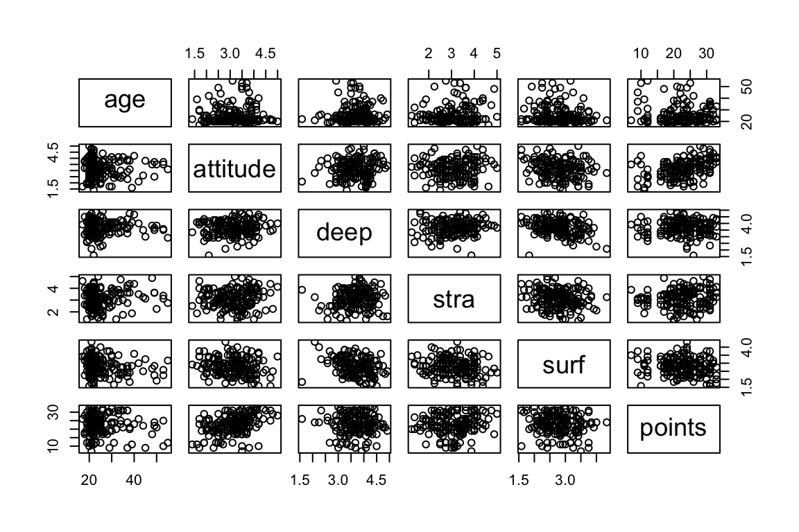

The value of the variable "famrel" includes numbers from 1 - very bad to 5 - excellent. In the current study, I presume that the intervals between each consecutive pair of value is consistent, and hence see it as a numeric variable.

According to the bar plot of proportion, the hypothesis of using the current variable in model fitting is validated. It is found that with the increasing of family relationship quality, the proportion of alcohol high-use decreases, except for female from a very bad (level 1) relationship family, which had a proportion of high-users at zero. However, this low proportion suffers from a risk of error due to the small sample in the level (n = 8). The result should be interpreted with caution.

To facilitate understanding, the variable's name will be changed to family.quality according to the hypothesis.

### 3.2.3 re-code the variable of family relationship quality


```r
alc <- alc %>% 
  mutate(family.quality = famrel) #create a new variable family.quality
                                  #it has the same value with famrel
```


## 3.3 exploring the association between school performance (absences) and alcohol high-use

   The variable "studytime" in original data set captured participants' weekly study time (numeric: 1 - <2 hours, 2 - 2 to 5 hours, 3 - 5 to 10 hours, or 4 - >10 hours). The variable "absences" in original data set captured participants' number of school absences (numeric: from 0 to 93). It is presumed in the current analysis that they reflect off-class and in-class school performance, respectively, and hence they are selected as candidate predictors. 

### 3.3.1 exploring the association between in-class performance and alcohol high-use
### 3.3.1.1 numerically explore the association


```r
library(DT)
alc %>% group_by(high_use, sex) %>% 
  summarise(mean = mean(absences), 
            sd = sd(absences), 
            median = median(absences),
            Q1 = quantile(absences, prob = 0.25),
            Q3 = quantile(absences, prob = 0.75),
            sampleSize = n()) %>% 
  datatable() %>% 
  formatRound(columns = c(3:4), digits = 2)
```

```{=html}
<div id="htmlwidget-32f5f67cb67a0c50082b" style="width:100%;height:auto;" class="datatables html-widget"></div>
<script type="application/json" data-for="htmlwidget-32f5f67cb67a0c50082b">{"x":{"filter":"none","vertical":false,"data":[["1","2","3","4"],[false,false,true,true],["F","M","F","M"],[4.25324675324675,2.91428571428571,6.85365853658537,6.1],[5.29343123373645,2.67148145919323,9.40361891935694,5.29191343713094],[3,3,3,4],[1,1,1,2],[6,4,8,9],[154,105,41,70]],"container":"<table class=\"display\">\n  <thead>\n    <tr>\n      <th> <\/th>\n      <th>high_use<\/th>\n      <th>sex<\/th>\n      <th>mean<\/th>\n      <th>sd<\/th>\n      <th>median<\/th>\n      <th>Q1<\/th>\n      <th>Q3<\/th>\n      <th>sampleSize<\/th>\n    <\/tr>\n  <\/thead>\n<\/table>","options":{"columnDefs":[{"targets":3,"render":"function(data, type, row, meta) {\n    return type !== 'display' ? data : DTWidget.formatRound(data, 2, 3, \",\", \".\", null);\n  }"},{"targets":4,"render":"function(data, type, row, meta) {\n    return type !== 'display' ? data : DTWidget.formatRound(data, 2, 3, \",\", \".\", null);\n  }"},{"className":"dt-right","targets":[3,4,5,6,7,8]},{"orderable":false,"targets":0}],"order":[],"autoWidth":false,"orderClasses":false}},"evals":["options.columnDefs.0.render","options.columnDefs.1.render"],"jsHooks":[]}</script>
```

From the table, it is found that both the frequency and median(Q1,Q3) of class absences differed greatly between alcohol high-users and non-high-users, indicating its validity in entering the model. 


### 3.3.1.2 graphically explore the association


```r
p2 <- alc %>%
  ggplot(aes(x = high_use, y = absences, fill = high_use)) +
  geom_boxplot() +
  geom_jitter(width=0.25, alpha=0.5)+
  facet_wrap(~sex, labeller = labeller(sex = sex.labs)) +
  scale_fill_brewer(palette = "Blues")+
  labs(x = "Alcohol high-user", 
       y = "Freuqncy of class absences",
       title = 
         "Frequency of class absences by alcohol high-use and gender")+
  theme(legend.position = "none")+
  scale_x_discrete(labels = c("FALSE" = "Non-high-user", 
                              "TRUE" = "high-user"))
p2
```

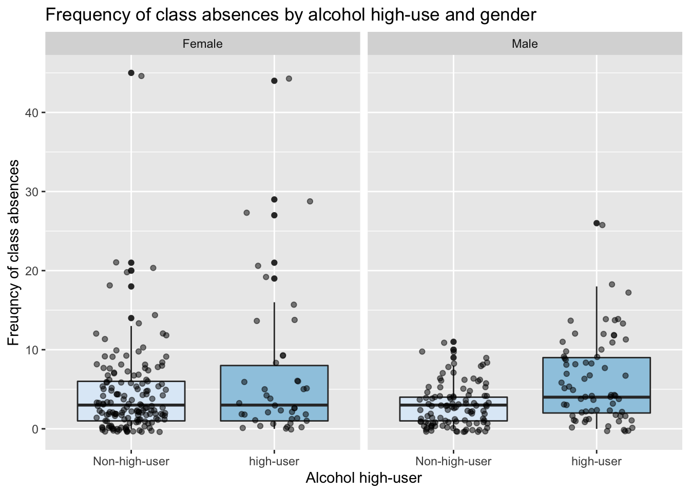

The box plot showed similar information to the previous table. No noticeable difference in proportions of absences can be observed between genders, and hence their interaction would not be considered in fitting the model. 

### 3.3.1.3 rename the variable

To facilitate understanding, the name of variable "absences" will be changed to in.class.performance according to the hypothesis of current study.


```r
alc <- alc %>% 
  mutate(in.class.performance = absences)
```


### 3.3.2 exploring the association between off-class performance (study time) and alcohol high-use
### 3.3.2.1 numerically explore the association


```r
alc %>% count(high_use, studytime)
```

```
## # A tibble: 8 × 3
##   high_use studytime     n
##   <lgl>        <dbl> <int>
## 1 FALSE            1    56
## 2 FALSE            2   128
## 3 FALSE            3    52
## 4 FALSE            4    23
## 5 TRUE             1    42
## 6 TRUE             2    57
## 7 TRUE             3     8
## 8 TRUE             4     4
```

From the table, it is found the sample of participants with long and very long (level 4 and 5) study time in alcohol high-user group is very small in number (n = 12). Caution should be taken about the potential large error. 

### 3.3.2.2 graphically explore the association


```r
p3 <- alc %>%
  ggplot(aes(x = factor(studytime), fill = high_use)) +
  geom_bar(position = "fill", color = "black") +
  facet_wrap(~sex, 
             labeller = labeller(sex = sex.labs)) +
  labs(x = "Study time ranges (larger is longer)", 
       y = "Proportion of high-user",
       title = "Proportion of alcohol high-use by study time ranges and sex")+
  theme(legend.position = "bottom")+
  guides(fill=guide_legend(title = "Alcohol high-use"))+
  scale_fill_discrete(labels = c("FALSE" = "Non-high-user", 
                                 "TRUE" = "high-user"))+
  scale_fill_brewer(palette = "Greys")
p3
```

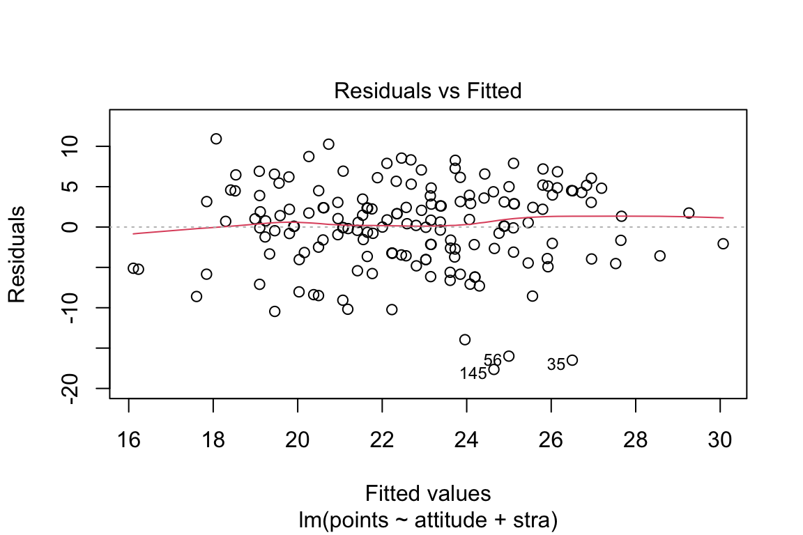

The levels of study time ranges include 1 - <2 hours, 2 - 2 to 5 hours, 3 - 5 to 10 hours, or 4 - >10 hours. Their intervals are inconsistent, and hence it is not appropriate to enter a model as numeric variables, and it will be transformed into a categorical variable.

According to the bar plot of proportion, it is found that with the increasing of study time, the proportion of alcohol high-use decreases, indicating its validity in entering the model. However, male with long study time (level 3) is an exception, which had the lowest proportion of high-users across the levels. Notably, this low proportion suffers from a risk of error due to the small sample in the level. To address the risk of error, the levels of study time ranges will be re-coded as Long study(original level 3 + original level 4), Moderate study(original level 2) and Light study (original level 1). Besides, no noticeable difference in proportions of study length can be observed between genders, and hence their interaction would not be considered in fitting the model. 

To facilitate understanding, the name of variable "studytime" will be changed to off.class.performance according to the hypothesis.

### 3.3.3 re-code the variable of study length


```r
alc <- alc %>% 
  mutate(off.class.performance = 
           case_when(studytime == 3 |studytime == 4~"Long study",
                     studytime == 2~"Moderate study",
                     studytime == 1~"Light study") %>% 
           factor(levels = c("Light study", "Moderate study", "Long study")))
```


## 3.4 exploring the association between social communication frequency and alcohol high-use

The variable "goout" in original data set captured participants' frequency of going out with friends (numeric: from 1 - very low to 5 - very high). It is presumed in the current analysis that it reflects social involvement, and hence it is selected as a candidate predictor. 

### 3.4.1 numerically explore the association


```r
alc %>% count(high_use, goout)
```

```
## # A tibble: 10 × 3
##    high_use goout     n
##    <lgl>    <dbl> <int>
##  1 FALSE        1    19
##  2 FALSE        2    82
##  3 FALSE        3    97
##  4 FALSE        4    40
##  5 FALSE        5    21
##  6 TRUE         1     3
##  7 TRUE         2    15
##  8 TRUE         3    23
##  9 TRUE         4    38
## 10 TRUE         5    32
```

From the table, it is found the sample of participants having very low frequency of social communication (level 1) is small in number (n = 21). Caution should be taken about the potential large error. 

### 3.4.2 graphically explore the association


```r
p4 <- alc %>%
  ggplot(aes(x = factor(goout), fill = high_use)) +
  geom_bar(position = "fill", color = "black") +
  facet_wrap(~sex, 
             labeller = labeller(sex = sex.labs)) +
  labs(x = "Social Communication Frequency (larger is more frequent)", 
       y = "Proportion of alcohol high-users",
       title = 
         "Proportion of social communication frequency ranges  by alcohol high-use and sex")+
  theme(legend.position = "bottom",
        plot.title = element_text(size = 10))+
  guides(fill=guide_legend(title = "Alcohol high-use"))+
  scale_fill_discrete(labels = c("FALSE" = "Non-high-user", 
                                 "TRUE" = "high-user"))+
  scale_fill_brewer(palette = "Greys")
  
p4
```

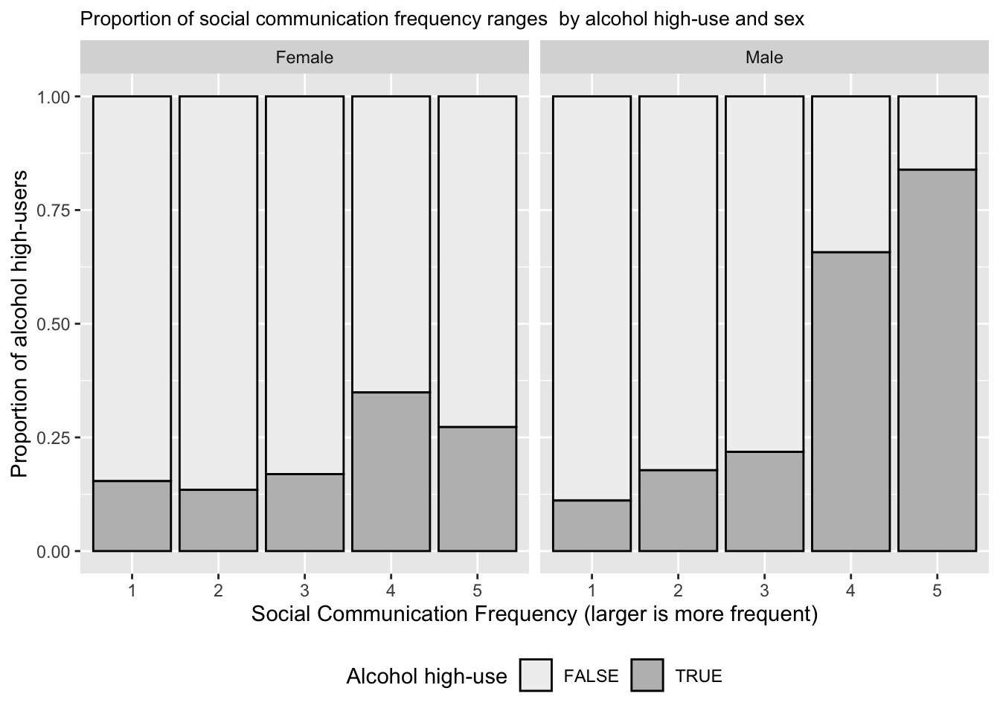

According to the bar plot, the proportion of alcohol high-users changed tremendously across different levels of social communication, indicating good validity of our model hypothesis about this variable. There is a clear borderline between social communication levels 1-3 and levels 4-5, though the difference is varied across genders. The levels are hence re-coded into two--Infrequent (original level 1-3) and Frequent (original level 4+5). Its interaction with sex will also be considered in fitting the model. This corresponds to the finding of previous evidence[@Senchak1998].

### 3.4.3 re-code the variable of social communication


```r
alc <- alc %>% 
  mutate(social = goout>3) 

alc <- alc %>% 
  mutate(social = social %>%  
           factor() %>% 
           fct_recode("Frequent" = "TRUE",
                      "Infrequent" = "FALSE"))
```

# 4 Model fitting

## 4.1 fitting base on the original hypothesis


```r
fit1 <- glm(high_use~ family.quality:sex + social:sex + off.class.performance + in.class.performance, data = alc, family = "binomial")
summary(fit1)
```

```
## 
## Call:
## glm(formula = high_use ~ family.quality:sex + social:sex + off.class.performance + 
##     in.class.performance, family = "binomial", data = alc)
## 
## Deviance Residuals: 
##     Min       1Q   Median       3Q      Max  
## -1.8260  -0.6946  -0.4982   0.6392   2.3077  
## 
## Coefficients:
##                                     Estimate Std. Error z value Pr(>|z|)    
## (Intercept)                         -0.05927    0.59970  -0.099  0.92127    
## off.class.performanceModerate study -0.44754    0.31133  -1.438  0.15058    
## off.class.performanceLong study     -1.03288    0.43290  -2.386  0.01704 *  
## in.class.performance                 0.06651    0.02294   2.899  0.00374 ** 
## family.quality:sexF                 -0.37948    0.15263  -2.486  0.01291 *  
## family.quality:sexM                 -0.34314    0.14677  -2.338  0.01939 *  
## sexF:socialFrequent                  0.92783    0.38133   2.433  0.01497 *  
## sexM:socialFrequent                  2.50131    0.39566   6.322 2.58e-10 ***
## ---
## Signif. codes:  0 '***' 0.001 '**' 0.01 '*' 0.05 '.' 0.1 ' ' 1
## 
## (Dispersion parameter for binomial family taken to be 1)
## 
##     Null deviance: 452.04  on 369  degrees of freedom
## Residual deviance: 350.52  on 362  degrees of freedom
## AIC: 366.52
## 
## Number of Fisher Scoring iterations: 4
```

All of the hypothesized predictors have at least one level being significant in the model. Comparing to light study participants, moderate study participants is not significant in predicting alcohol high-use. Hence,this variable will be dichotomized into Light study and moderate to long study for better model performance and parsimony of levels. The reason why it is not dichotomized into long study and moderate to short study is because the sample of long study category is extremely small, risking introducing error in our model.

## 4.2 re-code variable with insignificant levels


```r
alc <- alc %>% 
  mutate(off.class.performance = 
           case_when(off.class.performance == "Light study"~ "Light study",
                     TRUE~ "Moderate to long study") %>% 
           factor(levels = c("Light study", 
                             "Moderate to long study")))
```

## 4.3 fitting the model again


```r
fit2 <- glm(high_use~ family.quality:sex + social:sex + off.class.performance + in.class.performance, data = alc, family = "binomial")
summary(fit2)
```

```
## 
## Call:
## glm(formula = high_use ~ family.quality:sex + social:sex + off.class.performance + 
##     in.class.performance, family = "binomial", data = alc)
## 
## Deviance Residuals: 
##     Min       1Q   Median       3Q      Max  
## -1.8509  -0.6950  -0.4982   0.6364   2.3410  
## 
## Coefficients:
##                                             Estimate Std. Error z value
## (Intercept)                                 -0.06960    0.59922  -0.116
## off.class.performanceModerate to long study -0.58019    0.30223  -1.920
## in.class.performance                         0.07155    0.02275   3.145
## family.quality:sexF                         -0.40471    0.15192  -2.664
## family.quality:sexM                         -0.34358    0.14686  -2.339
## sexF:socialFrequent                          1.01880    0.37639   2.707
## sexM:socialFrequent                          2.51453    0.39586   6.352
##                                             Pr(>|z|)    
## (Intercept)                                  0.90753    
## off.class.performanceModerate to long study  0.05489 .  
## in.class.performance                         0.00166 ** 
## family.quality:sexF                          0.00772 ** 
## family.quality:sexM                          0.01931 *  
## sexF:socialFrequent                          0.00679 ** 
## sexM:socialFrequent                         2.12e-10 ***
## ---
## Signif. codes:  0 '***' 0.001 '**' 0.01 '*' 0.05 '.' 0.1 ' ' 1
## 
## (Dispersion parameter for binomial family taken to be 1)
## 
##     Null deviance: 452.04  on 369  degrees of freedom
## Residual deviance: 352.88  on 363  degrees of freedom
## AIC: 366.88
## 
## Number of Fisher Scoring iterations: 4
```

Now all of the hypothesized predictors are significant in predicting alcohol high-use, except for off-class performance, which has a a _p_ value of 0.05489, being very close to 0.05. An increase in sample size would very possibly make it significant. I hence keep this predictor in the model. Consequently, fit2 will be our final model.

## 4.4 interpreting the model results

### 4.4.1 transforming the coeficients to ORs


```r
OR <- coef(fit2) %>% exp()
CI <- confint(fit2) %>% exp()
ORCI <- cbind(OR,CI) 
print(ORCI, digits = 2)
```

```
##                                                OR 2.5 % 97.5 %
## (Intercept)                                  0.93  0.29   3.02
## off.class.performanceModerate to long study  0.56  0.31   1.02
## in.class.performance                         1.07  1.03   1.13
## family.quality:sexF                          0.67  0.49   0.90
## family.quality:sexM                          0.71  0.53   0.94
## sexF:socialFrequent                          2.77  1.33   5.86
## sexM:socialFrequent                         12.36  5.84  27.75
```

Our hypothesis that *a.* family relationship quality (interactive with gender); *b.* school performance; *c.* social communication (interactive with gender) could be predictors for alcohol high-use among college students is justified. According to the final model, comparing to participants who study less than 5 hours per week, those who study more than 5 hours have on average 0.56 (95%CI: 0.31~1.02) times less odds to be an alcohol high-user (95%CI: 0.31~1.02). Participants who have one more time of absence from class will on average have 1.07 (95%CI: 1.03~1.13) times more odds being an alcohol high-user. These findings about the predictive effect of academic performance on alcohol use is consistent with previous evidence[@Hayatbakhsh2011].For female college students, every one unit of family relationship quality increase would lead to 0.67 (95%CI: 0.49~9.90) times less odds being alcohol high-user. For male students, every one unit of family relationship quality increase would lead to 0.71 (95%CI: 0.53~0.94) times less odds being alcohol high-user. These indicate the predictive effects of family relationship on alcohol use are present and different across genders. This finding is consistent with previous evidence [@Kelly2011]. For female college students, comparing to students who do not have social involvement frequently, those who usually have social engagement have 2.77 (95%CI: 12.36~5.84) times more odds of being alcohol high-users. For male students, this effect is also present but the effect size goes as high as 12.36 times more odds of being alcohol high-users. These indicate the predictive effects of social engagement on alcohol use are present and tremendously different across genders. This finding is consistent with previous evidence[@Senchak1998].

### 4.4.2 exploring predictions

#### 4.4.2.1 cross tabulation of predcition versus the actual values


```r
prob <- predict(fit2, type = "response")

alc <- alc %>% 
  mutate(probability = prob)

alc <- alc %>% 
  mutate(prediction = probability>0.5)

high_use <- alc$high_use %>% 
  factor(level = c("TRUE", "FALSE"))

prediction <- alc$prediction %>% 
  factor(level = c("TRUE", "FALSE"))

accuracy.table <- table(high_use = high_use, prediction = prediction)%>%
  addmargins
accuracy.table 
```

```
##         prediction
## high_use TRUE FALSE Sum
##    TRUE    54    57 111
##    FALSE   23   236 259
##    Sum     77   293 370
```


```r
#generate proportion of predictive performance
table(high_use = high_use, prediction = prediction) %>% 
  prop.table %>% 
  addmargins %>% 
  print(digits = 2)
```

```
##         prediction
## high_use  TRUE FALSE   Sum
##    TRUE  0.146 0.154 0.300
##    FALSE 0.062 0.638 0.700
##    Sum   0.208 0.792 1.000
```


```r
#generate a function that calculates some indicators for sensitivity and specificity
my.fun <- function(array){
  TP <- array[1,1] #true positive
  FN <- array[1,2] #false negative
  FP <- array[2,1] #false positive 
  TN <- array[2,2] #true negative
  PP <- array[3,1] #positive
  PN <- array[3,2] #negative
  P <- array[1,3] # positive
  N <- array[2,3] # negative
  PPV <- TP/PP #positive predictive value
  FOR <- FN/PN #false omission rate
  FDR <- FP/PP # false discovery rate
  NPV <-  TN/PN # negative predictive value
  TPR <- TP/P #true positive rate
  FPR <- FP/N #false positive rate
  FNR <- FN/P #false negative rate
  TNR <- TN/N #true negative rate
  a <- paste("Positive predictive value is", round(PPV,2))
  b <- paste("False omission rate is", round(FOR,2))
  c <- paste("False discovery rate is", round(FDR,2))
  d <- paste("Negative predictive value is", round(NPV,2))
  e <- paste("True positive rate is", round(TPR,2))
  f <- paste("False positive rate is", round(FPR,2))
  g <- paste("False negative rate is", round(FNR,2))
  h <- paste("True negative rate is", round(TNR,2))
  
  output <- list(a,b,c,d,e,f,g,h)
  return(output)
}
my.fun(accuracy.table)
```

```
## [[1]]
## [1] "Positive predictive value is 0.7"
## 
## [[2]]
## [1] "False omission rate is 0.19"
## 
## [[3]]
## [1] "False discovery rate is 0.3"
## 
## [[4]]
## [1] "Negative predictive value is 0.81"
## 
## [[5]]
## [1] "True positive rate is 0.49"
## 
## [[6]]
## [1] "False positive rate is 0.09"
## 
## [[7]]
## [1] "False negative rate is 0.51"
## 
## [[8]]
## [1] "True negative rate is 0.91"
```


Among 259 participants who are not alcohol high-users, our model correctly predicts 236 (91%) of them (True negative rate). Among 111 participants who are alcohol high-users, our model correctly predicts 54 of them (49%) of them (True positive rate). In all, among the 370 predicts, 80(21.6%) were inaccurate. 

### 4.4.2.2 scatter plot of the prediction versus the actual values


```r
library(dplyr); library(ggplot2)

p5 <- alc %>% 
  ggplot(aes(x = probability, 
             y = high_use, 
             color = prediction, 
             shape =factor(probability>0.5))) +
  geom_point(position = position_jitter(0.01), 
             alpha = 0.8, size =2)
p5  
```

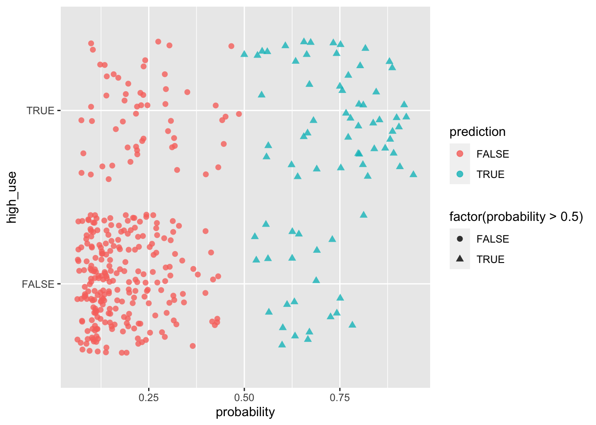

### 4.4.2.3 comparing the model to the performance of random guess


```r
random.guess <- runif(n= nrow(alc), min = 0, max = 1)
alc <- alc %>% 
  mutate(random.guess = random.guess)

alc <- alc %>% 
  mutate(prediction.guess = random.guess>0.5)

high_use = alc$high_use %>% 
  factor(levels = c("TRUE", "FALSE"))

prediction.guess = alc$prediction.guess %>% 
  factor(levels = c("TRUE", "FALSE"))

accuracy.tab.rand<- table(high_use = high_use, prediction = prediction.guess) %>% 
  addmargins()

accuracy.tab.rand  
```

```
##         prediction
## high_use TRUE FALSE Sum
##    TRUE    64    47 111
##    FALSE  123   136 259
##    Sum    187   183 370
```


```r
my.fun(accuracy.tab.rand)
```

```
## [[1]]
## [1] "Positive predictive value is 0.34"
## 
## [[2]]
## [1] "False omission rate is 0.26"
## 
## [[3]]
## [1] "False discovery rate is 0.66"
## 
## [[4]]
## [1] "Negative predictive value is 0.74"
## 
## [[5]]
## [1] "True positive rate is 0.58"
## 
## [[6]]
## [1] "False positive rate is 0.47"
## 
## [[7]]
## [1] "False negative rate is 0.42"
## 
## [[8]]
## [1] "True negative rate is 0.53"
```

Among 259 participants who are not alcohol high-users, random guess correctly guesses 126 (57%) of them. Among 111 participants who are alcohol high-users, random guess correctly guesses 55 of them (47%) of them. In all, among the 370 predicts, 181(49%) were inaccurate. Our model shows a tremendously better overall performance than random guess. However, its effect on correctly predicting the alcohol high-users is roughly equal to random guess, indicating the model is better applied in predicting who is a non-alcohol-high-user.

## 4.5 cross validation (Bonus)

### 4.5.1 define loss function


```r
# define a loss function (average prediction error)
loss_func <- function(class, prob) {
  n_wrong <- abs(class - prob) > 0.5
  mean(n_wrong)
}
```

### 4.5.2 compute prediction error base on traing data set


```r
# compute the average number of wrong predictions in the (training) data
training.error.full <- loss_func(alc$high_use, alc$probability)
training.error.full
```

```
## [1] 0.2162162
```

The prediction error rate is 21.6%, outperforming the model in Exercise Set 3, which had about 26% error.

### 4.5.3 compute prediction error base on 10-fold cross validation 


```r
# 10-fold cross-validation
set.seed(16)
library(boot)
cv <- cv.glm(data = alc, cost = loss_func, glmfit = fit2, K = 10)
cross.val.error.full <- cv$delta[1]
cross.val.error.full
```

```
## [1] 0.2216216
```

According to the result of 10 fold cross-validation, the model has an average error rate of 22.2%, a bit larger than the results from training model, but the error rate is still notably lower than the model in Exercise.

# 5 Observing the relationship between prediction error and number of predictors (Super Bonus) 

## 5.1 preparation

```r
library(utils)#install.packages("utils") library for generating all possible combinations of n elements

#pass the name of 4 predictors for our final model into an object
used.predictor <- c("family.quality:sex", 
                    "social:sex", 
                    "off.class.performance", 
                    "in.class.performance")
```

## 5.2 generating prediction error for all possible combinations of subsets of selected predictors


```r
#define a list "mylist"
mylist <- list()

#define a matrix with 2 rows and 6 columns, "ct.error", which means 
#cross-validation and training error
ct.error <- matrix(nrow=2, ncol = 6)

#start a loop that generate all possible combinations of the 4 used predictors,
#the combination could have 1-4 elements. Four each number of element, start a 
#loop (i in 1:4); Within the loop, another loop is used to pass all the prediction
#error results from cross validation and training data set into a matrix. Each 
#Matrix will have two rows saving results of cv and training data set, respectively.
#The number of columns will be dependent on how many combinations will be produced,
#with the maximum number being 6 (number of possible combinations of  2 predictors).
#Base on the number of i, 4 matrices will be generated, and saved in mylist. 

for(i in 1:4){
  combinations <- combn(used.predictor, i)
   all.formula.text <- apply(combinations, 2, 
                             function(x)paste("high_use~", 
                                              paste(x, collapse = "+")))
  for(j in 1:length(all.formula.text)){
    all.formula <- as.formula(all.formula.text[j])
    model <- glm(all.formula, data = alc, family = "binomial")
    cv <- cv.glm(data = alc, cost = loss_func, glmfit = model, K =10)
    ct.error[1,j] <- cv$delta[1]
    alc <- mutate(alc, probability = predict(model, type = "response"))
    ct.error[2,j] <- loss_func(alc$high_use, alc$probability)
  }
   mylist[[i]] <- ct.error
   ct.error <- matrix(nrow=2, ncol = 6)
}

#collapse the 4 matrices in mylist into 4 data frames.
for(w in 1:4){
 assign(paste0("df",w), as.data.frame(mylist[[w]]))
  }

#merge the 4 data frames into 1 by row. 
all.error <- rbind(df1,df2,df3,df4) #name the data set as all.error

#add a new column in all.error, which reflects if the result of this row is
#from cross validation or training set

tag <- rep(c("pred_cv", "pred_training"), times = 4)

#add another new column in all.error, which reflects if the result of this row is
#base on 1, 2, 3 or 4 predictors.
predictor_number <- rep(c(1,2,3,4), each = 2)

all.error <- all.error %>% 
  mutate(tag = tag,
         predictor_number = predictor_number)

#calculate the mean and sd for each row.
#note that the rows base on 4 predictor will not have sd, since there is only
#one combination. 
all.error <- all.error %>% 
  mutate(mean = rowMeans(select(.,V1:V6), na.rm = T),
         sd = apply(.[,1:6], 1, function(x)sd(x, na.rm=T)))
#check the all.error data set
all.error
```

```
##          V1        V2        V3        V4        V5        V6           tag
## 1 0.3135135 0.2135135 0.3000000 0.2918919        NA        NA       pred_cv
## 2 0.2972973 0.2135135 0.3000000 0.2891892        NA        NA pred_training
## 3 0.2135135 0.3027027 0.2675676 0.2135135 0.2108108 0.2783784       pred_cv
## 4 0.2108108 0.3054054 0.2648649 0.2135135 0.2054054 0.2837838 pred_training
## 5 0.2162162 0.2108108 0.2648649 0.2135135        NA        NA       pred_cv
## 6 0.2135135 0.2081081 0.2621622 0.2135135        NA        NA pred_training
## 7 0.2216216        NA        NA        NA        NA        NA       pred_cv
## 8 0.2162162        NA        NA        NA        NA        NA pred_training
##   predictor_number      mean         sd
## 1                1 0.2797297 0.04503604
## 2                1 0.2750000 0.04124759
## 3                2 0.2477477 0.04014825
## 4                2 0.2472973 0.04299761
## 5                3 0.2263514 0.02577033
## 6                3 0.2243243 0.02535360
## 7                4 0.2216216         NA
## 8                4 0.2162162         NA
```

## 5.3 plotting the trends of training&validation prediction errors by different number of predictors


```r
#plot all.error
#the error ribbon is 95% confidence interval
#4 predictors (the fitted model) do now have a error range because there is only one combination
all.error %>% ggplot(aes(x = factor(predictor_number), y = mean, group = tag), color = tag) +
  geom_line(aes(color = tag))+
  geom_point()+
  geom_ribbon(aes(ymin = mean-1.96*sd/sqrt(rowSums(!is.na(select(all.error,V1:V6)))), 
                  ymax = mean+1.96*sd/sqrt(rowSums(!is.na(select(all.error,V1:V6)))),  
                  fill = tag), alpha =0.25,
                position = position_dodge(0.05))+
  guides(fill = guide_legend(title = "Training/Cross-validation", title.position = "top"),
         color = guide_legend(title = "Training/Cross-validation", title.position = "top"))+
  theme_bw()+
  theme(legend.position = c(0.82,0.85), axis.text.x = element_text(size=12), 
        panel.grid.major = element_blank(),
        panel.grid.minor = element_blank()) +
  labs(x =  "", y = "Prediction Error",
       title = "Trends of training&validation prediction errors by different number of predictors")+
  scale_x_discrete(labels = c("1 predictor", "2 predictors", 
                              "3 predictors", 
                              "4 predictors \n(fitted model)"))+
  scale_fill_discrete(labels = c("pred_cv" = "error base on cross-validation", 
                                 "pred_training" = "error base on training set"))+
  scale_color_discrete(labels = c("pred_cv" = "error base on cross-validation", 
                                  "pred_training" = "error base on training set"))+
  annotate("text", 
           label = 
             "↓4-predictor model does \nnot have CI since it only \nhas one type of combination", 
           x = 3.9, y = 0.24, color = "red")+
  geom_point(aes(x=4, y= 0.22), shape = 1, size = 10, color = "red")
```

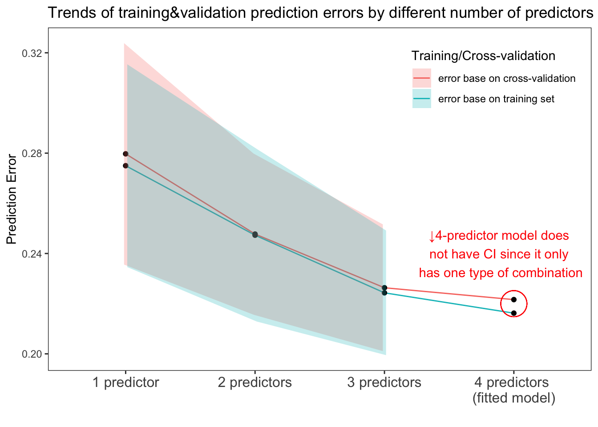

According to the plot, the prediction error of our 4-predictor final model is low comparing to the mean prediction errors of the possible combinations of either of the 1-,2-, and 3- predictor models. However, this goodness is only statistically significant comparing to 1- predictor models.(falls with 95%ci of 2- and 3- predictor models). This might be due to the possible combinations of 4 predictors is very small in number, resulting in large error ranges. 

# Super Bonus: Continued

Inspired by the bonus task, where different <4 number of predictors' influence on prediction error was observed, I started to get interested in how different number of random combinations of predictors added to the final model would affect the error. There are almost 30 variables that were not used in the final model. Twenty-three of them do not have direct relationship with the entered predictors, and hence they were selected to be a free predictor pool. One to 15 different predictors were randomly selected from the pool, each with 100 random repetitions (if all possible combinations of the number of predictors <100, then all possible combination will be used), resulting in 1423 models. The error rate base on training dataset and 10 fold cross validation were computed and plotted in a line chart. 95% confidence interval for each number of added predictors were also calculated and visualized.

The reason why only 15 maximum added predictors will be used instead of all 23 predictors is because the current sample size could not faithfully support model with more than 19 predictors, according to a rule of thumb that for each predictor used in model, a sample of 20 is required. 

**Preparing the predictor pool**


```r
# The predictors used in final 4-factor model 
fixed.predictor <- c("family.quality:sex", 
                    "social:sex", 
                    "off.class.performance", 
                    "in.class.performance")

# The variables not used in final model
not.used.predictor <- c("sex", "famsize", "studytime", "famrel", "Dalc", 
                        "Walc", "G1", "G2", "G3", "alc_use", "high_use", 
                        "family.quality", "social", "probability", 
                        "prediction", "random.guess", "prediction.guess", 
                        "goout")

#The set of free predictor pool
free.predictor<- setdiff(names(alc), fixed.predictor)
free.predictor<- setdiff(free.predictor, not.used.predictor)
```

**Building a loop that generates the result of 1423 models with 5~19 predictors (4 predictors in final model are fixed)**


```r
mylist <- list()

ct.error <- matrix(nrow=2, ncol = 100)


for(i in 1:15){
  combinations <- combn(free.predictor, i)
  if(choose(23,i)>100){
    ss = 100
  }else{
    ss = choose(23,i)
  }
  for(j in 1:ss){
    rn <- round(runif(1,min = 1, max = choose(23,i)), 0)
    sample.comb <- combinations[,rn]
    formula.text <- paste(
      "high_use ~ family.quality:sex + social:sex + off.class.performance + in.class.performance+", 
      paste(sample.comb, collapse = "+"))
    model <- glm(formula.text, data = alc, family = "binomial")
    cv <- cv.glm(data = alc, cost = loss_func, glmfit = model, K =10)
    ct.error[1,j] <- cv$delta[1]
    alc <- mutate(alc, probability = predict(model, type = "response"))
    ct.error[2,j] <- loss_func(alc$high_use, alc$probability)
  }
  mylist[[i]] <- ct.error
  ct.error <- matrix(nrow=2, ncol = 100)
}
```

**Collapsing the results into different data frame and merge them**


```r
for(w in 1:15){
 assign(paste0("df",w), as.data.frame(mylist[[w]]))
  }

all.error <- rbind(df1,df2,df3,df4,df5,df6,df7,df8,df9,df10,df11,df12,df13,df14,df15)

tag <- rep(c("pred_cv", "pred_training"), times = 15)

#add another new column in all.error, which reflects if the result of this row is
#base on 1-15 predictors.
predictor_number <- rep(c(1,2,3,4,5,6,7,8,9,10,11,12,13,14,15), each = 2)
 
all.error <- all.error %>% 
  mutate(tag = tag,
         predictor_number = predictor_number)

#calculate the mean and sd for each row.
all.error <- all.error %>% 
  mutate(mean = rowMeans(select(.,V1:V100), na.rm = T),
         sd = apply(.[,1:100], 1, function(x)sd(x, na.rm=T)))
```

**Plotting**


```r
#plot all.error
#the error ribbon is 95% confidence interval
#4 predictors (the fitted model) do now have a error range because there is only one combination
all.error %>% ggplot(aes(x = factor(predictor_number), y = mean, group = tag)) +
  geom_line()+
  geom_point()+
  geom_ribbon(aes(ymin = 
                    mean-1.96*sd/sqrt(rowSums(!is.na(select(all.error,V1:V100)))), 
                  ymax = 
                    mean+1.96*sd/sqrt(rowSums(!is.na(select(all.error,V1:V100)))),  
                  fill = tag), alpha =0.25,
                position = position_dodge(0.05))+
  guides(fill = guide_legend(title = "Training/Cross-validation", 
                             title.position = "top"),
         color = guide_legend(title = "Training/Cross-validation", 
                              title.position = "top"))+
  theme_bw()+
  theme(legend.position = c(0.2,0.15), 
        axis.text.x = element_text(size=12),
        panel.grid.major = element_blank(), 
        panel.grid.minor = element_blank()) +
  labs(x =  "Number of random predictors added to final model(4 predictors)", 
       y = "Prediction Error",
       title="Trends of training&validation error rates of final model plus \ndifferent number of random predictors")+
  scale_fill_discrete(labels = c("pred_cv" = "error base on cross-validation", 
                                 "pred_training" = "error base on training set"))+
  scale_color_discrete(labels = c("pred_cv" = "error base on cross-validation", 
                                  "pred_training" = "error base on training set"))+
  geom_line(aes(y = 0.22), color = "coral", size = 0.2, alpha = 0.8)+
  geom_line(aes(y = 0.21), color = "cyan3", size = 0.2, alpha =1)+ 
 annotate("text", 
          label = "↓Error rate of final model base on cross validation", 
          x = 11, y = 0.22, vjust = -0.5)+ 
 annotate("text", 
          label = "↓Error rate of final model base on training dataset", 
          x = 11, y = 0.21, vjust = -0.5)
```

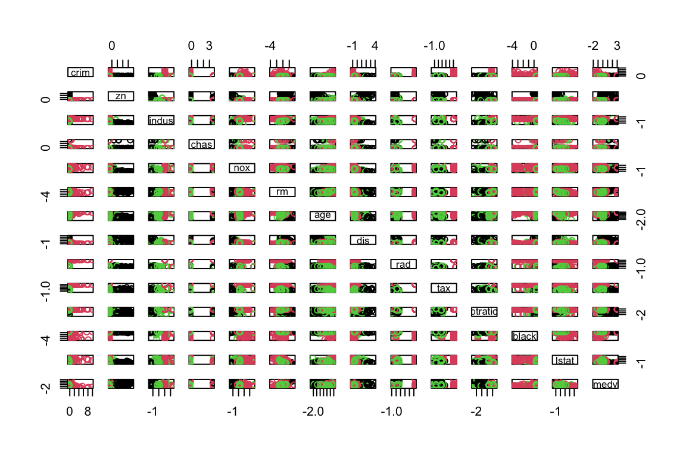

It is found in the plot that the prediction error rate of the 4-predictor final model by cross validation is always lower than the mean prediction error (and their lower ends of confidence interval) of the final model plus 1 to 15 randomly selected predictors, indicating the goodness of our final model.

It is also interesting to observe that the more predictors introduced to the model, the error rate by training data set keeps decreasing, indicating more predictors produce better models. However, the results of error rate by cross validation show an opposite effect, where the error rates generally increase with more predictors (though some flucutations are present). Put together, it can be infered that measuring model error rates using training data set itself would lead to over-estimation of the model goodness when more predictors enter the model. 

******
**Reference**

***


# **Chapter 4: Clustering and classification**

I do not come up with any better way to arrange everything than follow the pathway of assignment requirement. I will report the analysis with each main section being one of the requirement and each subsection being a component of that requirement, consecutively. I hope this would also make your rating process easier.

## 1 Assignment requirement #1

Quoted from the assignment: 

_"Create a new R Markdown file and save it as an empty file named ‘chapter4.Rmd’. Then include the file as a child file in your ‘index.Rmd’ file."_


### 1.1  Create a new R Markdown file and save it as an empty file named ‘chapter4.Rmd’

Done!

### 1.2 include the file as a child file in your ‘index.Rmd’ file.

Done!

## 2  Assignment requirement #2

Quoted from the assignment: 

_"Load the Boston data from the MASS package. Explore the structure and the dimensions of the data and describe the dataset briefly, assuming the reader has no previous knowledge of it. *(0-1 points)*"_

### 2.1 Load the Boston data from the MASS package.


```r
# access the MASS package
library(MASS)

# load the data
data("Boston")

# pass Boston to another object for easy typing
bos <- Boston
```


### 2.2 Explore the structure and the dimensions of the data  


```r
library(tidyverse)
#explore structure
str(bos)
```

```
## 'data.frame':	506 obs. of  14 variables:
##  $ crim   : num  0.00632 0.02731 0.02729 0.03237 0.06905 ...
##  $ zn     : num  18 0 0 0 0 0 12.5 12.5 12.5 12.5 ...
##  $ indus  : num  2.31 7.07 7.07 2.18 2.18 2.18 7.87 7.87 7.87 7.87 ...
##  $ chas   : int  0 0 0 0 0 0 0 0 0 0 ...
##  $ nox    : num  0.538 0.469 0.469 0.458 0.458 0.458 0.524 0.524 0.524 0.524 ...
##  $ rm     : num  6.58 6.42 7.18 7 7.15 ...
##  $ age    : num  65.2 78.9 61.1 45.8 54.2 58.7 66.6 96.1 100 85.9 ...
##  $ dis    : num  4.09 4.97 4.97 6.06 6.06 ...
##  $ rad    : int  1 2 2 3 3 3 5 5 5 5 ...
##  $ tax    : num  296 242 242 222 222 222 311 311 311 311 ...
##  $ ptratio: num  15.3 17.8 17.8 18.7 18.7 18.7 15.2 15.2 15.2 15.2 ...
##  $ black  : num  397 397 393 395 397 ...
##  $ lstat  : num  4.98 9.14 4.03 2.94 5.33 ...
##  $ medv   : num  24 21.6 34.7 33.4 36.2 28.7 22.9 27.1 16.5 18.9 ...
```

```r
#explore dimensions
dim(bos)
```

```
## [1] 506  14
```

```r
#generate a codebook
# string is copy from dataset introduction
codebook <- data.frame(variable = "CRIM - per capita crime rate by town/ZN - proportion of residential land zoned for lots over 25,000 sq.ft./INDUS - proportion of non-retail business acres per town./CHAS - Charles River dummy variable (1 if tract bounds river; 0 otherwise)/NOX - nitric oxides concentration (parts per 10 million)/RM - average number of rooms per dwelling/AGE - proportion of owner-occupied units built prior to 1940/DIS - weighted distances to five Boston employment centres/RAD - index of accessibility to radial highways/TAX - full-value property-tax rate per $10,000/PTRATIO - pupil-teacher ratio by town/B - 1000(Bk-0.63)^2 where Bk is the proportion of blacks by town/LSTAT - % lower status of the population/MEDV - Median value of owner-occupied homes in $1000's") 

codebook <- codebook %>% 
  separate_rows(variable, sep = "/") %>%  # "/" is the delimiter for rows
  separate(variable, sep = " - ",      #" - " is the delimiter for variables
           into = c("name", "description"),  # names of sparated variables
           remove = T)  #remove old column
#check codebook
library(DT)
codebook %>% datatable (caption = "Tab 2.2 Codebook for Boston dataset")
```

```{=html}
<div id="htmlwidget-4a085e368fc2a2fb0541" style="width:100%;height:auto;" class="datatables html-widget"></div>
<script type="application/json" data-for="htmlwidget-4a085e368fc2a2fb0541">{"x":{"filter":"none","vertical":false,"caption":"<caption>Tab 2.2 Codebook for Boston dataset<\/caption>","data":[["1","2","3","4","5","6","7","8","9","10","11","12","13","14"],["CRIM","ZN","INDUS","CHAS","NOX","RM","AGE","DIS","RAD","TAX","PTRATIO","B","LSTAT","MEDV"],["per capita crime rate by town","proportion of residential land zoned for lots over 25,000 sq.ft.","proportion of non-retail business acres per town.","Charles River dummy variable (1 if tract bounds river; 0 otherwise)","nitric oxides concentration (parts per 10 million)","average number of rooms per dwelling","proportion of owner-occupied units built prior to 1940","weighted distances to five Boston employment centres","index of accessibility to radial highways","full-value property-tax rate per $10,000","pupil-teacher ratio by town","1000(Bk-0.63)^2 where Bk is the proportion of blacks by town","% lower status of the population","Median value of owner-occupied homes in $1000's"]],"container":"<table class=\"display\">\n  <thead>\n    <tr>\n      <th> <\/th>\n      <th>name<\/th>\n      <th>description<\/th>\n    <\/tr>\n  <\/thead>\n<\/table>","options":{"columnDefs":[{"orderable":false,"targets":0}],"order":[],"autoWidth":false,"orderClasses":false}},"evals":[],"jsHooks":[]}</script>
```

The data set has 506 observations of 14 variables. Variable CHAS is a dummy variable where 1 means the the place having tract that bounds river, and 0 means otherwise. It needs to be converted to a factor.


```r
bos <- bos %>% 
  mutate(chas = chas %>%
           factor() %>% 
           fct_recode(
             "With tracts that bonds river" = "1", #old value 1 to new label
             "Otherwise" = "0") # old value 0 to new label
)
```

### 2.3 describe the dataset

Each of the 506 rows in the dataset describes a Boston suburb or town, and it has 14 columns with information such as average number of rooms per dwelling, pupil-teacher ratio, and per capita crime rate. The last row describes the median price of owner-occupied homes.

## 3 Assignment requirement #3

Quoted from the assignment:

_"Show a graphical overview of the data and show summaries of the variables in the data. Describe and interpret the outputs, commenting on the distributions of the variables and the relationships between them. *(0-2 points)*"_

### 3.1 Show a graphical overview of the data


```r
library(GGally)
library(ggplot2)

#define a function that allows me to fine-tune the matrix
my.fun <- function(data, mapping, method = "lm",...){ #define arguments
  p <- ggplot(data = data, mapping = mapping) + #pass arguments
    geom_point(size = 0.3, 
               color = "blue",...) + #define points size and color
    geom_smooth(size = 0.5, 
                color = "red", 
                method = method) #define line size and color; define lm regression
  p #print the results
}

#the abbreviated variable names are not self-explanatory, set column and row
#names to be the variable labels for better reading
#this new object will be used in ggpairs function
names1 <- pull(codebook[1:7,], description)  # extract row 1：7 of var description
names1 <- sapply(names1,    #collapse the description into multiple lines
                 function(x) paste(strwrap(x, 35),  # for better reading
                                   collapse = "\n")) # "\n" calls for a new line

ggpairs(bos, 
        lower = list(
          continuous = my.fun,
          combo = wrap("facethist", bins = 20)),
        col = 1:7,
        columnLabels = names1)+#define column labels as the names I just set
  labs(title = "Fig 3.1 Visualized relations of Boston dataset, variable #1~#7" )+
  theme(plot.title = element_text(size = 20) ) 
```

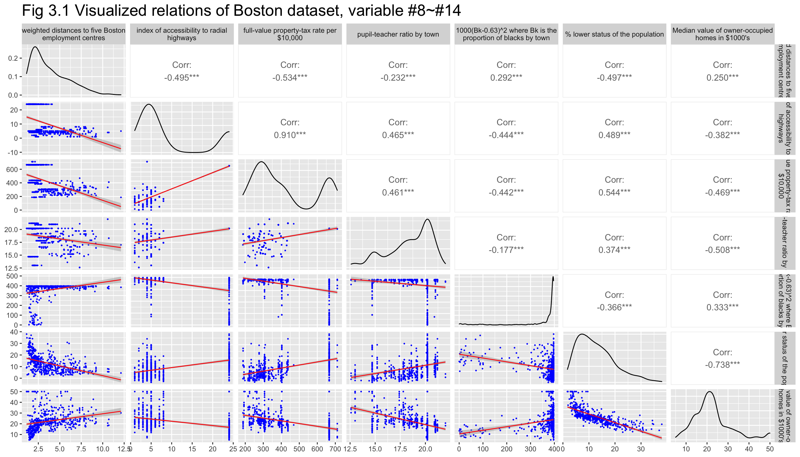

Note that variable about crime rate is plagued with outliers.


```r
#repeat what is done in the last chunk for variable 8~14
names2 <- pull(codebook[8:14,], description)
names2 <- sapply(names2, function(x) paste(strwrap(x, 35), collapse = "\n"))

ggpairs(bos, 
        lower = list(
          continuous = my.fun),
        col = 8:14,
        columnLabels = names2,
        )+
   labs(title = "Fig 3.1 Visualized relations of Boston dataset, variable #8~#14" )+
  theme(plot.title = element_text(size = 20) ) 
```


### 3.2 Show summaries of the variables in the data. 


```r
library(finalfit)
#summarize the continuous data
ff_glimpse(bos)$Continuous %>% datatable(caption = "Fig 3.2 Summary of Continuous data")
```

```{=html}
<div id="htmlwidget-a23d2a8298c8f15147f7" style="width:100%;height:auto;" class="datatables html-widget"></div>
<script type="application/json" data-for="htmlwidget-a23d2a8298c8f15147f7">{"x":{"filter":"none","vertical":false,"caption":"<caption>Fig 3.2 Summary of Continuous data<\/caption>","data":[["crim","zn","indus","nox","rm","age","dis","rad","tax","ptratio","black","lstat","medv"],["crim","zn","indus","nox","rm","age","dis","rad","tax","ptratio","black","lstat","medv"],["&lt;dbl&gt;","&lt;dbl&gt;","&lt;dbl&gt;","&lt;dbl&gt;","&lt;dbl&gt;","&lt;dbl&gt;","&lt;dbl&gt;","&lt;int&gt;","&lt;dbl&gt;","&lt;dbl&gt;","&lt;dbl&gt;","&lt;dbl&gt;","&lt;dbl&gt;"],[506,506,506,506,506,506,506,506,506,506,506,506,506],[0,0,0,0,0,0,0,0,0,0,0,0,0],["0.0","0.0","0.0","0.0","0.0","0.0","0.0","0.0","0.0","0.0","0.0","0.0","0.0"],["3.6","11.4","11.1","0.6","6.3","68.6","3.8","9.5","408.2","18.5","356.7","12.7","22.5"],["8.6","23.3","6.9","0.1","0.7","28.1","2.1","8.7","168.5","2.2","91.3","7.1","9.2"],["0.0","0.0","0.5","0.4","3.6","2.9","1.1","1.0","187.0","12.6","0.3","1.7","5.0"],["0.1","0.0","5.2","0.4","5.9","45.0","2.1","4.0","279.0","17.4","375.4","6.9","17.0"],["0.3","0.0","9.7","0.5","6.2","77.5","3.2","5.0","330.0","19.1","391.4","11.4","21.2"],["3.7","12.5","18.1","0.6","6.6","94.1","5.2","24.0","666.0","20.2","396.2","17.0","25.0"],["89.0","100.0","27.7","0.9","8.8","100.0","12.1","24.0","711.0","22.0","396.9","38.0","50.0"]],"container":"<table class=\"display\">\n  <thead>\n    <tr>\n      <th> <\/th>\n      <th>label<\/th>\n      <th>var_type<\/th>\n      <th>n<\/th>\n      <th>missing_n<\/th>\n      <th>missing_percent<\/th>\n      <th>mean<\/th>\n      <th>sd<\/th>\n      <th>min<\/th>\n      <th>quartile_25<\/th>\n      <th>median<\/th>\n      <th>quartile_75<\/th>\n      <th>max<\/th>\n    <\/tr>\n  <\/thead>\n<\/table>","options":{"columnDefs":[{"className":"dt-right","targets":[3,4]},{"orderable":false,"targets":0}],"order":[],"autoWidth":false,"orderClasses":false}},"evals":[],"jsHooks":[]}</script>
```


```r
# summarize the categorical data
ff_glimpse(bos)$Categorical %>% datatable(caption = "Fig 3.2 Summary of Categorical data")
```

```{=html}
<div id="htmlwidget-6bc9af357c2e0e0daf12" style="width:100%;height:auto;" class="datatables html-widget"></div>
<script type="application/json" data-for="htmlwidget-6bc9af357c2e0e0daf12">{"x":{"filter":"none","vertical":false,"caption":"<caption>Fig 3.2 Summary of Categorical data<\/caption>","data":[["chas"],["chas"],["&lt;fct&gt;"],[506],[0],["0.0"],[2],["\"Otherwise\", \"With tracts that bonds river\""],["471, 35"],["93.1,  6.9"]],"container":"<table class=\"display\">\n  <thead>\n    <tr>\n      <th> <\/th>\n      <th>label<\/th>\n      <th>var_type<\/th>\n      <th>n<\/th>\n      <th>missing_n<\/th>\n      <th>missing_percent<\/th>\n      <th>levels_n<\/th>\n      <th>levels<\/th>\n      <th>levels_count<\/th>\n      <th>levels_percent<\/th>\n    <\/tr>\n  <\/thead>\n<\/table>","options":{"columnDefs":[{"className":"dt-right","targets":[3,4,6]},{"orderable":false,"targets":0}],"order":[],"autoWidth":false,"orderClasses":false}},"evals":[],"jsHooks":[]}</script>
```


### 3.3 Describe and interpret the outputs, commenting on the distributions of the variables and the relationships between them. 

#### 3.3.1 interpreting continuous variables

There are 13 continuous variables in the dataset. The crime rate of the town was 0.3(0.1~3.7)%; the proportion of a town's residential land zoned for lots over 25,000 sq.ft. was 0 (0~12.5)%; the proportion of non-retail business acres per town was 9.7(5.2~18.1)%; the nitric oxides concentration was 0.5(0.4~0.6) parts per 10 million; the average number of rooms per dwelling was 6.3±0.7 rooms; the proportion of owner-occupied units built prior to 1940 was 77.5(45.0~94.1)%; the weighted distances to five Boston employment centres was 3.2 (2.1~5.2) kilometers; the index of accessibility to radial highways was 5(4~24) units of accessibility; the full-value property-tax rate was $330(279~666) per \$10,000; the pupil-teacher ratio by town was 19.1(17.4~20.2); the Black proportion of population after taking the formula of 1000(Bk-0.63)^2 was 391.4(375.4~396.2); the proportion of population that is lower status was 11.4(6.9~17.0)%; the median value of owner-occupied homes was \$21.2(17~25)*1000.

#### 3.3.2 interpreting categorical variable

35(6.9%) towns have tracts that bonds Charles River. 

#### 3.3.3 commenting on the ditributions

The distribution of variables is shown in the diagonal grids of fig 3.1 (see above). For clear presentation, it is visualized singly again. See fig 3.3.3 below.


```r
label.name <- paste(codebook$name[-4], paste("(",codebook$description[-4],")"))
names(label.name) <- c("crim",	
                       "zn",	
                       "indus",
                       "nox",	
                       "rm",	
                       "age",
                       "dis",	
                       "rad",	
                       "tax",
                       "ptratio",	
                       "black",	
                       "lstat",	
                        "medv")

#plot it
bos %>% 
  dplyr::select(-chas) %>% 
  pivot_longer(everything()) %>%  #longer format
  ggplot(aes(x = value)) + #x axis used variable "value" (a default of pivot)
  geom_histogram(aes(y = ..density..), #match ys of density and histogram plots
                 color = "black", #my favorite border color
                 fill = "#9999CC")+  # I heard this is a beautiful color
  geom_density(fill = "pink", 
               alpha = 0.25)+ #adjust the aesthetics for density plot
  facet_wrap(~name, scales = "free", #wrap by name variable
             labeller = labeller(name = label.name),#use the label I set above
             ncol = 2) + #wrap into 2 columns
  theme(panel.grid.major = element_blank(), #get rid of the ugly grids
        panel.grid.minor = element_blank(),
        panel.background = element_rect(fill = "white",#adjust the background
                                        color = "black"),
        strip.background = element_rect(color = "black",#adjust the strips aes
                                        fill = "steelblue"),
        strip.text = element_text(size =10, 
                                  color = "white"), #adjust the strip text
        axis.title.x = element_text(size = 20), #adjust the x text
        axis.title.y = element_text(size = 20), # adjust the y text
        plot.title = element_text(size = 18, face = "bold"))+ #adjust the title
  labs(title = "Fig. 3.3.3 Distribution of variables", #title it
       x= "",
       y="")
```

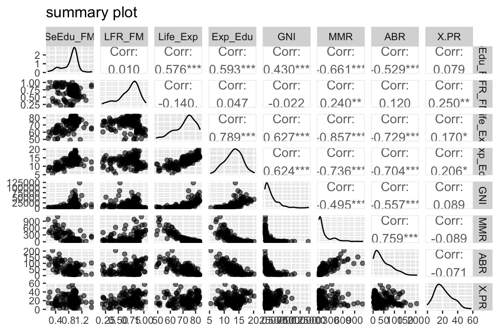

From the figure above, some interesting findings are:

*a.* AGE: the distribution is heavily left-skewed, with strong negative kurtosis. A Proportion of 75% to 100% for owner-occupied units built prior to 1940 takes up almost 1/2 of the towns/counties, indicating old owner-occupied units are still the majority for most parts of Boston city. 


*b.* RM: average number of rooms per dwelling is roughly normally distributed, centering arond a number of 6 rooms. This is a bit surprising because most of the wealth-related indicators tend to show strong right-skewness due to the fact people cannot have negative wealth but can indefinitely rich. The normality of RM might indicate most Boston people is leading a good life in terms of the size of their accommodation, and wealth has a ceiling effect on size of accommodation.

*c.* DISL weighted distances to five Boston employment centres is heavily right-skewed, with a mode at arond 2 km. Zero to 5 kilos' distances take up 2/3 of data. These might reflect Boston people's tendency to live in a community closer to where they work, and the preference falls within a range of 0~5 kilos. 

*d.* B: Adjusted proportion of blacks by town distributed with heavy left-skewness and a strong positive kurtosis. The mode of the data is at around 400 per 1000. I am not able to interpret the number with much reference to reality since I do not have any idea on the adjusting logic. However it is sufficient to conclude the proportion of Africa America is stably large in most of regions of Boston, but there are a small number of also towns/counties that are very rarely resided by them.

#### 3.3.4 commenting on the relationships between variables

Except for the one binary variable about tract that bonds river, each variable in our data set shows a >0.3 and/or <-0.3 correlation with at least one of the other variables. Some of them have correlation as high as 0.9. All of the correlation coefficients are significant (_p_<0.001). 

## 4 Assignment requirement #4

Quoted from the assignment:

_"Standardize the dataset and print out summaries of the scaled data. How did the variables change? Create a categorical variable of the crime rate in the Boston dataset (from the scaled crime rate). Use the quantiles as the break points in the categorical variable. Drop the old crime rate variable from the dataset. Divide the dataset to train and test sets, so that 80% of the data belongs to the train set. *(0-2 points)*"_

### 4.1 Standardize the dataset and print out summaries of the scaled data


```r
library(MASS)
#binary variables with values as number will not influence the result of 
#standardization and clustering, hence I will reload Boston without re-coding
#binary variable. This is for easiness of matrix multiplication in the following
#operations
              
bos <- Boston 
bos.s <- as.data.frame(scale(bos))# bos.s means Boston Scaled
```


### 4.2 How did the variables change?


```r
ff_glimpse(bos.s)$Con %>% datatable(caption = "Fig 3.2 Summary of standardized data")
```

```{=html}
<div id="htmlwidget-f05e31a3b157d4f8f67b" style="width:100%;height:auto;" class="datatables html-widget"></div>
<script type="application/json" data-for="htmlwidget-f05e31a3b157d4f8f67b">{"x":{"filter":"none","vertical":false,"caption":"<caption>Fig 3.2 Summary of standardized data<\/caption>","data":[["crim","zn","indus","chas","nox","rm","age","dis","rad","tax","ptratio","black","lstat","medv"],["crim","zn","indus","chas","nox","rm","age","dis","rad","tax","ptratio","black","lstat","medv"],["&lt;dbl&gt;","&lt;dbl&gt;","&lt;dbl&gt;","&lt;dbl&gt;","&lt;dbl&gt;","&lt;dbl&gt;","&lt;dbl&gt;","&lt;dbl&gt;","&lt;dbl&gt;","&lt;dbl&gt;","&lt;dbl&gt;","&lt;dbl&gt;","&lt;dbl&gt;","&lt;dbl&gt;"],[506,506,506,506,506,506,506,506,506,506,506,506,506,506],[0,0,0,0,0,0,0,0,0,0,0,0,0,0],["0.0","0.0","0.0","0.0","0.0","0.0","0.0","0.0","0.0","0.0","0.0","0.0","0.0","0.0"],["-0.0","0.0","0.0","-0.0","-0.0","-0.0","-0.0","0.0","0.0","0.0","-0.0","-0.0","-0.0","-0.0"],["1.0","1.0","1.0","1.0","1.0","1.0","1.0","1.0","1.0","1.0","1.0","1.0","1.0","1.0"],["-0.4","-0.5","-1.6","-0.3","-1.5","-3.9","-2.3","-1.3","-1.0","-1.3","-2.7","-3.9","-1.5","-1.9"],["-0.4","-0.5","-0.9","-0.3","-0.9","-0.6","-0.8","-0.8","-0.6","-0.8","-0.5","0.2","-0.8","-0.6"],["-0.4","-0.5","-0.2","-0.3","-0.1","-0.1","0.3","-0.3","-0.5","-0.5","0.3","0.4","-0.2","-0.1"],["0.0","0.0","1.0","-0.3","0.6","0.5","0.9","0.7","1.7","1.5","0.8","0.4","0.6","0.3"],["9.9","3.8","2.4","3.7","2.7","3.6","1.1","4.0","1.7","1.8","1.6","0.4","3.5","3.0"]],"container":"<table class=\"display\">\n  <thead>\n    <tr>\n      <th> <\/th>\n      <th>label<\/th>\n      <th>var_type<\/th>\n      <th>n<\/th>\n      <th>missing_n<\/th>\n      <th>missing_percent<\/th>\n      <th>mean<\/th>\n      <th>sd<\/th>\n      <th>min<\/th>\n      <th>quartile_25<\/th>\n      <th>median<\/th>\n      <th>quartile_75<\/th>\n      <th>max<\/th>\n    <\/tr>\n  <\/thead>\n<\/table>","options":{"columnDefs":[{"className":"dt-right","targets":[3,4]},{"orderable":false,"targets":0}],"order":[],"autoWidth":false,"orderClasses":false}},"evals":[],"jsHooks":[]}</script>
```

All the variables after scaling had a mean of 0 and most of variables' values ranged from -4 and 4, only except for variables crim (crime rate), which might be due to out-liers (corresponds to the finding from the correlation matrix).

### 4.3 Use the quantiles as the break points in the categorical variable and drop the old crime rate variable from the dataset.


```r
#generate cutoff according to quantile
bins <- quantile(bos.s$crim)
#generate a categorical variable "crime" and re-code it
bos.s <- bos.s %>% 
  mutate(crime = crim %>% 
           cut(breaks = bins, include.lowest = TRUE) %>% 
           fct_recode("Low" = "[-0.419,-0.411]",
                     "MediumLow" = "(-0.411,-0.39]",
                     "MediumHigh" = "(-0.39,0.00739]",
                     "High" = "(0.00739,9.92]"))
#remove crim
bos.s <- bos.s %>% dplyr::select(-crim)
```

### 4.4 Divide the dataset to train and test sets, so that 80% of the data belongs to the train set


```r
set.seed(2022) 
#generate an object containing the number of observations in bos dataset
n <-  nrow(bos.s)

#generate an object "ind", which contains a random selected set of the indexing 
#of bos dataset, and the number of indexing takes up 80% of number of observations
ind <- sample(1:n, size = n*0.8)
#generate train&test sets according to the random set of indexing number
train <- bos.s[ind,]
test <- bos.s[-ind,]
```

## 5 Assignment requirement #5

Quoted from the assignment:

_"Fit the linear discriminant analysis on the train set. Use the categorical crime rate as the target variable and all the other variables in the dataset as predictor variables. Draw the LDA (bi)plot *(0-3 points)*"_

### 5.1 Fit the linear discriminant analysis on the train set (Use the categorical crime rate as the target variable and all the other variables in the dataset as predictor variables)


```r
# fit an linear discriminant model on the train set, named as "lda.fit"
lda.fit <- lda(crime ~ ., data = train) 
```

### 5.2 Draw the LDA (bi)plot


```r
# the function for lda biplot arrows
lda.arrows <- function(x, myscale = 1, arrow_heads = 0.1, color = "red", tex = 0.75, choices = c(1,2)){
  heads <- coef(x)
  arrows(x0 = 0, y0 = 0, 
         x1 = myscale * heads[,choices[1]], 
         y1 = myscale * heads[,choices[2]], col=color, length = arrow_heads)
  text(myscale * heads[,choices], labels = row.names(heads), 
       cex = tex, col=color, pos=3)
}
# target classes as numeric
classes <- as.numeric(factor(train$crime))
```


```r
#plot the lda results
plot(lda.fit, dimen = 2,  
     pch = classes, 
     col = classes,
     main = "Fig 5.2 Biplot for LDA for clustering crime rate")+
lda.arrows(lda.fit, myscale = 4)
```

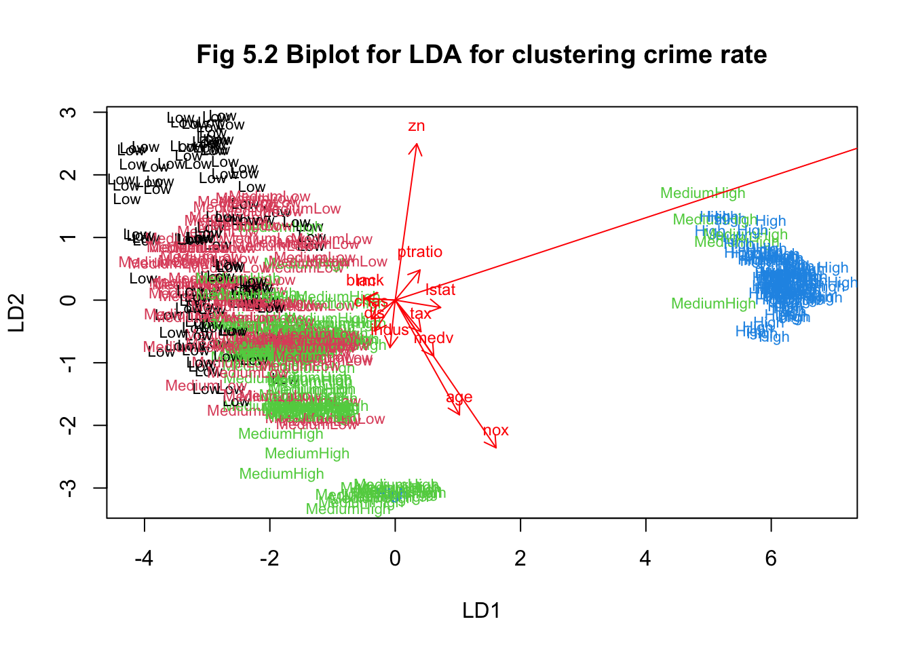

```
## integer(0)
```

Biplot based on LD1  and LD2 was generated, see fig 5.2. The most of four clusters separated poorly, except for the cluster "High".  Heavy overlap was observed between each pair of other cluster. Besides, Clusters High and MediumHigh also showed notable overlaps.

Based on arrows, varaibles lstat explained the most for cluster High. Contributions of variables to other clusters are not clear enough due to the heavy overlap.

## 6 Assignment requirement #6

Quoted from the assignment:

_"Save the crime categories from the test set and then remove the categorical crime variable from the test dataset. Then predict the classes with the LDA model on the test data. Cross tabulate the results with the crime categories from the test set. Comment on the results. *(0-3 points)*"_

### 6.1 Save the crime categories from the test set and then remove the categorical crime variable from the test dataset


```r
#save crime into an object
classes.test <- test$crime
#remove crime
test$crime <- NULL
```

### 6.2 predict the classes with the LDA model on the test data


```r
predicted.test <- predict(lda.fit, test)
```


### 6.3 Cross tabulate the results with the crime categories from the test set.


```r
#generate a table that evaluate the accuracy of model, and pass the table into
#an object named "accuracy.tab"
accuracy.tab <- table(correct = classes.test, predicted = predicted.test$class )

#show the accuracy table
accuracy.tab
```

```
##             predicted
## correct      Low MediumLow MediumHigh High
##   Low          4         7          0    0
##   MediumLow   10        16          4    0
##   MediumHigh   2        11         17    1
##   High         0         0          0   30
```

```r
#ask R to identify the correct predictions and add them up
correct.n = 0 # the number of correct predictions starting at 0
for (i in 1:4){ #4 loops because we have 4 rows/columns
  correct.c <- accuracy.tab[
    which(rownames(accuracy.tab) == colnames(accuracy.tab)[i]), 
    i] # if a cell has same row and column names, pass its value into "correct.c"
  correct.n = correct.c+ correct.n # update the value of correct prediction
}                                  # by adding "correct.c"

# calculate the percent of correct predictions for test set
correct.n/(nrow(bos.s)*0.2) #denominator is the number of obs. in test set
```

```
## [1] 0.6620553
```

```r
1-diag(accuracy.tab)/colSums(accuracy.tab)
```

```
##        Low  MediumLow MediumHigh       High 
## 0.75000000 0.52941176 0.19047619 0.03225806
```

```r
diag(accuracy.tab)
```

```
##        Low  MediumLow MediumHigh       High 
##          4         16         17         30
```


### 6.4 Comment on the results

Overall, 66.2% of the predictions are correct, showing not quite satisfactory predicting effect of our linear discriminant analysis. Observing the result closely, it is found that for high and medium high crime rate regions, the analysis did the best predictions, with 90% (47/52) of accuracy. For Low and medium low regions, the predictive effect of our model decreased tremendously. This might be the result of *a.* the violation of the assumption of multivariate normality (but evidence showed even when this is violated, LDA also exhibited good accuracy); *b.* large number of out-liers in the dependent variable before re-coding (LDA is sensitive to out-liers); *c.* The small size of category Low in test set; *d.* better categorization strategy for dependent variable needed (the current categorization is only base on quantiles, which lacks of more evidence-based foundation).

## 7 Assignment requirement #7

Quoted from the assignment:

_"Reload the Boston dataset and standardize the dataset (we did not do this in the Exercise Set, but you should scale the variables to get comparable distances). Calculate the distances between the observations. Run k-means algorithm on the dataset. Investigate what is the optimal number of clusters and run the algorithm again. Visualize the clusters (for example with the pairs() or ggpairs() functions, where the clusters are separated with colors) and interpret the results. *(0-4 points)*"_

### 7.1 Reload the Boston dataset and standardize the dataset


```r
#reload Boston
data("Boston")
bos <- Boston
#standardize the dataset
bos.s <- as.data.frame(scale(bos))
```

### 7.2 Calculate the distances between the observations


```r
dis_eu <- dist(bos.s)
summary(dis_eu)
```

```
##    Min. 1st Qu.  Median    Mean 3rd Qu.    Max. 
##  0.1343  3.4625  4.8241  4.9111  6.1863 14.3970
```

### 7.3 Run k-means algorithm on the dataset


```r
bos.s.km <- kmeans(bos.s, centers = 4) 
```

### 7.4 Investigate what is the optimal number of clusters


```r
date()
```

```
## [1] "Tue Dec 13 18:33:39 2022"
```

```r
set.seed(22) #22 is the date I carried out the analysis

# determine the number of clusters
k_max <- 10

# calculate the total within sum of squares
twcss <- sapply(1:k_max, function(k){kmeans(bos.s, k)$tot.withinss})
```


```r
# visualize the results
qplot(x = 1:k_max, y = twcss, geom = 'line')+
  geom_line(aes(x = 3, color = "red")) +
  annotate("text", 
           label = 
             "←Elbow effect happens here", 
           x = 4.8, y =3800, color = "red") +
  labs(title = "Fig 7.4 Trends of within-cluster sum-of-square with increasing number of k",
       x =  "Number of k",
       y = "With-cluster SS")+
  theme(legend.position = "none", 
        panel.background = element_rect(color = "black"))
```

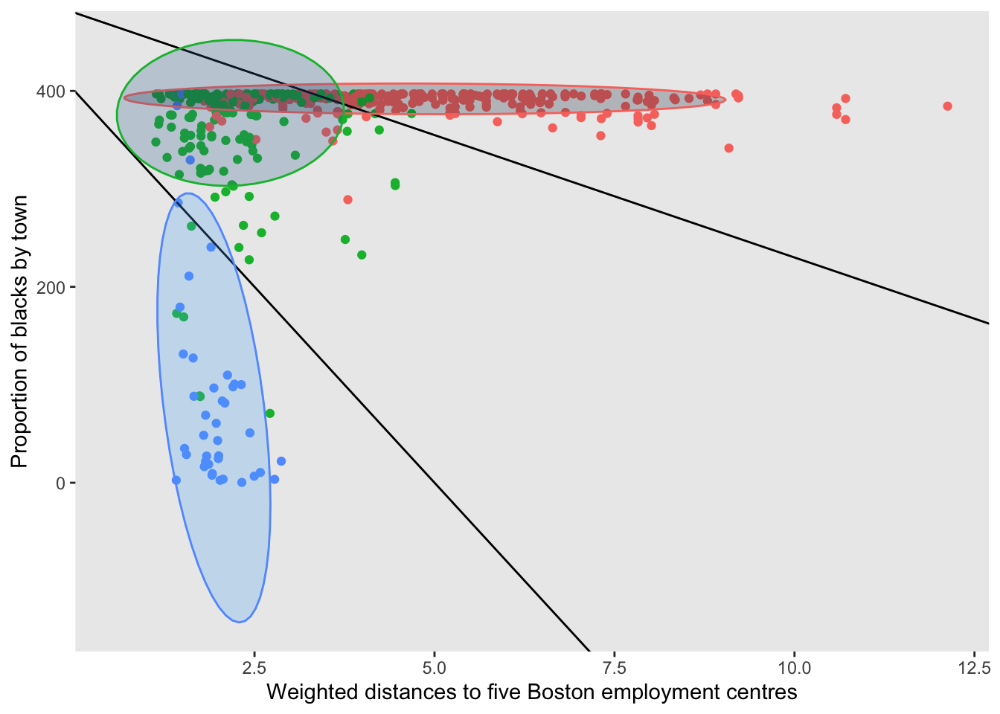

There is a huge reduction in variation with K =3, but after that the variation does not go down as quickly. I will use K = 3 and do the k-means clustering again.

### 7.5  run the algorithm again


```r
km <- kmeans(bos.s, centers = 3)
```

### 7.6 Visualize the clusters 


```r
#define a function that allows me to fine-tune the matrix
my.fun.km <- function(data, mapping,...){ #define arguments
  p <- ggplot(data = data, mapping = mapping) + #pass arguments
    geom_point(size = 0.3, 
               color = factor(km$cluster),
               ...) + #define points size and color
    stat_ellipse(geom = "polygon", mapping = mapping, alpha = 0.5)
     #calculate an ellipse layer that separate clusters
  p #print the results
}

ggpairs(bos, mapping = aes(fill=factor(km$cluster)),
        lower = list(
          continuous = my.fun.km
          ),
        col = 1:7,
        title = "Fig 7.6.1 Correlation Matrix with clusters, variables 1 to 7")+
  labs(caption = "Note that variables with at least one level fully covered by one cluster will not produce ellipse clustering")+
  theme(plot.title = element_text(size = 20) )
```

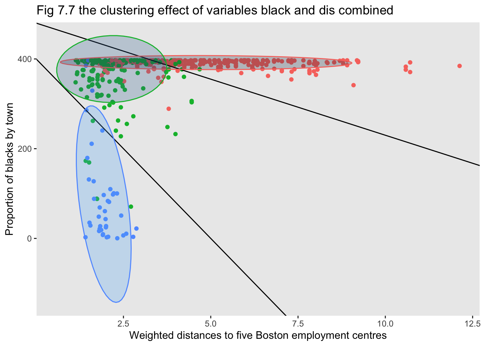


```r
ggpairs(bos, mapping = aes(fill=factor(km$cluster)),
        lower = list(
          continuous = my.fun.km
          ),
        col = 8:14)+
  labs(caption = "Note that variables with at least one level fully covered by one cluster will not produce ellipse clustering", title = "Fig 7.6.2 Correlation Matrix with clusters, variables 8 to 14" )+
  theme(plot.title = element_text(size = 20) )
```

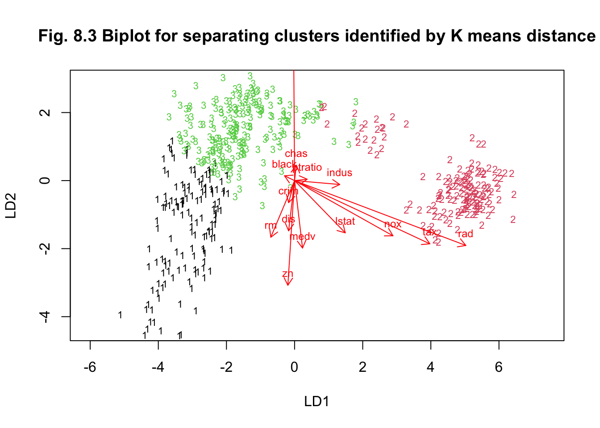

### 7.7 interpret the results

By observing the elbow plot that depicts the size of within-cluster sum-of-square changes with number of k, an optimal number of k = 3 was determined. The subsequent results of k-means clustering was visualized in a correlation matrix with variables containing in dataset. It is observed that some of the variables have contributed tremendously to the clustering. For example, the variable "black" separates one cluster with the other two clusters nicely, see the 5th column of the picture above (Fig 7.6.2), x axis; and the variable age separates a different cluster with the other two clusters roughly, see the 7th row of the picture above (Fig 7.6.1), y axis. Some pairs of the variables have also played important role in clustering, for example, the combination of black and dist variables separate three clusters roughly, see picture above (Fig 7.6.2, column 1nd, row 5th) or see the picture below (Fig 7.6.3). Due to the limitation of presenting more dimensions in a 2-dimension screen, I am not able to dig into the clustering effect of more variables combined. Fortunately, k-means clustering has done that for me, mathematically. 


```r
bos %>% ggplot(aes(x = dis, y = black, color = factor(km$cluster))) +
  geom_point() +
  geom_abline(intercept = 480, slope = -25)+
  geom_abline(intercept = 400, slope = -80) +
  stat_ellipse(geom = "polygon",
               aes(fill = km$cluster),
               alpha = 0.25)+
  theme(legend.position = "none",
        panel.grid.major = element_blank(), 
        panel.grid.minor = element_blank())+
  labs(x = "Weighted distances to five Boston employment centres", 
       y = "Proportion of blacks by town",
       title = "Fig 7.7 the clustering effect of variables black and dis combined")
```


## 8 Assignment requirement #2

Quoted from the assignment:

_"Bonus: Perform k-means on the original Boston data with some reasonable number of clusters (> 2). Remember to standardize the dataset. Then perform LDA using the clusters as target classes. Include all the variables in the Boston data in the LDA model. Visualize the results with a biplot (include arrows representing the relationships of the original variables to the LDA solution). Interpret the results. Which variables are the most influential linear separators for the clusters? *(0-2 points to compensate any loss of points from the above exercises)"*_

### 8.1 Perform k-means on the original Boston data with some reasonable number of clusters (> 2)(Remember to standardize the dataset)


```r
# k = 3 is the optimal clusters found
km <- kmeans(scale(Boston), centers = 3)
```

### 8.2  Perform LDA using the clusters as target classes.


```r
#reload and standardize data
bos.s  <- as.data.frame(scale(Boston))
#save the clusters identified by k-means clustering as a column in the data set
bos.s$km.cluster <- km$cluster
lda.km <- lda(km.cluster ~ ., data = bos.s) 
```

### 8.3 Visualize the results with a biplot (include arrows representing the relationships of the original variables to the LDA solution)


```r
# target classes as numeric
classes <- as.numeric(factor(bos.s$km.cluster))
#plot the lda results as biplot
plot(lda.km, dimen = 2, 
     pch = classes, 
     col = classes,
     main = "Fig. 8.3 Biplot for separating clusters identified by K means distance")+
lda.arrows(lda.km, myscale = 4)
```

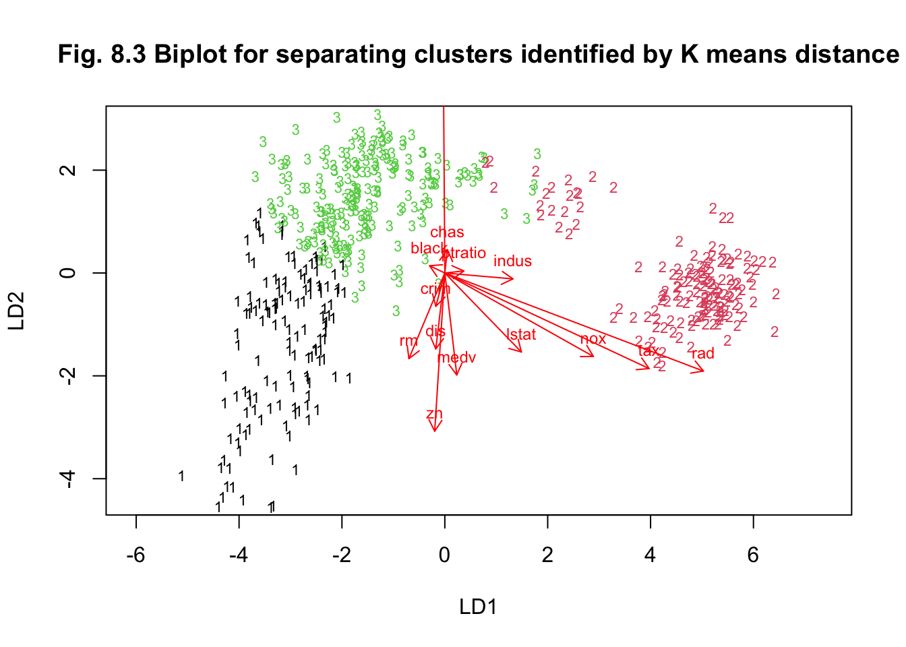

```
## integer(0)
```

### 8.4 Interpret the results

Biplot based on LD1 and LD2 is generated, see fig 8.3. The three clusters separates very clearly and some overlap is observed between cluster one and cluster three, and between cluster one and cluster three. Cluster one and cluster two are perfectly separated.

Based on arrows, variables rm, dis and crim explain more for cluster one;  variables indus, rad, tax and nox explain more for cluster two; and variables black, chas and ptratio explain more for clusters three. Other variables' role in clustering is much weaker. 

## 9 Assignment requirement #9

Quoted from the assignment:

_"Super-Bonus: Run the code below for the (scaled) train data that you used to fit the LDA. The code creates a matrix product, which is a projection of the data points.  Install and access the plotly package. Create a 3D plot of the columns of the matrix product using the given code. Adjust the code: add argument color as a argument in the plot_ly() function. Set the color to be the crime classes of the train set. Draw another 3D plot where the color is defined by the clusters of the k-means. How do the plots differ? Are there any similarities? *(0-3 points to compensate any loss of points from the above exercises)*"_

### 9.1 Run the code below for the (scaled) train data that you used to fit the LDA. The code creates a matrix product, which is a projection of the data points.


```r
#reload the data
bos.s <- as.data.frame(scale(Boston))
#generate cutoff according to quantile
bins <- quantile(bos.s$crim)
#generate a categorical variable "crime" and re-code it
bos.s <- bos.s %>% 
  mutate(crime = crim %>% 
           cut(breaks = bins, include.lowest = TRUE) %>% 
           fct_recode("Low" = "[-0.419,-0.411]",
                     "MediumLow" = "(-0.411,-0.39]",
                     "MediumHigh" = "(-0.39,0.00739]",
                     "High" = "(0.00739,9.92]"))
#remove crim
bos.s <- bos.s %>% dplyr::select(-crim)
set.seed(2022)
#generate an object containing the number of observations
n <-  nrow(bos.s)
#generate a random set of indexing number with n = 80% of the obs.
ind <- sample(1:n, size = n*0.8)
#generate the train set and test 
train <- bos.s[ind,]
test <- bos.s[-ind,]
```

### 9.2  Install and access the plotly package. Create a 3D plot of the columns of the matrix product using the given code. Adjust the code: add argument color as a argument in the plot_ly() function. Set the color to be the crime classes of the train set. 


```r
#select predictors for train set, with outcome variable removed
model_predictors <- dplyr::select(train, -crime)

# check the dimensions
dim(model_predictors)
```

```
## [1] 404  13
```

```r
dim(lda.fit$scaling)
```

```
## [1] 13  3
```

```r
# matrix multiplication, saving the resulting matrix into matrix_product
matrix_product <- as.matrix(model_predictors) %*% lda.fit$scaling
#turn matrix into data frame
matrix_product <- as.data.frame(matrix_product)

#plot the 3D plot with LD1, LD2 and LD3
library(plotly)
p1 <- plot_ly(x = matrix_product$LD1, 
        y = matrix_product$LD2, 
        z = matrix_product$LD3, 
        type= 'scatter3d', 
        mode='markers', 
        color = train$crime, #Set the color to be the crime classes of the train set. 
        size = 2)
p1
```

```{=html}
<div id="htmlwidget-1d14b74cae7fa5097e23" style="width:672px;height:480px;" class="plotly html-widget"></div>
<script type="application/json" data-for="htmlwidget-1d14b74cae7fa5097e23">{"x":{"visdat":{"3c07633a9f2c":["function () ","plotlyVisDat"]},"cur_data":"3c07633a9f2c","attrs":{"3c07633a9f2c":{"x":[-0.88196323144985,6.39116772390011,-2.73706307835056,-2.19172429508737,-2.88158672278645,-2.89248560300801,-1.32943119824854,-2.61907867866918,-2.99689396839038,5.96167901190821,-2.32911890605327,-1.09700839099395,-3.10137267875088,-1.45085803833626,-1.97591227850198,-2.98544193607021,6.94550052269653,-1.32789795564587,5.38024227756301,6.09570672663175,-3.52891385912823,-1.32872242532608,-2.38028346471707,6.15401891386766,-2.77913368520209,6.0097831448147,5.80590320329722,0.0338256236063729,-1.90031027261049,5.9561256315902,-2.09203835484176,6.21708245500804,6.00750981591758,6.31673445091359,5.73019091163243,-0.174999960968822,-3.90607870573135,-1.73900681072951,-1.24113174395434,-2.80957373169315,-0.75680578240667,-3.0787192893584,-3.42624388065967,6.13129416663481,-4.15229068261487,-4.35559490079072,-2.39542218582184,5.61551962260993,-4.19528450760886,-2.05330110085369,-0.944307803781973,5.9574617478917,-3.12793645736208,-3.96660473084072,-2.73547114360437,5.12598989635878,6.00297945776104,-2.1015794618075,-0.79688322163423,-1.34926675782026,6.01060945200181,6.15862594675967,-1.40373631719444,5.90594958419642,-1.81647007097981,-1.28420593072797,6.45907084778953,-3.59468119228596,-1.7369109773484,6.38803858419264,6.90742066148397,6.2257902160035,-3.01548589522886,-2.19483359531025,-3.94972142115284,6.64472268246808,-2.32627697937832,-3.74234020449365,-2.07649753211001,6.15756910351826,-2.12963585543986,-1.62055045435585,-2.38206880273226,0.156844871120639,5.12242529690102,5.2501282339207,-1.27612256153706,-1.39995301387048,-3.07964956847723,-2.27089245339511,-1.81478375141155,-2.78251886250043,-1.48550467329687,-2.68586806973369,-2.51434788787046,-1.4136709059645,-2.34221467556947,-1.23890534783683,6.5298874321768,-1.92604846075737,-1.30026601907829,-2.87292525730263,-1.49559766800384,-2.93416867326375,6.13384680378518,-0.802075506134893,-2.48384673397299,-1.77100750962911,-2.23646633809767,-3.24798680771066,6.3460411387065,-2.15449669064425,6.10658315169553,-2.14307167749179,-2.93179974869476,6.06462543069626,-1.98574299624472,-0.989166660273007,-2.86142748298726,-2.24363628899534,-1.14241929648067,-3.34875261008991,-2.96897257476399,5.0996084123932,-1.27269480208871,-3.40752495924982,-2.96462097935004,-1.25723333522738,6.02349333047288,-1.90352993748044,-2.08216664243199,6.29845593103382,-1.34751746200361,-1.98458865952354,-2.20413699415057,-2.84919480263414,-3.25868350776171,-2.02407353570856,-2.07026922921761,-1.70571202808344,-3.28901672733142,-1.65096363484297,-1.13778567876698,-2.06130847682902,-2.69610846624352,6.50180872408767,6.66894502955342,-2.69460069239684,-0.992987620010719,-1.2911812446794,-2.10829341013773,6.43367989186338,-1.92866972144958,-0.52909549028252,-1.39748970607206,-2.03476433772084,-3.11374306068493,-1.22427437193001,-0.355059536040747,-1.55392014060734,-2.27675646783102,-1.20301123454325,-1.98634910697419,-3.27827618639542,-1.0899710069902,-3.06184986194631,-1.2557927688593,-1.39880783520101,-1.18411778919935,-2.51628849603833,-1.55760168073711,-2.04556524147432,-2.35740434970235,-1.86831988616049,-1.79316890374162,-1.4207067876631,6.66972517586152,6.22877399423768,-0.99382836242267,-2.6577147870336,-2.6991394495642,-1.38569162208684,5.87358589739533,7.00480865940944,6.24825216436265,-2.92813265417806,-2.91242194091074,-2.05821916958682,-2.88979796905497,0.0522519890400168,5.04117874641136,-3.71176897141861,-3.16367203029509,-0.897500609286649,-2.38917519067189,-1.31382700603538,6.23237589498341,-0.808869623712326,-2.61180454976745,-1.21692119368043,-2.84072252954902,-1.76772066695266,-2.68994848473355,-2.03595248984593,-1.8944611459766,-1.92089005610322,-1.50702838319501,-2.27540895666082,-3.19981713722772,-2.55099915621838,-1.42026179530694,-2.87324274597903,-1.31269199049033,-3.10861223270981,-2.63274848509879,-2.90035111112765,0.084562772355265,6.13974496270099,-1.30511081891143,-0.9932664522906,-2.60725268887876,-2.36751339356667,-2.94635496935339,6.31416168155049,-1.46774465877473,6.07952817706665,6.41096296213946,-1.39745899969971,-3.11797796710866,-2.08587602105495,6.05137450052827,-2.37238607385614,-1.9241186481189,6.63771636166021,-1.49649833906895,-1.99050461394908,-1.08222499464002,6.58297663398232,5.82396242885874,-4.00347782422798,-1.32936392176144,-1.57923994460111,-2.46350104068107,-2.0751873341572,-1.79724049268652,-1.29898370362009,-3.96125767441929,-1.61857069363535,-1.37020166375713,-2.37838525392963,5.37324280992286,-4.09776225773172,-3.21102780224413,-1.08617602329883,6.3681465836782,6.28742824097362,-1.80670971297089,-1.50985570644803,-2.22178763859903,-3.55235294577937,5.47125610860166,-3.16866641236765,-0.797562204294874,-2.2344044170733,-2.86793185067725,5.60881951367039,6.27467487638711,-3.29468386615285,-3.32147170247261,-2.9588990437763,4.92989779020524,-1.35692820295102,-2.89337456648836,-4.16426570318715,5.51318706816326,-3.34059418202563,6.75164384853561,-3.23110363930991,-2.24151473267218,6.48769685669099,-1.77658788026372,-0.0324981243836543,-1.26635822333186,5.96597876941478,5.72187478893205,0.090121343838359,-2.76747041425025,6.41199019640777,-2.57418832923398,-1.38544756828513,-1.24927115208204,5.84743458829834,5.50120603898483,-1.33796730625647,6.23548465816191,-2.59164540016498,-1.87158393083878,6.36081673588647,6.40237055556295,-2.40335449160503,-1.18172554398267,-0.91800833780874,-3.27019740370909,-3.16639177898134,5.97923714046705,6.28865196540369,6.03471709655068,-2.65692929507707,-2.37668908066398,6.49387531355133,6.39159722877962,-4.27041097817906,6.01940913552738,-3.8046019678915,-2.81544968899793,-1.81547082448931,5.9373957084197,6.16395044768251,-2.83022938273947,6.48259856772446,6.55321024625762,-2.47731668852016,-3.12434575750924,-1.27932608255647,6.17819051482933,-3.35166809136599,-1.04926001363038,-2.21282251416954,-3.10411048092583,-3.23567602487008,-2.99702399055043,-3.7331106524363,6.16331207605317,6.31860761283801,-0.576085936146842,5.77126124821183,-2.63438063118392,-2.10344280432891,-0.0124556953064685,-1.23499428705578,-1.26751445810882,-2.81344523477467,6.62476908753899,-3.59529177962929,-2.98223737782123,-2.48771218251219,6.57024810398248,-2.97288484356302,-2.1958160163226,7.15804808894181,-1.35654739400709,-2.63315802390196,-1.47434723008026,-2.22893403618974,-2.83604447228481,-1.69724009781784,-3.09116629542797,-1.20656887388601,-1.76642396518389,-1.8708834415904,6.19494450030841,-2.21917858382122,5.99594888616669,-2.61245202207441,-3.00133403111406,-3.24825449015138,-1.24891750701207,-3.2595598063977,-2.25323456068262,-2.67049950292465,-3.26526336931753,-4.26390322256088,-1.80624674032407,-1.28075612936272,-1.26261446605774,-1.35148510158498,-2.13979812225341,6.11191541745213,-0.729904626728916,-0.123361319510884,6.20750230070977,-3.10771670797584,-3.16310730916003,6.57643304623372,5.69329972545445,-1.30021452253785,6.08924625685344,6.59079136318164,-3.77335963176938,-3.2332285159631,-1.96428157976143,-2.16385358047105,-2.56330841966755,-3.35307609672555,6.48868734550101,6.32818870692853,-3.19957710591561,6.32606065513546,-2.33334195839342,-3.08491397395659,-2.59302516125506,-2.48368643132344,-2.21393344270648,-4.04488218353881],"y":[-0.388693294782121,0.197755726257483,0.275981364287325,-0.0448817737645796,0.218667887583196,1.94505667747009,-1.45089820824902,1.32422706037497,-1.41550096427331,0.756326105162621,-1.7642990062324,-0.552097341544895,0.064807562899343,0.515949749833338,-0.418303690502072,2.43788890412281,0.196971214396438,-0.816195284406471,1.2797766716631,0.14944349235389,-0.519858265481306,0.867454486543443,2.02234800247033,0.0886051842922377,2.56261681957257,0.365034862271516,-0.458043770697694,-2.96726556736744,-0.628658617791524,0.20313552951062,-0.765553347068809,0.672305239826906,-0.00873267550719793,-0.0234542416896016,0.627189505472541,-3.02344924011591,1.88462496050676,-0.753470120639681,-0.649171826050512,1.09653022319965,0.619794853959216,0.693175926155577,-0.722630015807662,0.0664863246317383,2.42465070818489,1.92668735159977,2.11103059178534,0.727180812970551,2.39258274394269,-1.71506363753336,-0.661689164143425,0.632187182310475,2.1813605526289,2.44401677405411,2.94817945799265,1.26861777072919,0.407704830819406,0.0239916393169709,-0.738338179659646,1.18066279103228,1.23906196831477,-0.264660964216548,-1.88552571370308,0.0865625637721158,-0.884312000249306,-0.491593942214435,0.51889668804874,-0.23371398819189,-1.25861972538408,0.428396345160572,0.0155748499827098,0.708035063751062,0.144554042970255,-0.728302512475076,0.951895673992799,0.20400869504862,0.268838527655303,0.608917299307243,0.980834759522616,0.154120506407544,1.28286363932268,-0.908466959158757,0.192495718265704,-3.09782593588063,1.30900746264259,1.30447607962797,-0.557833512891394,-0.639395104155878,-0.240623654708161,1.81061421703518,1.14829191405996,1.32810074538559,-0.576867590433202,0.607265364088924,-0.27999306452682,-0.622432817156327,0.190091795660559,-1.70666537043198,-0.0271500357782041,-0.983044150613982,-1.1066782546354,0.368862180046533,-0.825638415546731,2.76174289011534,0.245350017469714,-0.39284411936804,1.57493629966734,-0.469281847364213,-0.308580852799404,0.975262336620145,0.213901498595647,-0.0518926258968814,0.281136405383237,0.151357735685452,2.59293223580254,-0.604595292844772,-0.727035134662842,-0.966805220602619,-0.681744714730873,-0.93103172036367,-0.714302392109266,2.84049192032767,1.07370849216726,-0.0748947165261099,-0.0873147857531418,2.91251913596619,-0.0964244096511975,-1.59140547838942,0.250475713755499,-0.899172941774251,-0.791061968045046,-0.152760149978724,-1.30346811206879,1.6593000956334,0.236698691968952,0.837327589958965,0.290406218627748,-0.450315255012,-0.285162675725791,-0.67759623106257,0.98028974853825,-0.772552632265966,-0.589468128084006,-1.07028416199347,1.27277726800159,0.390636928783436,0.290260683227071,2.0147140339709,-0.915093529080514,-1.44049227911223,-0.920607174547424,0.251373130764045,0.869328605701858,-3.24611348605623,-1.61988324039575,-0.522138918521205,-0.344271757497851,-0.583772519466849,-3.17988036597302,1.24496491704655,-0.0333781803779576,0.898806569743311,-0.599796888229566,2.30448051898593,-0.640213564398011,-1.0612564249371,-1.640986963881,0.562242593165713,-1.61674826901648,-1.60741164214627,-0.686905195061885,-1.27130552525368,0.166844649303638,1.40674121577276,-2.78965594836992,-1.75685642915786,0.359966610047827,0.0107757117752749,-0.645015616940304,-0.903183175667834,2.20953110712259,-1.84045886220639,-0.55020271913099,0.49778160788423,0.115747104201231,1.1633359361841,2.84202029717187,-0.000135082256540769,2.67507078261463,-3.00678281806602,1.08291348046325,-0.821078052281935,-0.447546666137482,0.027516327614685,0.167058671894474,-1.73730081989928,0.377908317843269,-0.0768471004286813,-1.41862109459361,-1.87377256214041,2.92122118567755,-0.100076488298739,-0.552317826903916,-0.0662401948922741,-0.671037363798334,-0.336202967052696,-0.544519264658937,1.1964420051907,-0.014361380137621,1.48729782662227,-1.75548304251417,2.38898464613804,1.00602427413762,0.629629366705271,0.525200068813843,-0.137304064117746,-3.04861561848954,0.348847481257211,-1.71665816058786,0.977578000075912,2.80604045976078,0.0752562248833975,0.346431597282668,0.144544658081279,-0.616672612368721,0.412210777762048,0.378340674017735,-1.6902877943229,-0.557256183652708,-0.596282076711405,0.304035019728876,1.27828692944652,-0.0425064714074121,0.00189854076853049,1.46169705846612,-0.778212331812728,-0.311535095609405,0.242906348775476,0.617063299499086,0.342539167919013,-1.80871180177885,-0.791698700765846,0.307899468842732,-1.53723761502886,-0.899414196630196,-0.456247742519795,1.002104931405,-0.636534386824508,-1.83933253375092,-0.401338601788611,0.978849266345787,1.04813788253023,0.247205332766107,-1.71030084073334,-0.282600793363297,0.652702355585455,-2.15679846303672,-1.04927101849602,0.330680402440206,2.17535765554096,0.909682094382496,0.266075130404292,-1.89376742610411,-0.95421792052836,-0.435940879220247,1.02489470303007,-0.0863241966092436,0.844139821268843,0.988970636963958,-1.13077546152082,1.69260693956235,-1.71971948799072,2.5130767248454,2.17123560294031,0.731926132516678,-0.224474003693633,0.0358530999833585,0.959518441240713,-0.723037803188843,0.419500676585228,-0.841464322004604,-3.12243921320574,0.678638313092057,0.336722380191301,1.09143782279326,-3.09526134010605,0.382771043779967,0.0629304880527026,-0.992958806382756,-2.46906660597465,-0.712083884329246,0.786476351998341,0.872713241729466,-1.32003352686526,0.359682766351295,-0.484647477954282,-0.600616272208918,0.547727344795605,-0.289185289603195,-0.0375665199762674,-1.9228987388956,-0.645580893270592,-0.131155783594839,2.81869583488003,-0.376844388178377,0.612482423539482,0.16443744341011,-0.0111644978454102,1.5339979605681,0.176269240832257,0.188296973305066,1.83034530026212,0.799727248647737,2.13172926390996,0.884986572873642,-1.52946162235599,0.655549354147065,0.394600649154309,2.5525531291308,0.34307589697966,0.100433202554395,1.2067116601516,0.0591208230262767,-1.88328090376527,0.178076899483673,2.45655879527442,-0.727735611106782,-0.0384873369580902,-0.103847312222143,2.44555595079719,-1.35987110258417,1.89326621256004,0.0323550026556614,0.58704227947653,-3.12806364963015,0.60955287480982,1.33188982328586,1.41431109159873,-3.10543676173621,-1.98229677829554,-0.734700103380923,0.665841163484904,0.479684980801421,0.582145706364489,0.834146441048669,0.328073995104751,0.136062544861163,-0.3795626549901,1.62208811653368,0.261142543852913,-1.25393871154465,0.564362939711166,-1.53974708036508,0.0819867123667553,2.39920120433119,0.925772754557908,-0.994638856499837,-0.539884071263305,-0.776009783991845,-0.924028831816512,0.683403125892003,-0.0239400417823406,0.166154544145952,0.528008542577953,2.52610193583828,0.152411620433121,-1.7401799924121,0.847535370766533,0.302309541279257,-0.695294349187967,0.112194522066315,1.61360212248342,-0.825847682881102,-0.91254164750972,-0.755217227367308,0.621231404506985,1.55753608479335,0.397160065103523,-3.36188553304179,-3.16789430282416,-0.117973909939499,0.992218154873663,-0.800942347939765,0.353196013243291,-0.516908001390373,-0.644620873005837,0.428518999110578,0.048344950125935,1.77378218358794,-0.720643675992596,-0.115893240541433,0.203863881188678,-0.487659585985708,-0.746043938316612,0.444146623382356,-0.207657872286506,-0.266571243402185,0.532223676114784,-1.15569574192404,0.998788731917336,-0.101348872147261,0.0638645296385787,-0.417286922679645,1.02632189237794],"z":[-0.251069731848871,-1.08293239971005,1.01740932014959,0.730538632169961,2.31333152274015,-2.34050022918306,-2.46862321611458,0.204466468473794,-1.39734616436106,1.46721057432961,-0.817819462395626,-0.813204511495605,0.516770324855164,0.324231895251391,0.379502912758912,-1.9619719532104,0.25339915051567,0.593300872698208,1.3252130393455,-0.450194871888818,-0.59224218494672,-1.75380056461286,-0.320287045345498,-0.389998320434861,-2.97699077799419,0.229526768528492,-1.06043638277232,-2.82365978810493,0.326295388735533,-0.642117011331454,0.203883529501103,-0.725105558685003,-0.810078689817064,-0.876993254199231,0.369418698351533,-2.03617549360702,-1.05028801551479,0.756310548560813,1.11432462370672,-1.21510507580875,-0.17546560152097,1.94432786884003,-0.0120870139325632,-0.588293893278319,-1.48319885749161,-0.522038724077115,-0.168816171416866,0.140936560622815,-0.463549702851907,-0.00472379037633949,-0.690398293021079,0.426070842736708,0.315898397122919,-1.02687495307472,-2.70182770919993,0.851012944604902,0.277099735642071,0.266379593548248,1.00701198122377,-1.23863159202296,0.772135018786287,-1.94560541577091,1.86977040678103,-1.06090713388297,-0.151844268519882,1.24203564778733,0.00351049060523206,0.507673565783664,-0.399062787428157,-0.261867821340951,-0.629765669105544,1.02304167513896,1.32599881964325,0.0283634706749627,-0.115991105696201,1.03029515107467,-0.187505526681833,0.823280887068514,0.451591448858841,-0.801169093930266,-1.2018796092605,0.49848365652477,-0.392627970171183,-1.95122656972189,1.35503007999519,0.992889371620604,0.61632095524773,0.776708561299966,0.179645598869409,-0.429866226534202,0.674921541318966,-0.677695455364099,0.661537888713843,-0.200743759587098,0.650708809247668,1.02487213363561,-0.458304603774058,0.0499118738003295,-0.86668943848999,0.019658084551732,-1.64119683645444,2.52344147047045,0.269722890985698,-2.46079473858331,-0.0609521873614901,-0.030990572214263,0.336083335524818,0.164181643385827,-0.0797874038195009,0.175769327663611,0.346722198343115,0.792610540175336,-0.641322200034134,-0.107910216332876,-1.65103569579304,-0.320224156408954,-0.257749590803267,1.19244568744015,-0.691342074355679,-0.643545345468682,0.446542135200884,-1.42500586725718,0.00522383292501407,-1.57727065535695,1.03548641898676,-1.46491843733836,1.72648759066026,0.193155390091316,-0.307201857009236,-0.206667379183674,0.00652138550506718,-0.874432881166037,-2.38702099223543,0.483040158202685,0.49906978223715,2.04847548490439,1.26194557075222,0.054201483857654,1.86115828624569,0.247507652167778,-0.546397790925661,0.386446090624724,0.255318939854026,-0.28511452598068,-0.047053034033884,-0.0449426932440273,0.139636949517994,-0.647065061323857,1.17409651759324,-2.45751023965183,-0.291687225454022,-0.916842022008715,0.535020226722297,-3.45537338654852,-2.80956756857918,-1.62342531367694,0.0514773809327912,0.57406369801508,-2.77156531669261,-1.41083986904042,2.11119874917851,-0.680381289565732,0.0677612779703086,-2.53584207300125,0.367737825367041,-0.783243768555773,0.118833720751068,0.206919713447331,0.359276684598816,-1.04957054022972,0.889545969379129,1.8821234462085,2.02851681528771,0.373472442318561,-0.728399736930335,-0.516792922725815,0.272500125475472,-0.908029720187995,0.470068740143637,-0.637484699354804,0.140381926980884,-0.646149946173767,-1.03873952637212,1.98293440964375,-0.483247913759613,0.238714066363271,-2.25563066038259,-0.280036855867861,-0.521673006182812,-1.1780643225645,0.752580601524215,1.55247269480416,0.531649080479623,0.52555820516596,-0.486045731396954,-0.118109687474402,0.62737265809446,0.586781277224261,-0.871583896258219,-0.232615412348423,-1.42334390776302,0.901266691557046,1.44192076275999,-0.168130337209698,0.169534736296829,0.588941707697495,-1.4532634395763,0.187201037785847,1.88081762312134,0.205785042387767,-0.505265984235422,-3.18758662435275,-1.5081385755865,-0.682731968140022,0.370379540313551,-0.227977085472525,-1.16550335759856,0.0968380763683007,-0.15758075831774,0.0283859956496806,-2.83267780214565,0.380027178360486,-0.52273331948766,-0.232795327950826,0.531082063466903,0.390525836913354,1.05653189849269,-0.338522450283646,0.417408811900918,1.16696337699675,-0.0703177914344637,0.229605224049862,0.508971590010144,-0.799043945412799,-0.266283160788933,0.595280449864503,-0.35072642685676,-0.803138766234085,0.736649299270119,-0.246261201969187,0.165304284429444,0.751868703881352,2.08917947315609,0.120477321150178,-1.61228351793469,0.496125560311061,0.901016241522785,0.235433470332499,-0.0275402304936819,-0.147581891804104,1.30994190298306,0.435144285919297,1.75845706582391,-0.176249521029001,-0.655948911756549,-0.00794326125288373,-0.0329855538236774,0.619076863870541,0.667083328435696,-0.882187267918588,0.955963501355681,1.56919912071172,3.2053407974132,0.79795262029443,-0.443445817852391,0.37071437749333,-0.741036512138469,1.66685361879199,-0.167594684544756,-0.788869314377356,1.65212313012118,-0.270988547726748,-0.407436387108861,-0.860244097391045,0.228609708925305,0.83497247793264,-0.809791078283119,-0.627939551644956,2.49818880170778,1.03758499547967,0.227843180783242,-1.57072641931624,1.25482181161165,-0.350825718889476,0.26567539747573,-1.37456265158393,0.236487768299383,-0.14610457963859,-0.81485430667855,-1.0559251333214,0.882250638416621,1.22113885436782,1.01729038921832,-2.32379628377059,0.515461148222804,0.0631463600053968,0.283036131907257,-0.540507630618451,-1.58011098644089,-0.753623955569703,2.30525471242513,-0.692172924458863,-0.029818554762852,-0.986297471602527,-0.827253541015059,0.995617894792218,-0.550190701452191,0.657763545208731,-1.24071291609748,-1.15608232695864,0.424586829939684,-0.634775125313455,0.622728377957472,-1.41759060686878,-0.395032040902556,0.820944312881,1.31504772581595,0.199843075502951,-2.54216144317507,-0.91206180980939,-1.05606267705513,0.0544943016547211,0.950053139065429,-0.0995383687355685,-0.222626398245565,-2.30717899928388,0.261598451203177,0.177206871536809,0.547379342037996,-2.05943349852459,-1.26997180908073,-0.715092347454757,-0.844510884677911,0.488787648151008,-2.57165021968632,0.775255114749699,0.180841188688821,0.48831232755852,-2.78959144970018,2.14214808994543,0.695915132947951,0.766215649560624,0.550905376974495,1.1451183645581,1.6489714989669,0.367194634311576,-1.30396298277164,1.2552683316141,0.354688407043313,1.26142361173257,-2.0761645725199,-0.131040246905805,-2.89945462770922,0.369143598168062,-3.07404858123749,0.481114735954976,-0.863449949827881,-0.137902331916349,0.410427194307051,0.661424717144503,-0.293495983006221,0.209199755162704,-0.649552435842094,-0.497551785965197,-0.503379472437293,0.0158291712230236,0.307111251928477,1.78692612087684,-0.180538497511424,1.36213072571143,1.05258639654721,0.282136626959974,0.0342581565562136,1.6262295648029,0.754148208924028,0.681515462699369,0.532800836083822,0.542675349971427,-2.30433122490977,-2.72966403085057,-1.38189799010853,0.547655729686642,-0.0441313782288149,-0.356367260451309,-0.503886746958097,0.947291616618001,0.416803268867894,-0.38870912265136,-0.889080346200173,0.477896640545019,0.321492397937917,-0.127975415556994,0.328443594796502,0.183694164937053,1.26849317983241,-1.42716688981157,1.30187451031441,0.779353554003415,1.33019375481185,1.69240559021364,0.640719178664387,-0.0394157911693714,-0.168506900919162,-0.154837431599589],"mode":"markers","color":["MediumHigh","High","MediumLow","MediumHigh","Low","Low","MediumHigh","MediumLow","Low","High","MediumLow","MediumHigh","MediumLow","MediumLow","MediumLow","Low","High","MediumLow","High","High","Low","Low","Low","High","Low","High","High","MediumHigh","MediumLow","High","MediumLow","High","High","High","High","MediumHigh","Low","MediumLow","MediumLow","MediumLow","MediumLow","MediumLow","Low","High","Low","Low","Low","High","Low","MediumHigh","MediumHigh","High","Low","Low","Low","MediumHigh","High","MediumHigh","MediumHigh","Low","High","High","MediumLow","High","MediumHigh","MediumLow","High","Low","Low","High","High","High","Low","MediumHigh","Low","High","Low","MediumLow","MediumLow","High","Low","MediumHigh","Low","MediumHigh","High","High","MediumHigh","MediumHigh","Low","Low","MediumHigh","Low","MediumLow","Low","MediumLow","MediumHigh","Low","MediumHigh","High","MediumHigh","MediumHigh","Low","MediumHigh","Low","High","MediumHigh","MediumLow","MediumLow","MediumHigh","Low","High","Low","High","Low","Low","High","MediumHigh","MediumLow","Low","MediumHigh","MediumHigh","Low","Low","MediumHigh","MediumLow","Low","Low","MediumHigh","High","MediumHigh","MediumHigh","High","MediumHigh","MediumLow","Low","MediumLow","MediumLow","MediumHigh","MediumLow","MediumHigh","Low","MediumHigh","MediumLow","MediumHigh","MediumLow","High","High","Low","MediumLow","MediumHigh","MediumHigh","High","MediumLow","MediumHigh","MediumHigh","MediumHigh","Low","MediumHigh","MediumHigh","Low","Low","MediumLow","Low","Low","MediumHigh","Low","MediumHigh","MediumHigh","MediumLow","Low","MediumLow","MediumHigh","MediumLow","Low","MediumHigh","MediumHigh","High","High","MediumLow","Low","Low","MediumHigh","High","High","High","Low","Low","Low","Low","MediumHigh","High","Low","Low","MediumHigh","Low","MediumHigh","High","MediumHigh","Low","MediumHigh","Low","MediumLow","MediumLow","Low","MediumHigh","MediumLow","MediumHigh","MediumLow","Low","MediumLow","MediumHigh","Low","Low","MediumLow","MediumLow","Low","MediumHigh","High","MediumHigh","MediumLow","Low","Low","MediumLow","High","MediumLow","High","High","MediumHigh","Low","MediumLow","High","Low","MediumLow","High","MediumLow","MediumLow","MediumHigh","High","High","Low","MediumHigh","MediumHigh","MediumLow","MediumLow","MediumHigh","MediumHigh","Low","MediumLow","MediumHigh","MediumHigh","High","Low","MediumLow","MediumHigh","High","High","MediumHigh","MediumLow","MediumLow","Low","MediumHigh","MediumLow","MediumLow","Low","Low","MediumHigh","High","MediumLow","MediumLow","Low","MediumHigh","MediumHigh","Low","Low","High","MediumLow","High","Low","MediumLow","High","MediumHigh","High","MediumLow","High","High","MediumHigh","Low","High","MediumLow","MediumHigh","MediumLow","High","High","MediumHigh","High","Low","MediumLow","High","High","Low","MediumLow","MediumHigh","Low","Low","High","High","High","MediumLow","Low","High","High","Low","High","Low","Low","MediumLow","High","High","Low","High","High","MediumLow","Low","MediumHigh","High","Low","MediumLow","MediumLow","Low","Low","MediumLow","Low","High","High","MediumHigh","High","Low","MediumLow","MediumHigh","MediumLow","MediumLow","MediumLow","High","MediumLow","MediumLow","MediumHigh","High","Low","MediumLow","High","MediumHigh","Low","MediumHigh","MediumHigh","Low","MediumLow","Low","MediumLow","MediumHigh","MediumHigh","High","MediumLow","High","Low","Low","Low","MediumHigh","MediumLow","Low","MediumLow","MediumLow","Low","MediumHigh","MediumLow","MediumLow","MediumLow","MediumLow","High","MediumHigh","MediumHigh","High","Low","Low","High","High","MediumLow","High","High","Low","Low","Low","Low","Low","MediumLow","High","High","MediumLow","High","MediumLow","Low","MediumLow","MediumHigh","MediumHigh","Low"],"size":2,"alpha_stroke":1,"sizes":[10,100],"spans":[1,20],"type":"scatter3d"}},"layout":{"margin":{"b":40,"l":60,"t":25,"r":10},"scene":{"xaxis":{"title":[]},"yaxis":{"title":[]},"zaxis":{"title":[]}},"hovermode":"closest","showlegend":true},"source":"A","config":{"modeBarButtonsToAdd":["hoverclosest","hovercompare"],"showSendToCloud":false},"data":[{"x":[-2.88158672278645,-2.89248560300801,-2.99689396839038,-2.98544193607021,-3.52891385912823,-1.32872242532608,-2.38028346471707,-2.77913368520209,-3.90607870573135,-3.42624388065967,-4.15229068261487,-4.35559490079072,-2.39542218582184,-4.19528450760886,-3.12793645736208,-3.96660473084072,-2.73547114360437,-1.34926675782026,-3.59468119228596,-1.7369109773484,-3.01548589522886,-3.94972142115284,-2.32627697937832,-2.12963585543986,-2.38206880273226,-3.07964956847723,-2.27089245339511,-2.78251886250043,-2.68586806973369,-2.34221467556947,-2.87292525730263,-2.93416867326375,-3.24798680771066,-2.15449669064425,-2.14307167749179,-2.93179974869476,-2.86142748298726,-3.34875261008991,-2.96897257476399,-3.40752495924982,-2.96462097935004,-2.20413699415057,-3.28901672733142,-2.69460069239684,-3.11374306068493,-1.55392014060734,-2.27675646783102,-1.98634910697419,-3.27827618639542,-3.06184986194631,-2.51628849603833,-1.86831988616049,-2.6577147870336,-2.6991394495642,-2.92813265417806,-2.91242194091074,-2.05821916958682,-2.88979796905497,-3.71176897141861,-3.16367203029509,-2.38917519067189,-2.61180454976745,-2.84072252954902,-2.03595248984593,-3.19981713722772,-2.87324274597903,-1.31269199049033,-2.90035111112765,-2.60725268887876,-2.36751339356667,-3.11797796710866,-2.37238607385614,-4.00347782422798,-3.96125767441929,-4.09776225773172,-3.55235294577937,-2.2344044170733,-2.86793185067725,-2.9588990437763,-2.89337456648836,-4.16426570318715,-3.23110363930991,-2.76747041425025,-2.59164540016498,-2.40335449160503,-3.27019740370909,-3.16639177898134,-2.37668908066398,-4.27041097817906,-3.8046019678915,-2.81544968899793,-2.83022938273947,-3.12434575750924,-3.35166809136599,-3.10411048092583,-3.23567602487008,-3.7331106524363,-2.63438063118392,-2.97288484356302,-2.63315802390196,-2.83604447228481,-3.09116629542797,-2.61245202207441,-3.00133403111406,-3.24825449015138,-2.25323456068262,-4.26390322256088,-3.10771670797584,-3.16310730916003,-3.77335963176938,-3.2332285159631,-1.96428157976143,-2.16385358047105,-2.56330841966755,-3.08491397395659,-4.04488218353881],"y":[0.218667887583196,1.94505667747009,-1.41550096427331,2.43788890412281,-0.519858265481306,0.867454486543443,2.02234800247033,2.56261681957257,1.88462496050676,-0.722630015807662,2.42465070818489,1.92668735159977,2.11103059178534,2.39258274394269,2.1813605526289,2.44401677405411,2.94817945799265,1.18066279103228,-0.23371398819189,-1.25861972538408,0.144554042970255,0.951895673992799,0.268838527655303,1.28286363932268,0.192495718265704,-0.240623654708161,1.81061421703518,1.32810074538559,0.607265364088924,0.190091795660559,0.368862180046533,2.76174289011534,0.975262336620145,-0.0518926258968814,0.151357735685452,2.59293223580254,-0.681744714730873,2.84049192032767,1.07370849216726,2.91251913596619,-0.0964244096511975,0.236698691968952,0.98028974853825,2.0147140339709,-0.344271757497851,1.24496491704655,-0.0333781803779576,-0.599796888229566,2.30448051898593,-1.0612564249371,-1.60741164214627,1.40674121577276,-0.903183175667834,2.20953110712259,1.1633359361841,2.84202029717187,-0.000135082256540769,2.67507078261463,-0.821078052281935,-0.447546666137482,0.167058671894474,-1.41862109459361,2.92122118567755,-0.0662401948922741,-0.014361380137621,2.38898464613804,1.00602427413762,-0.137304064117746,2.80604045976078,0.0752562248833975,-0.557256183652708,1.27828692944652,0.342539167919013,1.002104931405,1.04813788253023,2.17535765554096,-0.95421792052836,-0.435940879220247,-1.13077546152082,2.5130767248454,2.17123560294031,0.959518441240713,0.382771043779967,-0.484647477954282,-0.0375665199762674,-0.131155783594839,2.81869583488003,1.5339979605681,1.83034530026212,2.13172926390996,0.884986572873642,2.5525531291308,0.0591208230262767,2.45655879527442,-0.103847312222143,2.44555595079719,1.89326621256004,1.33188982328586,-0.3795626549901,0.564362939711166,2.39920120433119,-0.994638856499837,0.528008542577953,2.52610193583828,0.152411620433121,0.302309541279257,1.61360212248342,0.992218154873663,-0.800942347939765,1.77378218358794,-0.720643675992596,-0.115893240541433,0.203863881188678,-0.487659585985708,0.998788731917336,1.02632189237794],"z":[2.31333152274015,-2.34050022918306,-1.39734616436106,-1.9619719532104,-0.59224218494672,-1.75380056461286,-0.320287045345498,-2.97699077799419,-1.05028801551479,-0.0120870139325632,-1.48319885749161,-0.522038724077115,-0.168816171416866,-0.463549702851907,0.315898397122919,-1.02687495307472,-2.70182770919993,-1.23863159202296,0.507673565783664,-0.399062787428157,1.32599881964325,-0.115991105696201,-0.187505526681833,-1.2018796092605,-0.392627970171183,0.179645598869409,-0.429866226534202,-0.677695455364099,-0.200743759587098,-0.458304603774058,2.52344147047045,-2.46079473858331,0.175769327663611,0.792610540175336,-0.107910216332876,-1.65103569579304,-0.691342074355679,-1.42500586725718,0.00522383292501407,-1.46491843733836,1.72648759066026,0.49906978223715,-0.546397790925661,-0.647065061323857,0.0514773809327912,-1.41083986904042,2.11119874917851,0.0677612779703086,-2.53584207300125,-0.783243768555773,-1.04957054022972,0.373472442318561,-0.637484699354804,0.140381926980884,0.238714066363271,-2.25563066038259,-0.280036855867861,-0.521673006182812,1.55247269480416,0.531649080479623,-0.486045731396954,-0.871583896258219,-1.42334390776302,-0.168130337209698,1.88081762312134,-3.18758662435275,-1.5081385755865,-0.227977085472525,-2.83267780214565,0.380027178360486,0.417408811900918,0.229605224049862,-0.246261201969187,0.901016241522785,0.435144285919297,-0.882187267918588,0.79795262029443,-0.443445817852391,-0.788869314377356,-0.407436387108861,-0.860244097391045,-0.627939551644956,0.236487768299383,0.0631463600053968,-0.753623955569703,-0.029818554762852,-0.986297471602527,-1.24071291609748,-0.634775125313455,-1.41759060686878,-0.395032040902556,-2.54216144317507,0.950053139065429,-2.30717899928388,0.547379342037996,-2.05943349852459,-0.715092347454757,0.180841188688821,1.2552683316141,-0.131040246905805,-3.07404858123749,-0.863449949827881,-0.497551785965197,-0.503379472437293,0.0158291712230236,-0.180538497511424,0.282136626959974,0.547655729686642,-0.0441313782288149,-0.889080346200173,0.477896640545019,0.321492397937917,-0.127975415556994,0.328443594796502,1.69240559021364,-0.154837431599589],"mode":"markers","type":"scatter3d","name":"Low","marker":{"color":"rgba(102,194,165,1)","size":[55,55,55,55,55,55,55,55,55,55,55,55,55,55,55,55,55,55,55,55,55,55,55,55,55,55,55,55,55,55,55,55,55,55,55,55,55,55,55,55,55,55,55,55,55,55,55,55,55,55,55,55,55,55,55,55,55,55,55,55,55,55,55,55,55,55,55,55,55,55,55,55,55,55,55,55,55,55,55,55,55,55,55,55,55,55,55,55,55,55,55,55,55,55,55,55,55,55,55,55,55,55,55,55,55,55,55,55,55,55,55,55,55,55,55,55],"sizemode":"area","line":{"color":"rgba(102,194,165,1)"}},"textfont":{"color":"rgba(102,194,165,1)","size":55},"error_y":{"color":"rgba(102,194,165,1)","width":55},"error_x":{"color":"rgba(102,194,165,1)","width":55},"line":{"color":"rgba(102,194,165,1)","width":55},"frame":null},{"x":[-2.73706307835056,-2.61907867866918,-2.32911890605327,-3.10137267875088,-1.45085803833626,-1.97591227850198,-1.32789795564587,-1.90031027261049,-2.09203835484176,-1.73900681072951,-1.24113174395434,-2.80957373169315,-0.75680578240667,-3.0787192893584,-1.40373631719444,-1.28420593072797,-3.74234020449365,-2.07649753211001,-1.48550467329687,-2.51434788787046,-2.48384673397299,-1.77100750962911,-0.989166660273007,-1.27269480208871,-1.98458865952354,-2.84919480263414,-3.25868350776171,-2.07026922921761,-1.13778567876698,-2.69610846624352,-0.992987620010719,-1.92866972144958,-1.20301123454325,-1.18411778919935,-1.55760168073711,-2.35740434970235,-0.99382836242267,-1.76772066695266,-2.68994848473355,-1.92089005610322,-2.27540895666082,-2.55099915621838,-3.10861223270981,-2.63274848509879,-0.9932664522906,-2.94635496935339,-1.46774465877473,-2.08587602105495,-1.9241186481189,-1.49649833906895,-1.99050461394908,-2.46350104068107,-2.0751873341572,-1.61857069363535,-3.21102780224413,-1.50985570644803,-2.22178763859903,-3.16866641236765,-0.797562204294874,-3.29468386615285,-3.32147170247261,-3.34059418202563,-2.24151473267218,-1.26635822333186,-2.57418832923398,-1.24927115208204,-1.87158393083878,-1.18172554398267,-2.65692929507707,-1.81547082448931,-2.47731668852016,-1.04926001363038,-2.21282251416954,-2.99702399055043,-2.10344280432891,-1.23499428705578,-1.26751445810882,-2.81344523477467,-3.59529177962929,-2.98223737782123,-2.1958160163226,-1.69724009781784,-1.20656887388601,-2.21917858382122,-3.2595598063977,-2.67049950292465,-3.26526336931753,-1.28075612936272,-1.26261446605774,-1.35148510158498,-2.13979812225341,-1.30021452253785,-3.35307609672555,-3.19957710591561,-2.33334195839342,-2.59302516125506],"y":[0.275981364287325,1.32422706037497,-1.7642990062324,0.064807562899343,0.515949749833338,-0.418303690502072,-0.816195284406471,-0.628658617791524,-0.765553347068809,-0.753470120639681,-0.649171826050512,1.09653022319965,0.619794853959216,0.693175926155577,-1.88552571370308,-0.491593942214435,0.608917299307243,0.980834759522616,-0.576867590433202,-0.27999306452682,1.57493629966734,-0.469281847364213,-0.966805220602619,-0.0873147857531418,1.6593000956334,0.837327589958965,0.290406218627748,-0.285162675725791,-0.589468128084006,1.27277726800159,-0.915093529080514,0.869328605701858,0.898806569743311,-1.61674826901648,-0.686905195061885,0.166844649303638,-0.645015616940304,-0.100076488298739,-0.552317826903916,-0.336202967052696,1.1964420051907,1.48729782662227,0.629629366705271,0.525200068813843,0.977578000075912,0.346431597282668,-0.616672612368721,-0.596282076711405,-0.0425064714074121,1.46169705846612,-0.778212331812728,0.307899468842732,-1.53723761502886,-0.636534386824508,0.247205332766107,-1.04927101849602,0.330680402440206,0.266075130404292,-1.89376742610411,0.844139821268843,0.988970636963958,-0.224474003693633,-0.723037803188843,0.678638313092057,-0.992958806382756,-0.712083884329246,-0.600616272208918,-1.9228987388956,-0.0111644978454102,-1.52946162235599,1.2067116601516,-0.727735611106782,-0.0384873369580902,-1.35987110258417,1.41431109159873,-1.98229677829554,-0.734700103380923,0.665841163484904,0.582145706364489,0.834146441048669,1.62208811653368,0.925772754557908,-0.539884071263305,-0.0239400417823406,0.847535370766533,-0.695294349187967,0.112194522066315,-0.91254164750972,-0.755217227367308,0.621231404506985,1.55753608479335,-0.644620873005837,-0.746043938316612,-0.266571243402185,-1.15569574192404,-0.101348872147261],"z":[1.01740932014959,0.204466468473794,-0.817819462395626,0.516770324855164,0.324231895251391,0.379502912758912,0.593300872698208,0.326295388735533,0.203883529501103,0.756310548560813,1.11432462370672,-1.21510507580875,-0.17546560152097,1.94432786884003,1.86977040678103,1.24203564778733,0.823280887068514,0.451591448858841,0.661537888713843,0.650708809247668,0.336083335524818,0.164181643385827,1.19244568744015,1.03548641898676,0.483040158202685,2.04847548490439,1.26194557075222,1.86115828624569,0.255318939854026,-0.047053034033884,1.17409651759324,0.535020226722297,-0.680381289565732,0.359276684598816,0.889545969379129,2.02851681528771,0.470068740143637,0.901266691557046,1.44192076275999,0.588941707697495,0.187201037785847,0.205785042387767,-0.682731968140022,0.370379540313551,0.0283859956496806,-0.52273331948766,0.531082063466903,1.16696337699675,0.508971590010144,-0.266283160788933,0.595280449864503,2.08917947315609,0.120477321150178,0.235433470332499,1.75845706582391,0.619076863870541,0.667083328435696,1.56919912071172,3.2053407974132,1.66685361879199,-0.167594684544756,0.83497247793264,2.49818880170778,1.25482181161165,-0.81485430667855,0.882250638416621,0.283036131907257,2.30525471242513,0.657763545208731,0.820944312881,0.0544943016547211,0.261598451203177,0.177206871536809,-1.26997180908073,0.48831232755852,2.14214808994543,0.695915132947951,0.766215649560624,1.1451183645581,1.6489714989669,0.354688407043313,0.481114735954976,-0.137902331916349,0.209199755162704,1.78692612087684,1.36213072571143,1.05258639654721,1.6262295648029,0.754148208924028,0.681515462699369,0.532800836083822,0.947291616618001,0.183694164937053,1.30187451031441,1.33019375481185,0.640719178664387],"mode":"markers","type":"scatter3d","name":"MediumLow","marker":{"color":"rgba(252,141,98,1)","size":[55,55,55,55,55,55,55,55,55,55,55,55,55,55,55,55,55,55,55,55,55,55,55,55,55,55,55,55,55,55,55,55,55,55,55,55,55,55,55,55,55,55,55,55,55,55,55,55,55,55,55,55,55,55,55,55,55,55,55,55,55,55,55,55,55,55,55,55,55,55,55,55,55,55,55,55,55,55,55,55,55,55,55,55,55,55,55,55,55,55,55,55,55,55,55,55],"sizemode":"area","line":{"color":"rgba(252,141,98,1)"}},"textfont":{"color":"rgba(252,141,98,1)","size":55},"error_y":{"color":"rgba(252,141,98,1)","width":55},"error_x":{"color":"rgba(252,141,98,1)","width":55},"line":{"color":"rgba(252,141,98,1)","width":55},"frame":null},{"x":[-0.88196323144985,-2.19172429508737,-1.32943119824854,-1.09700839099395,0.0338256236063729,-0.174999960968822,-2.05330110085369,-0.944307803781973,5.12598989635878,-2.1015794618075,-0.79688322163423,-1.81647007097981,-2.19483359531025,-1.62055045435585,0.156844871120639,-1.27612256153706,-1.39995301387048,-1.81478375141155,-1.4136709059645,-1.23890534783683,-1.92604846075737,-1.30026601907829,-1.49559766800384,-0.802075506134893,-2.23646633809767,-1.98574299624472,-2.24363628899534,-1.14241929648067,5.0996084123932,-1.25723333522738,-1.90352993748044,-2.08216664243199,-1.34751746200361,-2.02407353570856,-1.70571202808344,-1.65096363484297,-2.06130847682902,-1.2911812446794,-2.10829341013773,-0.52909549028252,-1.39748970607206,-2.03476433772084,-1.22427437193001,-0.355059536040747,-1.0899710069902,-1.2557927688593,-1.39880783520101,-2.04556524147432,-1.79316890374162,-1.4207067876631,-1.38569162208684,0.0522519890400168,-0.897500609286649,-1.31382700603538,-0.808869623712326,-1.21692119368043,-1.8944611459766,-1.50702838319501,-1.42026179530694,0.084562772355265,-1.30511081891143,-1.39745899969971,-1.08222499464002,-1.32936392176144,-1.57923994460111,-1.79724049268652,-1.29898370362009,-1.37020166375713,-2.37838525392963,-1.08617602329883,-1.80670971297089,5.47125610860166,5.60881951367039,4.92989779020524,-1.35692820295102,-1.77658788026372,0.090121343838359,-1.38544756828513,-1.33796730625647,-0.91800833780874,-1.27932608255647,-0.576085936146842,-0.0124556953064685,-2.48771218251219,-1.35654739400709,-1.47434723008026,-2.22893403618974,-1.76642396518389,-1.8708834415904,-1.24891750701207,-1.80624674032407,-0.729904626728916,-0.123361319510884,-2.48368643132344,-2.21393344270648],"y":[-0.388693294782121,-0.0448817737645796,-1.45089820824902,-0.552097341544895,-2.96726556736744,-3.02344924011591,-1.71506363753336,-0.661689164143425,1.26861777072919,0.0239916393169709,-0.738338179659646,-0.884312000249306,-0.728302512475076,-0.908466959158757,-3.09782593588063,-0.557833512891394,-0.639395104155878,1.14829191405996,-0.622432817156327,-1.70666537043198,-0.983044150613982,-1.1066782546354,-0.825638415546731,-0.39284411936804,-0.308580852799404,-0.727035134662842,-0.93103172036367,-0.714302392109266,-0.0748947165261099,-1.59140547838942,-0.899172941774251,-0.791061968045046,-1.30346811206879,-0.450315255012,-0.67759623106257,-0.772552632265966,-1.07028416199347,-1.44049227911223,-0.920607174547424,-3.24611348605623,-1.61988324039575,-0.522138918521205,-0.583772519466849,-3.17988036597302,-0.640213564398011,-1.640986963881,0.562242593165713,-1.27130552525368,-2.78965594836992,-1.75685642915786,-1.84045886220639,-3.00678281806602,0.027516327614685,-1.73730081989928,-0.0768471004286813,-1.87377256214041,-0.671037363798334,-0.544519264658937,-1.75548304251417,-3.04861561848954,-1.71665816058786,-1.6902877943229,-0.311535095609405,-1.80871180177885,-0.791698700765846,-0.899414196630196,-0.456247742519795,-1.83933253375092,-0.401338601788611,-1.71030084073334,-2.15679846303672,0.909682094382496,1.02489470303007,1.69260693956235,-1.71971948799072,-0.841464322004604,-3.09526134010605,-2.46906660597465,-1.32003352686526,-0.645580893270592,-1.88328090376527,-3.12806364963015,-3.10543676173621,0.328073995104751,-1.25393871154465,-1.53974708036508,0.0819867123667553,-0.776009783991845,-0.924028831816512,-1.7401799924121,-0.825847682881102,-3.36188553304179,-3.16789430282416,0.0638645296385787,-0.417286922679645],"z":[-0.251069731848871,0.730538632169961,-2.46862321611458,-0.813204511495605,-2.82365978810493,-2.03617549360702,-0.00472379037633949,-0.690398293021079,0.851012944604902,0.266379593548248,1.00701198122377,-0.151844268519882,0.0283634706749627,0.49848365652477,-1.95122656972189,0.61632095524773,0.776708561299966,0.674921541318966,1.02487213363561,0.0499118738003295,0.019658084551732,-1.64119683645444,0.269722890985698,-0.030990572214263,-0.0797874038195009,-0.257749590803267,-0.643545345468682,0.446542135200884,-1.57727065535695,0.193155390091316,-0.206667379183674,0.00652138550506718,-2.38702099223543,0.054201483857654,0.247507652167778,0.386446090624724,-0.28511452598068,-2.45751023965183,-0.291687225454022,-3.45537338654852,-2.80956756857918,-1.62342531367694,0.57406369801508,-2.77156531669261,0.367737825367041,0.118833720751068,0.206919713447331,1.8821234462085,-0.728399736930335,-0.516792922725815,-0.646149946173767,-1.1780643225645,0.52555820516596,-0.118109687474402,0.586781277224261,-0.232615412348423,0.169534736296829,-1.4532634395763,-0.505265984235422,-1.16550335759856,-0.15758075831774,-0.338522450283646,-0.35072642685676,0.165304284429444,0.751868703881352,-1.61228351793469,0.496125560311061,-0.0275402304936819,-0.147581891804104,-0.176249521029001,-0.0329855538236774,0.955963501355681,0.37071437749333,1.65212313012118,-0.270988547726748,0.227843180783242,-1.37456265158393,-1.0559251333214,-2.32379628377059,-0.692172924458863,-0.0995383687355685,-2.57165021968632,-2.78959144970018,0.367194634311576,-2.0761645725199,-2.89945462770922,0.369143598168062,0.410427194307051,0.661424717144503,0.307111251928477,0.0342581565562136,-2.30433122490977,-2.72966403085057,-0.0394157911693714,-0.168506900919162],"mode":"markers","type":"scatter3d","name":"MediumHigh","marker":{"color":"rgba(141,160,203,1)","size":[55,55,55,55,55,55,55,55,55,55,55,55,55,55,55,55,55,55,55,55,55,55,55,55,55,55,55,55,55,55,55,55,55,55,55,55,55,55,55,55,55,55,55,55,55,55,55,55,55,55,55,55,55,55,55,55,55,55,55,55,55,55,55,55,55,55,55,55,55,55,55,55,55,55,55,55,55,55,55,55,55,55,55,55,55,55,55,55,55,55,55,55,55,55,55],"sizemode":"area","line":{"color":"rgba(141,160,203,1)"}},"textfont":{"color":"rgba(141,160,203,1)","size":55},"error_y":{"color":"rgba(141,160,203,1)","width":55},"error_x":{"color":"rgba(141,160,203,1)","width":55},"line":{"color":"rgba(141,160,203,1)","width":55},"frame":null},{"x":[6.39116772390011,5.96167901190821,6.94550052269653,5.38024227756301,6.09570672663175,6.15401891386766,6.0097831448147,5.80590320329722,5.9561256315902,6.21708245500804,6.00750981591758,6.31673445091359,5.73019091163243,6.13129416663481,5.61551962260993,5.9574617478917,6.00297945776104,6.01060945200181,6.15862594675967,5.90594958419642,6.45907084778953,6.38803858419264,6.90742066148397,6.2257902160035,6.64472268246808,6.15756910351826,5.12242529690102,5.2501282339207,6.5298874321768,6.13384680378518,6.3460411387065,6.10658315169553,6.06462543069626,6.02349333047288,6.29845593103382,6.50180872408767,6.66894502955342,6.43367989186338,6.66972517586152,6.22877399423768,5.87358589739533,7.00480865940944,6.24825216436265,5.04117874641136,6.23237589498341,6.13974496270099,6.31416168155049,6.07952817706665,6.41096296213946,6.05137450052827,6.63771636166021,6.58297663398232,5.82396242885874,5.37324280992286,6.3681465836782,6.28742824097362,6.27467487638711,5.51318706816326,6.75164384853561,6.48769685669099,-0.0324981243836543,5.96597876941478,5.72187478893205,6.41199019640777,5.84743458829834,5.50120603898483,6.23548465816191,6.36081673588647,6.40237055556295,5.97923714046705,6.28865196540369,6.03471709655068,6.49387531355133,6.39159722877962,6.01940913552738,5.9373957084197,6.16395044768251,6.48259856772446,6.55321024625762,6.17819051482933,6.16331207605317,6.31860761283801,5.77126124821183,6.62476908753899,6.57024810398248,7.15804808894181,6.19494450030841,5.99594888616669,6.11191541745213,6.20750230070977,6.57643304623372,5.69329972545445,6.08924625685344,6.59079136318164,6.48868734550101,6.32818870692853,6.32606065513546],"y":[0.197755726257483,0.756326105162621,0.196971214396438,1.2797766716631,0.14944349235389,0.0886051842922377,0.365034862271516,-0.458043770697694,0.20313552951062,0.672305239826906,-0.00873267550719793,-0.0234542416896016,0.627189505472541,0.0664863246317383,0.727180812970551,0.632187182310475,0.407704830819406,1.23906196831477,-0.264660964216548,0.0865625637721158,0.51889668804874,0.428396345160572,0.0155748499827098,0.708035063751062,0.20400869504862,0.154120506407544,1.30900746264259,1.30447607962797,-0.0271500357782041,0.245350017469714,0.213901498595647,0.281136405383237,-0.604595292844772,0.250475713755499,-0.152760149978724,0.390636928783436,0.290260683227071,0.251373130764045,0.359966610047827,0.0107757117752749,-0.55020271913099,0.49778160788423,0.115747104201231,1.08291348046325,0.377908317843269,0.348847481257211,0.144544658081279,0.412210777762048,0.378340674017735,0.304035019728876,0.00189854076853049,0.242906348775476,0.617063299499086,0.978849266345787,-0.282600793363297,0.652702355585455,-0.0863241966092436,0.731926132516678,0.0358530999833585,0.419500676585228,-3.12243921320574,0.336722380191301,1.09143782279326,0.0629304880527026,0.786476351998341,0.872713241729466,0.359682766351295,0.547727344795605,-0.289185289603195,-0.376844388178377,0.612482423539482,0.16443744341011,0.176269240832257,0.188296973305066,0.799727248647737,0.655549354147065,0.394600649154309,0.34307589697966,0.100433202554395,0.178076899483673,0.0323550026556614,0.58704227947653,0.60955287480982,0.479684980801421,0.136062544861163,0.261142543852913,0.683403125892003,0.166154544145952,0.397160065103523,-0.117973909939499,0.353196013243291,-0.516908001390373,0.428518999110578,0.048344950125935,0.444146623382356,-0.207657872286506,0.532223676114784],"z":[-1.08293239971005,1.46721057432961,0.25339915051567,1.3252130393455,-0.450194871888818,-0.389998320434861,0.229526768528492,-1.06043638277232,-0.642117011331454,-0.725105558685003,-0.810078689817064,-0.876993254199231,0.369418698351533,-0.588293893278319,0.140936560622815,0.426070842736708,0.277099735642071,0.772135018786287,-1.94560541577091,-1.06090713388297,0.00351049060523206,-0.261867821340951,-0.629765669105544,1.02304167513896,1.03029515107467,-0.801169093930266,1.35503007999519,0.992889371620604,-0.86668943848999,-0.0609521873614901,0.346722198343115,-0.641322200034134,-0.320224156408954,-0.307201857009236,-0.874432881166037,-0.0449426932440273,0.139636949517994,-0.916842022008715,0.272500125475472,-0.908029720187995,-1.03873952637212,1.98293440964375,-0.483247913759613,0.752580601524215,0.62737265809446,0.0968380763683007,-0.232795327950826,0.390525836913354,1.05653189849269,-0.0703177914344637,-0.799043945412799,-0.803138766234085,0.736649299270119,1.30994190298306,-0.655948911756549,-0.00794326125288373,-0.741036512138469,0.228609708925305,-0.809791078283119,1.03758499547967,-1.57072641931624,-0.350825718889476,0.26567539747573,-0.14610457963859,1.22113885436782,1.01729038921832,0.515461148222804,-0.540507630618451,-1.58011098644089,-0.827253541015059,0.995617894792218,-0.550190701452191,-1.15608232695864,0.424586829939684,0.622728377957472,1.31504772581595,0.199843075502951,-0.91206180980939,-1.05606267705513,-0.222626398245565,-0.844510884677911,0.488787648151008,0.775255114749699,0.550905376974495,-1.30396298277164,1.26142361173257,-0.293495983006221,-0.649552435842094,0.542675349971427,-1.38189799010853,-0.356367260451309,-0.503886746958097,0.416803268867894,-0.38870912265136,1.26849317983241,-1.42716688981157,0.779353554003415],"mode":"markers","type":"scatter3d","name":"High","marker":{"color":"rgba(231,138,195,1)","size":[55,55,55,55,55,55,55,55,55,55,55,55,55,55,55,55,55,55,55,55,55,55,55,55,55,55,55,55,55,55,55,55,55,55,55,55,55,55,55,55,55,55,55,55,55,55,55,55,55,55,55,55,55,55,55,55,55,55,55,55,55,55,55,55,55,55,55,55,55,55,55,55,55,55,55,55,55,55,55,55,55,55,55,55,55,55,55,55,55,55,55,55,55,55,55,55,55],"sizemode":"area","line":{"color":"rgba(231,138,195,1)"}},"textfont":{"color":"rgba(231,138,195,1)","size":55},"error_y":{"color":"rgba(231,138,195,1)","width":55},"error_x":{"color":"rgba(231,138,195,1)","width":55},"line":{"color":"rgba(231,138,195,1)","width":55},"frame":null}],"highlight":{"on":"plotly_click","persistent":false,"dynamic":false,"selectize":false,"opacityDim":0.2,"selected":{"opacity":1},"debounce":0},"shinyEvents":["plotly_hover","plotly_click","plotly_selected","plotly_relayout","plotly_brushed","plotly_brushing","plotly_clickannotation","plotly_doubleclick","plotly_deselect","plotly_afterplot","plotly_sunburstclick"],"base_url":"https://plot.ly"},"evals":[],"jsHooks":[]}</script>
```

### 9.3 Draw another 3D plot where the color is defined by the clusters of the k-means. 


```r
#select predictors for train set, with outcome variable removed
model_predictors <- dplyr::select(train, -crime)

#get the clusters of k-means for the train set
train.km <- kmeans(model_predictors, centers = 3) 


p2 <- plot_ly(x = matrix_product$LD1, 
        y = matrix_product$LD2, 
        z = matrix_product$LD3, 
        type= 'scatter3d', 
        mode='markers', 
        color = factor(train.km$cluster), #color defined by clusters of the k-means
        size = 1.5)
p2
```

```{=html}
<div id="htmlwidget-a1e128c59e5b74a4f4a1" style="width:672px;height:480px;" class="plotly html-widget"></div>
<script type="application/json" data-for="htmlwidget-a1e128c59e5b74a4f4a1">{"x":{"visdat":{"3c07e153805":["function () ","plotlyVisDat"]},"cur_data":"3c07e153805","attrs":{"3c07e153805":{"x":[-0.88196323144985,6.39116772390011,-2.73706307835056,-2.19172429508737,-2.88158672278645,-2.89248560300801,-1.32943119824854,-2.61907867866918,-2.99689396839038,5.96167901190821,-2.32911890605327,-1.09700839099395,-3.10137267875088,-1.45085803833626,-1.97591227850198,-2.98544193607021,6.94550052269653,-1.32789795564587,5.38024227756301,6.09570672663175,-3.52891385912823,-1.32872242532608,-2.38028346471707,6.15401891386766,-2.77913368520209,6.0097831448147,5.80590320329722,0.0338256236063729,-1.90031027261049,5.9561256315902,-2.09203835484176,6.21708245500804,6.00750981591758,6.31673445091359,5.73019091163243,-0.174999960968822,-3.90607870573135,-1.73900681072951,-1.24113174395434,-2.80957373169315,-0.75680578240667,-3.0787192893584,-3.42624388065967,6.13129416663481,-4.15229068261487,-4.35559490079072,-2.39542218582184,5.61551962260993,-4.19528450760886,-2.05330110085369,-0.944307803781973,5.9574617478917,-3.12793645736208,-3.96660473084072,-2.73547114360437,5.12598989635878,6.00297945776104,-2.1015794618075,-0.79688322163423,-1.34926675782026,6.01060945200181,6.15862594675967,-1.40373631719444,5.90594958419642,-1.81647007097981,-1.28420593072797,6.45907084778953,-3.59468119228596,-1.7369109773484,6.38803858419264,6.90742066148397,6.2257902160035,-3.01548589522886,-2.19483359531025,-3.94972142115284,6.64472268246808,-2.32627697937832,-3.74234020449365,-2.07649753211001,6.15756910351826,-2.12963585543986,-1.62055045435585,-2.38206880273226,0.156844871120639,5.12242529690102,5.2501282339207,-1.27612256153706,-1.39995301387048,-3.07964956847723,-2.27089245339511,-1.81478375141155,-2.78251886250043,-1.48550467329687,-2.68586806973369,-2.51434788787046,-1.4136709059645,-2.34221467556947,-1.23890534783683,6.5298874321768,-1.92604846075737,-1.30026601907829,-2.87292525730263,-1.49559766800384,-2.93416867326375,6.13384680378518,-0.802075506134893,-2.48384673397299,-1.77100750962911,-2.23646633809767,-3.24798680771066,6.3460411387065,-2.15449669064425,6.10658315169553,-2.14307167749179,-2.93179974869476,6.06462543069626,-1.98574299624472,-0.989166660273007,-2.86142748298726,-2.24363628899534,-1.14241929648067,-3.34875261008991,-2.96897257476399,5.0996084123932,-1.27269480208871,-3.40752495924982,-2.96462097935004,-1.25723333522738,6.02349333047288,-1.90352993748044,-2.08216664243199,6.29845593103382,-1.34751746200361,-1.98458865952354,-2.20413699415057,-2.84919480263414,-3.25868350776171,-2.02407353570856,-2.07026922921761,-1.70571202808344,-3.28901672733142,-1.65096363484297,-1.13778567876698,-2.06130847682902,-2.69610846624352,6.50180872408767,6.66894502955342,-2.69460069239684,-0.992987620010719,-1.2911812446794,-2.10829341013773,6.43367989186338,-1.92866972144958,-0.52909549028252,-1.39748970607206,-2.03476433772084,-3.11374306068493,-1.22427437193001,-0.355059536040747,-1.55392014060734,-2.27675646783102,-1.20301123454325,-1.98634910697419,-3.27827618639542,-1.0899710069902,-3.06184986194631,-1.2557927688593,-1.39880783520101,-1.18411778919935,-2.51628849603833,-1.55760168073711,-2.04556524147432,-2.35740434970235,-1.86831988616049,-1.79316890374162,-1.4207067876631,6.66972517586152,6.22877399423768,-0.99382836242267,-2.6577147870336,-2.6991394495642,-1.38569162208684,5.87358589739533,7.00480865940944,6.24825216436265,-2.92813265417806,-2.91242194091074,-2.05821916958682,-2.88979796905497,0.0522519890400168,5.04117874641136,-3.71176897141861,-3.16367203029509,-0.897500609286649,-2.38917519067189,-1.31382700603538,6.23237589498341,-0.808869623712326,-2.61180454976745,-1.21692119368043,-2.84072252954902,-1.76772066695266,-2.68994848473355,-2.03595248984593,-1.8944611459766,-1.92089005610322,-1.50702838319501,-2.27540895666082,-3.19981713722772,-2.55099915621838,-1.42026179530694,-2.87324274597903,-1.31269199049033,-3.10861223270981,-2.63274848509879,-2.90035111112765,0.084562772355265,6.13974496270099,-1.30511081891143,-0.9932664522906,-2.60725268887876,-2.36751339356667,-2.94635496935339,6.31416168155049,-1.46774465877473,6.07952817706665,6.41096296213946,-1.39745899969971,-3.11797796710866,-2.08587602105495,6.05137450052827,-2.37238607385614,-1.9241186481189,6.63771636166021,-1.49649833906895,-1.99050461394908,-1.08222499464002,6.58297663398232,5.82396242885874,-4.00347782422798,-1.32936392176144,-1.57923994460111,-2.46350104068107,-2.0751873341572,-1.79724049268652,-1.29898370362009,-3.96125767441929,-1.61857069363535,-1.37020166375713,-2.37838525392963,5.37324280992286,-4.09776225773172,-3.21102780224413,-1.08617602329883,6.3681465836782,6.28742824097362,-1.80670971297089,-1.50985570644803,-2.22178763859903,-3.55235294577937,5.47125610860166,-3.16866641236765,-0.797562204294874,-2.2344044170733,-2.86793185067725,5.60881951367039,6.27467487638711,-3.29468386615285,-3.32147170247261,-2.9588990437763,4.92989779020524,-1.35692820295102,-2.89337456648836,-4.16426570318715,5.51318706816326,-3.34059418202563,6.75164384853561,-3.23110363930991,-2.24151473267218,6.48769685669099,-1.77658788026372,-0.0324981243836543,-1.26635822333186,5.96597876941478,5.72187478893205,0.090121343838359,-2.76747041425025,6.41199019640777,-2.57418832923398,-1.38544756828513,-1.24927115208204,5.84743458829834,5.50120603898483,-1.33796730625647,6.23548465816191,-2.59164540016498,-1.87158393083878,6.36081673588647,6.40237055556295,-2.40335449160503,-1.18172554398267,-0.91800833780874,-3.27019740370909,-3.16639177898134,5.97923714046705,6.28865196540369,6.03471709655068,-2.65692929507707,-2.37668908066398,6.49387531355133,6.39159722877962,-4.27041097817906,6.01940913552738,-3.8046019678915,-2.81544968899793,-1.81547082448931,5.9373957084197,6.16395044768251,-2.83022938273947,6.48259856772446,6.55321024625762,-2.47731668852016,-3.12434575750924,-1.27932608255647,6.17819051482933,-3.35166809136599,-1.04926001363038,-2.21282251416954,-3.10411048092583,-3.23567602487008,-2.99702399055043,-3.7331106524363,6.16331207605317,6.31860761283801,-0.576085936146842,5.77126124821183,-2.63438063118392,-2.10344280432891,-0.0124556953064685,-1.23499428705578,-1.26751445810882,-2.81344523477467,6.62476908753899,-3.59529177962929,-2.98223737782123,-2.48771218251219,6.57024810398248,-2.97288484356302,-2.1958160163226,7.15804808894181,-1.35654739400709,-2.63315802390196,-1.47434723008026,-2.22893403618974,-2.83604447228481,-1.69724009781784,-3.09116629542797,-1.20656887388601,-1.76642396518389,-1.8708834415904,6.19494450030841,-2.21917858382122,5.99594888616669,-2.61245202207441,-3.00133403111406,-3.24825449015138,-1.24891750701207,-3.2595598063977,-2.25323456068262,-2.67049950292465,-3.26526336931753,-4.26390322256088,-1.80624674032407,-1.28075612936272,-1.26261446605774,-1.35148510158498,-2.13979812225341,6.11191541745213,-0.729904626728916,-0.123361319510884,6.20750230070977,-3.10771670797584,-3.16310730916003,6.57643304623372,5.69329972545445,-1.30021452253785,6.08924625685344,6.59079136318164,-3.77335963176938,-3.2332285159631,-1.96428157976143,-2.16385358047105,-2.56330841966755,-3.35307609672555,6.48868734550101,6.32818870692853,-3.19957710591561,6.32606065513546,-2.33334195839342,-3.08491397395659,-2.59302516125506,-2.48368643132344,-2.21393344270648,-4.04488218353881],"y":[-0.388693294782121,0.197755726257483,0.275981364287325,-0.0448817737645796,0.218667887583196,1.94505667747009,-1.45089820824902,1.32422706037497,-1.41550096427331,0.756326105162621,-1.7642990062324,-0.552097341544895,0.064807562899343,0.515949749833338,-0.418303690502072,2.43788890412281,0.196971214396438,-0.816195284406471,1.2797766716631,0.14944349235389,-0.519858265481306,0.867454486543443,2.02234800247033,0.0886051842922377,2.56261681957257,0.365034862271516,-0.458043770697694,-2.96726556736744,-0.628658617791524,0.20313552951062,-0.765553347068809,0.672305239826906,-0.00873267550719793,-0.0234542416896016,0.627189505472541,-3.02344924011591,1.88462496050676,-0.753470120639681,-0.649171826050512,1.09653022319965,0.619794853959216,0.693175926155577,-0.722630015807662,0.0664863246317383,2.42465070818489,1.92668735159977,2.11103059178534,0.727180812970551,2.39258274394269,-1.71506363753336,-0.661689164143425,0.632187182310475,2.1813605526289,2.44401677405411,2.94817945799265,1.26861777072919,0.407704830819406,0.0239916393169709,-0.738338179659646,1.18066279103228,1.23906196831477,-0.264660964216548,-1.88552571370308,0.0865625637721158,-0.884312000249306,-0.491593942214435,0.51889668804874,-0.23371398819189,-1.25861972538408,0.428396345160572,0.0155748499827098,0.708035063751062,0.144554042970255,-0.728302512475076,0.951895673992799,0.20400869504862,0.268838527655303,0.608917299307243,0.980834759522616,0.154120506407544,1.28286363932268,-0.908466959158757,0.192495718265704,-3.09782593588063,1.30900746264259,1.30447607962797,-0.557833512891394,-0.639395104155878,-0.240623654708161,1.81061421703518,1.14829191405996,1.32810074538559,-0.576867590433202,0.607265364088924,-0.27999306452682,-0.622432817156327,0.190091795660559,-1.70666537043198,-0.0271500357782041,-0.983044150613982,-1.1066782546354,0.368862180046533,-0.825638415546731,2.76174289011534,0.245350017469714,-0.39284411936804,1.57493629966734,-0.469281847364213,-0.308580852799404,0.975262336620145,0.213901498595647,-0.0518926258968814,0.281136405383237,0.151357735685452,2.59293223580254,-0.604595292844772,-0.727035134662842,-0.966805220602619,-0.681744714730873,-0.93103172036367,-0.714302392109266,2.84049192032767,1.07370849216726,-0.0748947165261099,-0.0873147857531418,2.91251913596619,-0.0964244096511975,-1.59140547838942,0.250475713755499,-0.899172941774251,-0.791061968045046,-0.152760149978724,-1.30346811206879,1.6593000956334,0.236698691968952,0.837327589958965,0.290406218627748,-0.450315255012,-0.285162675725791,-0.67759623106257,0.98028974853825,-0.772552632265966,-0.589468128084006,-1.07028416199347,1.27277726800159,0.390636928783436,0.290260683227071,2.0147140339709,-0.915093529080514,-1.44049227911223,-0.920607174547424,0.251373130764045,0.869328605701858,-3.24611348605623,-1.61988324039575,-0.522138918521205,-0.344271757497851,-0.583772519466849,-3.17988036597302,1.24496491704655,-0.0333781803779576,0.898806569743311,-0.599796888229566,2.30448051898593,-0.640213564398011,-1.0612564249371,-1.640986963881,0.562242593165713,-1.61674826901648,-1.60741164214627,-0.686905195061885,-1.27130552525368,0.166844649303638,1.40674121577276,-2.78965594836992,-1.75685642915786,0.359966610047827,0.0107757117752749,-0.645015616940304,-0.903183175667834,2.20953110712259,-1.84045886220639,-0.55020271913099,0.49778160788423,0.115747104201231,1.1633359361841,2.84202029717187,-0.000135082256540769,2.67507078261463,-3.00678281806602,1.08291348046325,-0.821078052281935,-0.447546666137482,0.027516327614685,0.167058671894474,-1.73730081989928,0.377908317843269,-0.0768471004286813,-1.41862109459361,-1.87377256214041,2.92122118567755,-0.100076488298739,-0.552317826903916,-0.0662401948922741,-0.671037363798334,-0.336202967052696,-0.544519264658937,1.1964420051907,-0.014361380137621,1.48729782662227,-1.75548304251417,2.38898464613804,1.00602427413762,0.629629366705271,0.525200068813843,-0.137304064117746,-3.04861561848954,0.348847481257211,-1.71665816058786,0.977578000075912,2.80604045976078,0.0752562248833975,0.346431597282668,0.144544658081279,-0.616672612368721,0.412210777762048,0.378340674017735,-1.6902877943229,-0.557256183652708,-0.596282076711405,0.304035019728876,1.27828692944652,-0.0425064714074121,0.00189854076853049,1.46169705846612,-0.778212331812728,-0.311535095609405,0.242906348775476,0.617063299499086,0.342539167919013,-1.80871180177885,-0.791698700765846,0.307899468842732,-1.53723761502886,-0.899414196630196,-0.456247742519795,1.002104931405,-0.636534386824508,-1.83933253375092,-0.401338601788611,0.978849266345787,1.04813788253023,0.247205332766107,-1.71030084073334,-0.282600793363297,0.652702355585455,-2.15679846303672,-1.04927101849602,0.330680402440206,2.17535765554096,0.909682094382496,0.266075130404292,-1.89376742610411,-0.95421792052836,-0.435940879220247,1.02489470303007,-0.0863241966092436,0.844139821268843,0.988970636963958,-1.13077546152082,1.69260693956235,-1.71971948799072,2.5130767248454,2.17123560294031,0.731926132516678,-0.224474003693633,0.0358530999833585,0.959518441240713,-0.723037803188843,0.419500676585228,-0.841464322004604,-3.12243921320574,0.678638313092057,0.336722380191301,1.09143782279326,-3.09526134010605,0.382771043779967,0.0629304880527026,-0.992958806382756,-2.46906660597465,-0.712083884329246,0.786476351998341,0.872713241729466,-1.32003352686526,0.359682766351295,-0.484647477954282,-0.600616272208918,0.547727344795605,-0.289185289603195,-0.0375665199762674,-1.9228987388956,-0.645580893270592,-0.131155783594839,2.81869583488003,-0.376844388178377,0.612482423539482,0.16443744341011,-0.0111644978454102,1.5339979605681,0.176269240832257,0.188296973305066,1.83034530026212,0.799727248647737,2.13172926390996,0.884986572873642,-1.52946162235599,0.655549354147065,0.394600649154309,2.5525531291308,0.34307589697966,0.100433202554395,1.2067116601516,0.0591208230262767,-1.88328090376527,0.178076899483673,2.45655879527442,-0.727735611106782,-0.0384873369580902,-0.103847312222143,2.44555595079719,-1.35987110258417,1.89326621256004,0.0323550026556614,0.58704227947653,-3.12806364963015,0.60955287480982,1.33188982328586,1.41431109159873,-3.10543676173621,-1.98229677829554,-0.734700103380923,0.665841163484904,0.479684980801421,0.582145706364489,0.834146441048669,0.328073995104751,0.136062544861163,-0.3795626549901,1.62208811653368,0.261142543852913,-1.25393871154465,0.564362939711166,-1.53974708036508,0.0819867123667553,2.39920120433119,0.925772754557908,-0.994638856499837,-0.539884071263305,-0.776009783991845,-0.924028831816512,0.683403125892003,-0.0239400417823406,0.166154544145952,0.528008542577953,2.52610193583828,0.152411620433121,-1.7401799924121,0.847535370766533,0.302309541279257,-0.695294349187967,0.112194522066315,1.61360212248342,-0.825847682881102,-0.91254164750972,-0.755217227367308,0.621231404506985,1.55753608479335,0.397160065103523,-3.36188553304179,-3.16789430282416,-0.117973909939499,0.992218154873663,-0.800942347939765,0.353196013243291,-0.516908001390373,-0.644620873005837,0.428518999110578,0.048344950125935,1.77378218358794,-0.720643675992596,-0.115893240541433,0.203863881188678,-0.487659585985708,-0.746043938316612,0.444146623382356,-0.207657872286506,-0.266571243402185,0.532223676114784,-1.15569574192404,0.998788731917336,-0.101348872147261,0.0638645296385787,-0.417286922679645,1.02632189237794],"z":[-0.251069731848871,-1.08293239971005,1.01740932014959,0.730538632169961,2.31333152274015,-2.34050022918306,-2.46862321611458,0.204466468473794,-1.39734616436106,1.46721057432961,-0.817819462395626,-0.813204511495605,0.516770324855164,0.324231895251391,0.379502912758912,-1.9619719532104,0.25339915051567,0.593300872698208,1.3252130393455,-0.450194871888818,-0.59224218494672,-1.75380056461286,-0.320287045345498,-0.389998320434861,-2.97699077799419,0.229526768528492,-1.06043638277232,-2.82365978810493,0.326295388735533,-0.642117011331454,0.203883529501103,-0.725105558685003,-0.810078689817064,-0.876993254199231,0.369418698351533,-2.03617549360702,-1.05028801551479,0.756310548560813,1.11432462370672,-1.21510507580875,-0.17546560152097,1.94432786884003,-0.0120870139325632,-0.588293893278319,-1.48319885749161,-0.522038724077115,-0.168816171416866,0.140936560622815,-0.463549702851907,-0.00472379037633949,-0.690398293021079,0.426070842736708,0.315898397122919,-1.02687495307472,-2.70182770919993,0.851012944604902,0.277099735642071,0.266379593548248,1.00701198122377,-1.23863159202296,0.772135018786287,-1.94560541577091,1.86977040678103,-1.06090713388297,-0.151844268519882,1.24203564778733,0.00351049060523206,0.507673565783664,-0.399062787428157,-0.261867821340951,-0.629765669105544,1.02304167513896,1.32599881964325,0.0283634706749627,-0.115991105696201,1.03029515107467,-0.187505526681833,0.823280887068514,0.451591448858841,-0.801169093930266,-1.2018796092605,0.49848365652477,-0.392627970171183,-1.95122656972189,1.35503007999519,0.992889371620604,0.61632095524773,0.776708561299966,0.179645598869409,-0.429866226534202,0.674921541318966,-0.677695455364099,0.661537888713843,-0.200743759587098,0.650708809247668,1.02487213363561,-0.458304603774058,0.0499118738003295,-0.86668943848999,0.019658084551732,-1.64119683645444,2.52344147047045,0.269722890985698,-2.46079473858331,-0.0609521873614901,-0.030990572214263,0.336083335524818,0.164181643385827,-0.0797874038195009,0.175769327663611,0.346722198343115,0.792610540175336,-0.641322200034134,-0.107910216332876,-1.65103569579304,-0.320224156408954,-0.257749590803267,1.19244568744015,-0.691342074355679,-0.643545345468682,0.446542135200884,-1.42500586725718,0.00522383292501407,-1.57727065535695,1.03548641898676,-1.46491843733836,1.72648759066026,0.193155390091316,-0.307201857009236,-0.206667379183674,0.00652138550506718,-0.874432881166037,-2.38702099223543,0.483040158202685,0.49906978223715,2.04847548490439,1.26194557075222,0.054201483857654,1.86115828624569,0.247507652167778,-0.546397790925661,0.386446090624724,0.255318939854026,-0.28511452598068,-0.047053034033884,-0.0449426932440273,0.139636949517994,-0.647065061323857,1.17409651759324,-2.45751023965183,-0.291687225454022,-0.916842022008715,0.535020226722297,-3.45537338654852,-2.80956756857918,-1.62342531367694,0.0514773809327912,0.57406369801508,-2.77156531669261,-1.41083986904042,2.11119874917851,-0.680381289565732,0.0677612779703086,-2.53584207300125,0.367737825367041,-0.783243768555773,0.118833720751068,0.206919713447331,0.359276684598816,-1.04957054022972,0.889545969379129,1.8821234462085,2.02851681528771,0.373472442318561,-0.728399736930335,-0.516792922725815,0.272500125475472,-0.908029720187995,0.470068740143637,-0.637484699354804,0.140381926980884,-0.646149946173767,-1.03873952637212,1.98293440964375,-0.483247913759613,0.238714066363271,-2.25563066038259,-0.280036855867861,-0.521673006182812,-1.1780643225645,0.752580601524215,1.55247269480416,0.531649080479623,0.52555820516596,-0.486045731396954,-0.118109687474402,0.62737265809446,0.586781277224261,-0.871583896258219,-0.232615412348423,-1.42334390776302,0.901266691557046,1.44192076275999,-0.168130337209698,0.169534736296829,0.588941707697495,-1.4532634395763,0.187201037785847,1.88081762312134,0.205785042387767,-0.505265984235422,-3.18758662435275,-1.5081385755865,-0.682731968140022,0.370379540313551,-0.227977085472525,-1.16550335759856,0.0968380763683007,-0.15758075831774,0.0283859956496806,-2.83267780214565,0.380027178360486,-0.52273331948766,-0.232795327950826,0.531082063466903,0.390525836913354,1.05653189849269,-0.338522450283646,0.417408811900918,1.16696337699675,-0.0703177914344637,0.229605224049862,0.508971590010144,-0.799043945412799,-0.266283160788933,0.595280449864503,-0.35072642685676,-0.803138766234085,0.736649299270119,-0.246261201969187,0.165304284429444,0.751868703881352,2.08917947315609,0.120477321150178,-1.61228351793469,0.496125560311061,0.901016241522785,0.235433470332499,-0.0275402304936819,-0.147581891804104,1.30994190298306,0.435144285919297,1.75845706582391,-0.176249521029001,-0.655948911756549,-0.00794326125288373,-0.0329855538236774,0.619076863870541,0.667083328435696,-0.882187267918588,0.955963501355681,1.56919912071172,3.2053407974132,0.79795262029443,-0.443445817852391,0.37071437749333,-0.741036512138469,1.66685361879199,-0.167594684544756,-0.788869314377356,1.65212313012118,-0.270988547726748,-0.407436387108861,-0.860244097391045,0.228609708925305,0.83497247793264,-0.809791078283119,-0.627939551644956,2.49818880170778,1.03758499547967,0.227843180783242,-1.57072641931624,1.25482181161165,-0.350825718889476,0.26567539747573,-1.37456265158393,0.236487768299383,-0.14610457963859,-0.81485430667855,-1.0559251333214,0.882250638416621,1.22113885436782,1.01729038921832,-2.32379628377059,0.515461148222804,0.0631463600053968,0.283036131907257,-0.540507630618451,-1.58011098644089,-0.753623955569703,2.30525471242513,-0.692172924458863,-0.029818554762852,-0.986297471602527,-0.827253541015059,0.995617894792218,-0.550190701452191,0.657763545208731,-1.24071291609748,-1.15608232695864,0.424586829939684,-0.634775125313455,0.622728377957472,-1.41759060686878,-0.395032040902556,0.820944312881,1.31504772581595,0.199843075502951,-2.54216144317507,-0.91206180980939,-1.05606267705513,0.0544943016547211,0.950053139065429,-0.0995383687355685,-0.222626398245565,-2.30717899928388,0.261598451203177,0.177206871536809,0.547379342037996,-2.05943349852459,-1.26997180908073,-0.715092347454757,-0.844510884677911,0.488787648151008,-2.57165021968632,0.775255114749699,0.180841188688821,0.48831232755852,-2.78959144970018,2.14214808994543,0.695915132947951,0.766215649560624,0.550905376974495,1.1451183645581,1.6489714989669,0.367194634311576,-1.30396298277164,1.2552683316141,0.354688407043313,1.26142361173257,-2.0761645725199,-0.131040246905805,-2.89945462770922,0.369143598168062,-3.07404858123749,0.481114735954976,-0.863449949827881,-0.137902331916349,0.410427194307051,0.661424717144503,-0.293495983006221,0.209199755162704,-0.649552435842094,-0.497551785965197,-0.503379472437293,0.0158291712230236,0.307111251928477,1.78692612087684,-0.180538497511424,1.36213072571143,1.05258639654721,0.282136626959974,0.0342581565562136,1.6262295648029,0.754148208924028,0.681515462699369,0.532800836083822,0.542675349971427,-2.30433122490977,-2.72966403085057,-1.38189799010853,0.547655729686642,-0.0441313782288149,-0.356367260451309,-0.503886746958097,0.947291616618001,0.416803268867894,-0.38870912265136,-0.889080346200173,0.477896640545019,0.321492397937917,-0.127975415556994,0.328443594796502,0.183694164937053,1.26849317983241,-1.42716688981157,1.30187451031441,0.779353554003415,1.33019375481185,1.69240559021364,0.640719178664387,-0.0394157911693714,-0.168506900919162,-0.154837431599589],"mode":"markers","color":["2","3","2","2","2","2","2","2","2","3","3","2","1","2","2","2","3","2","3","3","2","2","2","3","2","3","1","3","2","3","2","3","3","3","3","3","2","2","3","2","2","2","2","3","2","2","2","3","2","3","2","3","2","2","2","3","3","2","3","2","3","3","3","3","2","2","3","2","2","3","3","3","2","2","2","3","2","2","2","3","2","3","2","3","3","3","1","2","2","2","2","2","2","2","2","3","2","3","3","2","2","2","3","2","3","2","2","2","2","2","3","2","3","2","2","1","2","3","2","2","1","2","2","1","2","2","2","3","3","2","2","3","2","2","2","2","2","2","2","2","1","3","2","2","2","3","3","2","3","2","2","3","2","3","2","2","2","1","3","2","2","2","2","2","2","2","3","2","3","3","2","1","2","2","1","3","3","3","3","2","2","3","1","3","3","2","2","2","2","3","3","2","2","2","2","3","3","2","3","3","2","2","2","2","2","2","2","2","2","2","3","2","2","1","2","1","3","3","3","2","2","2","2","3","2","3","3","3","2","2","3","2","2","3","2","2","2","3","3","2","3","3","2","1","2","1","2","2","3","2","3","2","2","3","3","3","1","2","2","2","3","2","3","1","2","3","3","2","2","2","3","3","2","2","3","2","3","1","2","3","2","3","2","3","3","3","2","3","2","2","3","3","3","2","3","2","2","3","3","2","3","2","2","2","1","3","3","2","2","3","3","2","3","2","2","1","3","3","2","3","3","2","2","3","3","2","3","2","2","2","2","2","3","3","1","3","2","2","3","3","2","2","3","2","2","2","3","2","2","3","2","2","2","2","2","2","2","3","2","2","3","2","3","2","2","2","3","2","2","1","2","2","2","2","2","2","2","3","1","3","3","2","2","3","1","2","3","3","2","2","2","2","2","2","3","3","2","3","1","2","2","2","2","2"],"size":1.5,"alpha_stroke":1,"sizes":[10,100],"spans":[1,20],"type":"scatter3d"}},"layout":{"margin":{"b":40,"l":60,"t":25,"r":10},"scene":{"xaxis":{"title":[]},"yaxis":{"title":[]},"zaxis":{"title":[]}},"hovermode":"closest","showlegend":true},"source":"A","config":{"modeBarButtonsToAdd":["hoverclosest","hovercompare"],"showSendToCloud":false},"data":[{"x":[-3.10137267875088,5.80590320329722,-1.27612256153706,6.06462543069626,-1.14241929648067,5.0996084123932,-3.28901672733142,-1.22427437193001,-2.04556524147432,-1.79316890374162,5.87358589739533,-3.10861223270981,-2.90035111112765,-2.0751873341572,-1.29898370362009,-1.80670971297089,-2.2344044170733,-3.23110363930991,5.97923714046705,-1.81547082448931,-0.576085936146842,-2.67049950292465,-0.729904626728916,5.69329972545445,-2.33334195839342],"y":[0.064807562899343,-0.458043770697694,-0.557833512891394,-0.604595292844772,-0.714302392109266,-0.0748947165261099,0.98028974853825,-0.583772519466849,-1.27130552525368,-2.78965594836992,-0.55020271913099,0.629629366705271,-0.137304064117746,-1.53723761502886,-0.456247742519795,-2.15679846303672,-0.95421792052836,0.959518441240713,-0.376844388178377,-1.52946162235599,-3.12806364963015,-0.695294349187967,-3.36188553304179,-0.516908001390373,-1.15569574192404],"z":[0.516770324855164,-1.06043638277232,0.61632095524773,-0.320224156408954,0.446542135200884,-1.57727065535695,-0.546397790925661,0.57406369801508,1.8821234462085,-0.728399736930335,-1.03873952637212,-0.682731968140022,-0.227977085472525,0.120477321150178,0.496125560311061,-0.0329855538236774,0.79795262029443,-0.627939551644956,-0.827253541015059,0.820944312881,-2.57165021968632,1.36213072571143,-2.30433122490977,-0.503886746958097,1.33019375481185],"mode":"markers","type":"scatter3d","name":"1","marker":{"color":"rgba(102,194,165,1)","size":[55,55,55,55,55,55,55,55,55,55,55,55,55,55,55,55,55,55,55,55,55,55,55,55,55],"sizemode":"area","line":{"color":"rgba(102,194,165,1)"}},"textfont":{"color":"rgba(102,194,165,1)","size":55},"error_y":{"color":"rgba(102,194,165,1)","width":55},"error_x":{"color":"rgba(102,194,165,1)","width":55},"line":{"color":"rgba(102,194,165,1)","width":55},"frame":null},{"x":[-0.88196323144985,-2.73706307835056,-2.19172429508737,-2.88158672278645,-2.89248560300801,-1.32943119824854,-2.61907867866918,-2.99689396839038,-1.09700839099395,-1.45085803833626,-1.97591227850198,-2.98544193607021,-1.32789795564587,-3.52891385912823,-1.32872242532608,-2.38028346471707,-2.77913368520209,-1.90031027261049,-2.09203835484176,-3.90607870573135,-1.73900681072951,-2.80957373169315,-0.75680578240667,-3.0787192893584,-3.42624388065967,-4.15229068261487,-4.35559490079072,-2.39542218582184,-4.19528450760886,-0.944307803781973,-3.12793645736208,-3.96660473084072,-2.73547114360437,-2.1015794618075,-1.34926675782026,-1.81647007097981,-1.28420593072797,-3.59468119228596,-1.7369109773484,-3.01548589522886,-2.19483359531025,-3.94972142115284,-2.32627697937832,-3.74234020449365,-2.07649753211001,-2.12963585543986,-2.38206880273226,-1.39995301387048,-3.07964956847723,-2.27089245339511,-1.81478375141155,-2.78251886250043,-1.48550467329687,-2.68586806973369,-2.51434788787046,-2.34221467556947,-1.92604846075737,-1.30026601907829,-2.87292525730263,-2.93416867326375,-0.802075506134893,-2.48384673397299,-1.77100750962911,-2.23646633809767,-3.24798680771066,-2.15449669064425,-2.14307167749179,-2.93179974869476,-1.98574299624472,-2.86142748298726,-2.24363628899534,-3.34875261008991,-2.96897257476399,-1.27269480208871,-3.40752495924982,-2.96462097935004,-1.90352993748044,-2.08216664243199,-1.34751746200361,-1.98458865952354,-2.20413699415057,-2.84919480263414,-3.25868350776171,-2.02407353570856,-2.07026922921761,-1.70571202808344,-1.13778567876698,-2.06130847682902,-2.69610846624352,-2.69460069239684,-1.2911812446794,-2.10829341013773,-1.92866972144958,-1.39748970607206,-2.03476433772084,-3.11374306068493,-1.55392014060734,-2.27675646783102,-1.20301123454325,-1.98634910697419,-3.27827618639542,-1.0899710069902,-3.06184986194631,-1.39880783520101,-1.55760168073711,-2.35740434970235,-1.86831988616049,-2.6577147870336,-2.6991394495642,-2.92813265417806,-2.91242194091074,-2.05821916958682,-2.88979796905497,-3.71176897141861,-3.16367203029509,-0.897500609286649,-2.38917519067189,-0.808869623712326,-2.84072252954902,-1.76772066695266,-2.68994848473355,-2.03595248984593,-1.8944611459766,-1.92089005610322,-1.50702838319501,-2.27540895666082,-3.19981713722772,-2.55099915621838,-2.87324274597903,-1.31269199049033,-2.63274848509879,-0.9932664522906,-2.60725268887876,-2.36751339356667,-2.94635496935339,-1.46774465877473,-3.11797796710866,-2.08587602105495,-2.37238607385614,-1.9241186481189,-1.49649833906895,-1.99050461394908,-1.08222499464002,-4.00347782422798,-2.46350104068107,-1.79724049268652,-3.96125767441929,-1.61857069363535,-2.37838525392963,-4.09776225773172,-3.21102780224413,-1.50985570644803,-2.22178763859903,-3.55235294577937,-3.16866641236765,-2.86793185067725,-3.29468386615285,-3.32147170247261,-2.9588990437763,-2.89337456648836,-4.16426570318715,-3.34059418202563,-2.24151473267218,-1.77658788026372,-1.26635822333186,-2.76747041425025,-2.57418832923398,-1.38544756828513,-1.33796730625647,-2.59164540016498,-1.87158393083878,-2.40335449160503,-0.91800833780874,-3.27019740370909,-3.16639177898134,-2.65692929507707,-2.37668908066398,-4.27041097817906,-3.8046019678915,-2.81544968899793,-2.83022938273947,-2.47731668852016,-3.12434575750924,-3.35166809136599,-2.21282251416954,-3.10411048092583,-3.23567602487008,-2.99702399055043,-3.7331106524363,-2.63438063118392,-2.10344280432891,-1.26751445810882,-2.81344523477467,-3.59529177962929,-2.98223737782123,-2.48771218251219,-2.97288484356302,-2.1958160163226,-1.35654739400709,-2.63315802390196,-1.47434723008026,-2.22893403618974,-2.83604447228481,-1.69724009781784,-3.09116629542797,-1.76642396518389,-1.8708834415904,-2.21917858382122,-2.61245202207441,-3.00133403111406,-3.24825449015138,-3.2595598063977,-2.25323456068262,-3.26526336931753,-4.26390322256088,-1.80624674032407,-1.28075612936272,-1.26261446605774,-1.35148510158498,-2.13979812225341,-3.10771670797584,-3.16310730916003,-1.30021452253785,-3.77335963176938,-3.2332285159631,-1.96428157976143,-2.16385358047105,-2.56330841966755,-3.35307609672555,-3.19957710591561,-3.08491397395659,-2.59302516125506,-2.48368643132344,-2.21393344270648,-4.04488218353881],"y":[-0.388693294782121,0.275981364287325,-0.0448817737645796,0.218667887583196,1.94505667747009,-1.45089820824902,1.32422706037497,-1.41550096427331,-0.552097341544895,0.515949749833338,-0.418303690502072,2.43788890412281,-0.816195284406471,-0.519858265481306,0.867454486543443,2.02234800247033,2.56261681957257,-0.628658617791524,-0.765553347068809,1.88462496050676,-0.753470120639681,1.09653022319965,0.619794853959216,0.693175926155577,-0.722630015807662,2.42465070818489,1.92668735159977,2.11103059178534,2.39258274394269,-0.661689164143425,2.1813605526289,2.44401677405411,2.94817945799265,0.0239916393169709,1.18066279103228,-0.884312000249306,-0.491593942214435,-0.23371398819189,-1.25861972538408,0.144554042970255,-0.728302512475076,0.951895673992799,0.268838527655303,0.608917299307243,0.980834759522616,1.28286363932268,0.192495718265704,-0.639395104155878,-0.240623654708161,1.81061421703518,1.14829191405996,1.32810074538559,-0.576867590433202,0.607265364088924,-0.27999306452682,0.190091795660559,-0.983044150613982,-1.1066782546354,0.368862180046533,2.76174289011534,-0.39284411936804,1.57493629966734,-0.469281847364213,-0.308580852799404,0.975262336620145,-0.0518926258968814,0.151357735685452,2.59293223580254,-0.727035134662842,-0.681744714730873,-0.93103172036367,2.84049192032767,1.07370849216726,-0.0873147857531418,2.91251913596619,-0.0964244096511975,-0.899172941774251,-0.791061968045046,-1.30346811206879,1.6593000956334,0.236698691968952,0.837327589958965,0.290406218627748,-0.450315255012,-0.285162675725791,-0.67759623106257,-0.589468128084006,-1.07028416199347,1.27277726800159,2.0147140339709,-1.44049227911223,-0.920607174547424,0.869328605701858,-1.61988324039575,-0.522138918521205,-0.344271757497851,1.24496491704655,-0.0333781803779576,0.898806569743311,-0.599796888229566,2.30448051898593,-0.640213564398011,-1.0612564249371,0.562242593165713,-0.686905195061885,0.166844649303638,1.40674121577276,-0.903183175667834,2.20953110712259,1.1633359361841,2.84202029717187,-0.000135082256540769,2.67507078261463,-0.821078052281935,-0.447546666137482,0.027516327614685,0.167058671894474,-0.0768471004286813,2.92122118567755,-0.100076488298739,-0.552317826903916,-0.0662401948922741,-0.671037363798334,-0.336202967052696,-0.544519264658937,1.1964420051907,-0.014361380137621,1.48729782662227,2.38898464613804,1.00602427413762,0.525200068813843,0.977578000075912,2.80604045976078,0.0752562248833975,0.346431597282668,-0.616672612368721,-0.557256183652708,-0.596282076711405,1.27828692944652,-0.0425064714074121,1.46169705846612,-0.778212331812728,-0.311535095609405,0.342539167919013,0.307899468842732,-0.899414196630196,1.002104931405,-0.636534386824508,-0.401338601788611,1.04813788253023,0.247205332766107,-1.04927101849602,0.330680402440206,2.17535765554096,0.266075130404292,-0.435940879220247,0.844139821268843,0.988970636963958,-1.13077546152082,2.5130767248454,2.17123560294031,-0.224474003693633,-0.723037803188843,-0.841464322004604,0.678638313092057,0.382771043779967,-0.992958806382756,-2.46906660597465,-1.32003352686526,-0.484647477954282,-0.600616272208918,-0.0375665199762674,-0.645580893270592,-0.131155783594839,2.81869583488003,-0.0111644978454102,1.5339979605681,1.83034530026212,2.13172926390996,0.884986572873642,2.5525531291308,1.2067116601516,0.0591208230262767,2.45655879527442,-0.0384873369580902,-0.103847312222143,2.44555595079719,-1.35987110258417,1.89326621256004,1.33188982328586,1.41431109159873,-0.734700103380923,0.665841163484904,0.582145706364489,0.834146441048669,0.328073995104751,-0.3795626549901,1.62208811653368,-1.25393871154465,0.564362939711166,-1.53974708036508,0.0819867123667553,2.39920120433119,0.925772754557908,-0.994638856499837,-0.776009783991845,-0.924028831816512,-0.0239400417823406,0.528008542577953,2.52610193583828,0.152411620433121,0.847535370766533,0.302309541279257,0.112194522066315,1.61360212248342,-0.825847682881102,-0.91254164750972,-0.755217227367308,0.621231404506985,1.55753608479335,0.992218154873663,-0.800942347939765,-0.644620873005837,1.77378218358794,-0.720643675992596,-0.115893240541433,0.203863881188678,-0.487659585985708,-0.746043938316612,-0.266571243402185,0.998788731917336,-0.101348872147261,0.0638645296385787,-0.417286922679645,1.02632189237794],"z":[-0.251069731848871,1.01740932014959,0.730538632169961,2.31333152274015,-2.34050022918306,-2.46862321611458,0.204466468473794,-1.39734616436106,-0.813204511495605,0.324231895251391,0.379502912758912,-1.9619719532104,0.593300872698208,-0.59224218494672,-1.75380056461286,-0.320287045345498,-2.97699077799419,0.326295388735533,0.203883529501103,-1.05028801551479,0.756310548560813,-1.21510507580875,-0.17546560152097,1.94432786884003,-0.0120870139325632,-1.48319885749161,-0.522038724077115,-0.168816171416866,-0.463549702851907,-0.690398293021079,0.315898397122919,-1.02687495307472,-2.70182770919993,0.266379593548248,-1.23863159202296,-0.151844268519882,1.24203564778733,0.507673565783664,-0.399062787428157,1.32599881964325,0.0283634706749627,-0.115991105696201,-0.187505526681833,0.823280887068514,0.451591448858841,-1.2018796092605,-0.392627970171183,0.776708561299966,0.179645598869409,-0.429866226534202,0.674921541318966,-0.677695455364099,0.661537888713843,-0.200743759587098,0.650708809247668,-0.458304603774058,0.019658084551732,-1.64119683645444,2.52344147047045,-2.46079473858331,-0.030990572214263,0.336083335524818,0.164181643385827,-0.0797874038195009,0.175769327663611,0.792610540175336,-0.107910216332876,-1.65103569579304,-0.257749590803267,-0.691342074355679,-0.643545345468682,-1.42500586725718,0.00522383292501407,1.03548641898676,-1.46491843733836,1.72648759066026,-0.206667379183674,0.00652138550506718,-2.38702099223543,0.483040158202685,0.49906978223715,2.04847548490439,1.26194557075222,0.054201483857654,1.86115828624569,0.247507652167778,0.255318939854026,-0.28511452598068,-0.047053034033884,-0.647065061323857,-2.45751023965183,-0.291687225454022,0.535020226722297,-2.80956756857918,-1.62342531367694,0.0514773809327912,-1.41083986904042,2.11119874917851,-0.680381289565732,0.0677612779703086,-2.53584207300125,0.367737825367041,-0.783243768555773,0.206919713447331,0.889545969379129,2.02851681528771,0.373472442318561,-0.637484699354804,0.140381926980884,0.238714066363271,-2.25563066038259,-0.280036855867861,-0.521673006182812,1.55247269480416,0.531649080479623,0.52555820516596,-0.486045731396954,0.586781277224261,-1.42334390776302,0.901266691557046,1.44192076275999,-0.168130337209698,0.169534736296829,0.588941707697495,-1.4532634395763,0.187201037785847,1.88081762312134,0.205785042387767,-3.18758662435275,-1.5081385755865,0.370379540313551,0.0283859956496806,-2.83267780214565,0.380027178360486,-0.52273331948766,0.531082063466903,0.417408811900918,1.16696337699675,0.229605224049862,0.508971590010144,-0.266283160788933,0.595280449864503,-0.35072642685676,-0.246261201969187,2.08917947315609,-1.61228351793469,0.901016241522785,0.235433470332499,-0.147581891804104,0.435144285919297,1.75845706582391,0.619076863870541,0.667083328435696,-0.882187267918588,1.56919912071172,-0.443445817852391,1.66685361879199,-0.167594684544756,-0.788869314377356,-0.407436387108861,-0.860244097391045,0.83497247793264,2.49818880170778,0.227843180783242,1.25482181161165,0.236487768299383,-0.81485430667855,-1.0559251333214,-2.32379628377059,0.0631463600053968,0.283036131907257,-0.753623955569703,-0.692172924458863,-0.029818554762852,-0.986297471602527,0.657763545208731,-1.24071291609748,-0.634775125313455,-1.41759060686878,-0.395032040902556,-2.54216144317507,0.0544943016547211,0.950053139065429,-2.30717899928388,0.177206871536809,0.547379342037996,-2.05943349852459,-1.26997180908073,-0.715092347454757,0.180841188688821,0.48831232755852,0.695915132947951,0.766215649560624,1.1451183645581,1.6489714989669,0.367194634311576,1.2552683316141,0.354688407043313,-2.0761645725199,-0.131040246905805,-2.89945462770922,0.369143598168062,-3.07404858123749,0.481114735954976,-0.863449949827881,0.410427194307051,0.661424717144503,0.209199755162704,-0.497551785965197,-0.503379472437293,0.0158291712230236,1.78692612087684,-0.180538497511424,1.05258639654721,0.282136626959974,0.0342581565562136,1.6262295648029,0.754148208924028,0.681515462699369,0.532800836083822,0.547655729686642,-0.0441313782288149,0.947291616618001,-0.889080346200173,0.477896640545019,0.321492397937917,-0.127975415556994,0.328443594796502,0.183694164937053,1.30187451031441,1.69240559021364,0.640719178664387,-0.0394157911693714,-0.168506900919162,-0.154837431599589],"mode":"markers","type":"scatter3d","name":"2","marker":{"color":"rgba(252,141,98,1)","size":[55,55,55,55,55,55,55,55,55,55,55,55,55,55,55,55,55,55,55,55,55,55,55,55,55,55,55,55,55,55,55,55,55,55,55,55,55,55,55,55,55,55,55,55,55,55,55,55,55,55,55,55,55,55,55,55,55,55,55,55,55,55,55,55,55,55,55,55,55,55,55,55,55,55,55,55,55,55,55,55,55,55,55,55,55,55,55,55,55,55,55,55,55,55,55,55,55,55,55,55,55,55,55,55,55,55,55,55,55,55,55,55,55,55,55,55,55,55,55,55,55,55,55,55,55,55,55,55,55,55,55,55,55,55,55,55,55,55,55,55,55,55,55,55,55,55,55,55,55,55,55,55,55,55,55,55,55,55,55,55,55,55,55,55,55,55,55,55,55,55,55,55,55,55,55,55,55,55,55,55,55,55,55,55,55,55,55,55,55,55,55,55,55,55,55,55,55,55,55,55,55,55,55,55,55,55,55,55,55,55,55,55,55,55,55,55,55,55,55,55,55,55,55,55,55,55,55,55,55,55,55,55,55,55,55],"sizemode":"area","line":{"color":"rgba(252,141,98,1)"}},"textfont":{"color":"rgba(252,141,98,1)","size":55},"error_y":{"color":"rgba(252,141,98,1)","width":55},"error_x":{"color":"rgba(252,141,98,1)","width":55},"line":{"color":"rgba(252,141,98,1)","width":55},"frame":null},{"x":[6.39116772390011,5.96167901190821,-2.32911890605327,6.94550052269653,5.38024227756301,6.09570672663175,6.15401891386766,6.0097831448147,0.0338256236063729,5.9561256315902,6.21708245500804,6.00750981591758,6.31673445091359,5.73019091163243,-0.174999960968822,-1.24113174395434,6.13129416663481,5.61551962260993,-2.05330110085369,5.9574617478917,5.12598989635878,6.00297945776104,-0.79688322163423,6.01060945200181,6.15862594675967,-1.40373631719444,5.90594958419642,6.45907084778953,6.38803858419264,6.90742066148397,6.2257902160035,6.64472268246808,6.15756910351826,-1.62055045435585,0.156844871120639,5.12242529690102,5.2501282339207,-1.4136709059645,-1.23890534783683,6.5298874321768,-1.49559766800384,6.13384680378518,6.3460411387065,6.10658315169553,-0.989166660273007,-1.25723333522738,6.02349333047288,6.29845593103382,-1.65096363484297,6.50180872408767,6.66894502955342,-0.992987620010719,6.43367989186338,-0.52909549028252,-0.355059536040747,-1.2557927688593,-1.18411778919935,-2.51628849603833,-1.4207067876631,6.66972517586152,6.22877399423768,-0.99382836242267,-1.38569162208684,7.00480865940944,6.24825216436265,0.0522519890400168,5.04117874641136,-1.31382700603538,6.23237589498341,-2.61180454976745,-1.21692119368043,-1.42026179530694,0.084562772355265,6.13974496270099,-1.30511081891143,6.31416168155049,6.07952817706665,6.41096296213946,-1.39745899969971,6.05137450052827,6.63771636166021,6.58297663398232,5.82396242885874,-1.32936392176144,-1.57923994460111,-1.37020166375713,5.37324280992286,-1.08617602329883,6.3681465836782,6.28742824097362,5.47125610860166,-0.797562204294874,5.60881951367039,6.27467487638711,4.92989779020524,-1.35692820295102,5.51318706816326,6.75164384853561,6.48769685669099,-0.0324981243836543,5.96597876941478,5.72187478893205,0.090121343838359,6.41199019640777,-1.24927115208204,5.84743458829834,5.50120603898483,6.23548465816191,6.36081673588647,6.40237055556295,-1.18172554398267,6.28865196540369,6.03471709655068,6.49387531355133,6.39159722877962,6.01940913552738,5.9373957084197,6.16395044768251,6.48259856772446,6.55321024625762,-1.27932608255647,6.17819051482933,-1.04926001363038,6.16331207605317,6.31860761283801,5.77126124821183,-0.0124556953064685,-1.23499428705578,6.62476908753899,6.57024810398248,7.15804808894181,-1.20656887388601,6.19494450030841,5.99594888616669,-1.24891750701207,6.11191541745213,-0.123361319510884,6.20750230070977,6.57643304623372,6.08924625685344,6.59079136318164,6.48868734550101,6.32818870692853,6.32606065513546],"y":[0.197755726257483,0.756326105162621,-1.7642990062324,0.196971214396438,1.2797766716631,0.14944349235389,0.0886051842922377,0.365034862271516,-2.96726556736744,0.20313552951062,0.672305239826906,-0.00873267550719793,-0.0234542416896016,0.627189505472541,-3.02344924011591,-0.649171826050512,0.0664863246317383,0.727180812970551,-1.71506363753336,0.632187182310475,1.26861777072919,0.407704830819406,-0.738338179659646,1.23906196831477,-0.264660964216548,-1.88552571370308,0.0865625637721158,0.51889668804874,0.428396345160572,0.0155748499827098,0.708035063751062,0.20400869504862,0.154120506407544,-0.908466959158757,-3.09782593588063,1.30900746264259,1.30447607962797,-0.622432817156327,-1.70666537043198,-0.0271500357782041,-0.825638415546731,0.245350017469714,0.213901498595647,0.281136405383237,-0.966805220602619,-1.59140547838942,0.250475713755499,-0.152760149978724,-0.772552632265966,0.390636928783436,0.290260683227071,-0.915093529080514,0.251373130764045,-3.24611348605623,-3.17988036597302,-1.640986963881,-1.61674826901648,-1.60741164214627,-1.75685642915786,0.359966610047827,0.0107757117752749,-0.645015616940304,-1.84045886220639,0.49778160788423,0.115747104201231,-3.00678281806602,1.08291348046325,-1.73730081989928,0.377908317843269,-1.41862109459361,-1.87377256214041,-1.75548304251417,-3.04861561848954,0.348847481257211,-1.71665816058786,0.144544658081279,0.412210777762048,0.378340674017735,-1.6902877943229,0.304035019728876,0.00189854076853049,0.242906348775476,0.617063299499086,-1.80871180177885,-0.791698700765846,-1.83933253375092,0.978849266345787,-1.71030084073334,-0.282600793363297,0.652702355585455,0.909682094382496,-1.89376742610411,1.02489470303007,-0.0863241966092436,1.69260693956235,-1.71971948799072,0.731926132516678,0.0358530999833585,0.419500676585228,-3.12243921320574,0.336722380191301,1.09143782279326,-3.09526134010605,0.0629304880527026,-0.712083884329246,0.786476351998341,0.872713241729466,0.359682766351295,0.547727344795605,-0.289185289603195,-1.9228987388956,0.612482423539482,0.16443744341011,0.176269240832257,0.188296973305066,0.799727248647737,0.655549354147065,0.394600649154309,0.34307589697966,0.100433202554395,-1.88328090376527,0.178076899483673,-0.727735611106782,0.0323550026556614,0.58704227947653,0.60955287480982,-3.10543676173621,-1.98229677829554,0.479684980801421,0.136062544861163,0.261142543852913,-0.539884071263305,0.683403125892003,0.166154544145952,-1.7401799924121,0.397160065103523,-3.16789430282416,-0.117973909939499,0.353196013243291,0.428518999110578,0.048344950125935,0.444146623382356,-0.207657872286506,0.532223676114784],"z":[-1.08293239971005,1.46721057432961,-0.817819462395626,0.25339915051567,1.3252130393455,-0.450194871888818,-0.389998320434861,0.229526768528492,-2.82365978810493,-0.642117011331454,-0.725105558685003,-0.810078689817064,-0.876993254199231,0.369418698351533,-2.03617549360702,1.11432462370672,-0.588293893278319,0.140936560622815,-0.00472379037633949,0.426070842736708,0.851012944604902,0.277099735642071,1.00701198122377,0.772135018786287,-1.94560541577091,1.86977040678103,-1.06090713388297,0.00351049060523206,-0.261867821340951,-0.629765669105544,1.02304167513896,1.03029515107467,-0.801169093930266,0.49848365652477,-1.95122656972189,1.35503007999519,0.992889371620604,1.02487213363561,0.0499118738003295,-0.86668943848999,0.269722890985698,-0.0609521873614901,0.346722198343115,-0.641322200034134,1.19244568744015,0.193155390091316,-0.307201857009236,-0.874432881166037,0.386446090624724,-0.0449426932440273,0.139636949517994,1.17409651759324,-0.916842022008715,-3.45537338654852,-2.77156531669261,0.118833720751068,0.359276684598816,-1.04957054022972,-0.516792922725815,0.272500125475472,-0.908029720187995,0.470068740143637,-0.646149946173767,1.98293440964375,-0.483247913759613,-1.1780643225645,0.752580601524215,-0.118109687474402,0.62737265809446,-0.871583896258219,-0.232615412348423,-0.505265984235422,-1.16550335759856,0.0968380763683007,-0.15758075831774,-0.232795327950826,0.390525836913354,1.05653189849269,-0.338522450283646,-0.0703177914344637,-0.799043945412799,-0.803138766234085,0.736649299270119,0.165304284429444,0.751868703881352,-0.0275402304936819,1.30994190298306,-0.176249521029001,-0.655948911756549,-0.00794326125288373,0.955963501355681,3.2053407974132,0.37071437749333,-0.741036512138469,1.65212313012118,-0.270988547726748,0.228609708925305,-0.809791078283119,1.03758499547967,-1.57072641931624,-0.350825718889476,0.26567539747573,-1.37456265158393,-0.14610457963859,0.882250638416621,1.22113885436782,1.01729038921832,0.515461148222804,-0.540507630618451,-1.58011098644089,2.30525471242513,0.995617894792218,-0.550190701452191,-1.15608232695864,0.424586829939684,0.622728377957472,1.31504772581595,0.199843075502951,-0.91206180980939,-1.05606267705513,-0.0995383687355685,-0.222626398245565,0.261598451203177,-0.844510884677911,0.488787648151008,0.775255114749699,-2.78959144970018,2.14214808994543,0.550905376974495,-1.30396298277164,1.26142361173257,-0.137902331916349,-0.293495983006221,-0.649552435842094,0.307111251928477,0.542675349971427,-2.72966403085057,-1.38189799010853,-0.356367260451309,0.416803268867894,-0.38870912265136,1.26849317983241,-1.42716688981157,0.779353554003415],"mode":"markers","type":"scatter3d","name":"3","marker":{"color":"rgba(141,160,203,1)","size":[55,55,55,55,55,55,55,55,55,55,55,55,55,55,55,55,55,55,55,55,55,55,55,55,55,55,55,55,55,55,55,55,55,55,55,55,55,55,55,55,55,55,55,55,55,55,55,55,55,55,55,55,55,55,55,55,55,55,55,55,55,55,55,55,55,55,55,55,55,55,55,55,55,55,55,55,55,55,55,55,55,55,55,55,55,55,55,55,55,55,55,55,55,55,55,55,55,55,55,55,55,55,55,55,55,55,55,55,55,55,55,55,55,55,55,55,55,55,55,55,55,55,55,55,55,55,55,55,55,55,55,55,55,55,55,55,55,55,55,55,55,55,55,55],"sizemode":"area","line":{"color":"rgba(141,160,203,1)"}},"textfont":{"color":"rgba(141,160,203,1)","size":55},"error_y":{"color":"rgba(141,160,203,1)","width":55},"error_x":{"color":"rgba(141,160,203,1)","width":55},"line":{"color":"rgba(141,160,203,1)","width":55},"frame":null}],"highlight":{"on":"plotly_click","persistent":false,"dynamic":false,"selectize":false,"opacityDim":0.2,"selected":{"opacity":1},"debounce":0},"shinyEvents":["plotly_hover","plotly_click","plotly_selected","plotly_relayout","plotly_brushed","plotly_brushing","plotly_clickannotation","plotly_doubleclick","plotly_deselect","plotly_afterplot","plotly_sunburstclick"],"base_url":"https://plot.ly"},"evals":[],"jsHooks":[]}</script>
```

### 9.4 How do the plots differ? Are there any similarities?

The LDA was trained according to a mathematical category of crime rates (quantiles), which has four categories. While k = 3 was adopted for the k-means clustering base on the size of within-cluster sum of square. Since LDA is a supervised technique, we know what are each categories represent, which are also labeled in the caption. K-means clustering is a unsupervised method and thus I do not know anything about the real-world representation of the 3 clusters identified before observing closely. 

However, by observing the pictures together, it is interesting to find out that, cluster three from k-means nicely overlaps with High category from LDA. Also, cluster two from k-means roughly overlaps with Low and Medium low categories from LDA. As such, I will re-code categories from LDA according to this finding and see how well results from k-means and LDA are consistent.

#### 9.4.1 Recode categories from LDA into High, Medium and Low (old Low + Medium Low)


```r
train.crime3 <- train %>% 
  mutate(crime3 = crime %>% 
           fct_recode("Medium" = "MediumHigh" ,
                      "Low" = "MediumLow",
                      "High" = "High",
                      "Low" = "Low"))

km.cluster <- factor(train.km$cluster)
levels(km.cluster) <- c("Medium","Low","High")
```

#### 9.4.2 Check the accuracy table 


```r
accuracy.tab <- table(correct = train.crime3$crime3, kmean.pred = km.cluster)
accuracy.tab 
```

```
##         kmean.pred
## correct  Medium Low High
##   Low        10 187   15
##   Medium     10  48   37
##   High        5   0   92
```

#### 9.4.3 Calculate the accuracy rate


```r
# looping through the 3X3 matrix to add up the columns and rows with same name
correct.n = 0
for (i in 1:3){
  correct.c <- accuracy.tab[which(rownames(accuracy.tab) == colnames(accuracy.tab)[i]), i]
  correct.n = correct.c+ correct.n
} 
# calculate the accuracy rate
correct.n/(nrow(bos.s)*0.8)
```

```
## [1] 0.7139328
```

It gets an accuracy rate of 71.3%, greatly outperforming the original LDA model, indicating k-mean cluster could be used as a cue for categorizing continuous variables.   


***


# **Chapter 5: Dimensionality reduction technique**

# 1 Data wrangling

## 1.1 Mutate the data

"Mutate the data: transform the Gross National Income (GNI) variable to numeric (using string manipulation). Note that the mutation of 'human' was NOT done in the Exercise Set. (1 point)"

1.1.1 read the data-set


```r
library(tidyverse)
```


```r
human <- read.table("https://raw.githubusercontent.com/KimmoVehkalahti/Helsinki-Open-Data-Science/master/datasets/human1.txt", 
                    sep =",", header = T)
```

1.1.2 label the variables


```r
library(finalfit)
library(labelled)
hd <- read_csv("https://raw.githubusercontent.com/KimmoVehkalahti/Helsinki-Open-Data-Science/master/datasets/human_development.csv")
gii <- read_csv("https://raw.githubusercontent.com/KimmoVehkalahti/Helsinki-Open-Data-Science/master/datasets/gender_inequality.csv", na = "..")
names(hd);names(gii)
```

```
## [1] "HDI Rank"                              
## [2] "Country"                               
## [3] "Human Development Index (HDI)"         
## [4] "Life Expectancy at Birth"              
## [5] "Expected Years of Education"           
## [6] "Mean Years of Education"               
## [7] "Gross National Income (GNI) per Capita"
## [8] "GNI per Capita Rank Minus HDI Rank"
```

```
##  [1] "GII Rank"                                    
##  [2] "Country"                                     
##  [3] "Gender Inequality Index (GII)"               
##  [4] "Maternal Mortality Ratio"                    
##  [5] "Adolescent Birth Rate"                       
##  [6] "Percent Representation in Parliament"        
##  [7] "Population with Secondary Education (Female)"
##  [8] "Population with Secondary Education (Male)"  
##  [9] "Labour Force Participation Rate (Female)"    
## [10] "Labour Force Participation Rate (Male)"
```

```r
hu.names <- rbind(data.frame(name = names(hd)), 
                  data.frame(name =names(gii)),
                  data.frame(name = 
                               c("ratio of Female and Male populations with secondary education", 
                                 "ratio of labor force participation of females and males")))
hu.names <- hu.names[-10,1] #the 10th row is country that comes up 2nd times

for(i in 1:19){
  var_label(human[i]) <- hu.names[i]
}

library(DT)
codebook <- rbind(data.frame(ff_glimpse(human)$Con[1]), data.frame(ff_glimpse(human)$Categorical[1]))
codebook$variable <- rownames(codebook)
codebook %>% datatable
```

```{=html}
<div id="htmlwidget-f95cfb74842b58e56683" style="width:100%;height:auto;" class="datatables html-widget"></div>
<script type="application/json" data-for="htmlwidget-f95cfb74842b58e56683">{"x":{"filter":"none","vertical":false,"data":[["HDI.Rank","HDI","Life.Exp","Edu.Exp","Edu.Mean","GNI.Minus.Rank","GII.Rank","GII","Mat.Mor","Ado.Birth","Parli.F","Edu2.F","Edu2.M","Labo.F","Labo.M","Edu2.FM","Labo.FM","Country","GNI"],["HDI Rank","Human Development Index (HDI)","Life Expectancy at Birth","Expected Years of Education","Mean Years of Education","GNI per Capita Rank Minus HDI Rank","GII Rank","Gender Inequality Index (GII)","Maternal Mortality Ratio","Adolescent Birth Rate","Percent Representation in Parliament","Population with Secondary Education (Female)","Population with Secondary Education (Male)","Labour Force Participation Rate (Female)","Labour Force Participation Rate (Male)","ratio of Female and Male populations with secondary education","ratio of labor force participation of females and males","Country","Gross National Income (GNI) per Capita"],["HDI.Rank","HDI","Life.Exp","Edu.Exp","Edu.Mean","GNI.Minus.Rank","GII.Rank","GII","Mat.Mor","Ado.Birth","Parli.F","Edu2.F","Edu2.M","Labo.F","Labo.M","Edu2.FM","Labo.FM","Country","GNI"]],"container":"<table class=\"display\">\n  <thead>\n    <tr>\n      <th> <\/th>\n      <th>label<\/th>\n      <th>variable<\/th>\n    <\/tr>\n  <\/thead>\n<\/table>","options":{"columnDefs":[{"orderable":false,"targets":0}],"order":[],"autoWidth":false,"orderClasses":false}},"evals":[],"jsHooks":[]}</script>
```

1.1.3 mutate


```r
library(stringr)
str(human$GNI)
```

```
##  chr [1:195] "64,992" "42,261" "56,431" "44,025" "45,435" "43,919" "39,568" ...
##  - attr(*, "label")= chr "Gross National Income (GNI) per Capita"
```

```r
human$GNI <- str_replace(human$GNI, pattern = ",", replace = "") %>% 
  as.numeric
str(human$GNI)
```

```
##  num [1:195] 64992 42261 56431 44025 45435 ...
```

## 1.2 Exclude unneeded variables

Quoted:

_"Exclude unneeded variables: keep only the columns matching the following variable names (described in the meta file above):  "Country", "Edu2.FM", "Labo.FM", "Edu.Exp", "Life.Exp", "GNI", "Mat.Mor", "Ado.Birth", "Parli.F" (1 point)"_


```r
keep.var <- c("Country", "Edu2.FM", "Labo.FM", "Edu.Exp", "Life.Exp", "GNI", "Mat.Mor", "Ado.Birth", "Parli.F")

codebook <- codebook %>% filter(rownames(codebook) %in% c("Edu2.FM", "Labo.FM", "Edu.Exp", "Life.Exp", "GNI", "Mat.Mor", "Ado.Birth", "Parli.F"))

human <- human %>% dplyr::select(one_of(keep.var))

human %>% names()
```

```
## [1] "Country"   "Edu2.FM"   "Labo.FM"   "Edu.Exp"   "Life.Exp"  "GNI"      
## [7] "Mat.Mor"   "Ado.Birth" "Parli.F"
```
## 1.3 Remove rows 

"Remove all rows with missing values (1 point)"


```r
human.all <- human %>% filter(complete.cases(human))
```

## 1.4 Remove observations 

Quoted:

_"Remove the observations which relate to regions instead of countries. (1 point)"_


```r
last <- nrow(human.all) - 7
# choose everything until the last 7 observations
human.all <- human.all[1:last, ]
```

## 1.5 Define row names

Quoted:

_"Define the row names of the data by the country names and remove the country name column from the data. The data should now have 155 observations and 8 variables. Save the human data in your data folder including the row names. You can overwrite your old ‘human’ data. (1 point)"_


```r
#row names
rownames(human.all) <- human.all$Country
human.all$Country <- NULL
dim(human.all)
```

```
## [1] 155   8
```

# 2 Analysis

## 2.1 Requirement 1

Quoted:

_"Show a graphical overview of the data and show summaries of the variables in the data. Describe and interpret the outputs, commenting on the distributions of the variables and the relationships between them. (0-3 points)"_

### 2.1.1 Show a graphical overview of the data


```r
library(GGally)
#define a function that allows me for more control over ggpairs
#this function produces point plot with fitted lines
my.fun.smooth <- function(data,    #my function needs 3 arguments
                          mapping,
                          method = "lm"){
  ggplot(data = data, #data is passed from ggpairs' arguments
         mapping = mapping)+#aes is passed from ggpairs' arguments
           geom_point(size = 0.3,  #draw points
                      color = "blue")+
           geom_smooth(method = method,  #fit a linear regression
                       size = 0.3, 
                       color = "red")+
           theme(panel.grid.major = element_blank(), #get rid of the grids
                 panel.grid.minor = element_blank(),
                 panel.background = element_rect(fill = "#F0E442", #adjust background
                                                 color = "black"))
} 

#define a function that allows me for more control over ggpairs
#this function produces density plot 
my.fun.density <- function(data, mapping, ...) { #notes are roughly same with above

    ggplot(data = data, mapping = mapping) +
       geom_histogram(aes(y=..density..),
                      color = "black", 
                      fill = "white")+
       geom_density(fill = "#FF6666", alpha = 0.25) +
       theme(panel.grid.major = element_blank(), 
             panel.grid.minor = element_blank(),
             panel.background = element_rect(fill = "#9999CC",
                                             color = "black"))
} 


ggpairs(human.all, #data
        lower = 
          list(continuous = my.fun.smooth), #lower half show points with fitted line
        diag =
          list(continuous = my.fun.density), #diagonal grids show density plots
        title = "Fig. 2.1.1 Relationships between variables") + #title
  theme (plot.title = element_text(size = 22,  #adjust title visuals
                                   face = "bold")) 
```

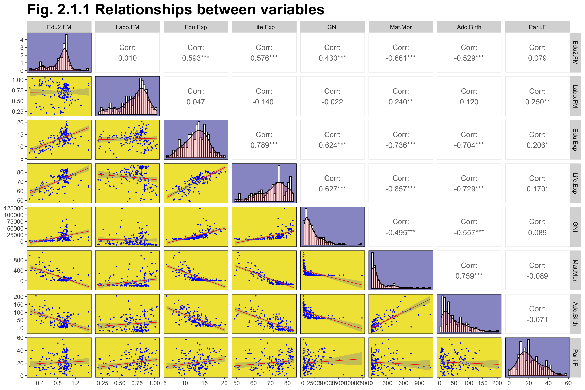

### 2.1.2 Show summaries of the variables in the data

#### 2.1.2.1 summarising the descriptive statistics


```r
library(finalfit)
ff_glimpse(human.all)$Con %>% 
  datatable (caption = "Tab. 2.1.2.1 Discriptive statistics for variables")
```

```{=html}
<div id="htmlwidget-6abfcd94c53c36250fd6" style="width:100%;height:auto;" class="datatables html-widget"></div>
<script type="application/json" data-for="htmlwidget-6abfcd94c53c36250fd6">{"x":{"filter":"none","vertical":false,"caption":"<caption>Tab. 2.1.2.1 Discriptive statistics for variables<\/caption>","data":[["Edu2.FM","Labo.FM","Edu.Exp","Life.Exp","GNI","Mat.Mor","Ado.Birth","Parli.F"],["Edu2.FM","Labo.FM","Edu.Exp","Life.Exp","GNI","Mat.Mor","Ado.Birth","Parli.F"],["&lt;dbl&gt;","&lt;dbl&gt;","&lt;dbl&gt;","&lt;dbl&gt;","&lt;dbl&gt;","&lt;int&gt;","&lt;dbl&gt;","&lt;dbl&gt;"],[155,155,155,155,155,155,155,155],[0,0,0,0,0,0,0,0],["0.0","0.0","0.0","0.0","0.0","0.0","0.0","0.0"],["0.9","0.7","13.2","71.7","17627.9","149.1","47.2","20.9"],["0.2","0.2","2.8","8.3","18543.9","211.8","41.1","11.5"],["0.2","0.2","5.4","49.0","581.0","1.0","0.6","0.0"],["0.7","0.6","11.2","66.3","4197.5","11.5","12.6","12.4"],["0.9","0.8","13.5","74.2","12040.0","49.0","33.6","19.3"],["1.0","0.9","15.2","77.2","24512.0","190.0","72.0","27.9"],["1.5","1.0","20.2","83.5","123124.0","1100.0","204.8","57.5"]],"container":"<table class=\"display\">\n  <thead>\n    <tr>\n      <th> <\/th>\n      <th>label<\/th>\n      <th>var_type<\/th>\n      <th>n<\/th>\n      <th>missing_n<\/th>\n      <th>missing_percent<\/th>\n      <th>mean<\/th>\n      <th>sd<\/th>\n      <th>min<\/th>\n      <th>quartile_25<\/th>\n      <th>median<\/th>\n      <th>quartile_75<\/th>\n      <th>max<\/th>\n    <\/tr>\n  <\/thead>\n<\/table>","options":{"columnDefs":[{"className":"dt-right","targets":[3,4]},{"orderable":false,"targets":0}],"order":[],"autoWidth":false,"orderClasses":false}},"evals":[],"jsHooks":[]}</script>
```

#### 2.1.2.1 Summarising the distributions

The distribution of variables is shown in the diagonal grids of fig 2.2.1 (see above). For clear presentation, it is visualized singly again. See fig 2.1.2.1 below.


```r
#save clearer names to the lables so that they have better readability in plot
label.name <- paste(codebook$variable, paste("\n(",codebook$label,")"))
names(label.name) <- c("Life.Exp",
                  "Edu.Exp",
                  "Mat.Mor",
                  "Ado.Birth",
                  "Parli.F",
                  "Edu2.FM",
                  "Labo.FM", 
                  "GNI")

#plot it
human.all %>% 
  pivot_longer(everything()) %>%  #longer format
  ggplot(aes(x = value)) + #x axis used variable "value" (a default of pivot)
  geom_histogram(aes(y = ..density..), #match ys of density and histogram plots
                 color = "black", #my favorite border color
                 fill = "#9999CC")+  # I heard this is a beautiful color
  geom_density(fill = "pink", 
               alpha = 0.25)+ #adjust the aesthetics for density plot
  facet_wrap(~name, scales = "free", #wrap by name variable
             labeller = labeller(name = label.name)) + #use the label I set above
  theme(panel.grid.major = element_blank(), #get rid of the ugly grids
        panel.grid.minor = element_blank(),
        panel.background = element_rect(fill = "white",#adjust the background
                                        color = "black"),
        strip.background = element_rect(color = "black",#adjust the strips aes
                                        fill = "steelblue"),
        strip.text = element_text(size =12, 
                                  color = "white"), #adjust the strip text
        axis.title.x = element_text(size = 20), #adjust the x text
        axis.title.y = element_text(size = 20), # adjust the y text
        plot.title = element_text(size = 22, face = "bold"))+ #adjust the title
  labs(title = "Fig. 2.1.2.1 Distribution of variables", #title it
       )
```

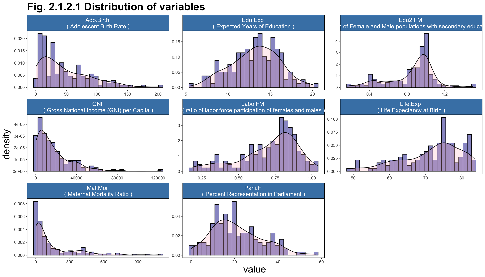

### 2.1.3 Describe and interpret the outputs

According to their distribution shapes visualized in fig 2.2.1 (see above), non-normally distributed variables were reported as median (Q1-Q3); roughly normal variables will be reported as mean±sd.

The respondents have a life expectancy at birth (Life.Exp) of 74.2(66.3-77.2) years; an expected years of education (Edu.Exp) of 13.2±2.8 years; a maternal mortality ratio (Mat.Mor) of 49 (11.5-190) per 100,000 births; an adolescent birth rate (Ado.Birth) of 33.6 (12.6 - 72.0) per 1,000 women; a percent representation in parliment (Parli.F) of 20.9±11.5 per 100 women; a ratio of Female and Male populations with secondary education (Edu2.FM) of 0.9 (0.7-1.0); a ratio of labor force participation of females and males	(Labo.FM) of 0.8 (0.6-0.9); a 	Gross National Income (GNI) per Capita(GNI) of $12040.0 (4197.5-24512.0).

### 2.1.4 Commenting on the distributions of the variables and the relationships between them.

#### 2.1.4.1 Distribution

From the figure above, I found:
*a.* Adolescent birth rate is skewed to right with the mode being at around 25. This indicates most of the countries have a rate of around 25 births per 1,000 women, while a small number of countries can have birth rate as high as 200 births per 1,000 women. For this indicator, number below zero is impossible, which might the the reason why it goes right-skewed.

*b.* Expected years of education is roughly normally distributed, with the data points centering on around 1~13 years. This makes sense since it is the years taken to finish the education before college for most countries.

*c.* Ratio of Female and Male populations with secondary education is moderately left-skewed with a mode of 0.9. Both a mode less than one and long left tail demonstrates the fact that gender inequality is still presented across the world. However, roughly 1/2 of the data points fall within 0.9 to 1.1, which means in half of the countries it is not that big an issue any longer. 

*d.* Like any indicators related to income, GNI is right-skewed. This makes sense since no one will make negative amount of money while some people can be super rich. The value centers around 10,000 dollars.

*e.* Ratio of labor force participation of females and males have roughly similar distribution with variable "Ratio of Female and Male populations with secondary education". Since they are different indicators trying to capture similar idea(gender inequality), this consistency is legitimate and a sign of their reliability.

*f.* Life expectancy at birth centers around 75 years with long left tail and a shorter right tail stopping abruptly at 100 years. Besides, The distribution has negative kurtosis. These can be well-explained by the fact that thanks to modern medicine people are enjoying longer lifetime but there is always to limit to mankind's longevity.

*g.* Maternal mortality Ratio centers at very small number around 30 per 100,000 births in a positive kurtosis manner with long right skewness. This corresponds to the fact that maternal healthcare has long been a mature social service across many countries (center on small number and has positive kurtosis), and also that some of the extremely under-developed countries are still not providing it properly (long tail to right). Note that there is a small peak around 450 per 100,000 births, which might be the influence of nature's base rate of mortality.

*h.* Percent Presentation in Parliament is roughly normally distributed with slight right skewness. Sorry I have no idea how parliament works and will not comment on this indicator too much. 

#### 2.1.4.2 Relationships

Correlation between variables is visualized by scatter plots in fig 2.2.1. For better readability, I will also print out the correlation matrix down here.


```r
library(corrplot)
cor(human.all) %>% 
  round(digits = 2) %>% 
  datatable(caption = 
              "Tab. 2.1.4.2 Correlation Coeeficients bewteen the variables")
```

```{=html}
<div id="htmlwidget-272184f5a70925438455" style="width:100%;height:auto;" class="datatables html-widget"></div>
<script type="application/json" data-for="htmlwidget-272184f5a70925438455">{"x":{"filter":"none","vertical":false,"caption":"<caption>Tab. 2.1.4.2 Correlation Coeeficients bewteen the variables<\/caption>","data":[["Edu2.FM","Labo.FM","Edu.Exp","Life.Exp","GNI","Mat.Mor","Ado.Birth","Parli.F"],[1,0.01,0.59,0.58,0.43,-0.66,-0.53,0.08],[0.01,1,0.05,-0.14,-0.02,0.24,0.12,0.25],[0.59,0.05,1,0.79,0.62,-0.74,-0.7,0.21],[0.58,-0.14,0.79,1,0.63,-0.86,-0.73,0.17],[0.43,-0.02,0.62,0.63,1,-0.5,-0.56,0.09],[-0.66,0.24,-0.74,-0.86,-0.5,1,0.76,-0.09],[-0.53,0.12,-0.7,-0.73,-0.56,0.76,1,-0.07],[0.08,0.25,0.21,0.17,0.09,-0.09,-0.07,1]],"container":"<table class=\"display\">\n  <thead>\n    <tr>\n      <th> <\/th>\n      <th>Edu2.FM<\/th>\n      <th>Labo.FM<\/th>\n      <th>Edu.Exp<\/th>\n      <th>Life.Exp<\/th>\n      <th>GNI<\/th>\n      <th>Mat.Mor<\/th>\n      <th>Ado.Birth<\/th>\n      <th>Parli.F<\/th>\n    <\/tr>\n  <\/thead>\n<\/table>","options":{"columnDefs":[{"className":"dt-right","targets":[1,2,3,4,5,6,7,8]},{"orderable":false,"targets":0}],"order":[],"autoWidth":false,"orderClasses":false}},"evals":[],"jsHooks":[]}</script>
```

It can be observed that six out of eight variables have a correlation efficient >0.4 with at least one other variable. The remaining two variables are Labo.FM and Parli.F. Their weaker correlation with other variable might be due to a number of pronounced con-founders. For example, women's labor force participation is culturally less welcomed in some Asian cultures for reasons other than gender inequality; it is also influenced by the industrial structure of a country (countries with developed 3rd industry might have more women employed); only 46% of the world population are living under full or flawed democracy, and parliament does not even exist in a number of countries.  

## 2.2 Requirement 2

Perform principal component analysis (PCA) on the raw (non-standardized) human data. Show the variability captured by the principal components. Draw a biplot displaying the observations by the first two principal components (PC1 coordinate in x-axis, PC2 coordinate in y-axis), along with arrows representing the original variables.

### 2.2.1 Perform principal component analysis (PCA) on the raw (non-standardized) human data

PCA is performed on un-standardized data set.


```r
# perform principal component analysis with 
# results passing into pca.human
pca.human <- prcomp(human.all) #PCA
```

### 2.2.2 Show the variability captured by the principal components

#### 2.2.2.1 show variability numerically

First, I checked the names of the lists of the pca results.


```r
names(pca.human) #get the names of data set
```

```
## [1] "sdev"     "rotation" "center"   "scale"    "x"
```

By reading the help file, I get the idea that list "sdev" is the square roots of the eignvalues of the components. Since variability captured by a component _vc_ using eignvalue _ev_ can be formulated as:

$$
vc =\frac{ev_{i}^{2}}{ \sum_{i=1}^{n}ev_{i}^{2}} 
$$

The variability captured by each component is hence calculated.


```r
eig <- pca.human$sdev^2
for (i in 1:8){ # the loop will run through 8 components
  a <- eig[i]/sum(eig) #use the formula above
  b <- paste("PC", i , "captures", a*100, "% of varibility") #improve readability
  print(b) #print it out
}
```

```
## [1] "PC 1 captures 99.9897649093306 % of varibility"
## [1] "PC 2 captures 0.0100076294642637 % of varibility"
## [1] "PC 3 captures 0.000184456576000702 % of varibility"
## [1] "PC 4 captures 3.81492929408603e-05 % of varibility"
## [1] "PC 5 captures 4.1243674737075e-06 % of varibility"
## [1] "PC 6 captures 7.12977441293848e-07 % of varibility"
## [1] "PC 7 captures 1.06301744648587e-08 % of varibility"
## [1] "PC 8 captures 7.36109912940859e-09 % of varibility"
```

It is found that PC1 explains 99.99% of the variability of the data set. Other components' contribution is less the 0.1%, in totality.

Package FactoMineR calculates the variability captured automatically, I will try using it and see if my calculation replicates its results. 


```r
library(FactoMineR)#for Multivariate Exploratory Data Analysis and Data Mining
library(factoextra)#to extract and visualize the output of PCA, CA and MCA
eig.human <- get_eigenvalue(pca.human)
eig.human[2]
```

```
##       variance.percent
## Dim.1     9.998976e+01
## Dim.2     1.000763e-02
## Dim.3     1.844566e-04
## Dim.4     3.814929e-05
## Dim.5     4.124367e-06
## Dim.6     7.129774e-07
## Dim.7     1.063017e-08
## Dim.8     7.361099e-09
```

They are same. PC1 explains 99.99% of the variability of the data set

#### 2.2.2.2 show variability visually


```r
#explore the varai
library(factoextra)#install.packages("factoextra")
fviz_eig(pca.human,
         barfill = "grey",
         barcolor = "black")+
  theme(panel.grid = element_blank()) +
  labs(title = "Fig. 2.2.2.2 Scree plot for eigenvalues across the components (un-standardized dataset)")
```

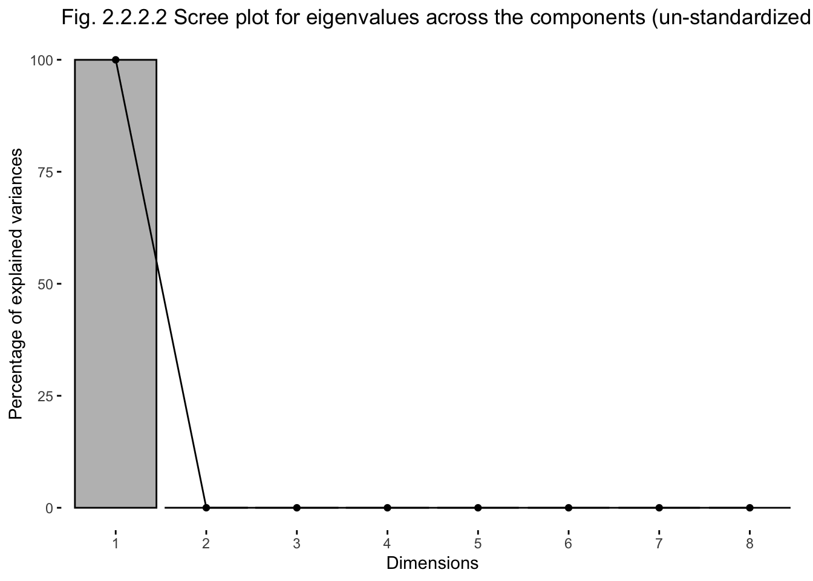

#### 2.2.2.3 check the loading score numerically

Although this is not required by the assignment, I feel it could be also interesting to check the proportion of each variable's contribution to each components (loading scores). This could shed light on the comparison between standardized and un-standardized datasets for PCA. By checking the help file of prcomp, I found it is easy to obtain these loading scores from the "rotation" list of PCA result


```r
#obtain loading scores of my PCA result and pass it into pca.human.ls
pca.human.ls <- pca.human$rotation%>% data.frame
#check the loading scores
pca.human.ls
```

```
##                     PC1           PC2           PC3           PC4           PC5
## Edu2.FM   -5.607472e-06  0.0006713951 -3.412027e-05 -2.736326e-04 -0.0022935252
## Labo.FM    2.331945e-07 -0.0002819357  5.302884e-04 -4.692578e-03  0.0022190154
## Edu.Exp   -9.562910e-05  0.0075529759  1.427664e-02 -3.313505e-02  0.1431180282
## Life.Exp  -2.815823e-04  0.0283150248  1.294971e-02 -6.752684e-02  0.9865644425
## GNI       -9.999832e-01 -0.0057723054 -5.156742e-04  4.932889e-05 -0.0001135863
## Mat.Mor    5.655734e-03 -0.9916320120  1.260302e-01 -6.100534e-03  0.0266373214
## Ado.Birth  1.233961e-03 -0.1255502723 -9.918113e-01  5.301595e-03  0.0188618600
## Parli.F   -5.526460e-05  0.0032317269 -7.398331e-03 -9.971232e-01 -0.0716401914
##                     PC6           PC7           PC8
## Edu2.FM    2.180183e-02  6.998623e-01  7.139410e-01
## Labo.FM    3.264423e-02  7.132267e-01 -7.001533e-01
## Edu.Exp    9.882477e-01 -3.826887e-02  7.776451e-03
## Life.Exp  -1.453515e-01  5.380452e-03  2.281723e-03
## GNI       -2.711698e-05 -8.075191e-07 -1.176762e-06
## Mat.Mor    1.695203e-03  1.355518e-04  8.371934e-04
## Ado.Birth  1.273198e-02 -8.641234e-05 -1.707885e-04
## Parli.F   -2.309896e-02 -2.642548e-03  2.680113e-03
```

```r
#There are quite a number of extremely small numbers in each column. To get
#a better reading experience, I passed the largest score in each column to an
#object "largest.ls" and extracted their row names(the variable name), merging
#into a dataframe
largest.ls<- apply(pca.human.ls, 2, function(x)max(abs(x))) # largest scores
name<- rownames(pca.human.ls)[apply(pca.human.ls, 2, which.max)] # row names
data.frame(largest.ls = largest.ls, name =name) %>% datatable (caption = "Fig. 2.2.2.3 largest factor loading for each components") %>%  # data frame
  formatRound(columns = 1, digits = 2) #round to increase readability
```

```{=html}
<div id="htmlwidget-bf5d8997b0b79a7d95b0" style="width:100%;height:auto;" class="datatables html-widget"></div>
<script type="application/json" data-for="htmlwidget-bf5d8997b0b79a7d95b0">{"x":{"filter":"none","vertical":false,"caption":"<caption>Fig. 2.2.2.3 largest factor loading for each components<\/caption>","data":[["PC1","PC2","PC3","PC4","PC5","PC6","PC7","PC8"],[0.999983199108119,0.991632012007209,0.991811267316935,0.997123248536381,0.986564442473923,0.988247660951514,0.713226711971368,0.713940964430774],["Mat.Mor","Life.Exp","Mat.Mor","Ado.Birth","Life.Exp","Edu.Exp","Labo.FM","Edu2.FM"]],"container":"<table class=\"display\">\n  <thead>\n    <tr>\n      <th> <\/th>\n      <th>largest.ls<\/th>\n      <th>name<\/th>\n    <\/tr>\n  <\/thead>\n<\/table>","options":{"columnDefs":[{"targets":1,"render":"function(data, type, row, meta) {\n    return type !== 'display' ? data : DTWidget.formatRound(data, 2, 3, \",\", \".\", null);\n  }"},{"className":"dt-right","targets":1},{"orderable":false,"targets":0}],"order":[],"autoWidth":false,"orderClasses":false}},"evals":["options.columnDefs.0.render"],"jsHooks":[]}</script>
```

It is interesting to find out that each variable loads almost exclusively on one components (Six out of 8 variables have loading score on one unique component larger than 0.99).  

### 2.2.3 Draw a biplot 

Quoted from the requirement:
"Draw a biplot Biplot displaying the observations by the first two principal components, along with arrows representing the original variables."


```r
# draw a biplot of the principal component representation and the original variables
biplot(pca.human)#biplot
```

<div class="figure">
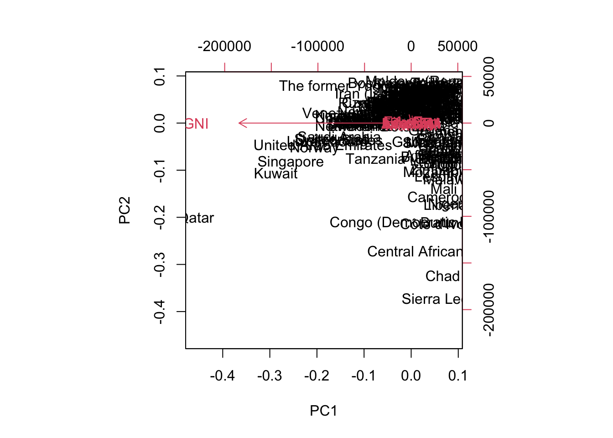
<p class="caption">Fig. 2.2.3 Biplot for the first two components (unstandardized data set)</p>
</div>

In the biplot, red texts stand for variables, while black texts for rows (countries). The position of GNI is far away from the origin (0,0) in the direction of x axis (PC1), indicating its strong contribution to PC1. Most of the countries clustered tightly around the origin (0,0), which points to the fact that they are not well-represented on the factor map. 

I visualized another biplot using outside package. The graph will have different visual effect but same idea. 


```r
p1 <- fviz_pca_biplot(pca.human, #data used
                      repel = TRUE,  #avoid overlap
                      ggtheme = theme_test(), #a theme I like
                      title = "Fig. 2.2.1 a PCA for unstandardized dataset")
p1
```

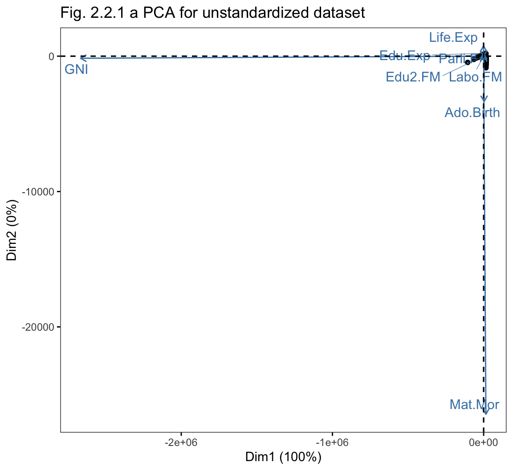

The graph carrys idea that is same with the graph generated by base function.

## 2.3 Requirment 3 

Quoted:

_"Standardize the variables in the human data and repeat the above analysis. Interpret the results of both analysis (with and without standardizing). Are the results different? Why or why not? Include captions (brief descriptions) in your plots where you describe the results by using not just your variable names, but the actual phenomena they relate to. "_

### 2.3.1 Standardize the variables 


```r
human.all.scaled <- scale(human.all) #scale it!
```

### 2.3.2 Repeat the above analysis

#### 2.3.2.1 PCA


```r
spca.human <- prcomp(human.all.scaled) #PCA
```

#### 2.3.2.1 Check variability captured by each component


```r
eig <- spca.human$sdev^2 #sdev is the square roots of ev, turn it into ev
for (i in 1:8){ #this loop will go through 8 components
  a <- eig[i]/sum(eig) #use the formula I expressed above
  b <- paste("PC", i , "captures", a*100, "% of varibility") #make it readable
  print(b) #print it out
}
```

```
## [1] "PC 1 captures 53.6046258273805 % of varibility"
## [1] "PC 2 captures 16.237031039413 % of varibility"
## [1] "PC 3 captures 9.57137445323498 % of varibility"
## [1] "PC 4 captures 7.58284503035719 % of varibility"
## [1] "PC 5 captures 5.47732753268388 % of varibility"
## [1] "PC 6 captures 3.59530248187163 % of varibility"
## [1] "PC 7 captures 2.63350570981446 % of varibility"
## [1] "PC 8 captures 1.29798792524435 % of varibility"
```


```r
fviz_screeplot(spca.human, 
               barfill = "grey",
               barcolor = "black",
               addlabel =T)+
  theme(panel.grid = element_blank())+
  labs(title = "Fig. 2.3.2.1 Scree plot for eigenvalues across each component \n(standardized dataset)")
```

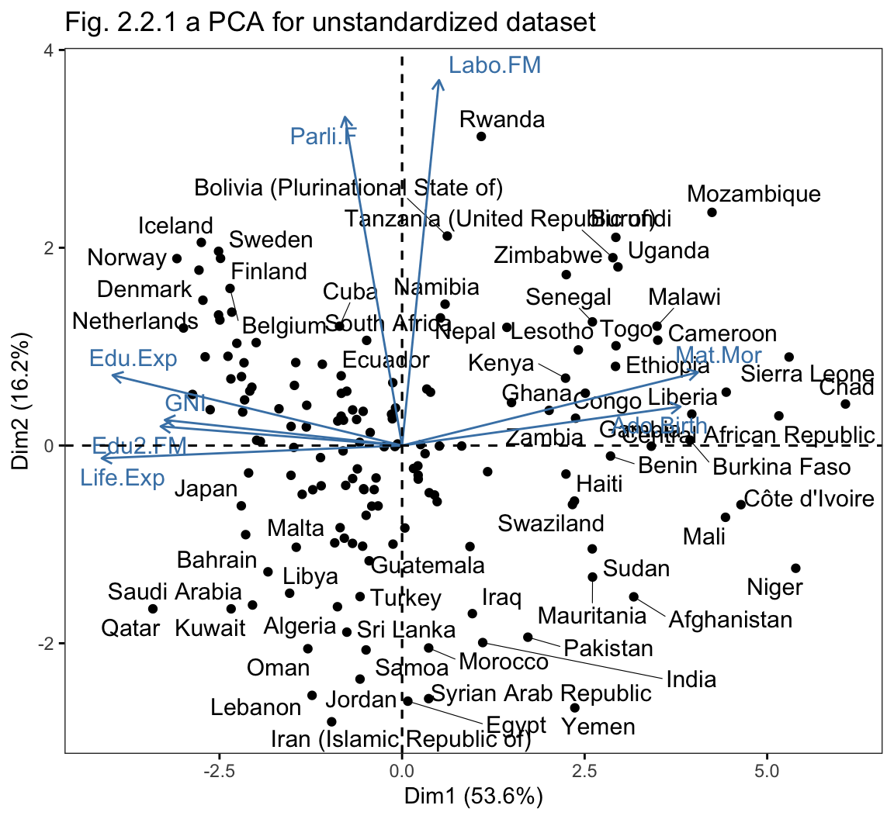

Interesting change happens. Thanks to scaling, the "scree" doesn't plummet this time. Comment will be given in section 2.3.3.

#### 2.3.2.2 Check factor laodings of each variable on each component


```r
#obtain loading scores of my PCA result and pass it into pca.human.ls
spca.human.ls <- spca.human$rotation%>% data.frame
#check the loading scores
spca.human.ls
```

```
##                   PC1         PC2         PC3         PC4        PC5
## Edu2.FM   -0.35664370  0.03796058 -0.24223089  0.62678110 -0.5983585
## Labo.FM    0.05457785  0.72432726 -0.58428770  0.06199424  0.2625067
## Edu.Exp   -0.42766720  0.13940571 -0.07340270 -0.07020294  0.1659678
## Life.Exp  -0.44372240 -0.02530473  0.10991305 -0.05834819  0.1628935
## GNI       -0.35048295  0.05060876 -0.20168779 -0.72727675 -0.4950306
## Mat.Mor    0.43697098  0.14508727 -0.12522539 -0.25170614 -0.1800657
## Ado.Birth  0.41126010  0.07708468  0.01968243  0.04986763 -0.4672068
## Parli.F   -0.08438558  0.65136866  0.72506309  0.01396293 -0.1523699
##                   PC6         PC7         PC8
## Edu2.FM    0.17713316  0.05773644  0.16459453
## Labo.FM   -0.03500707 -0.22729927 -0.07304568
## Edu.Exp   -0.38606919  0.77962966 -0.05415984
## Life.Exp  -0.42242796 -0.43406432  0.62737008
## GNI        0.11120305 -0.13711838 -0.16961173
## Mat.Mor    0.17370039  0.35380306  0.72193946
## Ado.Birth -0.76056557 -0.06897064 -0.14335186
## Parli.F    0.13749772  0.00568387 -0.02306476
```

```r
#There are quite a number of extremely small numbers in each column. To get
#a better reading experience, I passed the largest score in each column to an
#object "largest.ls" and extracted their row names(the variable name), merging
#into a dataframe
largest.ls<- apply(spca.human.ls, 2, function(x)max(abs(x))) # largest scores
name<- rownames(spca.human.ls)[apply(spca.human.ls, 2, which.max)] # row names
data.frame(largest.ls = largest.ls, name =name) %>% datatable %>%  # data frame
  formatRound(columns = 1, digits = 2) #round to increase readability
```

```{=html}
<div id="htmlwidget-44afcc4da6d96f323aeb" style="width:100%;height:auto;" class="datatables html-widget"></div>
<script type="application/json" data-for="htmlwidget-44afcc4da6d96f323aeb">{"x":{"filter":"none","vertical":false,"data":[["PC1","PC2","PC3","PC4","PC5","PC6","PC7","PC8"],[0.443722397197696,0.724327255939404,0.725063089451365,0.727276754586132,0.598358508345907,0.760565565191853,0.779629656192225,0.721939461927338],["Mat.Mor","Labo.FM","Parli.F","Edu2.FM","Labo.FM","Edu2.FM","Edu.Exp","Mat.Mor"]],"container":"<table class=\"display\">\n  <thead>\n    <tr>\n      <th> <\/th>\n      <th>largest.ls<\/th>\n      <th>name<\/th>\n    <\/tr>\n  <\/thead>\n<\/table>","options":{"columnDefs":[{"targets":1,"render":"function(data, type, row, meta) {\n    return type !== 'display' ? data : DTWidget.formatRound(data, 2, 3, \",\", \".\", null);\n  }"},{"className":"dt-right","targets":1},{"orderable":false,"targets":0}],"order":[],"autoWidth":false,"orderClasses":false}},"evals":["options.columnDefs.0.render"],"jsHooks":[]}</script>
```

Interesting change happens. The one-variable-to-one-component loading style has disappeared Comment will be given in section 2.3.3.

#### 2.3.2.3 Biplot


```r
biplot(spca.human) #biplot
```

<div class="figure">
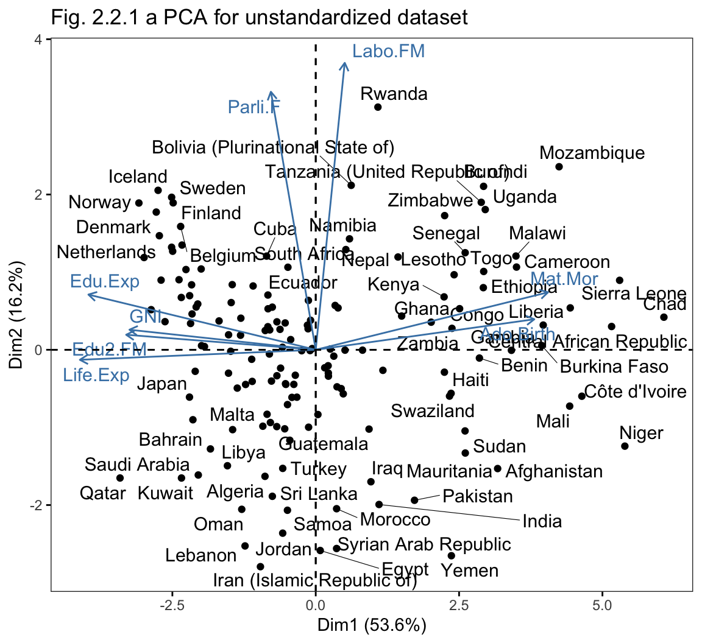
<p class="caption">Fig 2.3.2.3 Biplot for the first two components (standardized data set)</p>
</div>

This time the texts representing both the rows and columns are scattered away from each other and more column text (in red) are visualized. 

I will visualize another biplot using outside package. The graph will have different visual effect but same idea. 


```r
p2 <- fviz_pca_biplot(spca.human,  #data used
                      repel = TRUE,  #avoid overlap
                      ggtheme = theme_test(), #a theme I like
                      title = "Fig. 2.2.1 a PCA for unstandardized dataset")
p2
```

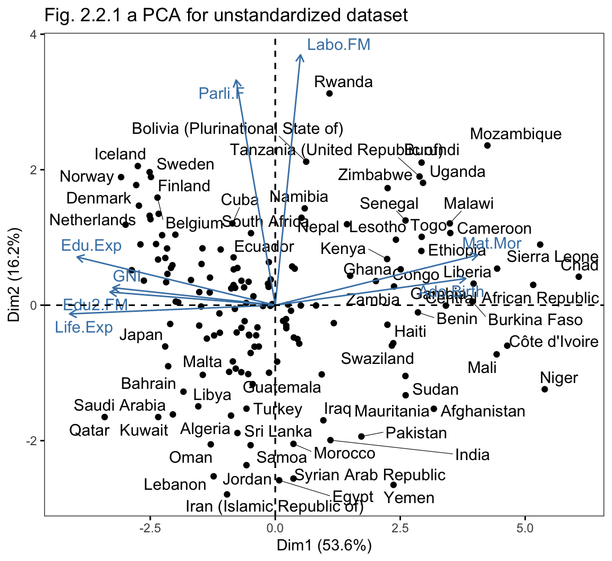

### 2.3.3 Interpret the results of both analysis

Some interesting findings by looking at both analyses are:

#### 2.3.3.1 Difference between PCA results with standardized and un-standardized data sets

*a. Variability explained* 

With un-standardized data set, PCA produced results showing PC1 explains 99.99% of the variability of the data set; other components' contribution is less the 0.1%, in totality . With standardized data set, PC1 and PC2 together explains 69.8% of the variability of the data set, with the amount of variability explained falling gradually for the components following. 

*b. Factor loading* 

With un-standardized data set, PCA produced results showing each variable loads almost exclusively on one components (Six out of 8 variables have loading score on one unique component larger than 0.99). While this one-variable-to-one-component loading style has disappeared in results from standardized data set.

*b. Biplot* 

With un-standardized data set, most of the countries clustered tightly around the origin (0,0), which points to the fact that they are not well-represented on the factor map. Besides, only one variable GNI locates far away from the origin (0,0) in the direction of x axis (PC1), indicating its strong contribution to PC1. However, when I use standardized data set, row and column points are more well scattered across the coordinate panel and all the variables are visualized more reasonably. 

#### 2.3.3.2 Possible explanation for the difference

Base on finding above, it is not hard to draw the conclusion that PCA using standardized data set produces results better for analysis. 

Possible explanation for this is the different scales of the variables make comparision between pairs of features difficult. PCA is calculated based on co-variance. Unlike correlation, which is dimensionless, covariance is in units obtained by multiplying the units of the two variables. When data set is not scaled, this makes each variable not easily comparable with others (since they all have their own value ranges). Further, each variable loads almost exclusively on one components because they can hardly find another variable with comparable value range. This assumption is further consolidated by the fact that the only two variables with smaller loading scores are Edu2.FM and Labo.FM, both of which happen to have similar value range from 0 to 1. 

Also, co-variance also gives some variable extremely high leverage in our data set. To better deliver the idea, here I reproduce the table from 2.1.2.1 about variable descriptions (see more description below):


```r
ff_glimpse(human.all)$Con %>%  #"$Con" calls for the continuous variables
  datatable (caption = "Tab. 2.1.2.1 Discriptive statistics for variables")
```

```{=html}
<div id="htmlwidget-ab96b818976eceee2b87" style="width:100%;height:auto;" class="datatables html-widget"></div>
<script type="application/json" data-for="htmlwidget-ab96b818976eceee2b87">{"x":{"filter":"none","vertical":false,"caption":"<caption>Tab. 2.1.2.1 Discriptive statistics for variables<\/caption>","data":[["Edu2.FM","Labo.FM","Edu.Exp","Life.Exp","GNI","Mat.Mor","Ado.Birth","Parli.F"],["Edu2.FM","Labo.FM","Edu.Exp","Life.Exp","GNI","Mat.Mor","Ado.Birth","Parli.F"],["&lt;dbl&gt;","&lt;dbl&gt;","&lt;dbl&gt;","&lt;dbl&gt;","&lt;dbl&gt;","&lt;int&gt;","&lt;dbl&gt;","&lt;dbl&gt;"],[155,155,155,155,155,155,155,155],[0,0,0,0,0,0,0,0],["0.0","0.0","0.0","0.0","0.0","0.0","0.0","0.0"],["0.9","0.7","13.2","71.7","17627.9","149.1","47.2","20.9"],["0.2","0.2","2.8","8.3","18543.9","211.8","41.1","11.5"],["0.2","0.2","5.4","49.0","581.0","1.0","0.6","0.0"],["0.7","0.6","11.2","66.3","4197.5","11.5","12.6","12.4"],["0.9","0.8","13.5","74.2","12040.0","49.0","33.6","19.3"],["1.0","0.9","15.2","77.2","24512.0","190.0","72.0","27.9"],["1.5","1.0","20.2","83.5","123124.0","1100.0","204.8","57.5"]],"container":"<table class=\"display\">\n  <thead>\n    <tr>\n      <th> <\/th>\n      <th>label<\/th>\n      <th>var_type<\/th>\n      <th>n<\/th>\n      <th>missing_n<\/th>\n      <th>missing_percent<\/th>\n      <th>mean<\/th>\n      <th>sd<\/th>\n      <th>min<\/th>\n      <th>quartile_25<\/th>\n      <th>median<\/th>\n      <th>quartile_75<\/th>\n      <th>max<\/th>\n    <\/tr>\n  <\/thead>\n<\/table>","options":{"columnDefs":[{"className":"dt-right","targets":[3,4]},{"orderable":false,"targets":0}],"order":[],"autoWidth":false,"orderClasses":false}},"evals":[],"jsHooks":[]}</script>
```

The table (see the column "mean") has shown veraible "GNI" has a scale tremendously larger than other variables. This might lead to its large co-variances with any other variable, and further results in its over-contribution to the factor solution. 

All of these mis-representation of data would end up the poor quality of contribution, and hence the biplot shows most of the countries clustered tightly together, indicating the PCA has not produced a factor map with acceptable dissimilarity among rows. Also, the over-contribution of GNI to the factor solution leads to a graph with only one variable--GNI--showing in a visible distance (others overlap heavily around the center). 

## 2.4 Requirement 4

Quoted:

_"Give your personal interpretations of the first two principal component dimensions based on the biplot drawn after PCA on the standardized human data"_

To improve readability, I will visualize the biplot 2.2.1 again and interpret it.


```r
p2 # print picture p2
```

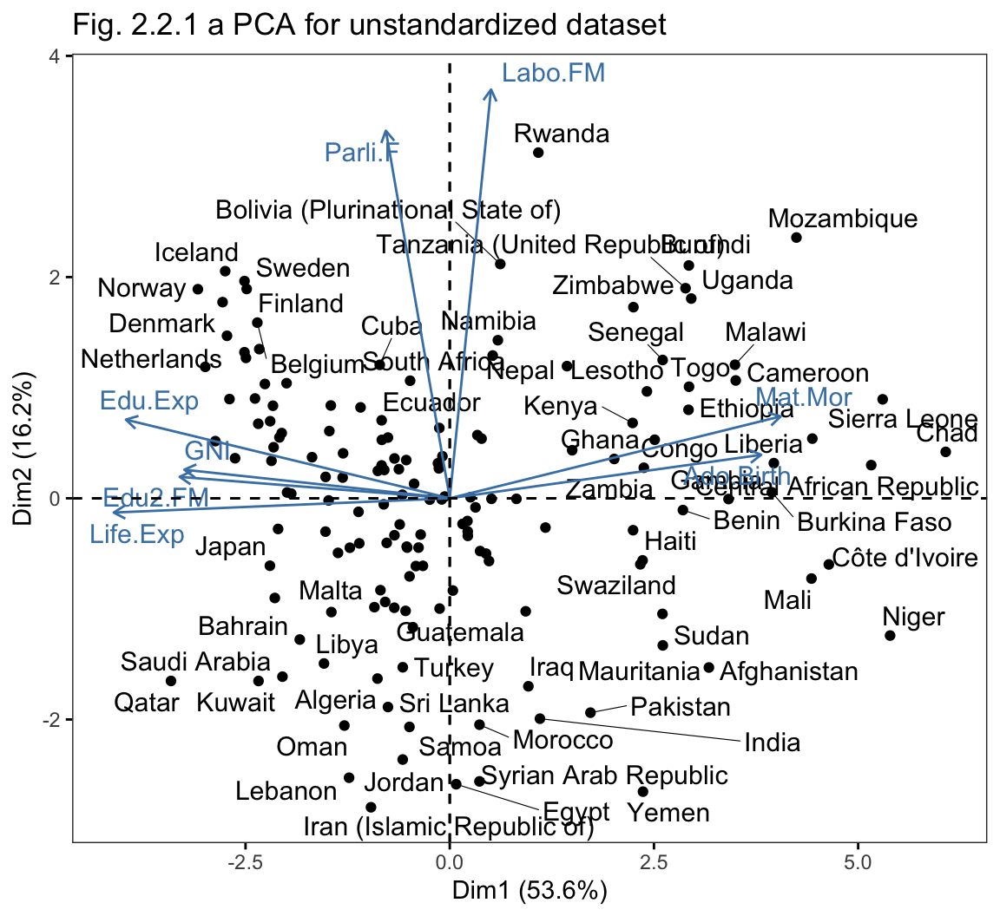

The scattered row names exhibit they are well-represented by the factor map. For example, country Rwanda's profile (top, 1st quadrant) is better represented by PC2 (Dim2, far away from origin in the direction of y axis), while Niger  (right end in the middle, 4th quadrant)  is better represented by PC1 (Dim1, far away from origin in the direction of x axis). Same idea, variables Labo.FM (top, 1st quadrant, in blue) and Parli.F (top, 2nd quadrant, in blue) have strong contribution to positive side of PC2(Dim2), while Mat.Mor (middle right, 1st quadrant, in blue) and ado.birth (top, 2nd quadrant) have strong contribution to positive side of PC2(Dim2), while Mat.Mor (middle right, 1st quadrant, in blue) made a good amount of contribution to the positive side of PC1(Dim1). The Education related variables, GNI (left, 2nd quadrnat, in blue) and life.EXp (left, 3rd quadrnat, in blue)  contributes more to the negative side of PC1 (Dim1). 

By observing the variables contributing to each principal components, I get the idea that:

Component 1: explains the gender equality in terms of enjoying basic social welfare (e.g. education, healthcare)

Component 1: explains the gender equality in terms of being a productive member of the society (labor involvement, parliament involvement)

## 2.5 Requirement 5

Quoted:

_"Load the tea dataset from the text file. Explore the data briefly: look at the structure and the dimensions of the data. Use View(tea) to browse its contents. As you see, all variables are categorical. Convert them explicitly to factors.Use Multiple Correspondence Analysis (MCA) on the tea data (or on just certain columns of the data, it is up to you!). Interpret the results of the MCA and draw at least the variable biplot of the analysis. You can also explore other plotting options for MCA. Comment on the output of the plots. (0-4 points)"_


### 2.5.1 Load the tea dataset


```r
tea <- read.table("https://raw.githubusercontent.com/KimmoVehkalahti/Helsinki-Open-Data-Science/master/datasets/tea.csv", 
                    sep =",", header = T)
tea.full <- tea #this is not actually functional, just keep the original data set
                # in case I mess up anything.
```


### 2.5.2 Explore the data briefly

The data used here concern a questionnaire on tea. A number of 300 participants were asked about how they drink tea (18 questions), what are their product's perception (12 questions) and some personal details (4 questions).

#### 2.5.2.1 Structure


```r
str(tea)
```

```
## 'data.frame':	300 obs. of  36 variables:
##  $ breakfast       : chr  "breakfast" "breakfast" "Not.breakfast" "Not.breakfast" ...
##  $ tea.time        : chr  "Not.tea time" "Not.tea time" "tea time" "Not.tea time" ...
##  $ evening         : chr  "Not.evening" "Not.evening" "evening" "Not.evening" ...
##  $ lunch           : chr  "Not.lunch" "Not.lunch" "Not.lunch" "Not.lunch" ...
##  $ dinner          : chr  "Not.dinner" "Not.dinner" "dinner" "dinner" ...
##  $ always          : chr  "Not.always" "Not.always" "Not.always" "Not.always" ...
##  $ home            : chr  "home" "home" "home" "home" ...
##  $ work            : chr  "Not.work" "Not.work" "work" "Not.work" ...
##  $ tearoom         : chr  "Not.tearoom" "Not.tearoom" "Not.tearoom" "Not.tearoom" ...
##  $ friends         : chr  "Not.friends" "Not.friends" "friends" "Not.friends" ...
##  $ resto           : chr  "Not.resto" "Not.resto" "resto" "Not.resto" ...
##  $ pub             : chr  "Not.pub" "Not.pub" "Not.pub" "Not.pub" ...
##  $ Tea             : chr  "black" "black" "Earl Grey" "Earl Grey" ...
##  $ How             : chr  "alone" "milk" "alone" "alone" ...
##  $ sugar           : chr  "sugar" "No.sugar" "No.sugar" "sugar" ...
##  $ how             : chr  "tea bag" "tea bag" "tea bag" "tea bag" ...
##  $ where           : chr  "chain store" "chain store" "chain store" "chain store" ...
##  $ price           : chr  "p_unknown" "p_variable" "p_variable" "p_variable" ...
##  $ age             : int  39 45 47 23 48 21 37 36 40 37 ...
##  $ sex             : chr  "M" "F" "F" "M" ...
##  $ SPC             : chr  "middle" "middle" "other worker" "student" ...
##  $ Sport           : chr  "sportsman" "sportsman" "sportsman" "Not.sportsman" ...
##  $ age_Q           : chr  "35-44" "45-59" "45-59" "15-24" ...
##  $ frequency       : chr  "1/day" "1/day" "+2/day" "1/day" ...
##  $ escape.exoticism: chr  "Not.escape-exoticism" "escape-exoticism" "Not.escape-exoticism" "escape-exoticism" ...
##  $ spirituality    : chr  "Not.spirituality" "Not.spirituality" "Not.spirituality" "spirituality" ...
##  $ healthy         : chr  "healthy" "healthy" "healthy" "healthy" ...
##  $ diuretic        : chr  "Not.diuretic" "diuretic" "diuretic" "Not.diuretic" ...
##  $ friendliness    : chr  "Not.friendliness" "Not.friendliness" "friendliness" "Not.friendliness" ...
##  $ iron.absorption : chr  "Not.iron absorption" "Not.iron absorption" "Not.iron absorption" "Not.iron absorption" ...
##  $ feminine        : chr  "Not.feminine" "Not.feminine" "Not.feminine" "Not.feminine" ...
##  $ sophisticated   : chr  "Not.sophisticated" "Not.sophisticated" "Not.sophisticated" "sophisticated" ...
##  $ slimming        : chr  "No.slimming" "No.slimming" "No.slimming" "No.slimming" ...
##  $ exciting        : chr  "No.exciting" "exciting" "No.exciting" "No.exciting" ...
##  $ relaxing        : chr  "No.relaxing" "No.relaxing" "relaxing" "relaxing" ...
##  $ effect.on.health: chr  "No.effect on health" "No.effect on health" "No.effect on health" "No.effect on health" ...
```

All the variables are of character type, excpet for age, which is integer. 

#### 2.5.2.2 Dimensions


```r
dim(tea)
```

```
## [1] 300  36
```

The dataset records information of 300 obs. on 36 variable

#### 2.5.2.3 Browse content


```r
view(tea) %>% head
```

```
##       breakfast     tea.time     evening     lunch     dinner     always home
## 1     breakfast Not.tea time Not.evening Not.lunch Not.dinner Not.always home
## 2     breakfast Not.tea time Not.evening Not.lunch Not.dinner Not.always home
## 3 Not.breakfast     tea time     evening Not.lunch     dinner Not.always home
## 4 Not.breakfast Not.tea time Not.evening Not.lunch     dinner Not.always home
## 5     breakfast Not.tea time     evening Not.lunch Not.dinner     always home
## 6 Not.breakfast Not.tea time Not.evening Not.lunch     dinner Not.always home
##       work     tearoom     friends     resto     pub       Tea   How    sugar
## 1 Not.work Not.tearoom Not.friends Not.resto Not.pub     black alone    sugar
## 2 Not.work Not.tearoom Not.friends Not.resto Not.pub     black  milk No.sugar
## 3     work Not.tearoom     friends     resto Not.pub Earl Grey alone No.sugar
## 4 Not.work Not.tearoom Not.friends Not.resto Not.pub Earl Grey alone    sugar
## 5 Not.work Not.tearoom Not.friends Not.resto Not.pub Earl Grey alone No.sugar
## 6 Not.work Not.tearoom Not.friends Not.resto Not.pub Earl Grey alone No.sugar
##       how       where           price age sex          SPC         Sport age_Q
## 1 tea bag chain store       p_unknown  39   M       middle     sportsman 35-44
## 2 tea bag chain store      p_variable  45   F       middle     sportsman 45-59
## 3 tea bag chain store      p_variable  47   F other worker     sportsman 45-59
## 4 tea bag chain store      p_variable  23   M      student Not.sportsman 15-24
## 5 tea bag chain store      p_variable  48   M     employee     sportsman 45-59
## 6 tea bag chain store p_private label  21   M      student     sportsman 15-24
##   frequency     escape.exoticism     spirituality     healthy     diuretic
## 1     1/day Not.escape-exoticism Not.spirituality     healthy Not.diuretic
## 2     1/day     escape-exoticism Not.spirituality     healthy     diuretic
## 3    +2/day Not.escape-exoticism Not.spirituality     healthy     diuretic
## 4     1/day     escape-exoticism     spirituality     healthy Not.diuretic
## 5    +2/day     escape-exoticism     spirituality Not.healthy     diuretic
## 6     1/day Not.escape-exoticism Not.spirituality     healthy Not.diuretic
##       friendliness     iron.absorption     feminine     sophisticated
## 1 Not.friendliness Not.iron absorption Not.feminine Not.sophisticated
## 2 Not.friendliness Not.iron absorption Not.feminine Not.sophisticated
## 3     friendliness Not.iron absorption Not.feminine Not.sophisticated
## 4 Not.friendliness Not.iron absorption Not.feminine     sophisticated
## 5     friendliness Not.iron absorption Not.feminine Not.sophisticated
## 6 Not.friendliness Not.iron absorption Not.feminine Not.sophisticated
##      slimming    exciting    relaxing    effect.on.health
## 1 No.slimming No.exciting No.relaxing No.effect on health
## 2 No.slimming    exciting No.relaxing No.effect on health
## 3 No.slimming No.exciting    relaxing No.effect on health
## 4 No.slimming No.exciting    relaxing No.effect on health
## 5 No.slimming No.exciting    relaxing No.effect on health
## 6 No.slimming No.exciting    relaxing No.effect on health
```

### 2.5.3 Convert to factors


```r
#use lapply function to generate a loop that runs through 
#every column and convert it to factor
tea[sapply(tea, is.character)] <- lapply(tea[sapply(tea, is.character)],
                                        as.factor)
```


### 2.5.4 Visualiz after conversion


```r
library(tidyverse)
tea %>% dplyr::select(-age) %>%  #age is continuous, remove it
  pivot_longer(everything()) %>%  # I need long format
  ggplot(aes(x = value, fill = value))+ # "Value" is assigned by piovt_longer
  geom_bar(color = "black", fill ="grey")+ #I like black border for the bars
  theme_bw()+ # a cool theme
  facet_wrap(~name, scale ="free")+ #wraps the value by variable "name"
  theme(legend.position = "none")+ # legend not necessary here
  theme(axis.text.x = element_text(size = 12, #x axis text settings
                                   angle = 45,
                                   vjust =1,
                                   hjust =1),
        strip.text = element_text(size = 10, #adjust the strips 
                                  face = "bold",
                                  color = "black"),
        strip.background = element_rect(color = "black", #adjust the background
                                        fill = "lightgrey"),
        axis.title = element_blank(), #remove axis titles
        plot.title = element_text(size =25))+ #make title bigger
  labs(title = "Frequency of each level of the variables") #name it
```

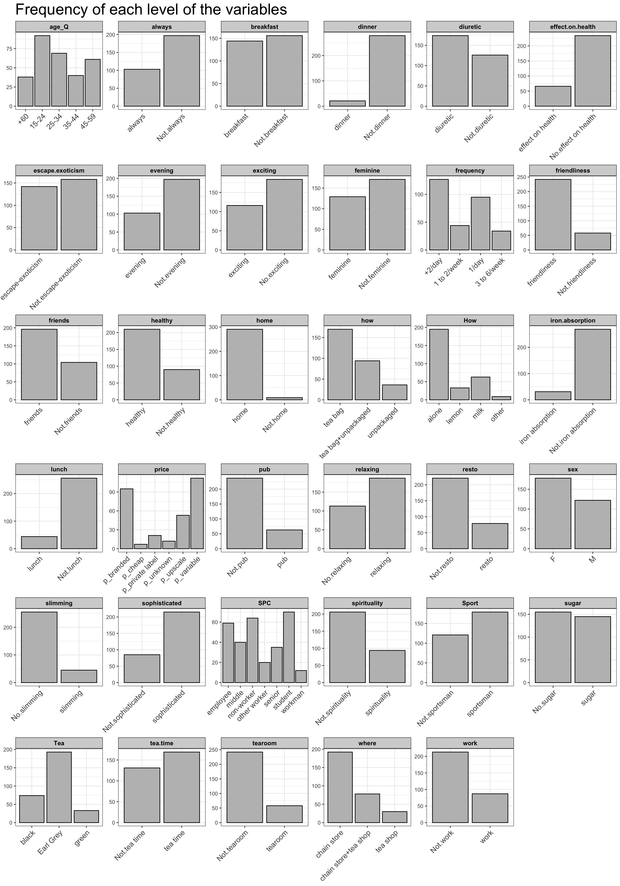

It can be observed that some variables have level(s) with very low frequency. This produces the risk in distorting the analysis. I will address it in this section.

### 2.5.5 variable selection 

Variable levels with very low frequency can distort the analysis and should be removed. Here I set an arbitrary cutoff 50, meaning any variable with at least one level below 50 would be removed.


```r
#remove age variable since its information has already been covered by age_Q variable
tea <- tea %>% dplyr::select(-age)
```


```r
vector.tea <- NA  #start a NULL vector 
for (i in 1:35){  #my loop will go through 35 columns
  table.tea <- table(tea[i]) #save the level frequency for each var into table.tea
  if (min(table.tea)>=50){ #if the smaller frequency is larger than 50
    vector.tea[i] <- colnames(tea[i]) #then save its nave ito vector.tea
  } 
}

keep.col.names <- vector.tea[complete.cases(vector.tea)]
```


```r
tea <- tea %>% 
  dplyr::select(one_of(keep.col.names))#remove variable with small category
```

### 2.5.6 Visualiz after removal 


```r
tea %>%  
  pivot_longer(everything()) %>%  #long format of data make "wrap" possible
  ggplot(aes(x = value))+   #define x axis variable. "Value" is assigned by pivot
  geom_bar(color = "black", fill = "grey")+ #I like grey bars with black border
  theme_bw()+ #a cool theme that I like
  facet_wrap(~name, scale ="free")+ # wrap the value by variable names
  theme(legend.position = "none")+ #legend is not functional here, remove it
  theme(axis.text.x = element_text(size = 12,  
                                   angle = 45,  #adjust angle
                                   vjust =1,  #adjust vertical position
                                   hjust =1), #adjust horizontal position
        strip.text = element_text(size = 10,
                                  face = "bold", # make title more visible
                                  color = "black"),
        strip.background = element_rect(color = "black", #I want the strip consistent
                                        fill = "lightgrey"), # with the bar
        axis.title = element_blank(), # remove x axis text. 
        plot.title = element_text(size =25))+ #adjust title size
  labs(title = "Frequency of each level of the variables") #name it!
```

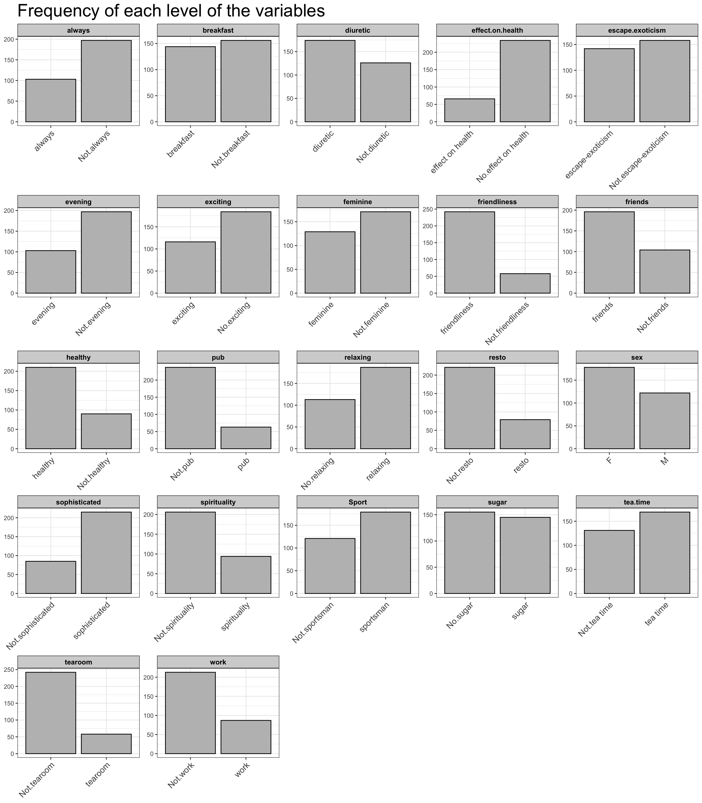


### 2.5.5 Multiple Correspondence Analysis on the data set


```r
mca.tea <- MCA(tea, graph = FALSE) #Multiple correspondence analysis done
```

### 2.5.6 Interpret the results

#### 2.5.6.1 Eigenvalues- interpretation with visualization

Eigenvalues measure the proportions of variances retained by the different dimensions. It will be printed to observe how the first several dimensions (components) represent the full data set.


```r
a <- get_eigenvalue(mca.tea) #obtain the eigenvalue of the mca results
```


```r
fviz_screeplot(mca.tea,
               barfill = "grey",
               barcolor = "black",
               addlabels = TRUE)+ #screeplot with labels
  labs(title= "Fig. 2.5.6.1 Variance explained by the top 10 dimensions")+
  theme(panel.grid = element_blank())#label
```

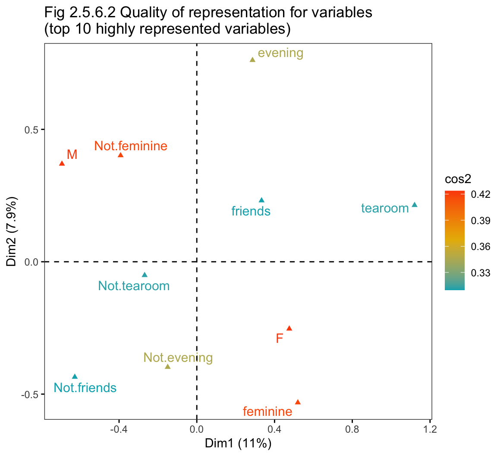

The eigenvalue of the first 3 dimensions are 0.109, 0.072 and 0.069. Since the eigenvalues of all 22 dimensions adds up to 1, an eigenvalue×100% will be the percentage of variance of the data set captured by this very dimension. Altogether, the first 2 dimensions captured 18.83% variability, indicating quite an amount of insights will be missed out using 2-dimension solution to represent the variation between variables. In the 2-dimension plot that I am going to generate in the following sections, some highly differentiated variables' leverage in discrimination might be underestimated, and indistinct variables might be highly differentiated on some dimensions other than the first 2. The full results of this MCA should be interpreted on the basis of this knowledge. 

#### 2.5.6.2 COS2 and visualization

COS2 (squared cosine) measures the quality of the representation for variables in factor map(2-dim solution). The higher cos2, the better. Variables with low cos2 should be treated and interpreted with caution. If a variable category is well represented by two dimensions, the sum of the cos2 is closed to one. 

CO2 values for first 2 dimensions across each variable will be printed out and added up by each variable. This is to explore how good the variables in our data set can be represented by the first two dimensions.


```r
#extract cos2 values for the 1st 2 dimensions
cos2.dim <- mca.tea$var$cos2 [,1:2]%>% data.frame() #save as data frame 
#save row names as a variable, so that ordering by column is possible
cos2.dim$variable <- rownames(cos2.dim)
#delete the row names since we already saved them into a new variable
rownames(cos2.dim) <- NULL
#calculate the addition of each row
cos2.dim <- cos2.dim %>% mutate(Dim.both = Dim.1 + Dim.2)
#show the top 10 largest results by descending order 
cos2.dim[order(-cos2.dim$Dim.both), c(3,4)][1:10,]
```

```
##        variable  Dim.both
## 22            M 0.4236926
## 21            F 0.4236926
## 36 Not.feminine 0.4173388
## 35     feminine 0.4173388
## 6   Not.evening 0.3458466
## 5       evening 0.3458466
## 12      tearoom 0.3117687
## 11  Not.tearoom 0.3117687
## 14  Not.friends 0.3097810
## 13      friends 0.3097810
```

As discussed above, the more the sum of the cos2 for a variable is closed to one, the better it is represented by the two dimensions. Reviewing the results, it is found that no added cos2 values is larger than 0.5. Only 4 variables have cos2 values (addition of the first two dimensions) larger than 0.4. These indicate only a limited number of variables were roughly represented by the first two dimensions, and the strength of variable relationship could be heavily under-estimated by by plots generated in the following sections of this analysis. 

For facilitating interpretability, a Variable Plot of MCA with high COS2 is generated (fig. 2.5.6.2). The results correspond to the finding from values of cos2. Note that variable categories such as tearoom  and feminine are relatively well-represented by both dimensions since they are far away from the origin in both x and y axes. Variable categories such as evening are well-represented by one dimension instead of the other since they are far away from the origin in either x or y axis (for evening, it is y). Variable categories such as friends are relatively well-represented by none of the dimensions since they are closed to origin from both directions. 


```r
p1 <- fviz_mca_var(mca.tea, 
                   col.var = "cos2", 
                   repel = TRUE, # avoid overlap
                   ggtheme = theme_test(), #theme that I like
                   gradient.cols = c("#00AFBB", "#E7B800", "#FC4E07"),
                   select.var = list(cos2 = 10))+ # limited the number of visualized
  labs(title = "Fig 2.5.6.2 Quality of representation for variables \n(top 10 highly represented variables)")
                                            #variables to 10 (largest cos2)
                                         
p1
```


#### 2.5.6.3 Contribution and visualization

Contr measures the percentage contributions of the each variable to the definition (inertia) of the dimensions. The contr of the first two dimensions will be displayed below. The sum of contr for each dimension will be 1. Larger Contr means the variable captures larger inertia of the dimension. Contr has similar functions as factor loading scores as that in principal component analysis, hence by reviewing the variable categories having strong contribution to a dimension, it is possible to assume a construct reflected underneath. Unfortunately, I did not find a clear explanation of variable categories of tea data set, this is not possible here. ("Inertia" in a MCA is analogous to the variance.)


```r
#extract contr values for the 1st 2 dimensions
tea.contr <- mca.tea$var$contrib[,1:2] %>% data.frame()
#save row names to a new variable
tea.contr$variable <- rownames(tea.contr)
#delete old row names.
rownames(tea.contr) <- NULL
#order by Dim.1, showing the top 10
tea.contr[order(-tea.contr$Dim.1), c(1,3)][1:10,]
```

```
##        Dim.1         variable
## 12 10.062284          tearoom
## 34 10.054077 Not.friendliness
## 22  8.120778                M
## 3   6.347914     Not.tea time
## 14  5.666634      Not.friends
## 21  5.565927                F
## 4   4.920572         tea time
## 18  4.868037              pub
## 35  4.816059         feminine
## 16  4.005020            resto
```

Variable categories tearoom and not.friendliness, each contributed more than 10% to the inertia of dimension one. Reviewing the important contributors to this dimension, I get the idea that the dimension tries to capture the social side of tea-drinking. However, since no original survey questions is available, no explicit conclusion can be drawn here.


```r
#order by Dim.2 showing the top 10
tea.contr[order(-tea.contr$Dim.2), c(2,3)][1:10,]
```

```
##        Dim.2          variable
## 5  11.480348           evening
## 35  7.025548          feminine
## 16  6.576528             resto
## 6   6.002415       Not.evening
## 37  5.604762 Not.sophisticated
## 36  5.299975      Not.feminine
## 41  4.991827       No.relaxing
## 23  4.755134     Not.sportsman
## 32  3.887125      Not.diuretic
## 14  3.793022       Not.friends
```

Variable category "evening" contributed more than 10% to the inertia of dimension two. Reviewing the important contributors to this dimension, I get the idea that the dimension tries to capture the leisure side of tea-drinking. However, since no original survey questions is available, no explicit conclusion can be drawn here.

Below is a plot about the contributions of top 15 variables to dimension one (Fig 2.5.6.3). It demonstrates similar insights with the numeric results, except for more variables is included here.


```r
#bar plot of the top 15 most contributed variable levels
fviz_contrib(mca.tea, 
             fill = "grey", 
             color = "black", 
             choice = "var", 
             axes = 1, 
             top = 15)+
  labs(title = "Fig 2.5.6.3 a :top 15 most contributed variable levels to dimension one")+
  theme(panel.grid = element_blank())
```

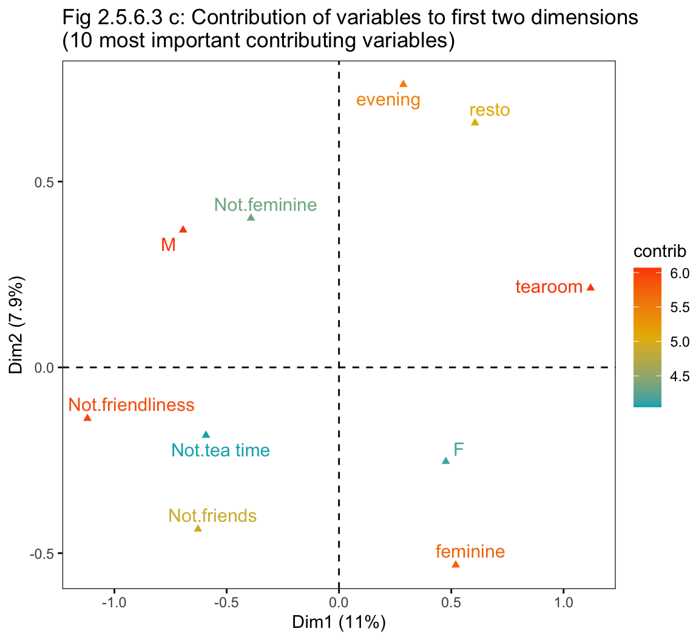

Below is a plot about the contributions of top 15 variables to dimension two. It carries similar information with the numeric results, except for more variables is included here.


```r
#bar plot of the top 15 most contributed variable levels
fviz_contrib(mca.tea,
             fill = "grey", 
             color = "black", 
             choice = "var", 
             axes = 2, 
             top = 15)+
  labs(title = "Fig 2.5.6.3 b :top 15 most contributed variable levels to dimension two")+
  theme(panel.grid = element_blank())
```

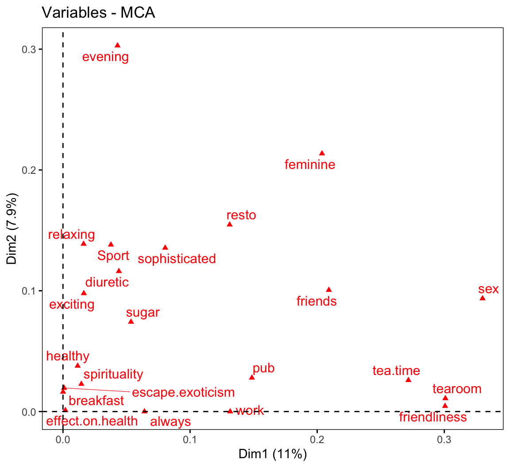

Below is a plot about the contributions of top 10 variables to both dimension one&two (fig 2.5.6.3). It carries similar information with the numeric results. Note that variables contribute highly to dimension one tend to show up in the far end in the direction of x axis while those contribute highly to dimension two will show up in the far end in the direction of y axis. The levels of contribution are also reflected by color gradients using the addition of the contr of both dimensions. Note that variable category "evening" (on top) contributes highly to dimension 2 but only has a color indicating moderate contribution. This is because its low contribution to dimension one drags its importance down. 


```r
#visualize the variable plot (row names are kept out of the plot)
p2 <- fviz_mca_var(mca.tea, col.var = "contrib",  
            repel = TRUE,  #avoid overlap
            ggtheme = theme_test(), #theme that I like
            gradient.cols = c("#00AFBB", "#E7B800", "#FC4E07"),
             select.var = list(contrib = 10))+# variables with top 10 largest 
  labs(title = "Fig 2.5.6.3 c: Contribution of variables to first two dimensions \n(10 most important contributing variables) " )
                                              #contribution  are shown
p2
```


Below I display plots 2.5.6.2 and 2.5.6.3c in one graph so that cos2 (contribution of dimensions to variable) and contr (contribution of variables to dimensions) can be compared. Most variable categories have consistent strength of cos2 and contr such as evening (on top, both), tearoom (right end, both), Male (M, to the left in the second quadrant, both), Not.friends (lower left). Some, such as friends (near the origin, first quadrant, left plot), have moderate strength in cos2 but not in contr, indicating it might be well-represented by the dimensions but its contribution to the dimensions either is explained by other variables or its contribution distributes across the dimension with neither one pronounced.


```r
library(patchwork)
p1+p2
```

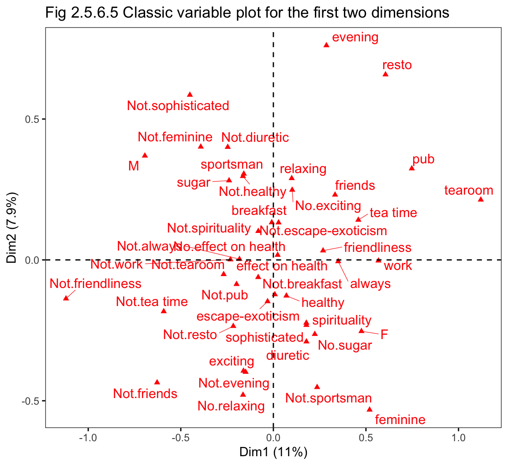

#### 2.5.6.4 correlation between variables and principal dimensions

The correlation between variables and first two dimensions are visualized here. 


```r
fviz_mca_var(mca.tea, choice = "mca.cor", 
            repel = TRUE, 
            ggtheme = theme_minimal())+
  theme(panel.grid = element_blank(),
          panel.background  = element_rect(color = "black"))
```

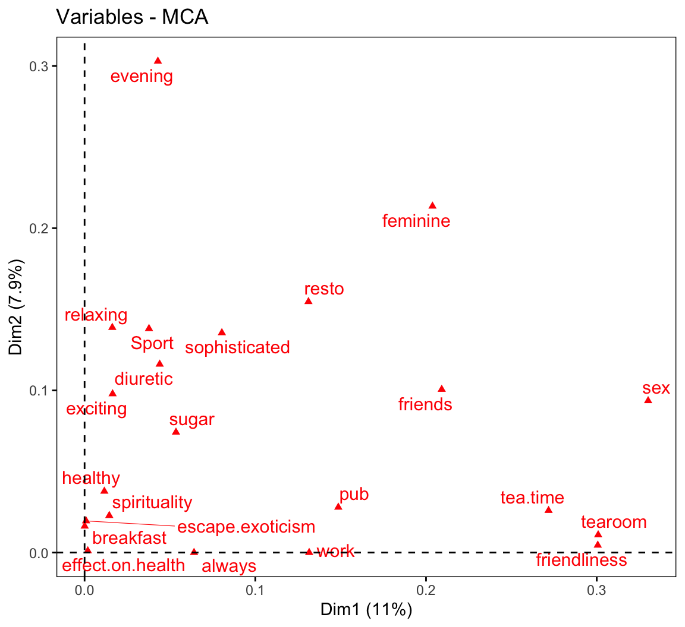

No variable is highly correlated with any dimension in terms of absolute correlation coefficients(see the scale ranges of x and y axes). Variables such as sex (right end), tearoom (lower right corner), friendliness (lower right corner) and tea.time(lower right) are moderately correlated with dimension one; variables such as evening (on top) are moderately correlated with the second dimension; variables such as feminine (upper right) and resto (roughly in the middle of the plot) are moderately correlated with both dimensions. Variables clustered closely to the origin are not noticeably correlated with any dimensions.

#### 2.5.6.5 classic variable plot

The classic variable plot is actually the cos2 plot. However, I visualize it again without excluding poorly represented variables, and will try to give a more thorough interpretation.


```r
fviz_mca_var(mca.tea, 
             repel = TRUE,
             ggtheme = theme_test(),
             title = "Fig 2.5.6.5 Classic variable plot for the first two dimensions")# theme that I like
```


Before interpreting the plot, I emphasize the fact that the first two dimensions only explain 19% of the total inertia contained in the data, indicating not all the points are equally well displayed in the two dimensions. Categories that do not differentiate well in the plot might still very possibly to be distinct in terms of other dimensions outside the first two. 

Variable categories clustered closely around the origin such as health, not.breakfast, not.pub, sportsman and not.spirituality might have weak to none association. Some points that are further from the origin, such as evening (top), resto(upper right), pub(middle upper right), tearoom (right), not.friends (lower left), no.relaxing (bottom, 3rd quadrant), feminine (bottom, 4th quadrant), not.sportsman (bottom, 4th quadrant) and not friendliness (left), are quite discriminating. Among them, tearoom and pub are well represented by the first dimension and have strong positive correlation. Not.friendliness is also well-represented by dimension one, while it is negatively correlated with tearoom and pub since it positions in the opposed quadrant with them.

Evening and resto are well represented by the 2nd dimension and have strong positive correlation. No.relaxing, non.sportsman and feminine are also well-represented by dimension 2, while they are negatively correlated with evening and resto since they position in the opposed quadrant. 

*Summary*

a. In this assignment I practiced PCA and MCA. Both are method that aims at condensing data with a variety of dimensions(variables) into one with small number of dimensions (most preferably two, but more is possible). 

b. MCA is built upon PCA. The former is for nominal data, while the later for continuous data.

c. PCA is better done with scaled/standardized data, especially when the variables having disparate scales. 

d. The reduced dimensions are called components or dimensions. When we only want two of them or two is a sufficient number to wrap most information of the data, we can visualize the relationships between eac component and each variable and between variables into a 2-dimension plot. When visualizing in PCA, these relationship can be measured by loading scores (the proportion of each variable's contribution to each components ). When visualizing in MCA, these relationship can be measured by either how much the components explain the each variable (cos2) or how much the variables contribute to each component (contra). The math behind these gauges is  eigenvalues and eigen-vectors, which I have not yet dug into. 


***


# **Chapter 6: Analysis of longitudinal data**

# Part I: Implement the analyses of Chapter 8 of MABS using RATS data

## 1 Preparation

### 1.1 Read the dataset


```r
#read the wide format dataset
rats <- read.csv("data/rats.csv")#I prefer lower case object name for typing                                            # convenience
#read the long format dataset
ratsl <- read.csv("data/ratsl.csv")#"l" is for long format

#delete the redundant X variable, which are the row names.
rats <- rats[-1]
ratsl <- ratsl[-1]
```

### 1.2 Factor the categorical variables

R does not recognize categorical variables automatically as factors. I will do manually that here.


```r
library(tidyverse)
#for wide format dataset
ratsf <- rats %>% mutate(ID = factor(ID), 
                        Group = factor(Group))
#for long format dataset
ratslf <- ratsl %>% mutate(ID = factor(ID), 
                        group = factor(Group), #I dont like uppercase names
                        Group = NULL) %>%  #delete upper case name
  dplyr::select(ID, group, time, weight) #recorder the variables
```


### 1.3 Check the wide format dataset

In longitudinal study, data are usually analyzed in wide format, so that variables carrying same indicators for different clusters (e.g. time points) could enter model as one parameter. To distinguish values from different clusters, another variable is generated for labeling the identity of clusters. For the reason, I will only analyze the long format dataset and check if the frame corresponds to the above-mentioned idea.


```r
library(tidyverse)
#check names 
names(ratslf)
```

```
## [1] "ID"     "group"  "time"   "weight"
```

```r
#check dimension

dim(ratslf)
```

```
## [1] 176   4
```

```r
#check variable types
sapply(ratslf, function(x)class(x))
```

```
##        ID     group      time    weight 
##  "factor"  "factor" "integer" "integer"
```

```r
#check variable levels and frequency of each level for factors
ratslf %>% 
  select_if(is.factor) %>%  #select factor variables
  apply(2,function(x)table(x)) %>% # generate table for levels per variable 
  lapply(function(x)data.frame(x)) # convert to dataframe
```

```
## $ID
##     x Freq
## 1   1   11
## 2  10   11
## 3  11   11
## 4  12   11
## 5  13   11
## 6  14   11
## 7  15   11
## 8  16   11
## 9   2   11
## 10  3   11
## 11  4   11
## 12  5   11
## 13  6   11
## 14  7   11
## 15  8   11
## 16  9   11
## 
## $group
##   x Freq
## 1 1   88
## 2 2   44
## 3 3   44
```

```r
#check the descriptive statistics for numeric variable
library(finalfit)
ratslf %>% select_if(is.numeric) %>% 
  ff_glimpse()
```

```
## $Continuous
##         label var_type   n missing_n missing_percent  mean    sd   min
## time     time    <int> 176         0             0.0  33.5  19.5   1.0
## weight weight    <int> 176         0             0.0 384.5 127.2 225.0
##        quartile_25 median quartile_75   max
## time          15.0   36.0        50.0  64.0
## weight       267.0  344.5       511.2 628.0
## 
## $Categorical
## data frame with 0 columns and 176 rows
```

According to the checks above，there are one by-individual identifier "ID", which is a factor; two by-cluster identifier "group" and "time", which are factor and numeric, respectively; one by-observation measure "weight", which is numeric. The frequency table reveals that there are 16 individual rats, each has 11 repeated measures, resulting in 176 (16×11) unique observations; the rats can be clustered into 3 treatment groups, with a sample of 8, 4 and 4, respectively; or they can be clustered into 11 times points, and at each point every rat's weight was measured and recorded into variable "weight". According to the descriptive statistics for weight, the rats, irrespective of individual and time effects, have a weight of 384.5±127.2 grams. No missing values is present in the data.

### 1.4 Determine sensible model for the data 

#### 1.4.1 Hypothesis

In the data, the variable I am interested in is "weight". The reasons are _a._ it is a numeric variable and hence carries more information than factors; _b._ it is the only variable that varies across all the observations; _c._ Digging into how types of nutritional diet would influence weight has substantial practical meaning in health and nutritional science. 

Now that I have chosen a numeric variable "weight" as the dependent variable, linear model is definitely one of the preferred choices for modeling. To fit this model, two options are possible. The first option would be to aggregate or to distill observations of each individual rat into one observation. In this case our total sample size goes from 176 down to 16 (176/11), which is the number of unique rats in the data. This approach also ignores within-rat variation, which is dangerous because it may be a large part of the overall variance and thus result in a loss of information and power. When aggregating, each sample becomes a sub-sample. So in a way we’re not actually modeling any of the observed data, but rather we are modeling means or averages of the data.

A second approach to modeling this data may be to disaggregate it and consider the random effect. By disaggregating it all observations would be used. Each observation is considered an independent replicate sample, which we know is not likely to be true because measurements within one rat are more likely to be similar than compared to other rats We also know that rats with more observations sample sizes would contribute disproportionately to the coefficients even though their groups are not being explicitly included (although in our context we have same number of observation for each rat, but considering out-lier removal is required by the assignment, we will inevitably meet the issue). For example, if we had a rat for which there were 11 observations retained after out-lier removal and a rat in which there were only one observation retained, under a disaggregated approach the rat with a large number of observations would have a disproportionate influence on the outcome of a disaggregated model. Hence, I need also to consider random effect in the data for this disaggregating approach. In other word, I will view the levels of rats (n = 20) as a sample of larger population out there and include into the model the fact that overall baseline effect and weight relationship to be similar among same rat, but not the same. 


Before carrying out approach one, I should check if there is any potential linear relationship between weight and the most important predictors "group" (diet group) and "time" (days when measurements were performed). I will do it as follows:

*(1) Linear relationship between group and weight*

Note that group is conceptually a categorical variable, the linearity of which with any variable does not make much sense. Nonetheless, the context of our data reveals each group was assigned a different type of nutritional diet. A sensible deduction these diets might differ in amount of absolute nutrition, though I have now idea about the order of contents. In this matter, it is somewhat legitimate to check the linearity between group and weight, to see if there is any notable variation of weight between groups (or different nutrition levels). Considering the guesstimate nature of this assumption, please interpret the results with caution.


```r
#generate more explicit labels to show on each facet of graph
time.labs <- sapply(c(seq(1,64,7),44), function(x)paste("Measure #", x, sep = ""))
names(time.labs) <- c(seq(1,64,7),44)

#plot weight against group
ratslf %>% ggplot(aes(x= as.numeric(group), y = weight)) +
  geom_point()+
  geom_smooth()+ #use default lowess smoothing
  facet_wrap(~time, #wrap the picture by time
             labeller = labeller(time = time.labs))+ # apply the label generated
  scale_x_continuous(name = "Groups", breaks = c(1,2,3))+ 
  labs(y = "Weight(grams)", caption = "Error bar is 95% confidence interval")+
  stat_summary(fun.data = "mean_cl_normal", #calculate and show error bar
               geom = "errorbar", 
               width = 0.1,
               color = "red")+
  theme(plot.caption = element_text(color = "red")) #change caption texts in red
```

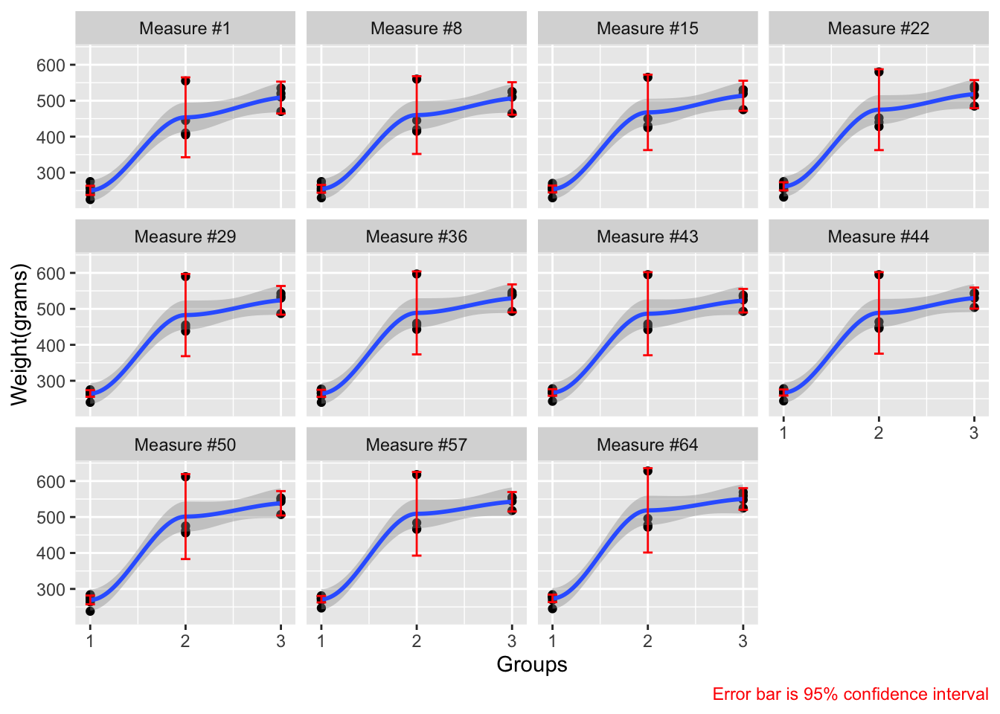

According to the scatter plot above, as groups change, the weight statistics increases, with group #1 and #2 and #1 and #3 having statistically significant change. This indicates, if our assumption that different levels of nutrition existed across the groups held, we could conclude there is some linear relationships between groups (assumed to reflect different level of nutrition) and weight. 

*(1) Linear relationship between time(days) and weight*

This is quite intuitive since both of the variables are continuous. 


```r
# Summary data with mean and standard error of rats by group and time 
rats.group <- ratslf %>%
  group_by(group, time) %>%
  summarise( mean = mean(weight), se = sd(weight)/sqrt(n()) ) %>%
  ungroup()

# check the data
library(DT)
rats.group %>%  datatable()
```

```{=html}
<div id="htmlwidget-44e268e9bd72ef12e931" style="width:100%;height:auto;" class="datatables html-widget"></div>
<script type="application/json" data-for="htmlwidget-44e268e9bd72ef12e931">{"x":{"filter":"none","vertical":false,"data":[["1","2","3","4","5","6","7","8","9","10","11","12","13","14","15","16","17","18","19","20","21","22","23","24","25","26","27","28","29","30","31","32","33"],["1","1","1","1","1","1","1","1","1","1","1","2","2","2","2","2","2","2","2","2","2","2","3","3","3","3","3","3","3","3","3","3","3"],[1,8,15,22,29,36,43,44,50,57,64,1,8,15,22,29,36,43,44,50,57,64,1,8,15,22,29,36,43,44,50,57,64],[250.625,255,254.375,261.875,264.625,265,267.375,267.25,269.5,271.5,273.75,453.75,460,467.5,475,482.75,488.75,486.5,488.75,501.25,509,518.5,508.75,506.25,513.75,518.25,523.75,529.25,522.75,530,538.25,542.5,550.25],[5.38164041639987,4.62910049886276,4.05734563125063,4.8086139226541,3.90940943658465,4.16619044897648,3.87269516708233,3.60431289271221,5.1478150704935,3.80319414627832,4.39866051039567,34.9031397823558,33.9730285177325,32.945662334618,35.3411940941446,35.9197601142695,36.2591942363129,36.3145976158349,35.6262426683852,37.1289981012146,36.5558932777375,36.8544434227408,13.9006894313436,14.1972708645007,13.1299593804906,12.270391191808,12.5391054970706,12.2022880368123,10.298664962023,9.20144916122817,10.6252450952123,8.5097982741465,9.44611913256797]],"container":"<table class=\"display\">\n  <thead>\n    <tr>\n      <th> <\/th>\n      <th>group<\/th>\n      <th>time<\/th>\n      <th>mean<\/th>\n      <th>se<\/th>\n    <\/tr>\n  <\/thead>\n<\/table>","options":{"columnDefs":[{"className":"dt-right","targets":[2,3,4]},{"orderable":false,"targets":0}],"order":[],"autoWidth":false,"orderClasses":false}},"evals":[],"jsHooks":[]}</script>
```

```r
#create an object that saves dodge position so that point and line dodge 
#simultaneously (for preventing overlap)

dodgeposition <- position_dodge(width = 0.3)

# Plot the mean profiles
rats.group %>% 
  ggplot(aes(x = time, 
             y = mean, 
             shape = group,
             color = group)) +
  geom_line(position = dodgeposition) + #dodge to avoid overlap
  geom_point(size=3, position = dodgeposition) +#dodge to avoid overlap
  scale_shape_manual(values = c(16,2,5)) + #set scale shape manually
  geom_errorbar(aes(ymin=mean-2*se, ymax=mean+2*se), 
                width=0.5, #set width of error bar
                position =dodgeposition) +#dodge to avoid overlap
  theme(legend.position = c(0.9,0.5),
        panel.background = element_rect(fill = "white",
                                        color = "black"),
        panel.grid = element_line(color = "grey",
                                  size = 0.1),
        axis.text = element_text(size = 10),
        axis.title = element_text (size = 13),
        plot.title = element_text(size = 15,
                                  face = "bold")) + 
  labs(title = "Fig 1.4.1(b) change of weight statistics (mean±sd) over time",
       x = "Time(days)",
       y = "mean(bprs) +/- 2×se(bprs)")
```

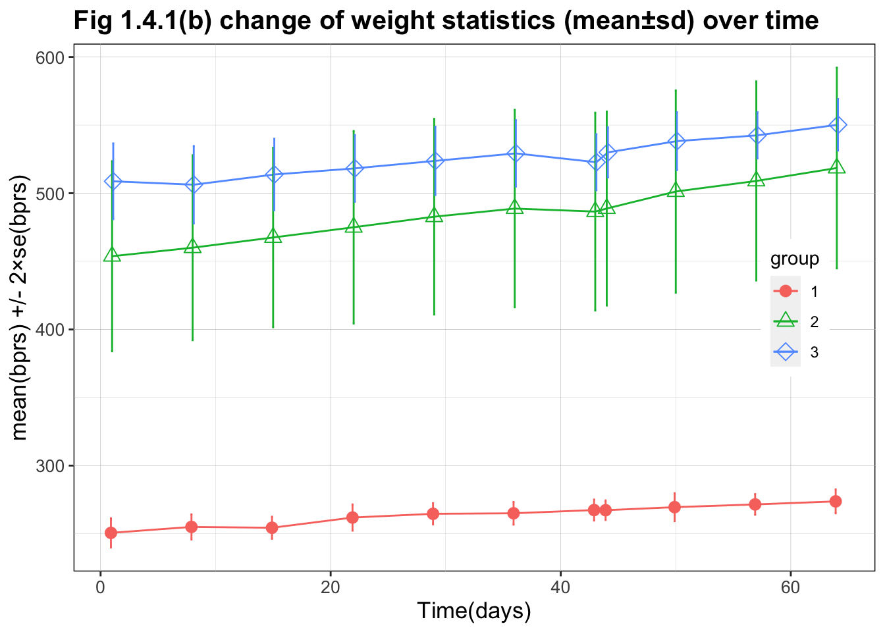

It is observed that over time, the weight of rats, on average, is increasing, albeit the relatively limited effect reflected by the near-to-flat slope. However, rats differed tremendously in weight when starting out at baseline (week 1). 

According to the checks above I would say the assumption of linearity is somewhat met. Linear regression can be used to fit the model. My preliminary hypothesis is different types of nutrition diet will contribute differently to the weight increase of the rats, even after adjusting for the effect of different weight at baseline. I will use linear regression to fit the model, and adjust for baseline effect by adding weight at baseline as a co-variate. Please see section 1.5.1.

Next, I need to decide--do I need to consider random effect in my model and is my data appropriate for a random model. I will do it in the next section 1.4.2.

#### 1.4.2 Check if random effect is approporiate for the data (section 1.4.2 is outside the requirement of assignment. Please go to section 2 if you're not interested)

Before carrying out appraoch two, I need to check if the rats are really starting out differently in weight (random intercept) and if rats with different baseline have different trajectory of gaining weight (random slope). I need also to reflect if mixed-model is really a proper choice for my hypothesis.

##### 1.4.2.1 Graphical display of measures by individual

Another way to deal with different starting-out effect is by introducing random intercept into my model. In the context of our data, random intercepts assume that some rats are more and some less heavy in weight at baseline, resulting in different intercepts. It is also reasonable to check if rats with different baseline weight would gain weights differently (random slope). As such, it is helpful to display my data in a by-individual manner. 


```r
#Access the package ggplot2
library(ggplot2)
#generate labels for the panel graph
group.labs <- sapply(1:3, function(x)paste("Treatment #", x, sep = ""))
names(group.labs) <- 1:3

# Draw the plot
p1 <- ggplot(ratslf, aes(x = time, y = weight, group = ID, color = group)) +
  geom_line()+
  geom_point()+
  labs(title = "Fig. 1.4.2.1(a) Change of weight by groups and rats in one graph",
       x = "Time (days)",
       y = "Weight (grams)")+
  theme(plot.title = element_text(size = 12, face = "bold"),
        panel.background = element_rect(fill = "white",
                                        color = "black"),
        panel.grid.major = element_line(color = "grey", size = 0.2),
        panel.grid.minor = element_line(color = "grey", size = 0.2),
        strip.background = element_rect(color = "black",#adjust the strips aes
                                        fill = "steelblue"),
        strip.text = element_text(size =10, 
                                  color = "white"),
        legend.position = "none")+
  facet_wrap(~group,
             labeller = labeller(group = group.labs))
p1
```

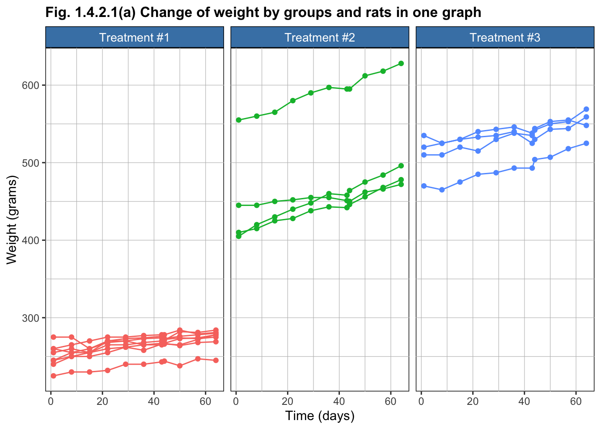

It is interesting to find out that rats might have a lot of variability in weight when starting out. However, some lines overlaps each other, which prevents a decisive conclusion. I will wrap the line chart into multiple graphs, one representing one rat.


```r
#generate more explicit labels to show on each facet of graph
rats.labs <- sapply(1:16, function(x)paste("Rat #", x, sep = ""))
names(rats.labs) <- c(1:16)

#plot it 
p2 <- ggplot(ratslf, aes(x = time, y = weight, group = ID, color = group)) +
  geom_line(size = 1)+
  geom_point()+
  facet_wrap(~ID, #wrap by ID
             labeller = labeller(ID = rats.labs))+ #apply the label generated
  scale_x_continuous(name = "Time (days)", 
                     breaks = seq(0, 60, 20)) + #set x scale values manually 
  theme(legend.position = "none",
        panel.grid.major = element_blank(), #get rid of the ugly grids
        panel.grid.minor = element_blank(),
        panel.background = element_rect(fill = "white",#adjust the background
                                        color = "black"),
        strip.background = element_rect(color = "black",#adjust the strips aes
                                        fill = "steelblue"),
        strip.text = element_text(size =12, 
                                  color = "white"), #adjust the strip text
        axis.title.x = element_text(size = 20), #adjust the x text
        axis.title.y = element_text(size = 20), # adjust the y text
        plot.title = element_text(size = 22, face = "bold"),#adjust the title
        axis.text.x = element_text(size = 12),#adjust size of x axis text
        axis.text.y = element_text(size = 12),#adjust size of y axis text
        plot.caption = element_text(color = "red", size = 15))+  
  labs(title = "Fig. 1.4.2.1(b) Change of weight by groups and rats in panel graph",
       caption = "Colors of lines indicate different nutrition groups")
p2
```

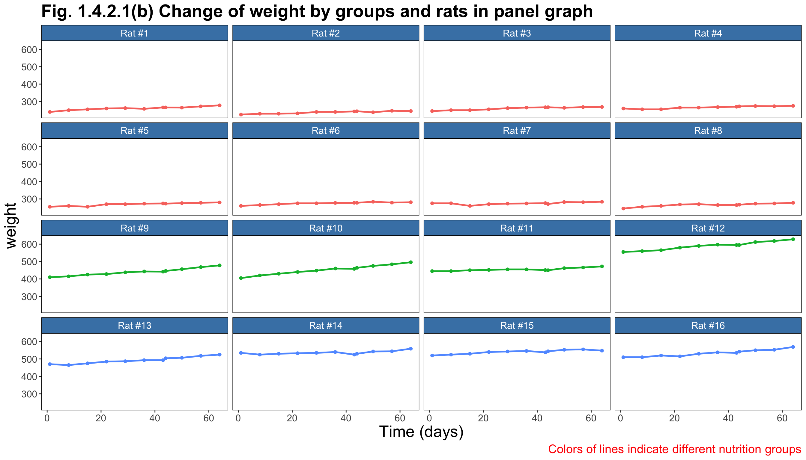

Now according to the graph above it is crystal clear that rats have a lot of variability in weight when starting out. For example, rats from the first and second rows of the graph started very light in weight, while rats from the third and fourth rows started heavier. This justifies an adoption of random intercept model to account for this variability. However, the general trend in weight is upward over time as we would expect and the individual rat only vary very slightly in trajectory. Following the rule of parsimony, I will adopt a random intercept only model. 

##### 1.4.2.2 Theoretical reflection of the appropriateness in adopting random intercept model

According to an outside material _Data Analysis in R_ (https://bookdown.org/steve_midway/DAR/random-effects.html#should-i-consider-random-effects), one should consider the following question to check if random effect is necessary to consdier. They are:

*(1) Can the factor(s) be viewed as a random sample from a probability distribution?*

Both the individual rat and each nutrition diet used for the analysis are not population of the possible choices and could be viewed as a random sample from a probability distribution. So the answer is yes.

*(2) Does the intended scope of inference extend beyond the levels of a factor included in the current analysis to the entire population of a factor? *

Of course. I want to use the rats in data to extrapolate the rats out there in the world, and I want to use the types of diet to extrapolate the diets of larger number of choices(perhaps base on their trends in nutrition type or level).

*(3) Are the coefficients of a given factor going to be modeled?*

Yes, variable "group" is a factor and is going to be modeled. 

*(4)Is there a lack of statistical independence due to multiple observations from the same level within a factor over space and/or time?*

Yes, I have multiple observations from the same diet group within a factor "ID" (rats) over time (days). There is a lack of statistical independence among these observations from same rats.

These done, I am confidently going to account for random effects(random intercept) for my linear model.

##### 1.4.2.3  Plan for ajusting the influence of baseline weight for each appraoch

My preliminary hypothesis is--different types of nutrition diet will contribute differently to the weight increase of the rats, even after adjusting for the effect of different weight at baseline. (see 1.4.1). 

In approach one (aggregated approach), the baseline effect will be adjusted by adding the baseline into the model formula as a co-variate, so that the variability components explained by baseline could be correctly assigned to a variable recording baseline weight, and the the net variability explained by types of nutrition diet will be revealed. 

In approach one (aggregated approach), the adjustment will be made possible by introducing random intercept into our model instead of adjusting for baseline weight. Adjustment approach assigns part of the variability to the difference in baseline; while random intercept per rat allows us to gain information about the individual rat, while recognizing the uncertainty with regard to the overall average that we were underestimating before. Mathematically, this is made possible by allowing the fitted line of each rat to be vertically shifted by their own customized amount. 
 
## 2  Testing the effect of different nutrition diet on weight of rats using two approaches

### 2.1 Aggregated approach

#### 2.1.1 Removing out-liers

Outliers may have a strong influence over the fitted slope and intercept, giving a poor fit to the bulk of the data points. Outliers tend to increase the estimate of residual variance, lowering the chance of rejecting the null hypothesis. Before performing each approach, I will check and, if there is any, remove the outliers in the data.


```r
#generate a summary data by group and ID with mean as the 
#summary variable (ignoring baseline day 1)
rats.clean <- ratslf %>%   
  filter(time > 1) %>%
  group_by(group, ID) %>%
  summarise( mean=mean(weight) ) %>%
  ungroup()
#check the dataset
rats.clean %>% datatable
```

```{=html}
<div id="htmlwidget-92f6446f0f90ef73a72b" style="width:100%;height:auto;" class="datatables html-widget"></div>
<script type="application/json" data-for="htmlwidget-92f6446f0f90ef73a72b">{"x":{"filter":"none","vertical":false,"data":[["1","2","3","4","5","6","7","8","9","10","11","12","13","14","15","16"],["1","1","1","1","1","1","1","1","2","2","2","2","3","3","3","3"],["1","2","3","4","5","6","7","8","9","10","11","12","13","14","15","16"],[263.2,238.9,261.7,267.2,270.9,276.2,274.6,267.5,443.9,457.5,455.8,594,495.2,536.4,542.2,536.2]],"container":"<table class=\"display\">\n  <thead>\n    <tr>\n      <th> <\/th>\n      <th>group<\/th>\n      <th>ID<\/th>\n      <th>mean<\/th>\n    <\/tr>\n  <\/thead>\n<\/table>","options":{"columnDefs":[{"className":"dt-right","targets":3},{"orderable":false,"targets":0}],"order":[],"autoWidth":false,"orderClasses":false}},"evals":[],"jsHooks":[]}</script>
```


```r
#create a function that automatically detect out-liers
is_outlier <- function(x) {
  return(x < quantile(x, 0.25) - 1.5 * IQR(x) | x > quantile(x, 0.75) + 1.5 * IQR(x))
}

#clearn a new variable "out-lier" to tag outlier weight
rats.clean <- rats.clean %>% 
  group_by(group) %>% 
  mutate(outlier = ifelse(is_outlier(mean), ID, as.factor(NA))) #create outlier label
```


```r
#plot out-lier
rats.clean %>% 
  ggplot(aes(x = group, y = mean)) +
  geom_boxplot() +
  stat_summary(fun = "mean", geom = "point", shape=23, size=4, fill = "red") +
  scale_y_continuous(name = "mean(weight), Time points 2-11")+
  geom_text(aes(label = outlier), na.rm = TRUE, hjust = -0.3)
```

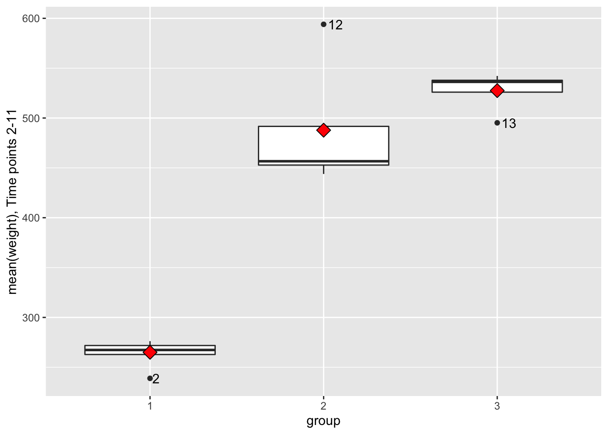

Each of the three group has one out-lier, respectively. Group 2's mean skewed to right, while group 3's mean skewed to the left. 


```r
# Create a new data by filtering the outlier and draw the box plot again
rats.clean <- rats.clean %>% 
  filter(is.na(outlier))

rats.clean %>% 
  ggplot(aes(x = group, y = mean)) +
  geom_boxplot() +
  stat_summary(fun = "mean", geom = "point", shape=23, size=4, fill = "red") +
  scale_y_continuous(name = "mean(weight), Time points 2-11")
```

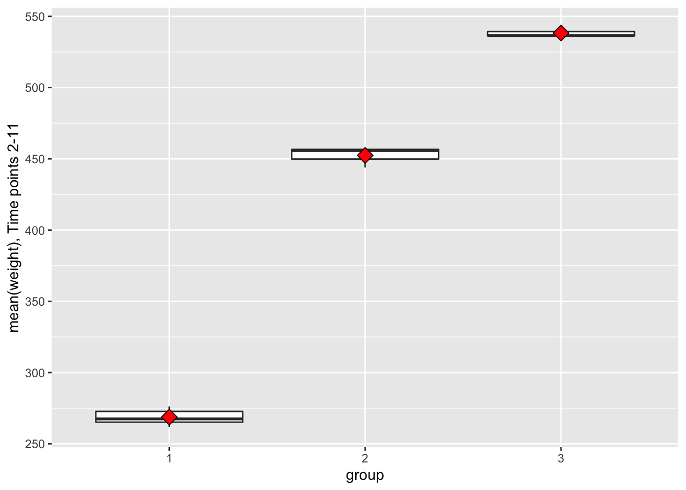

Now the out-liers were removed. The skewness of group 2 and 3 is minimized to some extent.

#### 2.1.2 ANOVA to test the difference among 3 groups

Now that the data has been aggregated with regard to each rat without considering repeated-measurement any longer. A easy-to-do method to detect difference among nutrition diets is ANOVA. 


```r
rats.anova <- aov(mean ~ group, data = rats.clean)
summary(rats.anova)
```

```
##             Df Sum Sq Mean Sq F value   Pr(>F)    
## group        2 176917   88458    2836 1.69e-14 ***
## Residuals   10    312      31                     
## ---
## Signif. codes:  0 '***' 0.001 '**' 0.01 '*' 0.05 '.' 0.1 ' ' 1
```

The null hypothesis that there is no difference in means is rejected (_p_<0.001). There are some difference in the mean of weight across the rats from 3 groups. But it is still unclear which pair of group(s) have significant difference, and post-hoc test for pairwise comparisons will be done.


```r
tukey.test <- TukeyHSD(rats.anova)
tukey.test
```

```
##   Tukey multiple comparisons of means
##     95% family-wise confidence level
## 
## Fit: aov(formula = mean ~ group, data = rats.clean)
## 
## $group
##          diff       lwr       upr p adj
## 2-1 183.64286 173.07885 194.20686     0
## 3-1 269.50952 258.94552 280.07353     0
## 3-2  85.86667  73.36717  98.36617     0
```

From the post-hoc test results, we see that there are statistically significant differences (p < 0.0001) between each pair of groups, indicating differences between group 1 and 2, group 1 and 3 and group 2 and 3 are all significant. However, this is fine except that the different baseline is not sufficiently adjusted. Still linear regression with baseline adjusted is needed, as we discussed. 

#### 2.1.3 Linear regression with baseline adjusted using aggregated data


```r
# Add the baseline from the original data as a new variable to the summary data
rats.clean <- rats.clean %>%
  mutate(outlier = NULL)
rats <- rats %>% mutate(group = as.factor(Group),
                        ID = as.factor(ID))
rats.baseline <- inner_join(rats.clean, rats, by = c("group", "ID")) %>% 
  dplyr::select(group, ID, mean, WD1) %>% 
  mutate(baseline = WD1,
         WD1 = NULL)
```


```r
fit <- lm(mean~group+baseline, data = rats.baseline)
summary(fit)
```

```
## 
## Call:
## lm(formula = mean ~ group + baseline, data = rats.baseline)
## 
## Residuals:
##     Min      1Q  Median      3Q     Max 
## -6.6341 -2.8915  0.1102  2.0096  7.8989 
## 
## Coefficients:
##             Estimate Std. Error t value Pr(>|t|)    
## (Intercept) 221.3094    28.3120   7.817 2.66e-05 ***
## group2      152.7218    18.7452   8.147 1.91e-05 ***
## group3      219.6183    29.9107   7.342 4.36e-05 ***
## baseline      0.1866     0.1111   1.680    0.127    
## ---
## Signif. codes:  0 '***' 0.001 '**' 0.01 '*' 0.05 '.' 0.1 ' ' 1
## 
## Residual standard error: 5.136 on 9 degrees of freedom
## Multiple R-squared:  0.9987,	Adjusted R-squared:  0.9982 
## F-statistic:  2236 on 3 and 9 DF,  p-value: 3.048e-13
```


```r
# Compute the analysis of variance table for the fitted model with anova()
anova(fit)
```

```
## Analysis of Variance Table
## 
## Response: mean
##           Df Sum Sq Mean Sq   F value    Pr(>F)    
## group      2 176917   88458 3353.2062 1.181e-13 ***
## baseline   1     74      74    2.8219    0.1273    
## Residuals  9    237      26                        
## ---
## Signif. codes:  0 '***' 0.001 '**' 0.01 '*' 0.05 '.' 0.1 ' ' 1
```

The results show after adjusting for baseline effect, comparing to nutrition group 1, the weight change of rats from nutrition group 2 and nutrition group 3 are significantly higher. Specifically, the rats have an average weight of 221.3094 at time point 2. Changing from group 1 to group 2 would cause a rat to increase, on average, 152.72 grams in weight; while changing from group 1 to group 3 would cause a rat to increase, on average 219.62 grams in weight. Overall, the model explains 99.82 variability of rats' weight.

### 2.2 Disagregated approach  with random intercept (section 2.2 is outside the requirement of assignment. Please skip this part and go to next section if you're not interested)

#### 2.2.1 Remove out-liers


```r
#generate a variable 
ratslf.clean <- ratslf %>% 
  group_by(group) %>% 
  mutate(outlier = is_outlier(weight)) %>% 
  ungroup

ratslf.clean <- ratslf.clean %>%
  filter(outlier == F)
```

#### 2.2.2 Fit a random intercept model

Weight will be modeled as a function of time and group (nutrition diet type), knowing that different rats have different weights at baseline.


```r
# access library lme4
library(lme4)#install.packages("lme4")

# Create a random intercept model
rats.ri <- lmer(weight ~ time + group + (1 | ID), 
                data = ratslf.clean,
                REML = FALSE)
summary(rats.ri)
```

```
## Linear mixed model fit by maximum likelihood  ['lmerMod']
## Formula: weight ~ time + group + (1 | ID)
##    Data: ratslf.clean
## 
##      AIC      BIC   logLik deviance df.resid 
##   1281.7   1300.6   -634.9   1269.7      165 
## 
## Scaled residuals: 
##     Min      1Q  Median      3Q     Max 
## -3.8218 -0.5732  0.0037  0.5265  3.3565 
## 
## Random effects:
##  Groups   Name        Variance Std.Dev.
##  ID       (Intercept) 1003.61  31.680  
##  Residual               60.51   7.779  
## Number of obs: 171, groups:  ID, 16
## 
## Fixed effects:
##              Estimate Std. Error t value
## (Intercept) 244.92521   11.28119   21.71
## time          0.55815    0.03115   17.92
## group2      219.52415   19.45658   11.28
## group3      262.49246   19.45399   13.49
## 
## Correlation of Fixed Effects:
##        (Intr) time   group2
## time   -0.094              
## group2 -0.575  0.004       
## group3 -0.575  0.000  0.333
```

The fixed effects tabulated above shows that starting out, i.e. when time is day 1, the average weight, denoted by the intercept, is 244.92 grams. In addition, as a rat move from group 1 to group2, we can expect its weight to increase by about 219.52 (95% interval: 179.99 to 260.08, see table below) grams; while as a rat move from group 1 to group 3 , we can expect its weight to increase by about 262.49 (95% interval: 221.95 to 303.03, see table below) grams ; as a rat move from one day to the next, its weight is expected to increase by 0.56 (95%CI: 0.50 to 0.62) grams, indicating for the full experiment period, which lasts for 63 days, a rat is expected to have a weight gain of 35.28 grams. Note that in comparison to different groups, the effect of time change per day is way smaller, indicating the appreciable influence of different nutrition diet on weight. 

The random effects tabulated above shows that weight bounces around by a standard deviation of 31.68 grams. In other words, even after making a prediction based on time and group, each rat has their own unique deviation of 31.68 grams. Note that in comparison to the different group, this effect of baseline is much smaller. For example, a rat changing from group 1 to group 3 would experience, on average, roughly 8 times more weight gain than moving from one rat to another, on average. 


```r
confint(rats.ri)
```

```
##                   2.5 %      97.5 %
## .sig01       23.1500615  46.9509030
## .sigma        6.9868343   8.7320431
## (Intercept) 221.4294186 268.4055728
## time          0.4966869   0.6195619
## group2      178.9897984 260.0825000
## group3      221.9497787 303.0339594
```

#### 2.2.3 Interclass correlation coefficient

Inter-class correlation coefficient (ICC) is an indicator for how much group-specific information is available for a random effect to help with. It has a range of 0~1 and the closer to 1, the better. 

$$
ICC=\frac{\sigma_{a}^{2} }{\sigma_{a}^{2}+\sigma^{2}}
$$

In our mixed model with a random intercept,  ICC is hence calculated as 1003.61/(1003.61+60.51)= 94%, which is very high and strongly suggestive that there is within-individual variability that would benefit from a random effect. 

#### 2.2.4 Display the random intercept effects

The following plot is the estimated random effects for each rat and their interval estimate.  Random effects are assumed to be normally distributed with a mean of zero, shown by the horizontal line. Intervals that do not include zero are in bold. In this case, such rats are relatively higher or lower starting out compared to a typical rat. However, the number of rats with higher baseline weight (n=4) is much smaller than those with lower baseline weight (n=4), indicating the assumption is somewhat violated. In this case, random intercept model is not a robust estimator of the effect and results should be interpreted with caution. 


```r
library(merTools)
plotREsim(REsim(rats.ri))
```

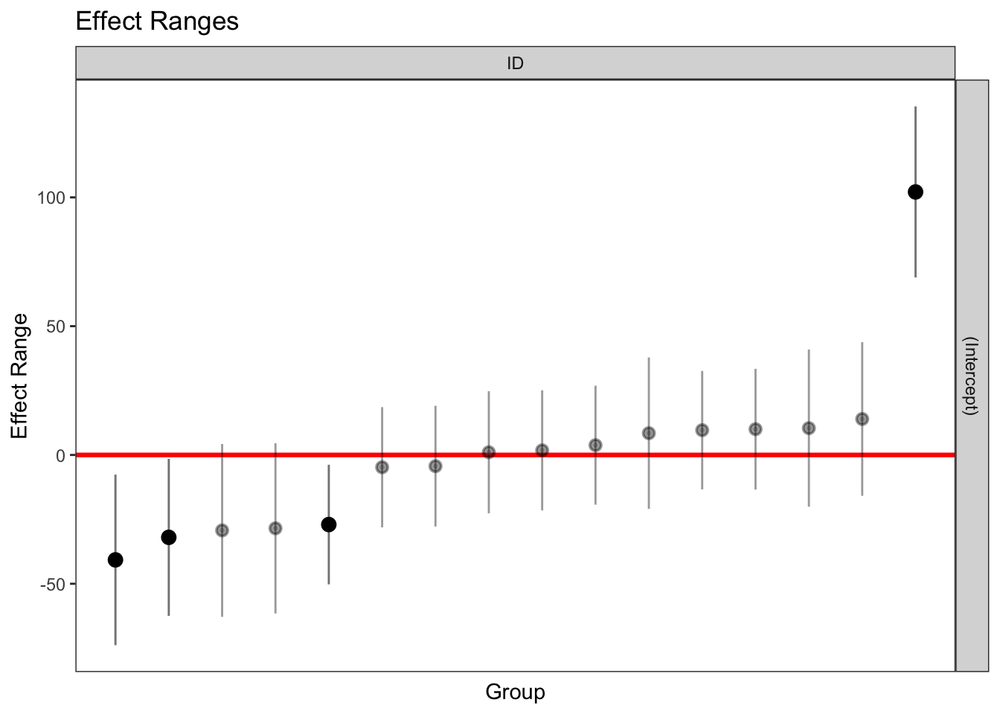

I will further generate a density plot for the by-individual estimates of intercept. Normally, it should be normally distributed. If not, it indicates random intercept model is not a robust estimator of the effect. 


```r
#get the by-individual intercepts and pass into an object "re"
re <-  ranef(rats.ri)$ID
#generate density plot
qplot(x = `(Intercept)`, geom = 'density',  data = re)
```

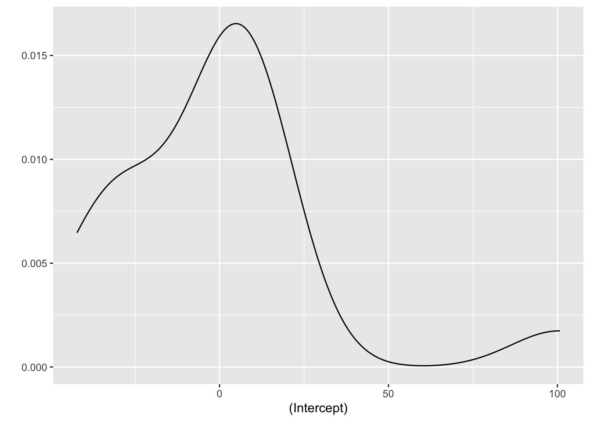

The density plot is notably skewed, indicating the rats might not be a random sample of rats in nature. This will bias the estimation from random intercept model and the results should be interpreted with caution.

## 3 Summary

a. In this exercise, I tested the hypothesis that different nutrition diets would lead to different weight change of rats.

b. The hypothesis is tested using two approach--aggregated and disagregated approaches. The former corresponds to the requirement of the current assignment.

c. Although the aggregated approach ignores within-rat variation, which is dangerous in terms of information and power loss, the model built upon this approach is quite good, detecting the baseline effect does significantly influence weight, and also explaining more than 90% of variability. However, we should also take note this goodness of fit is achieved by ignoring important information in a way we’re not actually modeling any of the observed data, but rather we are modeling means or averages of the data. If these information were brough back, the goodness might also be compromised. 

d. It is worth noting that the disaggregated approach with random intercept does provide more information and more extrapolative results. For example, via this approach I get the idea how much individual rat's weight at baseline would influence the weight change and could draw conclusion for a larger population of rats out there.

f. Random slope is not included in the model since I do not find evidence that different starting weight leads to different trajectory of weight change. 

g. One of the assumptions for mixed-model that the intercept should normally distribute around a mean of 0 is violated. We should as such interpret the results with caution. 


# Part II: Implement the analyses of Chapter 9 of MABS using BPRS data

## 1 Preparation

### 1.1 Read the dataset


```r
#read the wide format dataset
bprs <- read.csv("data/bprs.csv")#I prefer lower case object name for typing                                            # convenience
#read the long format dataset
bprsl <- read.csv("data/bprsl.csv")#"l" is for long format

#delete the redundant X variable, which are the row names.
bprs <- bprs[-1]
bprsl <- bprsl[-1]
```

### 1.2 Factor the categorical variables

R does not recognize categorical variables automatically as factors. I will do manually that here.


```r
library(tidyverse)
#for wide format dataset
bprsf <- bprs %>% mutate(treatment = factor(treatment),
                         subject = factor(subject)) 
#for long format dataset
bprslf <- bprsl %>% mutate(treatment = factor(treatment),
                         subject = factor(subject)) 
```


### 1.3 Check the wide format dataset

In longitudinal study, data are usually analyzed in wide format, so that variables carrying same indicators for different clusters (e.g. time points) could enter model as one parameter. To distinguish values from different clusters, another variable is generated for labeling the identity of clusters. For the reason, I will only analyze the long format dataset and check if the frame corresponds to the above-mentioned idea.


```r
library(tidyverse)
#check names 
names(bprslf)
```

```
## [1] "treatment" "subject"   "week"      "rating"
```

```r
#check dimension

dim(bprslf)
```

```
## [1] 360   4
```

```r
#check variable types
sapply(bprslf, function(x)class(x))
```

```
## treatment   subject      week    rating 
##  "factor"  "factor" "integer" "integer"
```

```r
#check variable levels and frequency of each level for factors
bprslf %>% count(treatment, subject)
```

```
##    treatment subject n
## 1          1       1 9
## 2          1       2 9
## 3          1       3 9
## 4          1       4 9
## 5          1       5 9
## 6          1       6 9
## 7          1       7 9
## 8          1       8 9
## 9          1       9 9
## 10         1      10 9
## 11         1      11 9
## 12         1      12 9
## 13         1      13 9
## 14         1      14 9
## 15         1      15 9
## 16         1      16 9
## 17         1      17 9
## 18         1      18 9
## 19         1      19 9
## 20         1      20 9
## 21         2       1 9
## 22         2       2 9
## 23         2       3 9
## 24         2       4 9
## 25         2       5 9
## 26         2       6 9
## 27         2       7 9
## 28         2       8 9
## 29         2       9 9
## 30         2      10 9
## 31         2      11 9
## 32         2      12 9
## 33         2      13 9
## 34         2      14 9
## 35         2      15 9
## 36         2      16 9
## 37         2      17 9
## 38         2      18 9
## 39         2      19 9
## 40         2      20 9
```

```r
#check the descriptive statistics for numeric variable
library(finalfit)
bprslf %>% select_if(is.numeric) %>% 
  ff_glimpse()
```

```
## $Continuous
##         label var_type   n missing_n missing_percent mean   sd  min quartile_25
## week     week    <int> 360         0             0.0  4.0  2.6  0.0         2.0
## rating rating    <int> 360         0             0.0 37.7 13.7 18.0        27.0
##        median quartile_75  max
## week      4.0         6.0  8.0
## rating   35.0        43.0 95.0
## 
## $Categorical
## data frame with 0 columns and 360 rows
```

According to the checks above，there are one by-individual identifier "subject", which is a factor; two by-cluster identifier "treatment" and "week", which are factor and numeric, respectively; one by-observation measurement "rating", which is numeric. The frequency table reveals that there are 2 types of treatments, each with 180 individual measurement; there are 20 participants for each treatment, and each participant was measured 9 times (the first measurement for each participant is baseline before treatment), resulting in 360 measurements. According to the descriptive statistics for rating, the participants, irrespective of treatment and time effects, have a rating of 37.7±13.7. No missing values is present in the data.


```r
head(bprslf)
```

```
##   treatment subject week rating
## 1         1       1    0     42
## 2         1       2    0     58
## 3         1       3    0     54
## 4         1       4    0     55
## 5         1       5    0     72
## 6         1       6    0     48
```


### 1.4 Determine sensible model for the data 

#### 1.4.1 Hypothesis

In the data, the variable I am interested in is "rating" (brief psychiatric rating scale). The reasons are _a._ it is a numeric variable and hence carries more information than factors; _b._ it is the only variable that varies across all the observations; _c._ Digging into how types of treatments would influence psychiatric tendency has substantial practical meaning in public health. 

Now that I have chosen a numeric variable "rating" as the dependent variable, linear model is definitely one of the preferred choices for modeling. I will entertain two options. The first option would be to use simple linear regression. In this case BPRS rating scores will be modeled as a function of treatments and time (week) without considering the cluster level (individual-level) information. In other words, I will adopt a fixed effect model. But before a decision, I should check if there is any potential linear relationship between rating and the one of predictors "week". This will be done in section 1.4.1.1.

A second approach to modeling this data is to model the rating as a function of treatment and time (week), while also include the cluster-level (individual-level) information. In other words, I will adopt a mixed effect model. But before a decision, I should check if participants are starting out differently and having different trajectory of rating change over this 9 weeks, and also reflect on some important assumptions for using mixed model. This will be done in section 


#### 1.4.2 Check linearity

This is quite intuitive since both of the variables are continuous. 

*(1) by-participant BPRS rating and week relationship*


```r
treatment.lab <- c("Treatment #1", "Treatment #2")
names(treatment.lab) <- c(1,2)
ggplot(bprslf, aes(x = week, y = rating, group = subject, color = subject)) +
  geom_line()+
  facet_wrap(~treatment, labeller = labeller(treatment = treatment.lab))+
  theme(legend.position = "none",
        panel.grid = element_line(color = "grey", size = 0.1),
        panel.background = element_rect(color = "black",
                                        fill = "white"),
        strip.background = element_rect(color = "black",
                                        fill = "steelblue"),
        strip.text = element_text(color = "white",
                                  face = "bold",
                                  size = 10),
        axis.title  = element_text(size = 12),
        axis.text = element_text(size = 10))+
  labs(title = "Fig 1.4.2 (a) treatment effect over week by individual",
       x = "Time (weeks)",
       y = "BPRS rating")
```

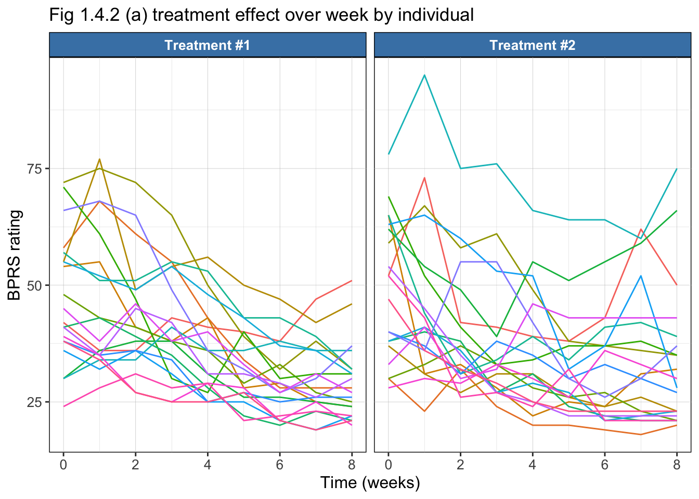

*(2) average BPRS rating (denoted by mean±2sd) and week relationship*


```r
# Summary data with mean and standard error of participants by treatment and week 
bprs.group <- bprslf %>%
  group_by(treatment, week) %>%
  summarise( mean = mean(rating), se = sd(rating)/sqrt(n()) ) %>%
  ungroup()

# check the data
bprs.group %>%  datatable()
```

```{=html}
<div id="htmlwidget-c866ade5582ff824c9d4" style="width:100%;height:auto;" class="datatables html-widget"></div>
<script type="application/json" data-for="htmlwidget-c866ade5582ff824c9d4">{"x":{"filter":"none","vertical":false,"data":[["1","2","3","4","5","6","7","8","9","10","11","12","13","14","15","16","17","18"],["1","1","1","1","1","1","1","1","1","2","2","2","2","2","2","2","2","2"],[0,1,2,3,4,5,6,7,8,0,1,2,3,4,5,6,7,8],[47,46.8,43.55,40.9,36.6,32.7,29.7,29.8,29.3,49,45.85,39.85,37.4,36.1,32.4,32.75,34.6,33.55],[3.04181386329725,3.47062864015941,2.68570778674626,2.51197133741609,2.18656182889461,1.7412941345901,1.71541003230929,1.71003231733081,1.84832783603821,3.33719075050605,3.91237913887647,2.919332115399,3.04648200906865,2.75384898106747,2.39670826892131,2.73272083424098,3.16094589440699,3.39850973531821]],"container":"<table class=\"display\">\n  <thead>\n    <tr>\n      <th> <\/th>\n      <th>treatment<\/th>\n      <th>week<\/th>\n      <th>mean<\/th>\n      <th>se<\/th>\n    <\/tr>\n  <\/thead>\n<\/table>","options":{"columnDefs":[{"className":"dt-right","targets":[2,3,4]},{"orderable":false,"targets":0}],"order":[],"autoWidth":false,"orderClasses":false}},"evals":[],"jsHooks":[]}</script>
```

```r
#create an object that saves dodge position so that point and line dodge 
#simultaneously (for preventing overlap)

dodgeposition <- position_dodge(width = 0.3)

# Plot the mean profiles
bprs.group %>% 
  ggplot(aes(x = week, 
             y = mean, 
             shape = treatment,
             color = treatment)) +
  geom_line(position = dodgeposition) + #dodge to avoid overlap
  geom_point(size=3, position = dodgeposition) +#dodge to avoid overlap
  scale_shape_manual(values = c(16,2,5)) + #set scale shape manually
  geom_errorbar(aes(ymin=mean-2*se, ymax=mean+2*se), 
                width=0.5, #set width of error bar
                position =dodgeposition) +#dodge to avoid overlap
  theme(legend.position = c(0.9,0.8),
        panel.background = element_rect(fill = "white",
                                        color = "black"),
        panel.grid = element_line(color = "grey",
                                  size = 0.1),
        axis.text = element_text(size = 10),
        axis.title = element_text (size = 13),
        plot.title = element_text(size = 15,
                                  face = "bold")) + 
  labs(title = "Fig 1.4.2 (b) change of rating statistics (mean±sd) over time",
       x = "Time(weeks)",
       y = "mean(bprs) +/- 2×se(bprs)")
```

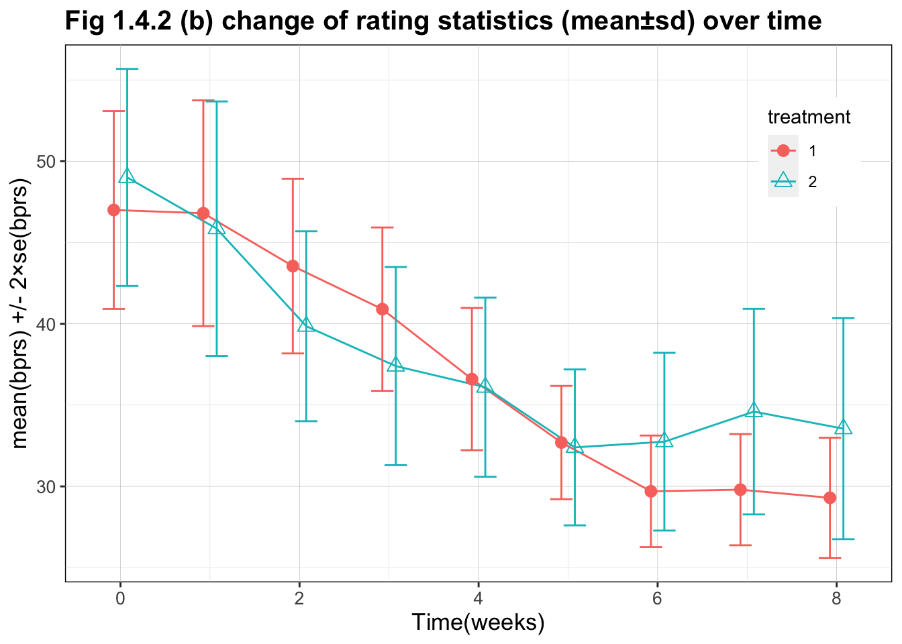

It is observed that over time, the BPRS rating of participants, on average, is decreasing. However, individual participants differed tremendously in the rating when starting out at baseline (week 0), and also differed greatly in the trajectory.

According to the checks above I would say the assumption of linearity is somewhat met. Linear regression can be used to fit the model. My preliminary hypothesis is different types of treatment will contribute differently to the BPRS rating decrease, even after adjusting for the effect of different BPRS rating at baseline. I will use linear regression to fit the model, using treatment and week as predictors. Please see section 1.5.1 (below).

Next, I need to decide--do I need to consider random effect in my model and is my data appropriate for a random model. 

#### 1.4.3 Check if random effect is approporiate for the data 

*(1) Graphical display of measures by individual*

Another way to deal with different starting-out effect is by introducing random effect including random intercept and slope into my model. In the context of our data, random intercepts assume that some individual participants are more and some less severe in psychiatric in terms of BPRS rating at baseline, resulting in different intercepts. It is also reasonable to check if participants with different baseline BPRS rating would react differently to the different treatment (random slope). As such, it is helpful to display my data in a by-individual manner. 


```r
#generate more explicit labels to show on each facet of graph
participant.labs <- sapply(1:20, function(x)paste("Participant #", x, sep = ""))
names(participant.labs) <- c(1:20)

#plot it 
bprslf %>% 
  filter (treatment == 1) %>% 
  ggplot(aes(x = week, y = rating, group = subject)) +
  geom_line(size = 1, color = "coral")+
  geom_point()+
  facet_wrap(~subject, #wrap by subject
             labeller = labeller(subject = participant.labs))+ #apply the label generated
  scale_x_continuous(name = "Time (weeks)") + #set x scale values manually 
  theme(legend.position = "none",
        panel.grid.major = element_blank(), #get rid of the ugly grids
        panel.grid.minor = element_blank(),
        panel.background = element_rect(fill = "white",#adjust the background
                                        color = "black"),
        strip.background = element_rect(color = "black",#adjust the strips aes
                                        fill = "steelblue"),
        strip.text = element_text(size =12, 
                                  color = "white"), #adjust the strip text
        axis.title.x = element_text(size = 20), #adjust the x text
        axis.title.y = element_text(size = 20), # adjust the y text
        plot.title = element_text(size = 22, face = "bold"),#adjust the title
        axis.text.x = element_text(size = 12),#adjust size of x axis text
        axis.text.y = element_text(size = 12),#adjust size of y axis text
        plot.caption = element_text(color = "red", size = 15))+  
  labs(title = "Fig. 1.4.3 (a) Change of BPRS rating by participants for treatment #1 in panel graph",
       y = "BPRS rating")
```

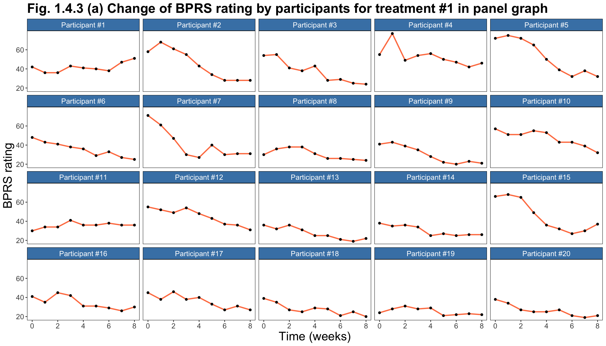


```r
#plot it 
bprslf %>% 
  filter (treatment == 2) %>% 
  ggplot(aes(x = week, y = rating, group = subject)) +
  geom_line(size = 1, color = "coral")+
  geom_point()+
  facet_wrap(~subject, #wrap by subject
             labeller = labeller(subject = participant.labs))+ #apply the label generated
  scale_x_continuous(name = "Time (weeks)") + #set x scale values manually 
  theme(legend.position = "none",
        panel.grid.major = element_blank(), #get rid of the ugly grids
        panel.grid.minor = element_blank(),
        panel.background = element_rect(fill = "white",#adjust the background
                                        color = "black"),
        strip.background = element_rect(color = "black",#adjust the strips aes
                                        fill = "steelblue"),
        strip.text = element_text(size =12, 
                                  color = "white"), #adjust the strip text
        axis.title.x = element_text(size = 20), #adjust the x text
        axis.title.y = element_text(size = 20), # adjust the y text
        plot.title = element_text(size = 22, face = "bold"),#adjust the title
        axis.text.x = element_text(size = 12),#adjust size of x axis text
        axis.text.y = element_text(size = 12),#adjust size of y axis text
        plot.caption = element_text(color = "red", size = 15))+  
  labs(title = "Fig. 1.4.3 (b) Change of BPRS rating by participants for treatment #2 in panel graph",
       y = "BPRS rating")
```

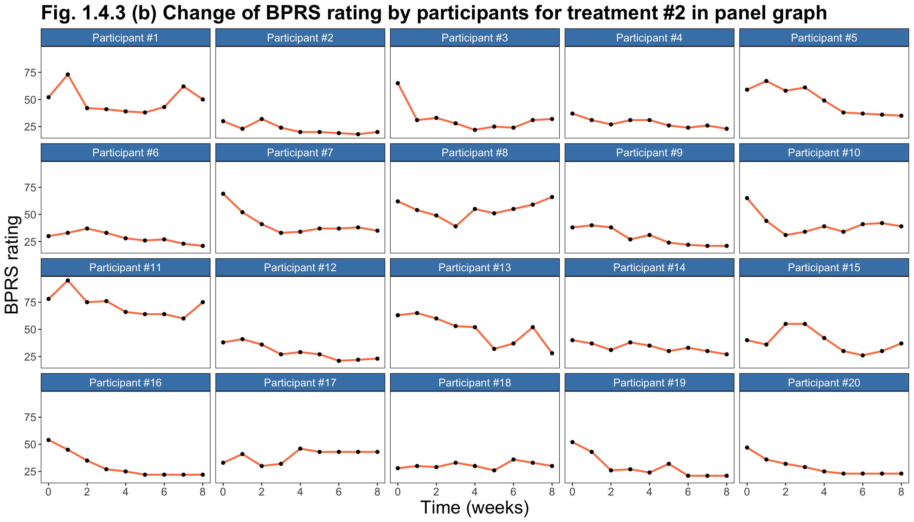

Now according to the graph above it is clear that participants have a lot of variability in weight when starting out. For example, at baseline of week 0, participant #11 from treatment #1 has a very low BPRS rating of around 30 (see fig 1.4.3 a), while participant #11 from treatment #2 has a much higher BPRS rating of around 75  (see fig 1.4.3 b).

Additionally, although the general trend in weight is downward over time as we would expect,  individual participants vary very tremendously in trajectory, for example, participant #16 from treatment #2 experienced a stable decrease of the rating over the period of 8 weeks, while participant #1 from treatment #2 underwent two big worsening and fluctuating of ratings  (see fig 1.4.3 b). 

*(2) Theoretical reflection of the appropriateness in adopting mixed model*

According to an outside material _Data Analysis in R_ (https://bookdown.org/steve_midway/DAR/random-effects.html#should-i-consider-random-effects), one should consider the following question to check if random effect is necessary to consider. They are:

*a. Can the factor(s) be viewed as a random sample from a probability distribution?*

Both the individual participant and the relationship between participants' different baseline and treatments could be viewed as a random sample from a probability distribution. So the answer is yes.

*b. Does the intended scope of inference extend beyond the levels of a factor included in the current analysis to the entire population of a factor? *

Of course. I want to use participant in data to extrapolate the trends of a larger population. and the two treatments in the study can be viewed as a sample of underlying treatments which is not represented in the model.

*c. Are the coefficients of a given factor going to be modeled?*

Yes, variable "subject" is a factor and is going to be modeled. Furthermore, it has 40 levels (20 for each treatments), which will provide considerable cluster-level information 

*d. Is there a lack of statistical independence due to multiple observations from the same level within a factor over space and/or time?*

Yes, I have 9 observations receiving a same treatment within a factor "subject" (participant) over a period of 9 weeks. There is a lack of statistical independence among these observations.

These done, I am confidently going to account for random effects(random intercept and slope) for my linear model. 

## 2. Fitting the model using fixed-effect and random-effect respectively

### 2.1 wrangling

Variable subject uses number 1 to 20 twice denoting different individual participant receiving two treatments, hence same number does not necessarily mean same participant. This might cause problem in the mixed-effect modeling since participant indexing will be included in model. I will convert it here. 


```r
bprslf <- bprslf %>% 
  mutate(subject = as.numeric(subject), #convert to numeric for math conversion
         subject.treatment2 = subject +20) %>% #create temporary variable 21, 22...
  mutate(subject.new = 
           case_when ((treatment == 1)~subject,  #treatment 1 uses old indexing
                      (treatment == 2)~subject.treatment2) # treatment 2 uses new
         )
                     
                                  
  
bprslf <- bprslf %>% 
  mutate(subject = NULL, #remove old subject
         subject.treatment2 = NULL, #remove tempo variable
         subject = subject.new %>% factor()) #save new subject as subject, factor it 


bprslf$subject #check if subject's levels grow from 20 to 40.
```

```
##   [1] 1  2  3  4  5  6  7  8  9  10 11 12 13 14 15 16 17 18 19 20 21 22 23 24 25
##  [26] 26 27 28 29 30 31 32 33 34 35 36 37 38 39 40 1  2  3  4  5  6  7  8  9  10
##  [51] 11 12 13 14 15 16 17 18 19 20 21 22 23 24 25 26 27 28 29 30 31 32 33 34 35
##  [76] 36 37 38 39 40 1  2  3  4  5  6  7  8  9  10 11 12 13 14 15 16 17 18 19 20
## [101] 21 22 23 24 25 26 27 28 29 30 31 32 33 34 35 36 37 38 39 40 1  2  3  4  5 
## [126] 6  7  8  9  10 11 12 13 14 15 16 17 18 19 20 21 22 23 24 25 26 27 28 29 30
## [151] 31 32 33 34 35 36 37 38 39 40 1  2  3  4  5  6  7  8  9  10 11 12 13 14 15
## [176] 16 17 18 19 20 21 22 23 24 25 26 27 28 29 30 31 32 33 34 35 36 37 38 39 40
## [201] 1  2  3  4  5  6  7  8  9  10 11 12 13 14 15 16 17 18 19 20 21 22 23 24 25
## [226] 26 27 28 29 30 31 32 33 34 35 36 37 38 39 40 1  2  3  4  5  6  7  8  9  10
## [251] 11 12 13 14 15 16 17 18 19 20 21 22 23 24 25 26 27 28 29 30 31 32 33 34 35
## [276] 36 37 38 39 40 1  2  3  4  5  6  7  8  9  10 11 12 13 14 15 16 17 18 19 20
## [301] 21 22 23 24 25 26 27 28 29 30 31 32 33 34 35 36 37 38 39 40 1  2  3  4  5 
## [326] 6  7  8  9  10 11 12 13 14 15 16 17 18 19 20 21 22 23 24 25 26 27 28 29 30
## [351] 31 32 33 34 35 36 37 38 39 40
## 40 Levels: 1 2 3 4 5 6 7 8 9 10 11 12 13 14 15 16 17 18 19 20 21 22 23 ... 40
```

Now I have 40 levels for subject.

### 2.2 fixed-effect model


```r
#fit linear regression model
bprs_lm <- lm(rating ~ week + treatment, data = bprslf, REML = FALSE)

#model summary
summary(bprs_lm)
```

```
## 
## Call:
## lm(formula = rating ~ week + treatment, data = bprslf, REML = FALSE)
## 
## Residuals:
##     Min      1Q  Median      3Q     Max 
## -22.454  -8.965  -3.196   7.002  50.244 
## 
## Coefficients:
##             Estimate Std. Error t value Pr(>|t|)    
## (Intercept)  46.4539     1.3670  33.982   <2e-16 ***
## week         -2.2704     0.2524  -8.995   <2e-16 ***
## treatment2    0.5722     1.3034   0.439    0.661    
## ---
## Signif. codes:  0 '***' 0.001 '**' 0.01 '*' 0.05 '.' 0.1 ' ' 1
## 
## Residual standard error: 12.37 on 357 degrees of freedom
## Multiple R-squared:  0.1851,	Adjusted R-squared:  0.1806 
## F-statistic: 40.55 on 2 and 357 DF,  p-value: < 2.2e-16
```

```r
#confidence interval
confint(bprs_lm)
```

```
##                 2.5 %    97.5 %
## (Intercept) 43.765472 49.142306
## week        -2.766799 -1.774035
## treatment2  -1.991083  3.135527
```

We can see from the above summary that the participants have an average BPRS rating score of 46.45 at baseline. For every new week, they will experience an decrease of rating by 2.27 (95%CI -2.77 to -1.77) from the previous one, on average. The average influence of treatment type is very small at 0.5722, indicating participant will only have an change in rating of 0.58 on average if they moved from one treatment to another ( _t_ = 0.44, _p_ = 0.66). Besides, only 18% of variability is explained by the model.  In other words, the finding of mixed model shows the two types of treatment do not have any influence on BPRS rating, while time has very small influence on the rating.


### 2.3 Random-effect model

#### 2.3.1 Random intercept model

Herein I model the BPRS rating as a function of treatment and time, knowing (including into model the consideration) that people (subjects) have different rating baselines. Note that I do not assume treatment types and different baseline have a relationship here since I am considering random intercept here.


```r
#fit it
bprs_intercept <- lmer(rating ~  week + treatment + (1 | subject), 
                       data = bprslf, 
                       REML = FALSE)
#summarize it
summary (bprs_intercept) 
```

```
## Linear mixed model fit by maximum likelihood  ['lmerMod']
## Formula: rating ~ week + treatment + (1 | subject)
##    Data: bprslf
## 
##      AIC      BIC   logLik deviance df.resid 
##   2582.9   2602.3  -1286.5   2572.9      355 
## 
## Scaled residuals: 
##      Min       1Q   Median       3Q      Max 
## -2.27506 -0.59909 -0.06104  0.44226  3.15835 
## 
## Random effects:
##  Groups   Name        Variance Std.Dev.
##  subject  (Intercept) 97.39    9.869   
##  Residual             54.23    7.364   
## Number of obs: 360, groups:  subject, 40
## 
## Fixed effects:
##             Estimate Std. Error t value
## (Intercept)  46.4539     2.3521  19.750
## week         -2.2704     0.1503 -15.104
## treatment2    0.5722     3.2159   0.178
## 
## Correlation of Fixed Effects:
##            (Intr) week  
## week       -0.256       
## treatment2 -0.684  0.000
```

```r
#show CI
confint(bprs_intercept)
```

```
##                 2.5 %    97.5 %
## .sig01       7.918218 12.645375
## .sigma       6.828332  7.973573
## (Intercept) 41.744598 51.163179
## week        -2.565919 -1.974914
## treatment2  -5.885196  7.029641
```

The fixed effect part of model summary above shows same results of coefficient with standard regression, as would be their interpretation. The standard errors, on the other hand are different here, though in the end our conclusion would be the same as far as statistical significance goes. Note specifically that the standard error for the intercept has increased. This makes sense in that with random aspects included uncertainty with regard to the overall average was more properly estimated (instead of being underestimated).

The random effect part of the summary above shows, on average, BPRS rating bounces around 9.87(95%CI: 41.74 to 51.16) as we move from one participant to another. In other words, even after making a prediction based on time point and treatment, each participant has their own unique deviation, and this deviation is almost 20 times as high as the effect of a different types of treatment, and almost 5 times as high as the effect of time (change from one week to the next).

Although the effect of treatment types is still insignificant, with random intercept model, I get more variations of participants' ratings explained by individual difference, and this difference is even larger than the effect of time, another significant predictor (coefficient -2.27, 95%CI: -2.56 to -1.97).

#### 2.3.2 Random intercept and slope model

Herein I model the BPRS rating as a function of treatment and time, knowing (including into model the consideration) that people (subjects) have different rating baselines (random intercept) and also that treatment types and different baseline have a correlation (randome slope).


```r
#fit it
bprs_both <- lmer(rating ~  week + treatment + (treatment | subject), 
                  data = bprslf, 
                  REML = FALSE)
#summarize it
summary (bprs_both) 
```

```
## Linear mixed model fit by maximum likelihood  ['lmerMod']
## Formula: rating ~ week + treatment + (treatment | subject)
##    Data: bprslf
## 
##      AIC      BIC   logLik deviance df.resid 
##   2584.8   2612.0  -1285.4   2570.8      353 
## 
## Scaled residuals: 
##     Min      1Q  Median      3Q     Max 
## -2.3066 -0.6047 -0.0635  0.4402  3.1691 
## 
## Random effects:
##  Groups   Name        Variance Std.Dev. Corr
##  subject  (Intercept) 64.43    8.027        
##           treatment2  57.38    7.575    0.07
##  Residual             54.23    7.364        
## Number of obs: 360, groups:  subject, 40
## 
## Fixed effects:
##             Estimate Std. Error t value
## (Intercept)  46.4539     1.9708  23.571
## week         -2.2704     0.1503 -15.104
## treatment2    0.5722     3.2159   0.178
## 
## Correlation of Fixed Effects:
##            (Intr) week  
## week       -0.305       
## treatment2 -0.556  0.000
```

```r
#show CI
confint(bprs_both, devtol = Inf)
```

```
##                 2.5 %    97.5 %
## .sig01       5.841160 11.598407
## .sig02      -1.000000  1.000000
## .sig03       0.000000       Inf
## .sigma       6.828333  7.973572
## (Intercept) 42.430095 50.477683
## week        -2.565919 -1.974914
## treatment2  -5.903310  7.047670
```

The fixed effect part of model summary above shows same results of coefficient with standard regression, as would be their interpretation. The standard errors, on the other hand are different here, though in the end our conclusion would be the same as far as statistical significance goes. 

The random effect part of the summary above shows, on average, BPRS rating bounces around 8.027(95%CI: 42.43 to 50.47) as we move from one participant to another. Note that this is a lower estimate but tighter interval than random intercept only model. The deviation for the treatment is as high as 7.58, roughly 13 times as high as the mean slope for treatment types (fixed effect). This indicates as we move from one patients to another, the effect of a different treatment could be huge, and this is an important finding since this shed some lights on why a different treatment does not show significantly different effect (it might still work on some subgroup of the patient! The future is we should identify that subgroup!)

To summarize, even after making a prediction based on time point and treatment, each participant has their own unique deviation, and this deviation is almost 16 times as high as the effect of a different types of treatment, and some of the patients might react tremendously different to the intervention with an effect of 7.58 unit change of rating as we move from one patient and treatment to another patient and treatment. 

Although the effect of treatment types is still insignificant, with random intercept and slope model, I get more variations of participants' ratings explained by individual difference at baseline and individual difference in reacting to the treatment, and these differences are even larger than the effect of time, another significant predictor (coefficient -2.27, 95%CI: -2.57 to -1.97).

#### 2.3.3 Random intercept and slope model with more random effect item

The interaction between time and treatment is considered in the following model.


```r
#fit it
bprs_interaction <- lmer(rating ~ week * treatment + (1 + treatment | subject), 
                  data = bprslf, 
                  REML = FALSE)
summary(bprs_interaction)
```

```
## Linear mixed model fit by maximum likelihood  ['lmerMod']
## Formula: rating ~ week * treatment + (1 + treatment | subject)
##    Data: bprslf
## 
##      AIC      BIC   logLik deviance df.resid 
##   2581.0   2612.1  -1282.5   2565.0      352 
## 
## Scaled residuals: 
##     Min      1Q  Median      3Q     Max 
## -2.2801 -0.6048 -0.0810  0.4414  3.3943 
## 
## Random effects:
##  Groups   Name        Variance Std.Dev. Corr 
##  subject  (Intercept) 64.53    8.033         
##           treatment2  71.91    8.480    -0.04
##  Residual             53.27    7.298         
## Number of obs: 360, groups:  subject, 40
## 
## Fixed effects:
##                 Estimate Std. Error t value
## (Intercept)      47.8856     2.0573  23.275
## week             -2.6283     0.2107 -12.475
## treatment2       -2.2911     3.4296  -0.668
## week:treatment2   0.7158     0.2980   2.402
## 
## Correlation of Fixed Effects:
##             (Intr) week   trtmn2
## week        -0.410              
## treatment2  -0.600  0.246       
## wek:trtmnt2  0.290 -0.707 -0.348
## optimizer (nloptwrap) convergence code: 0 (OK)
## Model is nearly unidentifiable: large eigenvalue ratio
##  - Rescale variables?
```

The interaction between week and treatment is significant. However, even after taking out the variance explained by their interaction, the effect of treatment types on BPRS rating is still insignificant. 

### 2.4 Model comparison

A couple of models has been fitted. All of them explains the variability of BPRS rating to some extent. These models will be compared via the Likelihood ratio test, where Likelihood is the probability of seeing the data you collected given your model. The logic of the likelihood ratio test is to compare the likelihoods, or Akaike Information Criteria (AIC), of two models with each other.

#### 2.4.1 Compare standard linear model with random intercept only model


```r
anova(bprs_intercept, bprs_lm)
```

```
## Data: bprslf
## Models:
## bprs_lm: rating ~ week + treatment
## bprs_intercept: rating ~ week + treatment + (1 | subject)
##                npar    AIC    BIC  logLik deviance  Chisq Df Pr(>Chisq)    
## bprs_lm           4 2837.3 2852.9 -1414.7   2829.3                         
## bprs_intercept    5 2582.9 2602.3 -1286.5   2572.9 256.43  1  < 2.2e-16 ***
## ---
## Signif. codes:  0 '***' 0.001 '**' 0.01 '*' 0.05 '.' 0.1 ' ' 1
```

The random intercept model has lower AIC and the comparison produced significant _p_ value, meaning the random intercept only model is better than the standard linear model.

#### 2.4.2 Compare random intercept only model with random intercept and slope model


```r
anova(bprs_both, bprs_intercept)
```

```
## Data: bprslf
## Models:
## bprs_intercept: rating ~ week + treatment + (1 | subject)
## bprs_both: rating ~ week + treatment + (treatment | subject)
##                npar    AIC    BIC  logLik deviance  Chisq Df Pr(>Chisq)
## bprs_intercept    5 2582.9 2602.3 -1286.5   2572.9                     
## bprs_both         7 2584.8 2612.0 -1285.4   2570.8 2.1436  2     0.3424
```

The random intercept and slope model actually has higher AIC and the comparison produced insignificant _p_ value, meaning this more complicated model is no better than the random intercept only model. According to the rule of parsimony, I will stick to random intercept only model in the following comparison.

#### 2.4.3 Compare random intercept and slope model with interaction model


```r
anova(bprs_interaction, bprs_intercept)
```

```
## Data: bprslf
## Models:
## bprs_intercept: rating ~ week + treatment + (1 | subject)
## bprs_interaction: rating ~ week * treatment + (1 + treatment | subject)
##                  npar    AIC    BIC  logLik deviance Chisq Df Pr(>Chisq)  
## bprs_intercept      5 2582.9 2602.3 -1286.5   2572.9                      
## bprs_interaction    8 2581.0 2612.1 -1282.5   2565.0 7.864  3    0.04891 *
## ---
## Signif. codes:  0 '***' 0.001 '**' 0.01 '*' 0.05 '.' 0.1 ' ' 1
```

The random intercept and slope model actually has lower AIC and the comparison produced significant _p_ value, meaning this more complicated model is better than the random intercept only model. Consequently, the random intercept and slope model with interaction is the best model I arrive at. 

### 2.5 Assumption check

To trust the results from mixed-effect model, several assumptions need to be checked. They are a. Linearity; b. Homogeneity; c. Normality of error term; d. Normality of random effect; e. Dependent data within clusters.

Among them, a and e have already been checked and discussed beforehand. I will check the others one by one.

#### 2.5.1 Normality of error term


```r
library(sjPlot)#install.packages("sjPlot")#install.packages("glmmTMB")
library(glmmTMB)
plot_model(bprs_interaction, type = "diag", show.values = TRUE)[[1]]
```

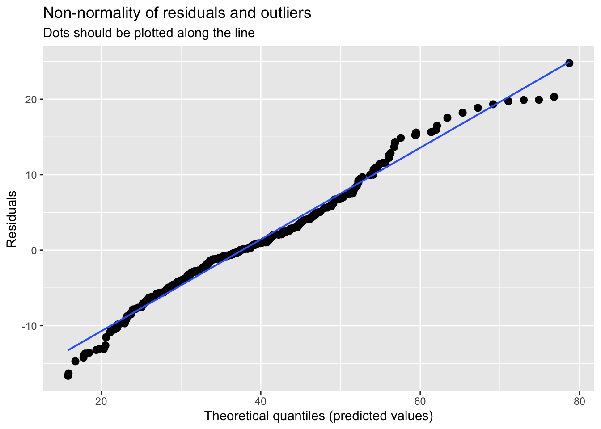

```r
plot_model(bprs_interaction, type = "diag", show.values = TRUE)[[3]]
```

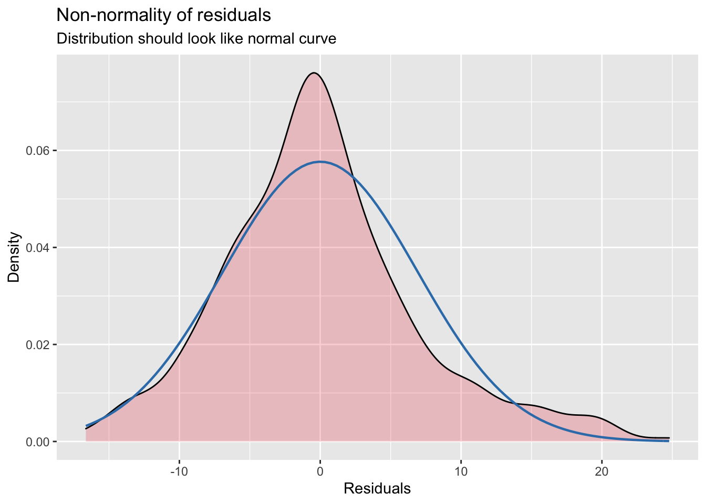

The distribution of residual is roughly normal, except that the distribution has slight positive kurtosis.

#### 2.5.2 Homogeneity


```r
plot_model(bprs_interaction, type = "diag", show.values = TRUE)[[4]]
```

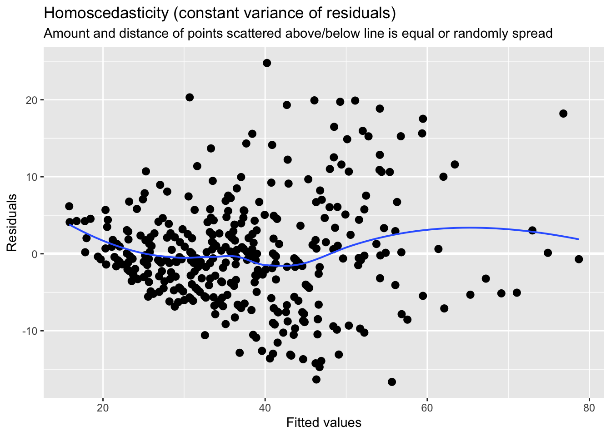

The amount and distance of the points scattered above/below line is rougly equaly. 

#### 2.5.3 Normality of random effect


```r
#pass all estimated random effect into an object
random.effect <-  ranef(bprs_interaction)$subject
#produce density plot
random.effect %>% ggplot(aes(x = `(Intercept)`))+
  geom_density(fill = "red", alpha = 0.3)
```

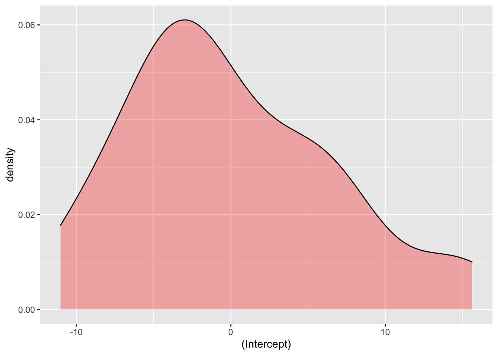

The random effects are roughly normally distributed around a mean of about -3 (near to 0). 

### 2.6 Shrinkage and partial pooling.

In mixed effects modeling, group levels with low sample size and/or poor information (i.e., no strong relationship) are more strongly influenced by the grand mean, which is serving to add information to an otherwise poorly-estimated group. However, a group with a large sample size and/or strong information (i.e., a strong relationship) will have very little influence of the grand mean and largely reflect the information contained entirely within the group. This process is called partial pooling. Partial pooling results in the phenomenon known as shrinkage, which refers to the group-level estimates being shrink toward the mean. This could be a very interesting phenomenon to look at. I will extract the intercept of the mixed effects and interaction model (the best one I arrived at) for each individual as the mixed-effects estimates; and then run a set of linear regressions, one for the data of each individual, resulting in a pool of estimated intercept for each separate linear regression. Next, I will plot them as density plot to see if there is any shrinkage going on.


```r
intercept <- matrix(nrow= 40, ncol = 1)#set a matrix

for (i in 1:40){ #define a loop that run through 1:40 participants
  data <- bprslf %>% filter(subject == i) #select one participants each time
  fit <- lm(rating ~ week, data) #fit a model each time
  intercept[i,] <- coef(fit)[1] #save the intercept from fitted model into matrix
}

a <- c(intercept)#convert matrix into vector
df <- data.frame(value = a) #trun the vector into a data frame

#get the by-individual intercepts and pass into an object "re"
re <-  ranef(bprs_interaction)$subject + fixef(bprs_interaction)[1]

#extract the first column of re to a new object, which is intercept
df.intercept1<- re[1]

#rename
names(df.intercept1) <- "value"

#create a label saying "random" for all data points in object
df.intercept1 <- df.intercept1 %>% mutate(label = "random")

#create a label saying "separate" for all data points in object df
#and pass it to a new object
df.intercept2 <- df %>% mutate(label = "separate")

#combine the object by column names
df <- rbind(df.intercept1, df.intercept2)

#density plot
df %>% ggplot(aes(x = value, color = label, fill = label))+
  geom_density(alpha = 0.3)
```

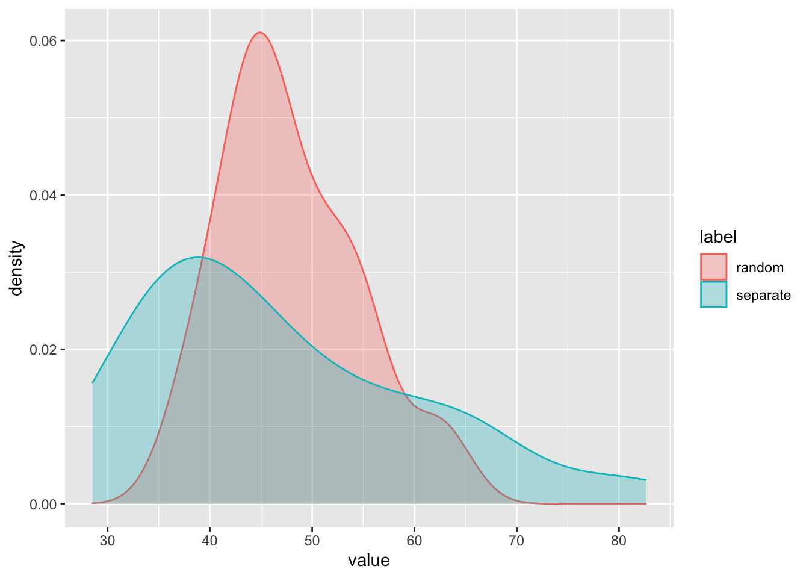

Thought the distributions are not perfectly, but it is showing that the tails of the distribution of random effect model, in comparison to separate model, have been pulled toward the overall effect, resulting in a tighter distribution. This somewhat corresponds to shrinkage effect, I guess.

## 3 Summary

a. In this exercise, I tested the hypothesis that different treatment would lead to different BPRS ratings.

b. The hypothesis was tested using two approaches--standard linear model and the mixed-effect model (random intercept only model and random intercept plus slope were fitted, respectively)

c. Both the approaches reported same coefficients (as we would expect) and significance value for the predictors.

d. It is worth noting that the mixed-effect approach does provide more information and more extrpolative results. for example, via this approach I get the idea that individual patient's BPRS rating at baseline would influence the rating change greatly, and that individual patient's BPRS rating at baseline would lead to tremendously different reaction to treatment.

e. Random intercept and slope model is more informative than random intercept only model in the context of this data in a way that it tells us although the insignificant effect of treatment types, some patients might react more responsively to the treatment. It might be meaningful to identify that subgroup of patients. 


***
